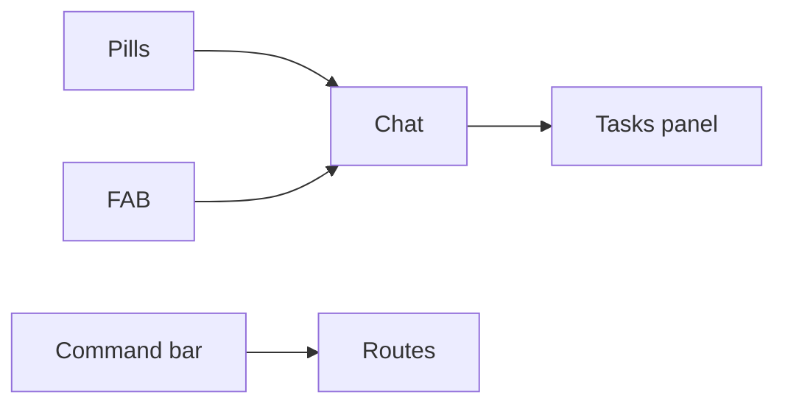

# Wireframe: Global UX Patterns

Cross-cutting patterns from audit — apply on every authenticated surface.

---

## ⌘K Command bar

```text
┌─ Command palette ─────────────────────┐
│ Search actions…                       │
│ Create event                          │
│ Find venue                            │
│ View revenue                          │
│ Find sponsors                         │
│ Open analytics                        │
│ Go to inbox                           │
└───────────────────────────────────────┘
```

| Action | Route / agent |
|--------|---------------|
| Create event | `/host/event/new` |
| Find venue | `/venues` |
| View revenue | `/host/analytics` + `hostOpsAgent` |
| Find sponsors | `/host/sponsors` |

Implementation: shadcn CommandDialog · no new agent.

---

## Floating AI FAB

| Surface | Agent on FAB |
|---------|--------------|
| `/events/*` | `conciergeAgent` sheet |
| `/host/*` | `hostOpsAgent` or `hostEventAgent` |
| `/me/tickets` | `attendeeAgent` |
| `/venues` | venue search context |

Mobile: bottom-right · Desktop: optional when nav chat collapsed.

---

## Context pills (above chat input)

```text
[📅 Event] [📍 Venue] [🎟 Ticket] [👥 CRM] [🤝 Sponsor] [📊 Analytics]
```

Clicking pill pre-fills system context via `useCopilotAdditionalInstructions` + `useCopilotReadable`.

---

## Copilot Tasks panel

Long-running task list (PM Canvas pattern):

| Task | Status |
|------|--------|
| Create venue shortlist | running |
| Research sponsors | queued |
| Build event timeline | done |

Stored in `HostDashboardState.tasks[]` · surfaced in center column below chat.


