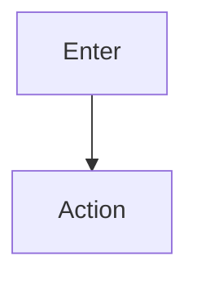

# Wireframe: {title}

## Page goal

{purpose}

## User type

- {persona list}

## User stories

```text
As a {role}
I want to {action}
So that {outcome}
```

## Components

| Component | Type | Notes |
|-----------|------|-------|

## Three-panel layout

### Left panel

Navigation · saved views · recent activity · memory

### Center panel

Chat · tasks · workflow updates · generative UI

### Right panel

Maps · forms · analytics · context · approvals

## AI features

| Feature | Implementation |
|---------|----------------|
| CopilotKit | |
| Mastra agent | |
| Workflow | |
| HITL | |

## Data sources

| Table | Use |
|-------|-----|

## States

| State | UI |
|-------|-----|
| Success | |
| Loading | skeleton |
| Empty | CTA |
| Error | retry |

## Mobile layout

```text
{ASCII}
```

## Tablet layout

Collapsible nav · bottom sheet right panel.

## Desktop layout

```text
{ASCII 3-panel}
```

## Mermaid — user flow


