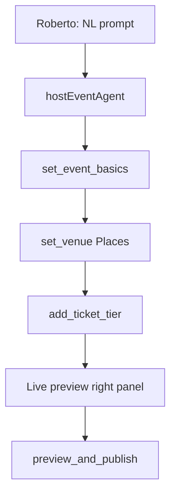
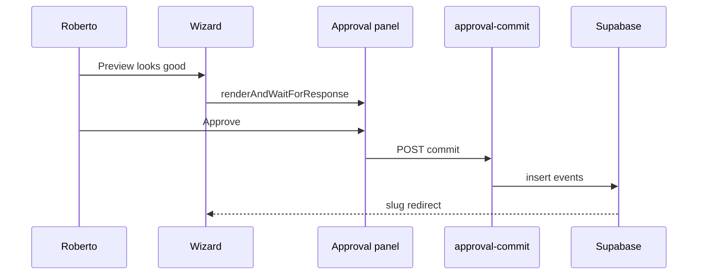
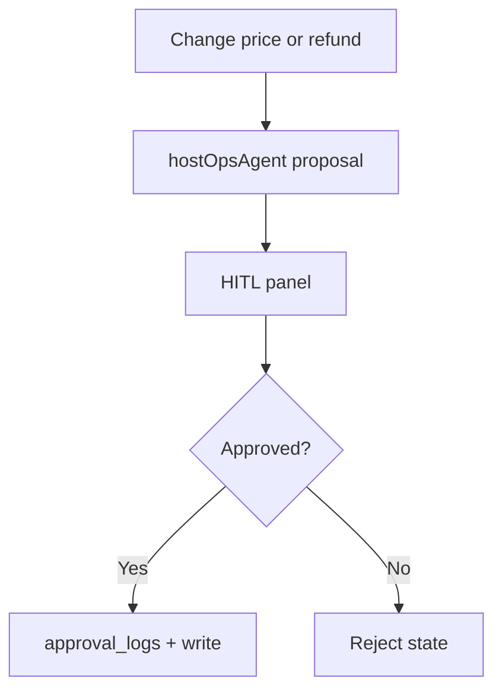

# Event Creation · Publishing · Approval Journeys

## Creation (AI replaces forms)

## Publishing

## Approval (sensitive edits)

Traditional vs AI:

| Step | Traditional | AI native |
|------|-------------|-----------|
| Basics | 12 form fields | One chat sentence |
| Venue | Manual address | Places + compare table |
| Tiers | 3 screens | `add_ticket_tier` tool |
| Publish | Submit button | HITL confirm |
