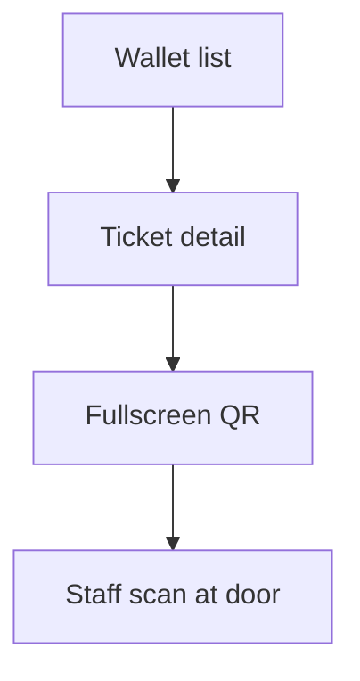
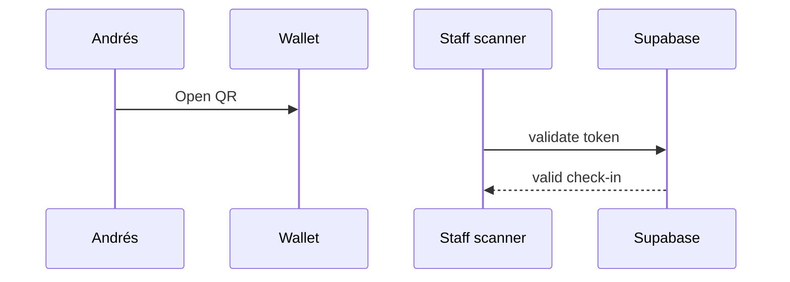

# Ticketing Flows

## Checkout

```mermaid
flowchart TD
  D[Event detail] --> M[Checkout modal]
  M --> ST[Stripe hosted]
  ST --> W[/me/tickets]
```

## Wallet + QR



## Event entry



Wireframes: [003](../events/003-event-details.md) · [004](../events/004-checkout.md) · [005](../events/005-ticket-wallet.md)
