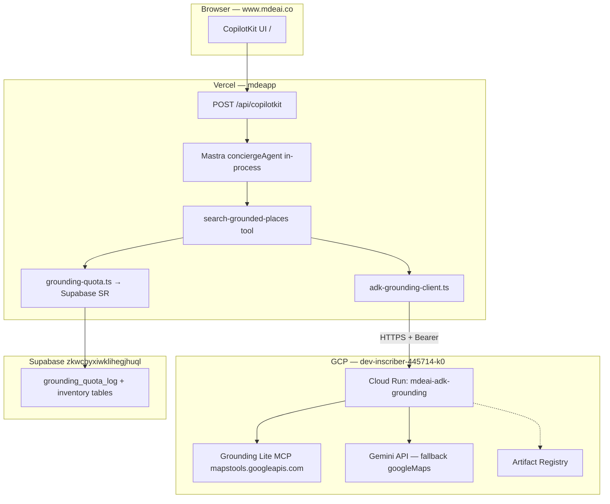

# ADK Grounding on Google Cloud Run — production plan

> **Scope:** Deploy **`services/adk-grounding`** (existing FastAPI sidecar) to **Cloud Run**. Wire **Vercel** via `ADK_GROUNDING_URL`. **Do not** replace Mastra with CopilotKit `HttpAgent` → full ADK ([Mastra example](https://github.com/CopilotKit/CopilotKit/tree/main/examples/integrations/mastra)). **Do not** auto-deploy in this doc.

---

## 0. Executive verdict — is the current ADK setup correct?

| Question | Answer |
|----------|--------|
| Is MAP-002 / sidecar architecture correct for mdeai? | **Yes** — Mastra orchestrates; ADK is Google-only HTTP sidecar |
| Is `services/adk-grounding` implemented correctly for dev? | **Yes** — `/health`, `/v1/grounding/invoke`, MCP + Gemini fallback, fail-closed JSON |
| Is it a full **google-adk** `root_agent` app? | **No** — intentional. Thin FastAPI wrapper, not `adk api_server` |
| Is production complete? | **No** — `ADK_GROUNDING_URL` missing on Vercel; no HTTPS host |
| Best prod host for mdeai? | **Cloud Run** (this plan) — aligns with GCP project, Maps keys, official ADK deploy docs |

**Readiness today:** **Code 88/100** · **Cloud Run production 25/100** · **After this plan ~82/100**

---

## 1. Architecture diagram

### Target (Vercel + Cloud Run + Supabase)



### What we are NOT building

```text
❌ CopilotKit HttpAgent → ADK api_server (CopilotKit ADK example pattern)
❌ ADK sidecar inside Vercel serverless
❌ Replacing Mastra with google-adk Runner in Next.js
```

References: [CopilotKit Mastra](https://github.com/CopilotKit/CopilotKit/tree/main/examples/integrations/mastra) · [CopilotKit ADK](https://github.com/CopilotKit/CopilotKit/tree/main/examples/integrations/adk) (reference only) · [ADK Cloud Run](https://adk.dev/deploy/cloud-run/)

---

## 2. Readiness score

| Dimension | Now | After Cloud Run + Vercel env |
|-----------|----:|-----------------------------:|
| Sidecar code (MAP-002) | 88 | 88 |
| Mastra client fail-closed | 90 | 90 |
| CopilotKit Pattern 1 | 90 | 90 |
| HTTPS production endpoint | 0 | 90 |
| Vercel `ADK_GROUNDING_URL` | 0 | 95 |
| Invoke auth (Bearer) | 0 | 80 |
| `GOOGLE_MAPS_SERVER_API_KEY` on sidecar | 50 | 90 |
| Observability (Cloud Logging) | 20 | 75 |
| **Overall production ADK** | **42** | **~82** |

---

## 3. Blockers

| # | Blocker | Owner | Unblocks |
|---|---------|-------|----------|
| 1 | No Cloud Run service deployed | Sofía | ADK-CR-03 |
| 2 | `ADK_GROUNDING_URL` not on Vercel | Sofía | ADK-CR-05 |
| 3 | No Bearer auth on `/v1/grounding/invoke` | Dev | ADK-CR-02 |
| 4 | Browser-restricted Maps key on sidecar (MCP 403) | Ops | `GOOGLE_MAPS_SERVER_API_KEY` in Secret Manager |
| 5 | No `Dockerfile` in `services/adk-grounding/` | Dev | ADK-CR-01 |
| 6 | GCP APIs not enabled (Run, AR, Secret Manager) | Ops | ADK-CR-00 |

---

## 4. Deployment strategy (recommended)

### Path A — **FastAPI sidecar on Cloud Run** (recommended)

| Item | Choice |
|------|--------|
| **What you deploy** | Existing `main.py` + `grounding_mcp.py` + `gemini_maps_grounding.py` |
| **How** | `Dockerfile` + `gcloud run deploy` **or** build via Cloud Build |
| **Why** | Matches [`sidecar-api-contract.md`](./sidecar-api-contract.md); zero Mastra/CopilotKit changes beyond env + optional Bearer header |
| **Official fit** | [Deploy custom FastAPI on Cloud Run](https://adk.dev/deploy/cloud-run/) (“gcloud run deploy with Dockerfile”) |

### Path B — Full `adk deploy cloud_run` with `root_agent` (defer)

| Item | Choice |
|------|--------|
| **What** | Restructure to `agent/agent.py` + `google-adk` Runner / `adk api_server` |
| **Why defer** | Different API surface than `/v1/grounding/invoke`; pushes toward CopilotKit ADK integration pattern |
| **When** | Phase 2 if you want ADK eval UI, multi-agent graphs, [adk-samples](https://github.com/google/adk-samples) patterns |

**Decision:** Ship **Path A** for production grounding in Phase 1.

---

## 5. Cloud Run setup steps (operator)

### ADK-CR-00 — GCP prerequisites

1. Confirm project: `dev-inscriber-445714-k0` (user-stated billing project).
2. Enable APIs:
   ```bash
   gcloud config set project dev-inscriber-445714-k0
   gcloud services enable \
     run.googleapis.com \
     artifactregistry.googleapis.com \
     cloudbuild.googleapis.com \
     secretmanager.googleapis.com \
     generativelanguage.googleapis.com
   ```
3. Pick region: **`us-east1`** (align with Supabase pooler `aws-1-us-east-1` latency — tune after smoke).

### ADK-CR-01 — Containerize sidecar

Add under `services/adk-grounding/`:

- `Dockerfile` (see §7)
- `.dockerignore` (exclude `.venv`, `__pycache__`)
- `requirements.txt` or use `uv pip compile` from `pyproject.toml`

### ADK-CR-02 — Bearer auth (code)

- Sidecar: require `Authorization: Bearer <ADK_INTERNAL_TOKEN>` on `POST /v1/grounding/invoke` only; leave `GET /health` public.
- Mastra: `adk-grounding-client.ts` sends header when `process.env.ADK_INTERNAL_TOKEN` set.
- Store token in **Secret Manager** + Vercel env (same value).

### ADK-CR-03 — Deploy to Cloud Run

Build, push, deploy (see §6).

### ADK-CR-04 — Domain (optional)

- Default URL: `https://mdeai-adk-grounding-<hash>-ue.a.run.app`
- Optional custom domain: `https://adk.mdeai.co` → Cloud Run domain mapping + DNS

### ADK-CR-05 — Vercel integration

```bash
cd /home/sk/mdeai/mdeapp
vercel env add ADK_GROUNDING_URL production --value 'https://<CLOUD_RUN_URL>' --yes
vercel env add ADK_GROUNDING_URL preview --value 'https://<CLOUD_RUN_URL>' --yes
vercel env add ADK_INTERNAL_TOKEN production --yes   # secret value
vercel --prod --yes   # when approved
```

### ADK-CR-06 — Smoke + evidence

Run §14; record in `tasks/notes/ADK-CR-evidence.md`.

---

## 6. Exact gcloud commands (Path A)

Replace `REGION`, `SERVICE`, and project as needed.

```bash
export PROJECT_ID=dev-inscriber-445714-k0
export REGION=us-east1
export SERVICE=mdeai-adk-grounding
export REPO=mdeai-adk-grounding
export IMAGE=${REGION}-docker.pkg.dev/${PROJECT_ID}/${REPO}/${SERVICE}:v1

gcloud config set project "${PROJECT_ID}"

# Artifact Registry (once)
gcloud artifacts repositories create "${REPO}" \
  --repository-format=docker \
  --location="${REGION}" \
  --description="mdeai ADK grounding sidecar"

# Build + push (from repo root)
gcloud builds submit /home/sk/mdeai/services/adk-grounding \
  --tag "${IMAGE}"

# Secrets (Maps server key + Gemini fallback + internal token)
# Create in console or:
# echo -n 'VALUE' | gcloud secrets create GOOGLE_MAPS_SERVER_API_KEY --data-file=-
# gcloud secrets create GOOGLE_GENERATIVE_AI_API_KEY --data-file=-
# gcloud secrets create ADK_INTERNAL_TOKEN --data-file=-

gcloud run deploy "${SERVICE}" \
  --image "${IMAGE}" \
  --region "${REGION}" \
  --platform managed \
  --allow-unauthenticated \
  --port 8000 \
  --memory 512Mi \
  --cpu 1 \
  --timeout 60s \
  --min-instances 0 \
  --max-instances 10 \
  --concurrency 20 \
  --set-secrets=GOOGLE_MAPS_SERVER_API_KEY=GOOGLE_MAPS_SERVER_API_KEY:latest,\
GOOGLE_GENERATIVE_AI_API_KEY=GOOGLE_GENERATIVE_AI_API_KEY:latest,\
ADK_INTERNAL_TOKEN=ADK_INTERNAL_TOKEN:latest

# URL for Vercel
gcloud run services describe "${SERVICE}" --region "${REGION}" --format='value(status.url)'
```

**Note:** `--allow-unauthenticated` keeps `/health` reachable for probes; **protect invoke** with Bearer (ADK-CR-02). For stricter model, use `--no-allow-unauthenticated` + load balancer / IAM only (harder from Vercel).

Alternative one-shot (if using `adk` CLI on a future `root_agent` layout):

```bash
# NOT for current FastAPI layout without refactor:
# adk deploy cloud_run --project=$PROJECT_ID --region=$REGION path/to/agent -- --allow_unauthenticated
```

Source: [ADK deploy Cloud Run](https://adk.dev/deploy/cloud-run/)

---

## 7. Docker strategy

### Dockerfile (add to `services/adk-grounding/Dockerfile`)

```dockerfile
FROM python:3.12-slim
WORKDIR /app
ENV PYTHONUNBUFFERED=1
COPY pyproject.toml grounding_mcp.py gemini_maps_grounding.py main.py ./
RUN pip install --no-cache-dir .
EXPOSE 8000
CMD ["uvicorn", "main:app", "--host", "0.0.0.0", "--port", "8000"]
```

### Why not `google-adk` base image?

Current service does **not** import `google.adk` — only FastAPI + httpx + MCP. Keep image minimal (~150MB vs full ADK stack).

### Cloud Run settings

| Setting | MVP value | Rationale |
|---------|-----------|-----------|
| Memory | 512Mi–1Gi | MCP + occasional Gemini fallback |
| CPU | 1 | MCP HTTP |
| Timeout | 60s | Matches Mastra client 30s + buffer |
| Min instances | 0 | Cost; accept cold start |
| Max instances | 10 | Burst chat |
| Concurrency | 10–20 | Mostly I/O bound |

---

## 8. Environment variables

### Cloud Run (sidecar only)

| Variable | Source | Required |
|----------|--------|----------|
| `GOOGLE_MAPS_SERVER_API_KEY` | Secret Manager | **Yes** (MCP) |
| `GOOGLE_GENERATIVE_AI_API_KEY` | Secret Manager | **Yes** (403 fallback) |
| `GEMINI_GROUNDING_MODEL` | Env | No (default `gemini-3.5-flash`) |
| `ADK_INTERNAL_TOKEN` | Secret Manager | **Yes** (invoke auth) |
| `PORT` | Cloud Run sets | Auto (`8080` default; use `--port 8000` or read `$PORT` in CMD) |

**Do not** put Supabase service role on Cloud Run — quota stays in Mastra on Vercel.

### Vercel (mdeapp)

| Variable | Example |
|----------|---------|
| `ADK_GROUNDING_URL` | `https://mdeai-adk-grounding-xxxxx-ue.a.run.app` |
| `ADK_INTERNAL_TOKEN` | same as Cloud Run secret |
| `SUPABASE_URL` + `SUPABASE_SERVICE_ROLE_KEY` | quota (existing) |
| `GOOGLE_GENERATIVE_AI_API_KEY` | Mastra agents (existing) |

---

## 9. Auth / security plan

| Layer | Control |
|-------|---------|
| **Public internet** | HTTPS only (Cloud Run managed TLS) |
| **Health** | `GET /health` may stay public (no secrets) |
| **Invoke** | `Authorization: Bearer ${ADK_INTERNAL_TOKEN}` required |
| **Maps keys** | Server key in Secret Manager; IP/API restrictions in GCP Console |
| **Vercel** | Never `NEXT_PUBLIC_*` for ADK token or Maps server key |
| **Supabase** | Service role only on Vercel server; never in Cloud Run |

### Vercel → Cloud Run (advanced, optional later)

[Service-to-service auth](https://cloud.google.com/run/docs/authenticating/service-to-service) uses Google identity tokens. Possible with Workload Identity Federation for Vercel, but **higher ops**. **Phase 1: shared Bearer.** Phase 2: migrate to IAM if required.

---

## 10. Bearer token strategy

1. Generate: `openssl rand -base64 32`
2. Store: GCP Secret Manager `ADK_INTERNAL_TOKEN` + Vercel encrypted env
3. Sidecar `main.py`: dependency checks Bearer on invoke routes only
4. Mastra client: add header in `invokeAdkGrounding`
5. Rotate: update secret + Vercel + redeploy Cloud Run revision

---

## 11. HTTPS / domain strategy

| Option | URL | Pros |
|--------|-----|------|
| **Default** | `https://SERVICE-xxx.run.app` | Zero DNS work |
| **Custom** | `https://adk.mdeai.co` | Stable URL across revisions |

Use **stable custom domain** if you want to avoid Vercel env churn on every service rename.

---

## 12. Vercel integration steps

1. Deploy Cloud Run; copy `status.url`
2. Set `ADK_GROUNDING_URL` + `ADK_INTERNAL_TOKEN` on Production + Preview
3. Redeploy mdeapp
4. Signed-in chat on www: “quiet cafés near Laureles” → pins or empty + metadata (never 500 from tool)
5. Confirm `grounding_quota_log` increments (Supabase)

**CopilotKit:** no change — still `getLocalAgentsWithLogging` in `route.ts`.

---

## 13. Monitoring / logging

| Signal | Where |
|--------|-------|
| Request logs | Cloud Logging — filter `resource.type=cloud_run_revision` |
| Latency | Cloud Run metrics — request latencies p95 |
| Errors | Log `metadata.reason` from Mastra (app logs) + MCP exceptions (sidecar) |
| Quota | Supabase `grounding_quota_log` |
| Alerts (Phase 2) | Error rate > 5% on invoke; p95 > 25s |

ADK observability plugins ([ADK docs](https://adk.dev/)) apply if you later adopt full `google-adk` Runner — optional.

Codelab: [Deploy, manage, observe ADK on Cloud Run](https://codelabs.developers.google.com/deploy-manage-observe-adk-cloud-run)

---

## 14. Smoke tests

### Cloud Run (direct)

```bash
export ADK_URL=https://<your-cloud-run-url>
export TOKEN=<ADK_INTERNAL_TOKEN>

curl -sS "${ADK_URL}/health"

curl -sS -X POST "${ADK_URL}/v1/grounding/invoke" \
  -H "Content-Type: application/json" \
  -H "Authorization: Bearer ${TOKEN}" \
  -d '{"tool":"search_grounded_places","query":"cafés Laureles Medellín","pageSize":3}'
```

Expect: JSON with `pins` array (may be empty with `metadata.reason` on quota/API errors — still 200).

### Vercel (after env)

```bash
# Local with production env pulled (no secrets in chat)
cd /home/sk/mdeai/mdeapp && npm run verify:grounding
```

### Mastra unit

```bash
cd /home/sk/mdeai/mdeapp && npm test -- src/mastra/lib/adk-grounding-client.test.ts
```

---

## 15. Rollback strategy

| Step | Action |
|------|--------|
| 1 | Vercel: remove or blank `ADK_GROUNDING_URL` → instant fail-closed (empty pins, chat OK) |
| 2 | Cloud Run: `gcloud run services update-traffic SERVICE --to-revisions=PREVIOUS=100` |
| 3 | Image: redeploy prior tag from Artifact Registry |

**Fastest prod kill-switch:** unset `ADK_GROUNDING_URL` on Vercel and redeploy mdeapp only.

---

## 16. Scaling / cost guidance

| knob | MVP | Scale later |
|------|-----|-------------|
| min-instances | 0 | 1 if cold starts hurt Camila |
| max-instances | 10 | 50+ |
| concurrency | 20 | tune with MCP QPM |
| memory | 512Mi | 1Gi if Gemini fallback heavy |

**Cost drivers:** Cloud Run invocations + Gemini fallback calls + Grounding Lite [100 QPM on search_places](https://developers.google.com/maps/ai/grounding-lite) (shared quota — monitor).

**Budget guard:** Mastra `MAPS_GROUNDING_DAILY_LIMIT` + Supabase `grounding_quota_log` (already implemented).

---

## 17. Production checklist

- [ ] GCP APIs enabled (§5)
- [ ] `GOOGLE_MAPS_SERVER_API_KEY` created (server, not browser referrer)
- [ ] Secrets in Secret Manager
- [ ] Dockerfile + `.dockerignore` committed
- [ ] Bearer auth in sidecar + Mastra client
- [ ] Cloud Run deployed; URL recorded
- [ ] `ADK_GROUNDING_URL` + `ADK_INTERNAL_TOKEN` on Vercel Prod + Preview
- [ ] mdeapp redeployed
- [ ] Smoke §14 passed
- [ ] `tasks/notes/ADK-CR-evidence.md` filled
- [ ] Patricia sign-off for Tourist/Camila grounded search on www

---

## 18. Phased task roadmap

See [`../INDEX.md`](../INDEX.md) — tasks **ADK-CR-00 … ADK-CR-08**.

---

## 19. Implementation order

```
ADK-CR-00 GCP prereqs
  → ADK-CR-01 Dockerfile + requirements lock
  → ADK-CR-02 Bearer auth (sidecar + Mastra client + tests)
  → ADK-CR-03 Maps server API key in GCP
  → ADK-CR-04 Cloud Run deploy + smoke direct
  → ADK-CR-05 Vercel env + redeploy
  → ADK-CR-06 E2E prod chat smoke
  → ADK-CR-07 (optional) custom domain adk.mdeai.co
  → ADK-CR-08 (optional) Cloud Monitoring alerts
```

---

## 20. Complexity / time estimate

| Phase | Effort | Calendar |
|-------|--------|----------|
| CR-00–01 Infra + Docker | 2–4h | Day 1 |
| CR-02 Bearer + tests | 2–3h | Day 1 |
| CR-03–04 Deploy + secrets | 2–4h | Day 2 |
| CR-05–06 Vercel + E2E | 2–3h | Day 2 |
| Optional domain + IAM | 2–4h | Day 3 |
| **Total** | **10–18h** | **2–3 days** one engineer |

---

## 21. Go / no-go

| Gate | Verdict |
|------|---------|
| **Continue with current sidecar design** | **GO** |
| **Deploy Path A to Cloud Run** | **GO** (recommended default) |
| **Switch to full ADK HttpAgent in CopilotKit** | **NO-GO** |
| **Public prod without Bearer on invoke** | **NO-GO** |
| **Marketing “grounded maps on www”** | **NO-GO** until ADK-CR-06 passes |

---

## 22. Relation to official ADK Cloud Run quickstart

The [Python ADK Cloud Run quickstart](https://docs.cloud.google.com/run/docs/quickstarts/build-and-deploy/deploy-python-adk-service) and [`adk deploy cloud_run`](https://adk.dev/deploy/cloud-run/) target a **folder with `agent.py` + `root_agent`**. mdeai intentionally uses a **smaller HTTP contract** documented in [`sidecar-api-contract.md`](./sidecar-api-contract.md). Converging to full ADK is **Phase 2** ([adk-python](https://github.com/google/adk-python), [adk-samples travel-planner](https://github.com/google/adk-samples)).

---

**End of plan — no resources were deployed.**
