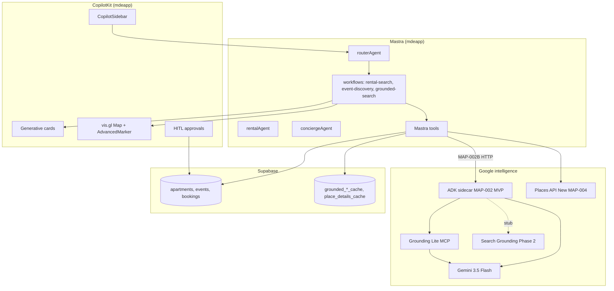
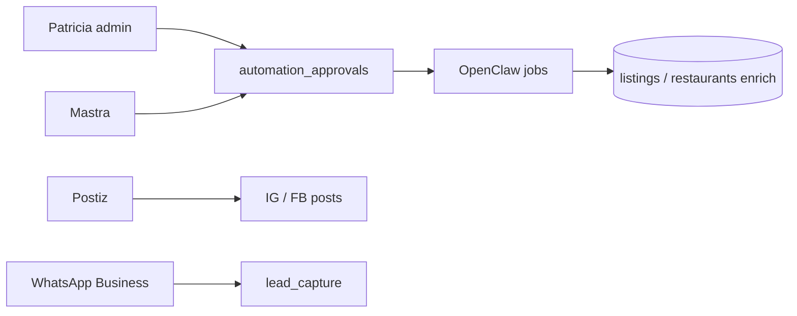

# mdeai Roadmap — CopilotKit + Mastra + ADK + Maps Grounding

> **Verified 2026-05-20:** `mdeapp` uses **CopilotKit + Mastra** (`MastraAgent.getLocalAgents` in `src/app/api/copilotkit/route.ts`). **Do not** swap to `HttpAgent` → Python ADK in Next. **MVP** ships **`services/adk-grounding/`** HTTP sidecar via **[MAP-002](../../tasks/maps/MAP-002-grounding-attribution.md)** (002A/B/C). **Search Grounding** stays stubbed until Phase 2 flag.
>
> **Canonical architecture:** [`maps-adk-prd.md`](./maps-adk-prd.md) · **Execution steps:** [`tasks/maps/INDEX.md`](../../tasks/maps/INDEX.md)

**Personas:** **Camila** (rentals), **Roberto** (events), **Tourist** (restaurants), **Patricia** (ops), **Andrés** (tickets).

---

## Document map

| § | Topic |
|---|--------|
| 1 | Executive summary |
| 2 | Repo review table |
| 2.1 | **Local repos — what to use & when** (CopilotKit ADK, ag-ui-adk, `github/maps`, **`github/adk`**) |
| 3 | Architecture decision (scored) |
| 4 | Final architecture (Mermaid) |
| 5 | Core setup plan |
| 6 | ADK grounding service plan |
| 7 | Mastra integration plan |
| 8 | CopilotKit UI plan |
| 9 | Google Maps repo strategy |
| 10 | Places API (New) plan |
| 11 | Grounding Lite / MCP plan |
| 12 | Search grounding plan |
| 13 | Core MVP roadmap |
| 14 | Post-MVP roadmap |
| 15 | Advanced roadmap |
| 16 | Supabase data plan |
| 17 | Testing plan |
| 18 | Risks & anti-patterns |
| 19 | Final recommendation |
| 20 | Audit verdict + readiness gates |
| — | **Canonical:** [`maps-adk-prd.md`](./maps-adk-prd.md) unifies Maps + ADK + Gemini |

---

## 1. Executive summary

### Layer stack (north star)

```text
CopilotKit     = frontend AI UI (chat, cards, map pins, HITL)
Mastra         = main product workflow orchestrator + Supabase writes
Google ADK     = Google intelligence sidecar (MVP MAP-002; Search stub → Phase 2)
Gemini         = reasoning + structured JSON (Flash default in mdeapp)
Search Grounding = live web / current facts (events, news, promos)
Maps Grounding = geospatial intelligence (nearby, venues, neighborhoods)
Places API New = structured place records (details, photos, hours)
Grounding Lite MCP = Maps search + routes (via ADK MapsAgent in MVP)
Supabase       = source of truth + cache + RLS
OpenClaw       = approved automation later (Phase 3)
Postiz         = social automation later (Phase 3)
WhatsApp       = messaging / booking assist later (Phase 3)
```

### Why each layer exists

| Layer | Why we need it | MVP vs advanced |
|-------|----------------|-----------------|
| **ADK** | `services/adk-grounding/` — MapsAgent + SearchAgent stub, `agents-cli eval` — **not** a second product brain | **MVP (MAP-002)** — Search enable Phase 2 |
| **Mastra** | TypeScript orchestration, router, workflows, Supabase, booking intents — already in `mdeapp` | **MVP** — production path |
| **CopilotKit** | AG-UI streaming, generative cards, `useCoAgent`, HITL — Roberto/Camila UX | **MVP** — pinned 1.55.2 |
| **Greyisheep / ag-ui-adk-grounding-app** | Proven Search+Maps sub-agent split + `useCopilotAction` renders | **Reference only** — never merge into `mdeapp` runtime |
| **Maps + Search grounding** | Moat vs raw LLM — real `place_id`, attribution, Medellín geo truth | **MVP** ADK → Grounding Lite; **Phase 2** SearchAgent on |
| **Places API New** | Field-masked details, nearby, autocomplete for Roberto venue + Camila enrichment | **MVP** MAP-004+; proxy MAP-005 |
| **Supabase** | Listings, events, cache TTL, RLS, Stripe-adjacent tables | **MVP** |
| **OpenClaw / Postiz / WhatsApp** | Growth + ops automation | **Post-MVP**, approval-gated |

### Phased execution (locked 2026-05-20)

```text
MVP (steps 0–6):  CopilotKit → Mastra → ADK sidecar (MAP-002) → Grounding Lite MCP
                  → Places (New) MAP-004 → Supabase SQL + cache MAP-005 → vis.gl pins
Phase 2:          Enable ADK SearchAgent + search_grounded_events (routing plan)
Phase 3:          OpenClaw enrichment, Postiz, WhatsApp, pgvector, itineraries
```

**Execute in order:** [`tasks/maps/INDEX.md`](../../tasks/maps/INDEX.md) — MAP-001 ✅ → F48 ✅ → F49 → MAP-002 → MAP-004 → MAP-007 → MAP-005…012.

---

## 2. Repo review table

Scores = **mdeai reuse value** (not generic repo quality). Local paths under `/home/sk/mdeai/`.

| Repo / resource | Type | Main features | What to copy | What to avoid | Best mdeai use case | Risk | Score | Rec |
|-----------------|------|---------------|--------------|---------------|---------------------|------|------:|-----|
| [CopilotKit/…/integrations/mastra](https://github.com/CopilotKit/CopilotKit/tree/main/examples/integrations/mastra) | CK example | `MastraAgent.getLocalAgents`, HITL, shared state, e2e | `route.ts`, co-agent patterns, test layout | Replacing with ADK HttpAgent | **mdeapp foundation** | Agent name drift | **99** | **Model** |
| [CopilotKit/…/integrations/adk](https://github.com/CopilotKit/CopilotKit/tree/main/examples/integrations/adk) | CK example | `HttpAgent` → FastAPI + `ag_ui_adk` | Docker agent layout, env split | Using as prod runtime for mdeai | ADK+CK wiring reference | Two runtimes confusion | **78** | **Reference** |
| [Greyisheep/ag-ui-adk-grounding-app](https://github.com/Greyisheep/ag-ui-adk-grounding-app) | Reference app | `GoogleSearchTool`, `GoogleMapsGroundingTool`, sub-agents | `agent/agent.py` tool split, `page.tsx` generative UI | Merging into mdeapp; no map panel | Search/Maps grounding recipes | Python-only prod | **82** | **Reference** |
| `github/copilotkit/ag-ui-adk-grounding-app` | Vendored copy | Same as Greyisheep | Offline diff vs upstream | Drift from upstream | Same | — | **82** | **Reference** |
| [ag-ui-protocol/ag-ui](https://github.com/ag-ui-protocol/ag-ui) | Protocol | Event types, SSE, agent↔UI contract | Event semantics when debugging streams | Reimplementing CK runtime | Understand AG-UI traces | Low if unused | **88** | **Reference** |
| [grounding-lite-mcp-sample-app](https://github.com/googlemaps-samples/grounding-lite-mcp-sample-app) | Official MCP | `search_places`, routes, Gemini | MCP transport + tool shapes for MAP-002 | Calling without attribution | Phase 1 Maps grounding | 100 QPM `search_places` | **99** | **Clone / ship** |
| [google/adk-samples](https://github.com/google/adk-samples) | Official | Multi-agent, deploy, eval | Service templates under `services/adk-grounding/` | Copying 8-agent travel monolith | Phase 2 ADK service | Version drift | **98** | **Clone patterns** |
| [google/agents-cli](https://github.com/google/agents-cli) | CLI | scaffold, eval, deploy | CI eval on ADK service | Running inside `mdeapp` npm scripts | Dev + staging smoke | Wrong cwd expectations | **94** | **Install global** |
| [google/adk-python](https://github.com/google/adk-python) | SDK | LlmAgent, tools, graphs | `services/adk-grounding` deps | Pinning without lockfile | ADK service runtime | Py ops on Vercel | **97** | **Install in service** |
| [vis.gl/react-google-maps](https://github.com/visgl/react-google-maps) | React lib | Map, AdvancedMarker, hooks | MAP-001 components | Raw Maps JS loader | All map UI | Missing `mapId` | **98** | **npm install** |
| [@googlemaps/markerclusterer](https://github.com/googlemaps/js-markerclusterer) | JS lib | Cluster dense pins | MAP-009 pattern | Custom cluster math | Rental/event dense maps | — | **90** | **npm install** |
| [googlemaps/js-api-samples](https://github.com/googlemaps/js-api-samples) | Samples | API snippets | Autocomplete / marker recipes | Copying whole apps | Roberto venue UX hints | Not React-first | **70** | **Reference** |
| [googlemaps/extended-component-library](https://github.com/googlemaps/extended-component-library) | Web components | Place pickers, elements | Autocomplete ideas | Replacing vis.gl stack | Optional host forms | Different stack | **55** | **Avoid for mdeapp** |
| [googlemaps/google-maps-services-js](https://github.com/googlemaps/google-maps-services-js) | Node client | Server-side Places/Directions | Edge fn helpers if needed | Browser exposure of keys | `places-proxy` edge | Legacy API versions | **75** | **Reference / edge only** |
| [CopilotKit/…/canvas/mastra](https://github.com/CopilotKit/CopilotKit/tree/main/examples/canvas/mastra) | CK example | Canvas co-agent state | F48 three-panel | — | `/` layout | — | **96** | **Model** |
| [CopilotKit/showcase/integrations/mastra](https://github.com/CopilotKit/CopilotKit/tree/main/showcase/integrations/mastra) | Showcase | Latest CK patterns | Docs parity checks | Assuming same as 1.55.2 pins | Future CK upgrade | Version skew | **85** | **Reference** |

---

## 2.1 Local reference repos — what to use & when

**Rule:** Everything under `CopilotKit/examples/`, `github/copilotkit/`, and `github/maps/` is **read-only**. Ship code only in `mdeapp/` and `services/adk-grounding/`. Never `import` from `github/**` into `mdeapp/src`.

**Refresh clones:**

```bash
# Maps family
git -C github/maps/grounding-lite-mcp-sample-app pull --ff-only
git -C github/maps/react-google-maps pull --ff-only

# CopilotKit grounding reference
git -C github/copilotkit/ag-ui-adk-grounding-app pull --ff-only

# Monorepo examples (already at repo root)
cd CopilotKit && git pull --ff-only
```

### Quick matrix (phase × repo)

| Phase | Repo (local path) | Use when | Do not use for |
|-------|-------------------|----------|----------------|
| **1 MVP** | `CopilotKit/examples/integrations/mastra` | `mdeapp` runtime, HITL, e2e test patterns | — |
| **1 MVP** | `CopilotKit/examples/canvas/mastra` | F48 three-panel + co-agent state | Prod map grounding |
| **1 MVP** | `github/maps/react-google-maps` | MAP-001 — copy **patterns**; install via **npm** | Vendoring lib into `src/` |
| **1 MVP** | `github/maps/grounding-lite-mcp-sample-app` | MAP-002 — MCP tool contract + attribution | Replacing Mastra orchestrator |
| **1 MVP** | `github/maps/js-markerclusterer` | MAP-009 — npm `@googlemaps/markerclusterer` | Custom clustering |
| **1 MVP** | `github/maps/js-api-samples` | Field masks, AdvancedMarker, autocomplete snippets | Whole-sample app port |
| **1 MVP** | `github/maps/google-maps-services-js` | MAP-005 `places-proxy` server calls | Browser keys |
| **1 MVP** | `github/maps/codelab-maps-platform-101-react-js` | Marker + clusterer together before MAP-009 | Long-term dependency |
| **1 MVP** | `github/copilotkit/ag-ui-adk-grounding-app` | MAP-002A agent.py — Maps/Search sub-agents | `mdeapp` `route.ts` / prod runtime |
| **1 MVP** | `CopilotKit/examples/integrations/adk` | `services/adk-grounding/` layout: FastAPI, Docker | **mdeapp** CopilotKit route |
| **1 MVP** | `github/adk/adk-samples` … `travel-planner-google-maps-mcp` | MAP-002A MCP wiring | — |
| **2+** | `github/maps/extended-component-library` | Host place pickers if vis.gl autocomplete insufficient | Replacing vis.gl map shell |
| **3** | `github/maps/platform-ai` | Maps Code Assist MCP while authoring tools | Runtime dependency |
| **—** | `github/maps/react-wrapper` | — | **Archived** — never use |

---

### A. `CopilotKit/examples/integrations/adk`

| | |
|--|--|
| **Local path** | [`/home/sk/mdeai/CopilotKit/examples/integrations/adk`](../../CopilotKit/examples/integrations/adk) |
| **Upstream** | [CopilotKit/CopilotKit …/integrations/adk](https://github.com/CopilotKit/CopilotKit/tree/main/examples/integrations/adk) |
| **Score** | **78/100** — reference only |
| **When** | **MAP-002A** — scaffolding `services/adk-grounding/` (Python venv, Docker agent image) |
| **When not** | **Never** point `mdeapp` at this example’s `HttpAgent` |

**Files to study (copy patterns, not paths):**

| File | Copy into mdeai | When |
|------|-----------------|------|
| `src/app/api/copilotkit/route.ts` | — | **Never** into `mdeapp` — shows `HttpAgent({ url: AGENT_URL })` |
| `agent/main.py` + `pyproject.toml` | `services/adk-grounding/` | Phase 2 ADK-SPIKE-01 |
| `docker/Dockerfile.agent`, `docker-compose.test.yml` | ADK service deploy | MAP-002 staging / Cloud Run |
| `scripts/run-agent.sh`, `.env.example` | `GOOGLE_API_KEY`, port **8000** | Local ADK dev (sidecar, not Next) |
| `README.md` | — | Prerequisites Node 18+ / Python 3.12+ |

**mdeai tasks:** **MAP-002A** (`services/adk-grounding/`) — Mastra calls HTTP, not HttpAgent in Next.

**Contrast with production:**

```text
mdeapp (prod UI):     CopilotKit/examples/integrations/mastra  → MastraAgent
ADK sidecar (MVP):    CopilotKit/examples/integrations/adk     → FastAPI (Mastra → POST /v1/grounding/invoke)
```

---

### B. `github/copilotkit/ag-ui-adk-grounding-app`

| | |
|--|--|
| **Local path** | [`/home/sk/mdeai/github/copilotkit/ag-ui-adk-grounding-app`](../../github/copilotkit/ag-ui-adk-grounding-app) |
| **Upstream** | [Greyisheep/ag-ui-adk-grounding-app](https://github.com/Greyisheep/ag-ui-adk-grounding-app) (same app; this is the **canonical vendored** copy) |
| **Score** | **82/100** — grounding + generative UI reference |
| **When (Phase 1)** | **F49** — `useCopilotAction` render shapes (weather card → swap for `RentalCard`, attribution strip) |
| **When (MAP-002A)** | **`services/adk-grounding/agent/`** — MapsAgent + SearchAgent stub (`search_disabled`) |
| **When (Phase 2)** | Enable `GoogleSearchTool` per [`search-grounding-routing.md`](../maps/search-grounding-routing.md) |
| **When not** | Production CopilotKit runtime; no vis.gl map panel in repo — mdeai adds MAP-001 separately |

**Files to study:**

| File | Use for | mdeai surface |
|------|---------|---------------|
| `agent/agent.py` | Search-only vs Maps-only sub-agents; root orchestrator | ADK service; port tool names to Mastra Zod |
| `src/app/api/copilotkit/route.ts` | `HttpAgent` → localhost agent | **Reference only** — compare with mastra `route.ts` |
| `src/app/page.tsx` | Generative UI, theme toggle, proverbs demo | `/` CopilotKit cards (Camila/Tourist) |
| `SETUP_GUIDE.md` | GCP + API key setup for grounding | `services/adk-grounding/.env` template |

**Also at** `github/maps/ag-ui-adk-grounding-app/` — older duplicate; **do not edit both**. Prefer `github/copilotkit/` per [`github/copilotkit/README.md`](../../github/copilotkit/README.md).

**mdeai personas:** Tourist (restaurant_discovery), Roberto (Search for event news), Camila (Maps nearby) — all **via Mastra tools** in prod; ADK repo is the recipe book.

---

### C. `github/maps/` (Google Maps reference clones)

Master index: [`github/maps/README.md`](../../github/maps/README.md).

| Folder (under `github/maps/`) | Score | Phase | Install vs reference | mdeai task / feature | When to open this clone |
|------------------------------|------:|-------|----------------------|----------------------|-------------------------|
| **`react-google-maps/`** | 98 | **1** | **npm** `@vis.gl/react-google-maps` | MAP-001, MAP-008 | Building `MapShell`, `AdvancedMarker`, `mapId` |
| **`grounding-lite-mcp-sample-app/`** | 99 | **1** | Reference + copy MCP shapes | MAP-002A | ADK MapsAgent → MCP `search_places` |
| **`js-markerclusterer/`** | 92 | **1** | **npm** `@googlemaps/markerclusterer` | MAP-009 | Dense rental/event pins on `/` |
| **`js-api-samples/`** | 94 | **1–2** | Reference snippets | MAP-004, MAP-010 | Field masks, Places widgets, marker options |
| **`codelab-maps-platform-101-react-js/`** | 91 | **1** | Reference | MAP-001 + MAP-009 | First AdvancedMarker + clusterer spike |
| **`google-maps-services-js/`** | 90 | **1+** | Optional dep in edge fn | MAP-005 `places-proxy` | Server-side Text/Nearby/Details |
| **`extended-component-library/`** | 88 | **2+** | Reference / optional web components | MAP-010 host venue | If Roberto autocomplete needs GM web components |
| **`platform-ai/`** | 85 | **Dev** | MCP assist only | — | Cursor authoring Places/grounding code |
| **`ag-ui-adk-grounding-app/`** | 75 | **2** | **Avoid** — use `github/copilotkit/` copy | Phase 2 ADK UX | Only if copilotkit folder missing |
| **`react-wrapper/`** | 52 | **—** | **Never** | — | Legacy; vis.gl only |

**Maps repo order (aligned with [`tasks/maps/INDEX.md`](../../tasks/maps/INDEX.md)):**

```text
1. react-google-maps          → MAP-001 ✅ (pins on /)
2. ag-ui-adk-grounding-app   → MAP-002A (ADK service + sub-agents)
3. grounding-lite-mcp-sample  → MAP-002A (MCP contract inside ADK)
4. js-api-samples             → MAP-004 field masks
5. google-maps-services-js    → MAP-005 edge proxy
6. codelab + js-markerclusterer → MAP-008/009
```

Open **`CopilotKit/…/integrations/adk`** + **`github/adk/adk-samples`** for **MAP-002A** — after F49 pin proof (soft gate).

**Planning cross-links:** [`plan/maps/maps-prd.md`](../maps/maps-prd.md) · [`tasks/maps/INDEX.md`](../../tasks/maps/INDEX.md) · [`tasks/maps/notes.md`](../../tasks/maps/notes.md).

---

### D. `CopilotKit/examples/integrations/mastra` (production foundation)

| | |
|--|--|
| **Local path** | [`/home/sk/mdeai/CopilotKit/examples/integrations/mastra`](../../CopilotKit/examples/integrations/mastra) |
| **When** | **Now** — any CopilotKit + Mastra change in `mdeapp` |
| **Copy** | `src/app/api/copilotkit/route.ts` pattern, `tests/e2e/*` for F48–F50 |

Listed here so §2.1 is the **single “which folder do I open?”** index alongside ADK and Maps clones.

---

### E. `github/adk/` — ADK + travel clones (all cloned 2026-05-23)

**Full matrix:** [`11-github-repos-plan.md`](./11-github-repos-plan.md) §1b · index [`github/adk/README.md`](../../github/adk/README.md).

| Clone | Phase | When to open |
|-------|-------|--------------|
| **`adk-samples`** | **1 MVP** | **MAP-002A** — start with `python/agents/travel-planner-google-maps-mcp/` |
| **`mcp-agent-tool-adapter`** | **2** | Point ADK at Grounding Lite via `mcp_config.json` + `app_client_adk.py` |
| **`agent-starter-pack`** | **2 deploy** | Cloud Run / CI for `services/adk-grounding/` |
| **`adk-examples/06_improved_travel_rec_agent`** | **2** | Community Maps MCP travel patterns |
| **`cicerone`** | **2–3** | Itinerary tool + `google_maps_grounding` |
| **`adk-travel-agent`** | Dev | ADK layout only — not Maps |
| **`iPathPilot`** | **3** | UX reference — not Mastra |

**Phase 2 build order inside `github/adk/`:**

```text
1. adk-samples/travel-planner-google-maps-mcp  → tool + skill shapes
2. mcp-agent-tool-adapter                        → MCP session wiring
3. ag-ui-adk-grounding-app (copilotkit/)         → Search + Maps tools
4. agent-starter-pack                            → deploy
5. cicerone                                      → itinerary (optional)
```

---

## 3. Architecture decision (evaluate & score)

| Option | Description | Score | Verdict |
|--------|-------------|------:|---------|
| **1** Start from CopilotKit **ADK** example | `HttpAgent` → Python FastAPI as main app | **22** | Reject — splits TS product from Python brain; mdeapp already Mastra |
| **2** Start from CopilotKit **Mastra** example | `MastraAgent.getLocalAgents` in Next route | **99** | **Choose** — matches `mdeapp` today |
| **3** Combine both in one Next process | Mastra + inline Python ADK | **35** | Reject — ops complexity, two languages in one deploy unit |
| **4** Greyisheep as grounding reference only | Port tool recipes to ADK service | **82** | **Choose** — MAP-002A |
| **5** Separate ADK grounding microservice Mastra calls | HTTP JSON, no Supabase in ADK | **94** | **Choose** — **MVP MAP-002** production shape |

### Combined recommendation score: **94/100**

```text
Foundation:     CopilotKit + Mastra (integrations/mastra) — PRODUCTION
ADK example:    Reference for HttpAgent + FastAPI layout only — NOT prod path
Greyisheep:     Reference for GoogleSearchTool + GoogleMapsGroundingTool + generative UI
ADK service:    MVP MAP-002 — `services/adk-grounding/` → Grounding Lite MCP inside MapsAgent
Search in ADK:  Phase 2 — SearchAgent enable after MAP-002A stable
Places client:  MVP MAP-004 — Mastra/edge, not inside ADK first invoke
```

**Proof from disk:**

```typescript
// mdeapp — production (keep)
agents: getLocalAgentsWithLogging({ mastra })

// CopilotKit/examples/integrations/adk — do NOT copy to mdeapp prod
my_agent: new HttpAgent({ url: "http://localhost:8000/" })
```

---

## 4. Final architecture

### Phase 1–2 (product)



### Phase 3 (automation — approval only)



---

## 5. Core setup plan

### Folder structure

```text
mdeapp/
  src/
    app/                    # Next.js App Router
      api/copilotkit/       # MastraAgent runtime (locked)
    mastra/
      agents/               # router, rental, concierge, hostEvent (W3+)
      workflows/
      tools/                # grounding, places, adk-client (Phase 2)
    platform/
      contracts/            # MapPin Zod (MAP-001)
      maps/                 # MapContext, normalize, merge (MAP-001)
    mastra/lib/
      adk-grounding-client.ts   # MAP-002B — HTTP to ADK
      google-places-client.ts   # MAP-004
    components/
      copilot/              # cards, sidebar wrappers
      maps/                 # MapShell, markers
  supabase/
    migrations/
    functions/places-proxy/ # MAP-005

services/adk-grounding/     # MVP MAP-002A — Python ADK sidecar
  agent/
    root_agent.py
  tools/
  skills/                   # ADK runtime skills (not .claude/skills)
  evals/
  pyproject.toml
  Dockerfile

github/adk/                 # MAP-002A clones — see §2.1-E + github/adk/README.md
  adk-samples/              # official — travel-planner-google-maps-mcp first
  mcp-agent-tool-adapter/
  agent-starter-pack/
  adk-examples/
  cicerone/
  iPathPilot/               # Phase 3 reference
  adk-travel-agent/         # learn only

github/
  copilotkit/ag-ui-adk-grounding-app/   # Phase 2 grounding UX + agent.py (§2.1-B)
  maps/                                 # Phase 1 Maps clones — see §2.1-C + maps/README.md
    react-google-maps/                  # MAP-001 patterns (npm in mdeapp)
    grounding-lite-mcp-sample-app/      # MAP-002 MCP
    js-markerclusterer/                 # MAP-009 (npm)
    js-api-samples/                     # field masks, autocomplete
    google-maps-services-js/            # MAP-005 edge
    codelab-maps-platform-101-react-js/
  # maps/ag-ui-adk-grounding-app/       # duplicate — prefer github/copilotkit/

CopilotKit/examples/integrations/
  mastra/                               # mdeapp prod model (§2.1-D)
  adk/                                  # Phase 2 sidecar layout only (§2.1-A)
```

### Packages (mdeapp — already partial)

| Package | Purpose |
|---------|---------|
| `@copilotkit/react-core` `@copilotkit/react-ui` `@copilotkit/runtime` **1.55.2** | UI + runtime |
| `@ag-ui/mastra` | `MastraAgent` bridge |
| `@mastra/core` + `@ai-sdk/google` | Agents + Gemini |
| `@vis.gl/react-google-maps` | MAP-001 |
| `@googlemaps/markerclusterer` | MAP-009 |

### Env vars

| Var | Where | Purpose |
|-----|-------|---------|
| `GOOGLE_GENERATIVE_AI_API_KEY` | mdeapp | Mastra Gemini |
| `NEXT_PUBLIC_GOOGLE_MAPS_API_KEY` | mdeapp client | Maps JS (restricted referrer) |
| `NEXT_PUBLIC_GOOGLE_MAPS_MAP_ID` | mdeapp | AdvancedMarker |
| `GOOGLE_MAPS_API_KEY` | ADK service | Grounding Lite MCP |
| `ADK_GROUNDING_URL` | mdeapp server | MAP-002B default `http://localhost:8000` |
| `GOOGLE_PLACES_API_KEY` | mdeapp / edge | MAP-004 / MAP-005 |
| `GOOGLE_API_KEY` | adk-grounding service | ADK docs convention |
| `GOOGLE_GENAI_USE_VERTEXAI` | adk-grounding | `FALSE` for AI Studio dev |

### Local dev ports

| Service | URL |
|---------|-----|
| Next.js UI | `http://localhost:3001` (3000 fallback) |
| CopilotKit | `POST /api/copilotkit` |
| Mastra Studio | `http://localhost:4111` |
| ADK sidecar (MAP-002) | `http://localhost:8000` — [`sidecar-api-contract.md`](./sidecar-api-contract.md) |

### API contract (Mastra → ADK)

```http
POST /v1/grounding/invoke
Content-Type: application/json

{
  "tool": "search_grounded_places",
  "query": "cafés Laureles",
  "locationBias": { "latitude": 6.2442, "longitude": -75.5812 },
  "pageSize": 5,
  "requestId": "<uuid>"
}

→ 200 { "places": [], "pins": [], "attribution": [], "citations": [], "confidence": 0.92, "metadata": { "source": "grounding-lite" } }
```

Full contract: [`sidecar-api-contract.md`](./sidecar-api-contract.md).

Mastra: Zod parse → merge pins → optional `upsert` cache (service role in edge/worker only).

### CopilotKit render path

1. User message → `conciergeAgent` / `routerAgent`
2. Mastra tool returns structured `ToolResponse` + pin payloads
3. `useCopilotAction({ name: "show_rental_results", render })` paints cards
4. `MapContext.mergePinsByCategory` updates map (F49)

### Supabase cache flow

1. Tool computes `cache_key = hash(tool + normalized_query + lat/lng)`
2. Read `grounded_places_cache` if `expires_at > now()`
3. On miss: Mastra → ADK → MCP (MAP-002) or Places (MAP-004) → write cache TTL 24–72h
4. Never cache failed/hallucinated rows (no `place_id` → drop)

---

## 6. ADK grounding service plan

> **Production deploy (2026-05-25):** Ship existing **FastAPI** sidecar to **Google Cloud Run** (Path A). Full `google-adk` `root_agent` + `adk deploy cloud_run` is Phase 2. See [`12-cloud-run-production-plan.md`](./12-cloud-run-production-plan.md) and [`../INDEX.md`](../INDEX.md) (ADK-CR-00–08).

**Service:** `services/adk-grounding/` — MVP is **FastAPI + MCP** (not full ADK Runner); Phase 2 may add `LlmAgent` graph; **returns JSON only**.

| Tool | Purpose | Input (Zod) | Output | Gemini | Grounding | Places | Cache table | Fallback | Tests | Score |
|------|---------|-------------|--------|--------|-----------|--------|-------------|----------|-------|------:|
| `search_grounded_places` | NL place discovery | `query`, `locationBias?` | `GroundedPlace[]` | 3.5-flash | Maps+Lite | Optional details | `grounded_places_cache` | MCP-only Mastra path | 10 golden queries | **96** |
| `search_grounded_events` | Live event facts | `query`, `dateRange?` | `GroundedEvent[]` | 3.5-flash | Search | — | `grounded_events_cache` | Supabase events first | weekend Medellín | **92** |
| `find_event_venues` | Roberto venue shortlist | `capacity`, `neighborhood`, `style` | `VenueCandidate[]` | 3.5-flash | Maps+Places | Text/Nearby | `venue_intelligence` | Places autocomplete | capacity filter | **93** |
| `explain_neighborhood` | Compare areas | `slug`, `persona` | `NeighborhoodBrief` | 3.5-flash | Search+Maps | — | `neighborhood_intelligence` | Static slug pack | Laureles vs Poblado | **91** |
| `compare_neighborhoods` | Side-by-side | `slugs[]` | `ComparisonTable` | 3.5-flash | Search | — | same | SQL demographics only | 2-slug eval | **90** |
| `nearby_lifestyle_context` | Cowork/gym/café near pin | `lat`, `lng`, `categories[]` | `NearbyPOI[]` | 3.5-flash | Maps Lite | Nearby | `rental_nearby_context` | MAP-006 path | 500m radius | **94** |
| `rental_nearby_enrichment` | Camila card enrich | `rental_id`, `lat`, `lng` | `EnrichmentBundle` | 3.5-flash | Maps | Nearby | `rental_nearby_context` | Skip if no coords | 1 rental golden | **93** |
| `restaurant_discovery` | Tourist eats | `query`, `diet?` | `RestaurantCard[]` | 3.5-flash | Maps+Search | Details | `restaurant_profiles` | Curated DB first | attribution test | **95** |
| `build_grounded_itinerary` | Day plan | `stops[]`, `date` | `Itinerary` | 3.1-pro optional | Maps+Search | Routes | — | Defer MVP | 3-stop eval | **75** |

**MVP ADK subset (MAP-002):** `search_grounded_places` via MapsAgent only. **Defer** other rows until post-MVP or Phase 2 Search enable.

| Phase | ADK tools live |
|-------|----------------|
| **MVP MAP-002** | `search_grounded_places` |
| **Phase 2** | `search_grounded_events`, SearchAgent on |
| **Post-MVP** | `explain_neighborhood`, `nearby_lifestyle_context`, `find_event_venues` |
| **Phase 3** | `build_grounded_itinerary` |

---

## 7. Mastra integration plan

### Mastra tools (MAP-002 + extensions)

| Mastra tool | Path | MVP? | Backend |
|-------------|------|------|---------|
| `search-grounded-places` | `mastra/tools/search-grounded-places.ts` | **Yes** | ADK HTTP → Grounding Lite |
| `search-rentals` | exists | Yes | Supabase SQL |
| `search-events` | exists | Yes | Supabase SQL |
| `search-restaurants` | exists | Yes | SQL + curated; Places enrich MAP-004 |
| `search-attractions` | exists | Yes | SQL + curated |
| `adkSearchGroundedEventsTool` | Phase 2 | No | ADK SearchAgent |
| `explain-neighborhood` | MAP-012 | Post | curated JSON + cache |
| `nearby-lifestyle` | MAP-006 | Post | Places via MAP-005 |

### Agents (current + planned)

| Agent | Status | Calls ADK? |
|-------|--------|------------|
| `routerAgent` | ✅ in repo | Phase 2 via workflows only |
| `rentalAgent` | ✅ in repo | Phase 2 nearby enrich |
| `conciergeAgent` | ✅ in repo | **MAP-002** `search-grounded-places` + SQL search tools |
| `hostEventAgent` | W3–W4 | `find_event_venues` |
| `eventAgent` / `restaurantAgent` | **Prefer workflows** | Not separate agents unless profiling demands |

### Workflows

| Workflow | When SQL first | When ADK | When Maps/Places | Cache | Human approval |
|----------|----------------|----------|------------------|-------|----------------|
| `rental-search-workflow` | Always for listings | Nearby enrich optional | MAP-006 nearby | `places_search_cache` | Booking → HITL |
| `event-discovery-workflow` | `events` table | Fresh web supplement | Venue autocomplete | `grounded_events_cache` | Publish → Roberto HITL |
| `restaurant-discovery-workflow` | `restaurants` curated | Tourist NL queries | Details + masks | `restaurant_profiles` | Sponsor disclose |
| `venue-discovery-workflow` | — | Phase 2 ranking | Places Text Search | `venue_intelligence` | — |
| `nearby-lifestyle-workflow` | Rental coords | Lifestyle ranking | Nearby Search | `rental_nearby_context` | — |

**Rules:**

- **SQL first** when mdeai owns inventory (apartments, published events, bookings).
- **ADK** when query needs live web + geo reasoning in one pass (Phase 2).
- **Maps/Places** when you need `place_id`, hours, photos — never invent.
- **Cache** after every paid Google call.
- **Human approval** for money, publish, bulk messaging — never ADK-autonomous.

---

## 8. CopilotKit UI plan

| UI concern | CK primitive | mdeai component |
|------------|--------------|-----------------|
| Chat shell | `<CopilotSidebar>` | `/` English |
| Rental results | `useCopilotAction` + `useCoAgent` | `RentalCard`, map pins |
| Event results | generative UI | `EventCard` |
| Restaurant | generative UI | `RestaurantCard` + attribution |
| Venue picker | HITL | Roberto wizard MAP-010 |
| Neighborhood compare | state render | comparison card |
| Map sync | `useCoAgentState<MapState>` read-only | F49 |
| Approvals | `renderAndWaitForResponse` | publish event, booking intent |

**From Mastra example:** shared state read/write, interrupt flows, tool rendering tests under `CopilotKit/examples/integrations/mastra/tests/e2e/`.

**From `github/copilotkit/ag-ui-adk-grounding-app` (§2.1-B):** sub-agent tool → card mapping; **do not** copy `HttpAgent` wiring. **From `CopilotKit/examples/integrations/adk` (§2.1-A):** Docker/agent scripts only for `services/adk-grounding/`.

**AG-UI:** use CopilotKit debug / event inspector when streams stall ([ag-ui](https://github.com/ag-ui-protocol/ag-ui) protocol reference).

---

## 9. Google Maps repo strategy

**Full local clone table, phases, and task mapping:** [§2.1-C](#c-githubmaps-google-maps-reference-clones).

Summary:

| Repo | Score | Phase | Install | mdeai feature |
|------|------:|-------|---------|---------------|
| **grounding-lite-mcp-sample-app** (`github/maps/`) | **99** | 1 | Clone + reference | MAP-002 Camila grounded search |
| **react-google-maps** (`github/maps/`) | **98** | 1 | **npm** | MAP-001 map shell |
| **js-api-samples** | **94** | 1–2 | Reference | MAP-004 / MAP-010 |
| **js-markerclusterer** | **92** | 1 | **npm** | MAP-009 |
| **google-maps-services-js** | **90** | 1+ | edge fn | MAP-005 places-proxy |
| **extended-component-library** | **88** | 2+ | Optional | Host venue UI |
| **ag-ui-adk-grounding-app** in `maps/` | **75** | 2 | Prefer `github/copilotkit/` | §2.1-B |

---

## 10. Places API (New) plan

**Rule:** every call includes `X-Goog-FieldMask`; keys only server-side (edge `places-proxy`).

| API | mdeai use |
|-----|-----------|
| Text Search | Venue discovery, restaurant NL |
| Nearby Search | MAP-006 rental enrichment |
| Place Details | Cards: rating, hours, `googleMapsUri`, photos |
| Autocomplete | Roberto `/host/event/new` MAP-010 |

**Fields to standardize:** `place_id`, `displayName`, `location`, `rating`, `regularOpeningHours`, `photos` (when allowed), `reviews` (policy-limited), **attribution** strings on every card.

**Use cases:** restaurant discovery (Tourist), venue discovery (Roberto), apartment nearby (Camila), itinerary stops (Phase 2), neighborhood POI density (Patricia analytics).

---

## 11. Grounding Lite / MCP plan

| Topic | Detail |
|-------|--------|
| **What it does** | Gemini-grounded Maps search via MCP (`search_places`, routes, weather lookup per sample) |
| **MCP fit** | Mastra tool speaks MCP JSON-RPC to `mapstools.googleapis.com` |
| **Production path** | **One:** Mastra → ADK → Grounding Lite MCP. **Do not** add parallel Mastra→MCP direct in prod. |
| **Mastra + ADK** | MVP: MAP-002B HTTP client + Zod validate → `normalize-tool-output` |
| **Prototype first** | MAP-002C: ≥3 grounded pins + `GroundingAttribution` on `/` |
| **Limits** | `search_places` **100 QPM**; drop rows without `place_id` / `placeUrl` |
| **Risks** | Skipping cache (MAP-005) → bill shock; enabling Search early → liability + cost |

---

## 12. Search grounding plan

| Need | Best layer |
|------|------------|
| Current events, nightlife, promos, MDE Community posts | **Search Grounding** (or Supabase if already ingested) |
| Nearby café, venue lat/lng, neighborhood POI | **Maps Grounding** / Grounding Lite |
| Known apartments, ticket inventory, user bookings | **Supabase SQL** |

**Never** let the LLM invent addresses — tool output or SQL only.

---

## 13. Core MVP roadmap

**Authoritative step order:** [`tasks/maps/INDEX.md`](../../tasks/maps/INDEX.md). Specs: **`tasks/maps/MAP-*.md`** only.

| Step | Task | Status | Deliverable | Exit proof |
|-----:|------|--------|-------------|------------|
| 0 | F09, F13, F19 | ✅ | Vitest, storage, concierge | floor green |
| 1 | **MAP-001** | **Done** | `platform/maps`, vis.gl, MapContext | mock pin + Vitest |
| 2 | **F48** | **Done** | 3-panel `/` | layout e2e |
| 3 | **F49** | In progress | generative cards → pins | X2: cards = pins |
| 4 | **MAP-002** | Not started | **002A** `services/adk-grounding/` · **002B** Mastra client + tool · **002C** attribution UI | ≥3 grounded pins + attribution |
| 5 | **MAP-004** | Not started | `google-places-client.ts` + masks | mask unit tests |
| 6 | **MAP-007** | Not started | mobile polish | X4 @ 390px |
| 7+ | MAP-005…012 | Post-MVP | proxy, nearby, markers, routes, hoods | per MAP spec |

**MVP (O4) met when:** MAP-001 + **MAP-002** (+ optional MAP-007); F49 Done with pin proof; `services/adk-grounding/` boots; no `HttpAgent` in `mdeapp`.

**CACHE migrations:** ship with **MAP-005** (or parallel migration PR before proxy) — tables in [`maps-adk-prd.md`](./maps-adk-prd.md) §16 / MAP-005.

---

## 14. Post-MVP roadmap

| Step | Task | Notes |
|-----:|------|-------|
| 7 | **MAP-005** | `places-proxy` + cache tables + RLS |
| 8 | **MAP-006** | rental nearby + F46 card |
| 9–10 | **MAP-008/009** | mapId prod + clustering |
| 11 | **MAP-010** | Roberto venue autocomplete |
| 12 | **MAP-011** | route previews |
| 13 | **MAP-012** | neighborhood compare |

| Feature | Phase | Notes |
|---------|-------|-------|
| **Search Grounding** | 2 | Enable ADK SearchAgent — [`search-grounding-routing.md`](../maps/search-grounding-routing.md) |
| `search_grounded_events` | 2 | Tourist promos — disclaimer in MVP |
| ADK eval CI | 2 | `agents-cli eval` on `services/adk-grounding/**` PRs |
| MDE Community ingest | 2 | API → `events` |
| Postiz / OpenClaw / WhatsApp | 3 | approval-only — [`prd-adk.md`](./prd-adk.md) §14 |

---

## 15. Advanced roadmap (not MVP)

| Feature | Mark |
|---------|------|
| Gemini Interactions API in ADK | Advanced |
| Voice concierge (Live API) | Advanced |
| Multi-agent ADK fleet | Advanced |
| OpenClaw browser automation | Advanced + approval |
| Automated social without human | **Reject** |
| Agent-autonomous bookings/payments | **Reject** |
| Sponsor discovery agents | Advanced |
| pgvector personalization | Phase 3 |
| Vertex Agent Engine | Scale-only |

---

## 16. Supabase data plan

All tables: **RLS ON**, ≥1 policy, migrations in `mdeapp/supabase/migrations/`.

| Table | Key fields | Indexes | TTL | RLS |
|-------|------------|---------|-----|-----|
| `grounded_places_cache` | `cache_key`, `payload` jsonb, `expires_at` | `cache_key` unique | 24–72h | auth read; service write |
| `grounded_events_cache` | `query_hash`, `payload` | `expires_at` | 24h | same |
| `place_details_cache` | `place_id`, `field_mask_hash`, `payload` | `(place_id, hash)` | 7d | same |
| `neighborhood_intelligence` | `slug`, `payload`, `updated_at` | `slug` | manual refresh | public read curated |
| `rental_nearby_context` | `rental_id`, `category`, `payload` | `rental_id` | 48h | owner + anon read safe |
| `venue_intelligence` | `place_id`, `capacity_band`, `payload` | `place_id` | 7d | host role |
| `restaurant_profiles` | `place_id`, `partnership_tier`, `mdeai_score` | tier | — | public read |
| `agent_tool_logs` | `tool`, `latency_ms`, `status`, `metadata` | `created_at` | 90d | admin |
| `ai_runs` | `run_id`, `agent`, `trace` | `run_id` | 30d | admin |
| `booking_intents` | `user_id`, `intent_type`, `status` | `status` | — | user owns row |

**Service role:** edge functions + Mastra server only — never `mdeapp/src/**` client.

---

## 17. Testing plan

**Shared gates (every MAP / grounding task):** [`tasks/maps/VERIFICATION-CHECKLIST.md`](../../tasks/maps/VERIFICATION-CHECKLIST.md) G1–G8.

### Phase 0 — Doc / MCP sanity (before coding ADK service)

| # | Check | Exact command | Pass |
|---|--------|---------------|------|
| D1 | ADK docs index live | `curl -sf -o /dev/null -w "%{http_code}" https://adk.dev/llms.txt` | `200` |
| D2 | `adk-docs-mcp` boots | `timeout 15 uvx --from mcpdoc mcpdoc --urls 'AgentDevelopmentKit:https://adk.dev/llms.txt' --transport stdio` + JSON-RPC `initialize` | `serverInfo.name` = `llms-txt` |
| D3 | Gemini ADK page fetchable | `curl -sf https://adk.dev/agents/models/google-gemini/index.md \| head -1` | `# Google Gemini` |
| D4 | Places field-mask doc | MCP `google-maps-code-assist` or [Choose fields](https://developers.google.com/maps/documentation/places/web-service/choose-fields) cited in MAP-004 evidence | recorded in evidence |

**Cursor:** `adk-docs-mcp` → `list_doc_sources` → `fetch_docs` on `https://adk.dev/integrations/ag-ui/index.md` before copying ADK+CK patterns. Config: [`.mcp.json`](../../.mcp.json), [`notes.md`](ADK/notes.md).

### Phase 1 — mdeapp MVP (Mastra + Maps + ADK sidecar MAP-002)

| # | Check | Exact command | Pass |
|---|--------|---------------|------|
| P1 | Floor | `cd mdeapp && npm run floor` | exit 0 (lint → typecheck → build → test → audit) |
| P2 | Unit | `cd mdeapp && npm test` | exit 0 |
| P3 | Dev boot | `cd mdeapp && npm run dev` | `[ui]` 200; `[agent]` Studio :4111 |
| P4 | CopilotKit | `curl -s -o /dev/null -w "%{http_code}" -X POST http://localhost:3001/api/copilotkit -H "Content-Type: application/json" -d '{}'` | `400` not `500` |
| P5 | MAP-001 mapId | Playwright or manual: `NEXT_PUBLIC_GOOGLE_MAPS_MAP_ID` set; no “AdvancedMarker requires mapId” in console | G8 evidence |
| P6 | Field mask unit | `npm test -- google-places-client` (when MAP-004 lands) | rejects call without `X-Goog-FieldMask` |
| P7 | place_id gate | `npm test -- maps-grounding` (MAP-002) | rows without `place_id` dropped; test fails if any pin lacks id |
| P8 | Cache before live | integration test: second identical query hits `grounded_places_cache` (no second MCP bill) | cache-hit logged |
| P9 | Card = pin count | Playwright X2: `cards.length === map-pins.length` | F49 evidence |
| P10 | Mobile F48 | Playwright X4 @ 390×844 | layout evidence |
| P11 | Attribution | MAP-002: grounded response includes attribution string per [Grounding Lite](https://developers.google.com/maps/ai/grounding-lite) | screenshot in evidence |

**Playwright (when F39 wired):**

```bash
cd mdeapp && npx playwright test e2e/maps-concierge-pins.spec.ts
```

Spec covers X1–X5: chat → cards → `[data-testid="map-pin"]` → click sync.

### Phase 2 — ADK hardening + Search enable (after MAP-002 MVP Done)

| # | Check | Exact command | Pass |
|---|--------|---------------|------|
| A1 | ADK eval | `cd services/adk-grounding && agents-cli eval run` (or project `evals/`) | 5/5 golden queries; every item has `place_id` |
| A2 | HTTP contract | `curl -sf -X POST localhost:8000/v1/grounding/invoke -d '{"tool":"search_grounded_places","query":"café Laureles","locationBias":{"latitude":6.2442,"longitude":-75.5812}}'` | 200 + Zod-valid JSON |
| A3 | Timeout fallback | Vitest: mock ADK 9s timeout → Mastra returns cache-only / empty + `metadata.reason` | no hang |
| A4 | **ADK cannot write DB** | `rg "supabase|createClient" services/adk-grounding/` | **0 matches** (JSON-only service) |
| A5 | No dual router | `rg "routerAgent|LlmAgent.*route" services/adk-grounding/` | no product routing; orchestration stays in Mastra |
| A6 | Mastra wrapper | `npm test -- adk-grounding-client` | mock HTTP + schema reject on bad JSON |

### Phase 2 — Deploy / CI (production readiness)

| Item | Plan |
|------|------|
| **Host** | Cloud Run or GKE per [adk.dev/deploy/agent-runtime](https://adk.dev/deploy/agent-runtime/) + `agents-cli deploy` |
| **CI job** | `agents-cli eval` on PR when `services/adk-grounding/**` changes |
| **Secrets** | `GOOGLE_API_KEY` in Secret Manager — not in `mdeapp` |
| **mdeapp env** | `ADK_GROUNDING_URL` → internal service URL |
| **Health** | `GET /health` on sidecar; Mastra fails open to cache if unhealthy |
| **Cost** | Log `agent_tool_logs.latency_ms` + cache hit rate; alert on Grounding Lite 429 |

**Note:** Standalone [CopilotKit/with-adk](https://github.com/CopilotKit/with-adk) is legacy; use monorepo [`CopilotKit/examples/integrations/adk`](../../CopilotKit/examples/integrations/adk) (§2.1-A).

### Places API — strict field masks (MAP-004 gate)

Per [Choose fields to return](https://developers.google.com/maps/documentation/places/web-service/choose-fields):

| API | Required header | Test |
|-----|-----------------|------|
| Place Details | `X-Goog-FieldMask: places.id,places.displayName,…` | unit: missing mask → throw before fetch |
| Text Search | field mask on `places.*` | same |
| Nearby Search | field mask on `places.*` | same |

**Allowlist builder** in `mdeapp/src/lib/google-places-field-masks.ts` — one export per use case (card, autocomplete, nearby). CI test: snapshot allowed masks; deny `places.*` wildcard in prod.

### Quota / cost monitoring

| Signal | Action |
|--------|--------|
| Grounding Lite 429 | Return `items: []`, `metadata.reason: "quota"`; Patricia dashboard |
| Cache miss spike | Alert if >N MCP calls/min per env |
| Places SKU | Log mask + endpoint in `agent_tool_logs` |

### Layer summary

| Layer | What |
|-------|------|
| Unit | Zod, cache key, **field mask builder**, `place_id` required |
| Mastra tools | Mock MCP + mock ADK HTTP + timeout fallback |
| Integration | `places-proxy`, cache hit/miss, **RLS negative** (anon cannot write cache) |
| Playwright | G1–G8 + X1–X5 |
| ADK evals | `agents-cli eval` — post MAP-002 only |
| Anti-hallucination | pin without `place_id` → CI fail |

---

## 20. Audit verdict (2026-05-20)

Roadmap **v1.3** aligns with [`maps-adk-prd.md`](./maps-adk-prd.md): Mastra orchestrates, CopilotKit UI, Supabase data, **ADK JSON sidecar in MVP (MAP-002)**, Search deferred Phase 2.

### Score reconciliation

| Category | Audit | Roadmap / PRD | Notes |
|----------|------:|---------------|-------|
| Strategy (Mastra + ADK sidecar MVP) | 92 | **94** (§3) | v1.3: ADK in MAP-002, not post-MVP only |
| Architecture | 90 | **94** | Dual-orchestrator risk **mitigated** in §18 + test A4–A5 |
| MVP focus | 89 | **89** | Execution order matches audit’s 1–5 |
| Technical correctness | 84 | **86** | Field masks + `place_id` in PRD §4; §17 now has mask CI |
| Testing readiness | 78 → **85** | §17 exact commands + G1–G8 |
| Production readiness | 76 → **80** | §17 deploy table; Cloud Run still Phase 2 |
| **Overall** | **86** | **88** | Ready to **start Phase 1 build**; not “100%” until MAP tasks Done |

### Audit findings — valid / already documented

| Finding | Status in docs |
|---------|----------------|
| Do not replace Mastra with ADK | ✅ §3, §18, §19; `mdeapp` uses `MastraAgent` |
| ADK JSON-only, no Supabase | ✅ PRD §4 cache strategy; test **A4** added |
| ADK wraps Grounding Lite (one path) | ✅ MAP-002A; no parallel Mastra→MCP in prod |
| OpenClaw/Postiz/WhatsApp deferred | ✅ §14–15 |
| `place_id` required | ✅ PRD `GroundedPlace`; MAP-002 checklist |
| with-adk → CopilotKit monorepo | ✅ §17 note; use `examples/integrations/adk` |

### Audit findings — fixed in v1.2

| Finding | Fix |
|---------|-----|
| Testing lacks exact CI gates | §17 phase tables (`npm run floor`, Playwright, `agents-cli eval`) |
| Places field masks | §17 mask table + allowlist file path |
| MAP task acceptance gaps | Cross-link VERIFICATION-CHECKLIST X2/X4; mapId in P5 |
| ADK deploy vague | §17 Cloud Run / `agents-cli` CI row |
| Cost/quota | §17 quota monitoring table |
| `adk-docs-mcp` verify | D1–D3 smoke commands; MCP initialize **verified 2026-05-23** |

### Task grades (audit vs roadmap)

| Task | Audit | Roadmap |
|------|-------|---------|
| MAP-001 | 92% | P5 mapId + G1–G8 |
| F48 | 90% | P10 mobile X4 |
| F49 | 88% | P9 card=pin |
| MAP-002 | 91% | P7, P11 attribution |
| MAP-004 | 84% | P6 strict masks |
| MAP-005 | 82% | P8 cache-hit |
| MAP-002 (ADK sidecar) | 91% | MVP — 002A/B/C |
| ADK wrapper | 80% | A3 timeout, A6 Vitest |

### Execution order (confirmed — [`tasks/maps/INDEX.md`](../../tasks/maps/INDEX.md))

```text
0  prereq ✅
1  MAP-001 ✅   platform/maps + vis.gl
2  F48 ✅       3-panel shell
3  F49         generative cards → pins  ← current
4  MAP-002     ADK sidecar 002A/B/C + Grounding Lite
5  MAP-004     Places (New) + masks
6  MAP-007     mobile polish
7–13 MAP-005…012  proxy, nearby, markers, routes, hoods
Phase 2: SearchAgent on + search_grounded_events
Phase 3: OpenClaw / Postiz / WhatsApp (approval)
```

### Verdict

**Strong plan — proceed.** ADK is **sidecar only** (MAP-002), not main runtime. Flip tasks to Done only with G1–G8 + [`VERIFICATION-CHECKLIST`](../../tasks/maps/VERIFICATION-CHECKLIST.md).

**MCP / docs verification (2026-05-23):**

| Check | Result |
|-------|--------|
| `https://adk.dev/llms.txt` | HTTP 200 |
| `adk-docs-mcp` (`mcpdoc` stdio) | `llms-txt` v1.27.1 — `list_doc_sources` / `fetch_docs` |
| PRD §18 + roadmap §2.1 | Consistent with adk.dev index (Gemini, AG-UI, grounding) |
| `mdeapp` CopilotKit route | `MastraAgent` — matches roadmap §3 |

---


## 18. Risks and anti-patterns

| Anti-pattern | Why fatal |
|--------------|-----------|
| Two competing orchestrators (ADK + Mastra routers) | Duplicate intent, drift |
| ADK writes Supabase directly | Breaks RLS audit |
| Autonomous booking/payment agents | Revenue + legal risk |
| Browser automation before cache layer | Cost + flake |
| No TTL cache | Google bill shock |
| Hallucinated places | Trust destruction |
| Missing Maps attribution | ToS violation |
| Skipping HITL on publish/charge | Roberto/Andrés incidents |
| Weak schema validation | Silent UI corruption |
| Replacing Mastra with ADK because docs are shiny | **22/100** — repo review rejects |

---

## 19. Final recommendation

```text
Foundation:
  Use CopilotKit + Mastra as the main mdeai app (integrations/mastra).
  Keep mdeapp/src/app/api/copilotkit/route.ts on MastraAgent — verified.

Grounding:
  MVP — Mastra → HTTP → services/adk-grounding → Grounding Lite MCP (MAP-002).
  MVP — Places API (New) via MAP-004; cache MAP-005.
  Phase 2 — Enable ADK SearchAgent + web citations (routing plan).

Examples:
  CopilotKit Mastra       → main app foundation (99/100).
  CopilotKit ADK example  → sidecar FastAPI layout only.
  ag-ui-adk-grounding-app → Maps/Search sub-agent recipes (82/100).
  grounding-lite-mcp-sample → MCP contract inside ADK (99/100).

MVP:
  MAP-001 ✅ → F48 ✅ → F49 → MAP-002 (ADK) → MAP-004 → MAP-007.
  Post-MVP: MAP-005…012. See tasks/maps/INDEX.md.

Post-MVP:
  Wire Mastra adk-* tools, venue/neighborhood intelligence, OpenClaw, Postiz, WhatsApp.
```

| Decision | Score |
|----------|------:|
| **Combined architecture (this doc)** | **94/100** |
| Mastra-only forever (skip ADK) | 72 — leaves Search+Maps combo on table |
| ADK-as-brain (replace Mastra) | 22 — reject |

**Cursor instruction (paste on ADK tasks):**

```text
Treat ADK as the Google intelligence layer only.
Treat Mastra as the workflow orchestrator and Supabase writer.
Treat CopilotKit as the frontend interaction layer.
MVP: Mastra → HTTP → services/adk-grounding (MAP-002) — no HttpAgent in mdeapp route.ts.
Phase 2: Enable SearchAgent; search_grounded_events per routing plan.
Read maps-adk-prd.md + adk-roadmap.md + tasks/maps/INDEX.md before scaffolding.
```

---

*Canonical architecture: [`maps-adk-prd.md`](./maps-adk-prd.md). ADK program: [`prd-adk.md`](./prd-adk.md). HTTP contract: [`sidecar-api-contract.md`](./sidecar-api-contract.md). Maps features: [`../maps/maps-prd.md`](../maps/maps-prd.md). **Execution:** [`../../tasks/maps/INDEX.md`](../../tasks/maps/INDEX.md). GitHub clones: [`11-github-repos-plan.md`](./11-github-repos-plan.md).*
