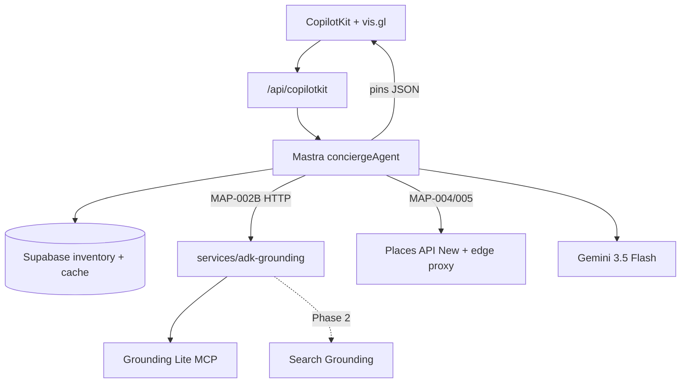

# mdeai — Maps + ADK + Gemini PRD

> **North star:** **Supabase** owns inventory and commerce. **Mastra + Gemini** own product orchestration and explanation. **Google ADK** owns multi-tool Google intelligence (Maps + Search recipes). **CopilotKit + vis.gl** own chat, cards, pins, and HITL. **Gemini must never invent geo facts** — only tools and SQL may supply coordinates, `place_id`, and Maps URLs.

**Product proof:** When the concierge tells **Camila** *“this apartment works for remote work,”* the map shows coworking pins, café density, and `placeUri` from Google — not model prose.

**Canonical split:**

| Document | Role |
|----------|------|
| **This file** | Unified **architecture + routing + phasing** (Maps + ADK + Gemini) |
| [`plan/maps/maps-prd.md`](../maps/maps-prd.md) | Maps **feature depth**, repo audit, CopilotKit integration §6 |
| [`plan/ADK/prd-adk.md`](./prd-adk.md) | ADK **program** (Skills, CLI, OpenClaw, community, eval harness) |
| [`tasks/maps/INDEX.md`](../../tasks/maps/INDEX.md) | **Execution order** + status (steps 0–13) |
| [`plan/ADK/sidecar-api-contract.md`](./sidecar-api-contract.md) | HTTP JSON contract (MAP-002B) |
| [`plan/maps/search-grounding-routing.md`](../maps/search-grounding-routing.md) | Intent → API routing matrix |

---

## 1. Executive summary

### Architecture verdict: **88/100** — ship as specified

| Question | Answer |
|----------|--------|
| Use Google ADK? | **Yes** — bounded **`services/adk-grounding/`** sidecar, not a second product brain |
| Replace Mastra? | **No** — CopilotKit → `getLocalAgents({ mastra })` only |
| Replace CopilotKit with `HttpAgent` → Python? | **No** — hard rule |
| Use two Google discovery APIs? | **Yes** — Grounding Lite (NL geo) + Places (New) (structured) |
| Defer Search Grounding? | **Yes in MVP** — SearchAgent stub until product flag |
| Gemini where? | **Mastra agents** (`gemini-3.5-flash`); **ADK agents** same default for tool orchestration |

### Locked stack (one sentence)

**CopilotKit renders; Mastra routes and persists; ADK returns grounded JSON; Places (New) enriches with field masks; Supabase owns listings and cache; vis.gl draws pins.**

---

## 2. Layer model

| Layer | Owns | Must not own |
|-------|------|----------------|
| **CopilotKit** (`mdeapp`) | Sidebar, generative cards, `useCoAgent`, `useCopilotAction`, HITL | Google server keys, Supabase service role, inventing pins |
| **Mastra** (`mdeapp`) | `conciergeAgent`, `routerAgent`, tools, workflows, quota, cache writes, CopilotKit bridge | Direct browser Places calls; CopilotKit → ADK in `route.ts` |
| **Gemini** (`@ai-sdk/google`) | Reasoning, ranking, copy, tool selection | `lat`/`lng`/`place_id`/hours without tool payload |
| **ADK sidecar** (`services/adk-grounding/`) | MapsAgent → Grounding Lite MCP; SearchAgent (stub); strict JSON out | Supabase, Stripe, sessions, CopilotKit |
| **Grounding Lite MCP** | `search_places`, `compute_routes` (allowlist per phase) | First-party rental/event inventory |
| **Places API (New)** | Details, Nearby, Text Search, Autocomplete + **`X-Goog-FieldMask`** | Client-exposed API keys |
| **Maps JavaScript** (`@vis.gl/react-google-maps`) | `Map`, `AdvancedMarker`, `mapId` | Business logic |
| **Supabase** | `apartments`, `events`, cache tables, RLS, edge `places-proxy` | LLM orchestration |

---

## 3. Target architecture

```text
┌─────────────────────────────────────────────────────────────────┐
│  CopilotKit UI (/) — CopilotSidebar + cards + vis.gl map column │
└────────────────────────────┬────────────────────────────────────┘
                             │ AG-UI
┌────────────────────────────▼────────────────────────────────────┐
│  Next.js /api/copilotkit → Mastra.getLocalAgents({ mastra })    │
│    conciergeAgent (gemini-3.5-flash)                            │
│    routerAgent → intent                                         │
│    tools: search-rentals | search-events | search-restaurants   │
│           | search-grounded-places (MAP-002B) | …               │
└─────┬──────────────────┬──────────────────┬─────────────────────┘
      │                  │                  │
      ▼                  ▼                  ▼
 Supabase SQL      HTTP JSON           Places (New)
 (inventory)       ADK :8000           via MAP-004/005
                   POST /v1/grounding/invoke
                        │
                        ▼
              ┌─────────────────────┐
              │  ADK root_agent     │
              │   ├─ MapsAgent      │──► Grounding Lite MCP
              │   └─ SearchAgent    │──► stub / flag (Phase 2)
              └─────────────────────┘
                        │
                        ▼
              Zod validate → normalize-tool-output
                        │
                        ▼
              MapContext.mergePinsByCategory → AdvancedMarker
```

### Mermaid (request path)



---

## 4. Four Google lanes (do not mix)

| Lane | Endpoint / transport | Owner task | Camila / Tourist example |
|------|----------------------|------------|---------------------------|
| **A — Grounding Lite** | `https://mapstools.googleapis.com/mcp` · `search_places` | **MAP-002** via ADK MapsAgent | *“Quiet cafés near Parque Lleras”* |
| **B — Places (New)** | `@googlemaps/places` + field masks | **MAP-004**, **MAP-005** | Venue details, nearby coworking, autocomplete |
| **C — Search Grounding** | Gemini + Google Search tool (ADK SearchAgent) | **Phase 2** after MAP-002A stable | *“Rooftop events this Friday”* (web) |
| **D — Maps JS** | `@vis.gl/react-google-maps` | **MAP-001**, **MAP-008** | Render pins only — `NEXT_PUBLIC_*` keys |

**Not production paths:** Vertex-only travel samples as runtime; Leaflet/OSM; Maps Code Assist MCP (`mapscodeassist.googleapis.com`) for prod; legacy `googlemaps` Python client in `mdeapp`.

---

## 5. Routing matrix (intent → source)

Canonical detail: [`plan/maps/search-grounding-routing.md`](../maps/search-grounding-routing.md).

| User intent | Primary | Fallback | MVP? |
|-------------|---------|----------|------|
| Rental / apartment list | Supabase `apartments` | — | Yes |
| Ticketed / hosted events | Supabase `events` (RLS) | — | Yes |
| Restaurants / attractions (curated) | Supabase + `search-restaurants` tool | Places enrich | Yes |
| NL geo discovery (“cafés near X”) | **ADK → Grounding Lite** | Places Nearby | Yes (MAP-002) |
| Static venue / address | Places Details | `venue_intelligence` cache | Yes (MAP-004) |
| Time-sensitive promos / “this Friday” | Supabase partial + **disclaimer** | Search (Phase 2) | MVP = disclaimer only |
| Neighborhood compare | Curated JSON + MAP-012 cache | Places density | Post-MVP |
| Rental lifestyle nearby | Places Nearby + cache | — | Post-MVP (MAP-006) |
| Turn-by-turn / commute card | Routes / `compute_routes` | — | Post-MVP (MAP-011) |

**Router rule (`routerAgent` / F18):** classify intent **before** calling ADK or Places — avoid billing Google for queries answerable from Supabase alone.

**Citation rule:**

| Source | UI |
|--------|-----|
| Grounding Lite / Places | `GroundingAttribution` + required Google Maps attribution |
| Search (Phase 2) | Inline citations + `source: web` on cards — never merge into SQL rows without `source` |

---

## 6. Gemini model policy

| Surface | Model ID | Env var | Notes |
|---------|----------|---------|-------|
| Mastra agents (`conciergeAgent`, etc.) | `gemini-3.5-flash` | `GOOGLE_GENERATIVE_AI_API_KEY` | Default Phase 1 — see CLAUDE.md registry |
| Complex host form-fill (optional) | `gemini-3.1-pro-preview` | same | Roberto wizard if Flash struggles |
| ADK sidecar agents | `gemini-3.5-flash` (default) | service env in `services/adk-grounding/` | Align with Mastra; document in ADK README |
| High-volume background (Phase 2+) | `gemini-3.1-flash-lite` | edge / workers only | Not concierge hot path |

**Deprecated for new code:** `gemini-2.0-flash`, `gemini-2.5-flash` (shutdown windows in CLAUDE.md).

**Forbidden in model output (enforce via Zod + tests):**

| Field | Valid source |
|-------|----------------|
| `lat` / `lng` | Tool/SQL only |
| `place_id` | Places or Grounding Lite |
| `placeUri` | `googleMapsLinks.placeUri` |
| Opening hours | Place Details mask |
| Durations | Routes API — parse `"180s"` strings |

---

## 7. ADK sidecar (MAP-002)

### Why ADK instead of Mastra → MCP only?

| Approach | Pros | Cons |
|----------|------|------|
| Mastra calls MCP directly | Fewer moving parts for one tool | Harder to add Search+Maps sub-agents, eval, official ADK patterns |
| **ADK HTTP sidecar (chosen)** | Matches Google samples; clean Search enable later; isolates Python | Second service to deploy |

### Agent layout (MVP)

```text
root_agent
├── MapsAgent → Grounding Lite MCP (search_places allowlist)
└── SearchAgent → returns empty + metadata.reason = search_disabled
```

**Places Details** stay in **MAP-004/005** (Mastra/edge) — ADK does not duplicate Places client in MVP.

### HTTP contract

See [`sidecar-api-contract.md`](./sidecar-api-contract.md):

- `POST {ADK_GROUNDING_URL}/v1/grounding/invoke`
- Request: `{ tool, query, locationBias, pageSize, requestId }`
- Response: `{ places, pins, attribution, citations, confidence, metadata }`
- Fail-closed: drop places without `googleMapsLinks.placeUrl`; log `metadata.reason`

### Invariants

1. **One orchestrator per request** — Mastra only; never CopilotKit → ADK in `route.ts`.
2. ADK **never** writes Supabase.
3. Mastra checks **quota** before HTTP call; writes **cache** after (MAP-005 migrations).
4. Default `locationBias`: Medellín (~6.2442, -75.5812).

### Reference repos (read-only)

| Path | Use |
|------|-----|
| `github/maps/grounding-lite-mcp-sample-app` | MCP shapes + attribution |
| `github/copilotkit/ag-ui-adk-grounding-app` | Sub-agent-as-tool + generative UI patterns (**do not** copy HttpAgent wiring) |
| `github/adk/adk-samples/.../travel-planner-google-maps-mcp` | ADK + MCP wiring |

---

## 8. Environment & security

| Variable | Client? | Consumer |
|----------|---------|----------|
| `NEXT_PUBLIC_GOOGLE_MAPS_API_KEY` | Yes | vis.gl `APIProvider` |
| `NEXT_PUBLIC_GOOGLE_MAPS_MAP_ID` | Yes | `AdvancedMarker` parent `<Map>` |
| `GOOGLE_MAPS_API_KEY` | Server | ADK → Grounding Lite MCP |
| `ADK_GROUNDING_URL` | Server | Mastra `adk-grounding-client.ts` |
| `GOOGLE_PLACES_API_KEY` | Server | MAP-004 / `places-proxy` edge |
| `GOOGLE_GENERATIVE_AI_API_KEY` | Server | Mastra + ADK Gemini |

**Never** `NEXT_PUBLIC_*` for Places, MCP, or ADK. **Never** service role in `mdeapp/src/**`.

**Cache tables (MAP-005 prerequisite):** `grounded_places_cache`, `place_details_cache`, `places_search_cache`, `rental_nearby_context`, `restaurant_profiles`, `venue_intelligence`, `neighborhood_intelligence`, `agent_tool_logs` — each **RLS enabled**, ≥1 policy.

---

## 9. Personas → surfaces → stack

| Persona | Surface | Primary data | Google layer |
|---------|---------|--------------|--------------|
| **Camila** | `/`, `/rentals` | Supabase apartments | Places nearby (MAP-006); optional ADK for NL |
| **Tourist** | `/` concierge | SQL restaurants/attractions + ADK discovery | MAP-002 + F49 cards |
| **Roberto** | `/host/event/new` | Supabase events + venue | MAP-010 autocomplete (Places) |
| **Patricia** | ops / advisors | cache + `agent_tool_logs` | Quota, field masks, RLS |
| **Sofía** | CI | Vitest + floor + Playwright X1–X5 | [`VERIFICATION-CHECKLIST.md`](../../tasks/maps/VERIFICATION-CHECKLIST.md) |

---

## 10. Implementation order

**Authoritative step table:** [`tasks/maps/INDEX.md`](../../tasks/maps/INDEX.md).

| Step | ID | MVP? | Delivers |
|-----:|----|:----:|----------|
| 0 | F09, F13, F19 | — | Test + storage + concierge base |
| 1 | **MAP-001** | Yes | Contracts, MapContext, vis.gl — **Done** |
| 2 | **F48** | Yes | 3-panel shell — **Done** |
| 3 | **F49** | Yes | Generative cards → pins |
| 4 | **MAP-002** | Yes | ADK sidecar + `search-grounded-places` + attribution |
| 5 | **MAP-004** | Yes | Places (New) client + masks |
| 6 | **MAP-007** | Yes | Mobile polish |
| 7–13 | MAP-005 … MAP-012 | Post | Proxy/cache, nearby, markers, routes, hoods |

**MAP-002 sub-steps:** 002A ADK service → 002B Mastra client + tool → 002C `GroundingAttribution` UI.

**MVP exit (O4):** MAP-001 + MAP-002 (+ optional MAP-007). **Gate:** F49 pin proof before deep Roberto/Camila geo features.

**CopilotKit tasks are not MAP ids:** F48/F49/F50 live in `tasks/core/`.

---

## 11. Phase gates

### MVP (W5–W6)

| Allowed | Blocked without flag |
|---------|----------------------|
| ADK MapsAgent → `search_places` | Search Grounding in prod |
| Supabase tools for rentals/events | Web promos presented as verified facts |
| Places (New) server-side with masks | Browser Places SDK |
| `GroundingAttribution` on grounded turns | Grounded cards without attribution |

### Phase 2 — Search

Enable ADK `SearchAgent` when:

- [ ] [`search-grounding-routing.md`](../maps/search-grounding-routing.md) reviewed (Patricia cost + product liability)
- [ ] MAP-002A stable in staging
- [ ] `search_grounded_events` tool + `source` field on merged cards
- [ ] Rate caps in ADK + Mastra quota

### Phase 3+

- Multi-stop itineraries (`build_grounded_itinerary`)
- OpenClaw enrichment, pgvector memory
- WhatsApp / Postiz (see [`prd-adk.md`](./prd-adk.md) §14)

---

## 12. Repo truth (`mdeapp`, 2026-05-20)

| Area | State |
|------|--------|
| **MAP-001** | **Done** — `platform/contracts`, `platform/maps`, `components/maps` |
| **F48** | **Done** — 3-panel `/` shell |
| **F49** | In progress — generative tool renders |
| **MAP-002** | **Not started** — `services/adk-grounding/` absent |
| **MAP-004** | Not started — no `google-places-client.ts` in mdeapp |
| **Mastra tools** | `search-rentals`, `search-events`, `search-restaurants`, `search-attractions` exist (SQL/curated) |
| **Gemini** | `gemini-3.5-flash` via `mastra/lib/models.ts` |
| **CopilotKit** | 1.55.2 pinned; `getLocalAgents` in `route.ts` |

---

## 13. Testing & Done gates

Master checklist: [`tasks/maps/VERIFICATION-CHECKLIST.md`](../../tasks/maps/VERIFICATION-CHECKLIST.md) (G1–G8, X1–X5).

| Gate | Proof |
|------|--------|
| Anti-hallucination | Tool tests reject rows without `place_id` when claiming Google |
| Field masks | CI fails if Places call drops `X-Goog-FieldMask` |
| ADK bridge | `adk-grounding-client.test.ts` + local `:8000` smoke |
| Pin pipeline | ≥3 `[data-testid="map-pin"]` after F49 rental prompt |
| Runtime | `npm run dev` + `curl /` 200 + POST `/api/copilotkit` not 500 |

---

## 14. Do not build (fail review)

| Item | Why |
|------|-----|
| CopilotKit `HttpAgent` → ADK in Next route | Breaks agent registry + memory |
| Second orchestrator competing with Mastra | Dual-brain bugs |
| ADK writing Supabase | Violates sidecar contract |
| Places API from browser | Key exposure + mask bypass |
| `AdvancedMarker` without `mapId` | Prod marker failure |
| Search Grounding in MVP prod | Cost + liability + citation gaps |
| `generativeSummary` for Medellín hoods | US-limited / empty in CO |
| Parallel maps task folders | Execute **`tasks/maps/`** only |

---

## 15. Document maintenance

When architecture changes:

1. Update **this file** first (§3–§5, §10).
2. Sync [`tasks/maps/INDEX.md`](../../tasks/maps/INDEX.md) step order if execution changes.
3. Sync [`sidecar-api-contract.md`](./sidecar-api-contract.md) if HTTP JSON changes.
4. Add a dated note to [`plan/maps/maps-prd.md`](../maps/maps-prd.md) §1 repo truth — do not fork competing diagrams.

**ADR:** Older [`prd-adk.md`](./prd-adk.md) §1 stated “Phase 1 skips ADK in prod.” **Superseded:** MVP includes **MAP-002 ADK sidecar** per tasks/maps (2026-05-20). Broader ADK program (Skills, OpenClaw) remains Phase 2+ in `prd-adk.md`.

---

## 16. Quick reference links

| Need | Link |
|------|------|
| Execute work | [`tasks/maps/INDEX.md`](../../tasks/maps/INDEX.md) |
| MAP-002 spec | [`tasks/maps/MAP-002-grounding-attribution.md`](../../tasks/maps/MAP-002-grounding-attribution.md) |
| HTTP contract | [`sidecar-api-contract.md`](./sidecar-api-contract.md) |
| Routing | [`search-grounding-routing.md`](../maps/search-grounding-routing.md) |
| Maps features PRD | [`maps-prd.md`](../maps/maps-prd.md) |
| ADK program PRD | [`prd-adk.md`](./prd-adk.md) |
| ADK roadmap | [`adk-roadmap.md`](./adk-roadmap.md) |
| Implementation notes | [`tasks/maps/notes.md`](../../tasks/maps/notes.md) |
