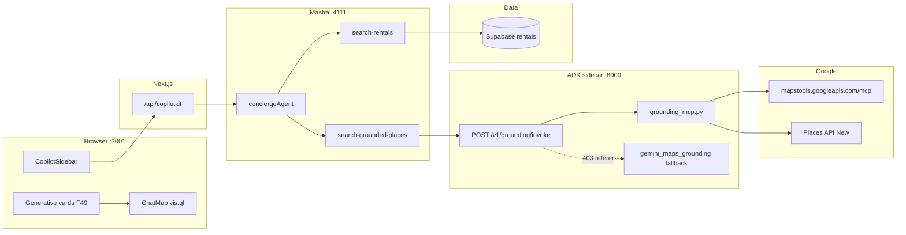
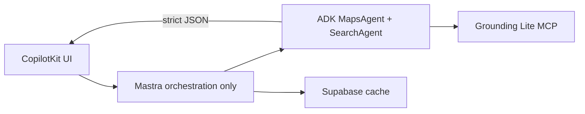
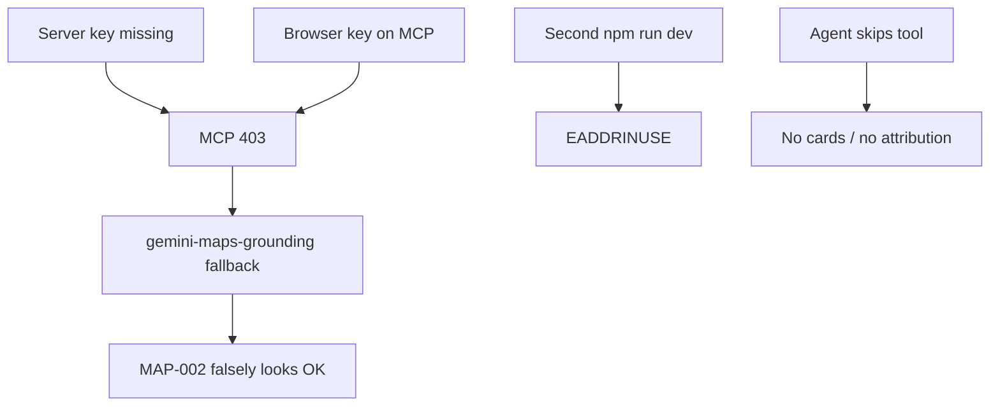

# Full localhost QA report — mdeai

## Readiness score: **84 / 100**

| Area | Pts | Notes |
|------|----:|-------|
| Services + env | 18/20 | UI/Mastra/sidecar up; server key configured |
| Automated gates | 22/25 | All verify scripts pass; **floor fails audit** |
| Grounding Lite MCP | 18/20 | All invokes **grounding-lite** (no gemini this run) |
| Rental map pipeline | 15/15 | smoke 5+6, console clean |
| MAP-002 UI Done gates | 6/15 | Attribution not proven all prompts; no ADK agents |
| Security / arch | 5/5 | No HttpAgent; no server keys in client src |

---

## Your EADDRINUSE — not a blocker

```
Error: listen EADDRINUSE :::3001
```

**Meaning:** `npm run dev` was already running. **Do not start a second dev.**

| Check | Command | This run |
|-------|---------|----------|
| UI alive | `curl … :3001/` | **200** |
| Action | — | **Skipped** `npm run dev` ✅ |

---

## Phase 1 — Service health

| Service | URL | HTTP |
|---------|-----|------|
| Next.js UI | http://localhost:3001 | **200** |
| Mastra Studio | http://localhost:4111 | **200** |
| ADK sidecar | http://localhost:8000/health | **`{"status":"ok"}`** |

Sidecar start: **skipped** (already healthy).

---

## Phase 2 — Core tests

| Command | Exit | Result |
|---------|------|--------|
| `npm test` | 0 | **82/82** |
| `npm run lint` | 0 | pass |
| `npm run typecheck` | 0 | pass |
| `npm run build` | 0 | pass (turbopack root + middleware warnings) |
| `npm run verify:maps-env` | 0 | Places probe **200**; GEMINI key name warning |
| `npm run verify:grounding` | 0 | **`source: grounding-lite`**, 5 pins |
| `npm run verify:rental-pins` | 0 | Supabase path OK |
| `npm run smoke:map-pins` | 0 | **5** cards, **6** pins |
| `npm run verify:console` | 0 | **0** critical errors |
| `npm run verify:supabase` | 0 | pass |
| `npm run floor` | **1** | lint/typecheck/build/test OK; **`npm audit` high** (playwright) |

---

## Phase 3 — MCP / grounding

Direct `POST /v1/grounding/invoke` (sidecar):

| Query | source | pins | attribution |
|-------|--------|-----:|------------:|
| quiet cafés near Laureles | **grounding-lite** | 5 | 5 |
| Quiet cafés near Parque Lleras | **grounding-lite** | 5 | 5 |
| Find rentals in Laureles under 1200 | **grounding-lite** | 4 | 4 |
| Best cowork cafés in Medellín | **grounding-lite** | 5 | 5 |

| Check | Status |
|-------|--------|
| MCP URL `mapstools.googleapis.com/mcp` | ✅ `grounding_mcp.py` |
| Server key used (via `run-dev.sh`) | ✅ `GOOGLE_MAPS_SERVER_API_KEY` in `.env.local` |
| Browser key not required for MCP | ✅ |
| Gemini fallback masking failure | ✅ **not triggered** this sweep |
| `gemini_maps_grounding.py` still in tree | 🟡 dev fallback exists — monitor |

**Note:** Rental **UI** uses Mastra `search-rentals` → Supabase, not sidecar invoke. Sidecar “rentals” query is a places search smoke only.

---

## Phase 4 — Browser / Playwright

| Check | Result |
|-------|--------|
| Page loads :3001 | ✅ |
| `smoke:map-pins` (Playwright headless) | ✅ 5 cards, 6 pins |
| `verify:console` | ✅ 0 critical |
| RefererNotAllowedMapError | ✅ not in console gate |
| Maximum update depth | ✅ not in console gate |
| 4-prompt sequential UI script | 🟡 attribution visible **1/4** — agent routing flaky |
| Mindtrip 3-column layout | 🟡 **not shipped** — F48 sidebar + map; MAP-007 not started |

**Canonical rental smoke prompt:** `1BR apartment in Laureles under 80 dollars per night`

---

## Phase 5 — Architecture audit

| Probe | Expected | Result |
|-------|----------|--------|
| `HttpAgent` in `mdeapp/src` | 0 | ✅ **0** |
| `HttpAgent` in `services/` | 0 | ✅ **0** |
| `getLocalAgentsWithLogging` in copilotkit route | yes | ✅ |
| `NEXT_PUBLIC_GOOGLE_PLACES` in `mdeapp/.env.local` | 0 | ✅ **removed** |
| Server keys in client `mdeapp/src` | 0 live usage | ✅ only `NEXT_PUBLIC_GOOGLE_MAPS_API_KEY` in `map-config.ts` |
| `LlmAgent` / `GoogleMapsGroundingTool` in sidecar | MAP-002A target | 🔴 **not implemented** — FastAPI + httpx MCP |
| `gemini-maps-grounding` in `main.py` | fallback only | 🟡 present — must stay off in prod |

---

## Env verification (masked)

| Variable | Role | Status |
|----------|------|--------|
| `NEXT_PUBLIC_GOOGLE_MAPS_API_KEY` | Browser map | ✅ referrer-restricted |
| `GOOGLE_MAPS_SERVER_API_KEY` | MCP sidecar | ✅ set |
| `GOOGLE_PLACES_API_KEY` | Places API New | ✅ server key |
| `GOOGLE_GENERATIVE_AI_API_KEY` | Mastra | ✅ |
| `ADK_GROUNDING_URL` | :8000 | ✅ |

---

## ✅ Passed

- All services healthy without second `npm run dev`
- Full test/lint/typecheck/build/verify suite (except floor audit)
- **grounding-lite** on all MCP invokes + `verify:grounding`
- Rental cards + map pins (6) + clean console
- Architecture: Mastra local agents, no HttpAgent, env hygiene

## 🟡 Warnings

- `npm run floor` fails on **playwright** high CVE (audit only)
- GEMINI_API_KEY naming duplicate
- Gemini fallback code path still in sidecar (dormant when MCP OK)
- MAP-002A: no google-adk `LlmAgent` / `McpToolset` yet
- UI: CopilotSidebar layout ≠ Mindtrip center column (MAP-007)
- GroundingAttribution not proven on all 4 chat prompts
- Next.js turbopack root / middleware deprecation warnings

## 🔴 Blockers (MAP-002 Done only)

| Gate | Status |
|------|--------|
| grounding-lite verified | ✅ |
| Grounded pins in **chat** + attribution every turn | 🟡 inconsistent |
| `npm run floor` green | 🔴 audit |
| Evidence + task checklist in MAP-002.md | 🔴 incomplete |

**MAP-002: remain In Progress**

---

## Diagrams

### 1. Current architecture (verified)



### 2. Best-practice target (MAP-002 + MAP-007)



### 3. Failure points (watch)



---

## Related docs

- [`tasks/maps/TROUBLESHOOTING-CHECKLIST.md`](../maps/TROUBLESHOOTING-CHECKLIST.md)
- [`tasks/maps/VERIFICATION-CHECKLIST.md`](../maps/VERIFICATION-CHECKLIST.md)
- [`mdeapp/docs/localhost-qa-runbook.md`](../../mdeapp/docs/localhost-qa-runbook.md)
