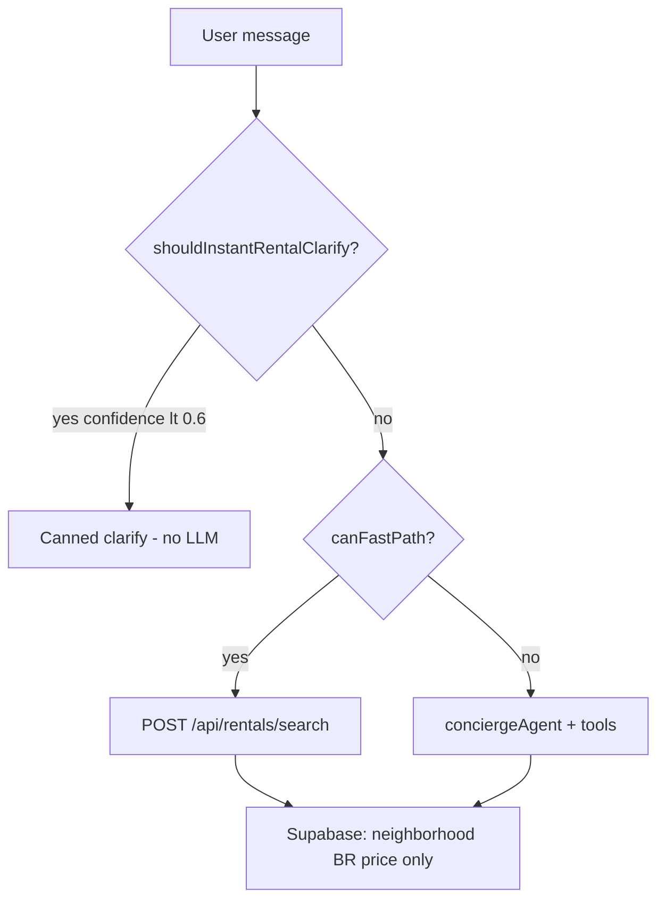

# Rental agent intelligence audit — `03-rental-agent.md`

**Date:** 2026-05-28  
**Prod:** https://www.mdeai.co/  
**Hero failure:** `list rentals in june 1 to 30 $1000 medellin` → canned clarify (reproduced on prod via Chrome DevTools)

---

## Executive summary

| Layer | Score | Notes |
|-------|-------|-------|
| **Narrow fast-path** (neighborhood + $/night) | **95/100** | Proven in `01-rentals-prompt` |
| **Monthly / date-range / city-wide** | **35/100** | Parser partially understands budget; blocks search anyway |
| **Expert concierge UX** | **40/100** | Generic clarify ignores extracted signals |
| **Overall rental intelligence** | **55/100** | Keyword bot on rich queries; expert on simple ones |

---

## Root cause (why the bad clarify fired)

### What the parser actually extracted

Query: `list rentals in june 1 to 30 $1000 medellin`

| Signal | Extracted? | Value |
|--------|------------|-------|
| Rental intent | ✅ | `looksLikeRentalSearch` |
| Budget | ✅ | `$1000` → `maxPricePerNight: 33`, `budgetType: monthly` |
| Dates (June 1–30) | ❌ | No `hasDates`; not in schema |
| City (Medellín) | ❌ | `medellin` ≠ neighborhood regex (Laureles, Poblado, …) |
| Monthly stay | ⚠️ | Inferred via `$1000` + no `/night` → monthly conversion only |
| Bedrooms / vibe | ❌ | — |
| **confidence** | **0.5** | Budget only → below 0.6 gate |

### Decision chain (`rental-query-parser.ts`)

1. `isGenericRentalQuery` → `confidence < 0.6` → **true**
2. `shouldInstantRentalClarify` → **true** (fast-path intercept)
3. `canFastPathRentalSearch` → **false**
4. UI shows `RENTAL_CLARIFY_MESSAGE` — *before* `conciergeAgent` runs

So Camila sees “What dates, budget, and setup…” even though **budget was already parsed** ($33/night equivalent). Dates were in the message but **never parsed**.

### Prod confirmation

Chrome DevTools on mdeai.co: same canned clarify, no `/api/rentals/search` on first turn.

---

## Parser matrix (local `tsx` trace)

| Prompt | Clarify? | Fast-path? | Params |
|--------|----------|------------|--------|
| `list rentals in june 1 to 30 $1000 medellin` | **yes** | no | null |
| `rentals in june for one month around $1000` | **yes** | no | null |
| `studio in laureles for july` | no | **yes** | Laureles, studio (0 BR) |
| `2 month furnished apartment in poblado` | **yes** | no | null |
| `cheap monthly rental medellin` | no | **yes** | max $60/night (wrong: treats “cheap” not monthly) |
| `remote work apartment envigado` | no | **yes** | Envigado + vibe |

**Pattern:** Anything with **budget + dates but no barrio** → clarify. **Furnished/month count** without BR/budget → clarify.

---

## Architecture gaps



| Gap | Impact |
|-----|--------|
| No **date** fields in `RentalSearchApiParams` / `lastRentalQuery` | June stay ignored in search |
| DB has `available_from` / `available_to` but **not filtered** in `searchRentals` | Cards show availability text but query can't narrow |
| **Medellín city-wide** not a neighborhood | “medellin” doesn't boost confidence |
| **Instant clarify** bypasses concierge instructions | LLM gate in `concierge.ts` never runs on turn 1 |
| `isGenericRentalQuery` ignores `budgetType: monthly` + date keywords | False “generic” |
| `rentalAgent` exists but **chat uses `conciergeAgent`** | Specialist instructions unused on `/` |

---

## What works today (keep)

- Laureles / Poblado / Envigado neighborhood regex
- Nightly + monthly budget conversion (`parseBudget`)
- Fast-path for `1BR in Laureles under $80/night` (prod 100%)
- `genericAskPending` follow-up merge (after clarify)
- Concierge prompt has good **Medellín heuristics** (unused when fast-path clarify fires)
- PR #12 pin clear on zero results

---

## Recommended improvements (priority)

### P0 — Quick parser fixes (1 PR, ~1 day)

**Goal:** Search immediately when user gave budget + (dates OR monthly intent OR city).

1. **`hasDateRange` / `hasMonthlyStay`** in `scoreRentalQuery`:
   - Match: `june`, `\d{1,2}\s*to\s*\d{1,2}`, `one month`, `2 months`, `monthly rental`, `for july`
2. **`medellin` / `medellín`** → `cityWide: true` or default search (no neighborhood filter)
3. **Raise confidence** when `hasBudget && (hasDateRange || hasMonthlyStay || cityWide)` → **≥ 0.75** → skip clarify
4. **`isGenericRentalQuery`**: return false if `budgetType === 'monthly'` or `hasDateRange`
5. **Contextual clarify** (`rental-clarify-copy.ts`):
   - If budget parsed: “Got ~$1,000/month — which neighborhood fits you: Laureles (walkable), Poblado (nightlife), or Envigado (quieter)?”
   - Never ask for budget/dates already in the message

**Tests:** Add `rental-query-parser.test.ts` cases from `03-rental-agent.md` §6.

### P1 — Search payload (1 PR, ~2–3 days)

1. Extend API + tool:
   ```ts
   checkIn?: string;  // ISO date
   checkOut?: string;
   stayType?: 'monthly' | 'nightly';
   ```
2. Filter `searchRentals` on `available_from` / `available_to` overlap
3. Mirror fields in `ConciergeWorkingMemory.lastRentalQuery`

### P2 — Expert UX (1 PR)

1. **Rank monthly stays:** boost `minimum_stay_days >= 28`, furnished tags
2. **Chip suggestions** after clarify: Laureles / Poblado / Envigado / “furnished”
3. **Agent path:** if fast-path skips, ensure `conciergeAgent` uses gate examples for monthly (already in prompt — align parser thresholds)

### P3 — Optional `rentalAgent` routing

Route high-confidence rental-only threads to `rentalAgent` for deeper prose; keep fast-path for latency.

---

## PR breakdown (suggested ledger)

| Row | Scope | Files |
|-----|-------|-------|
| C-013 | Parser: dates, city, confidence, smart clarify | `rental-query-parser.ts`, `rental-clarify-copy.ts`, tests |
| C-014 | API date filters | `search-rentals.ts`, `api/rentals/search/route.ts`, types |
| C-015 | Monthly ranking + furnished heuristic | `search-rentals.ts`, `rental-display.ts` |
| C-016 | E2E prod prompt for June/$1000 | `e2e/prod/rental-agent-intelligence.spec.ts` |

---

## How to test on prod

```bash
# Parser unit (before deploy)
cd mdeapp && npx tsx -e "..."  # see audit session

# Playwright narrow path (regression)
SMOKE_BASE_URL=https://www.mdeai.co PW_SKIP_WEBSERVER=1 \
  npx playwright test e2e/prod/pr12-pin-clear-prod-gate.spec.ts

# Manual / Chrome DevTools
# 1. list rentals in june 1 to 30 $1000 medellin  → should search OR neighborhood-only clarify
# 2. studio in laureles for july                   → cards + pins
# 3. remote work apartment envigado                → Envigado results
```

Network: first turn should show `POST /api/rentals/search` **200** when P0 lands.

---

## Verdict

**Production readiness**

- **Infrastructure / fast-path / maps:** ✅ (post PR #10–#12)
- **Rental advisor intelligence:** ❌ for monthly/date/city queries until P0+P1

**Next step:** Ship **C-013** before G1 Stripe — small diff, high Camila impact on the exact prompt in `03-rental-agent.md`.

## Implementation tasks (2026-05-28)

| ID | Title | Priority |
|----|-------|----------|
| [RE-017](../../../real-estate/tasks/RE-017-rental-parser-intelligence.md) | Parser dates/city/confidence | P0 |
| [RE-018](../../../real-estate/tasks/RE-018-gemini-rental-clarify-routing.md) | Gemini clarify routing | P0 |
| [RE-019](../../../real-estate/tasks/RE-019-rental-availability-search.md) | Availability date filters | P1 |
| [RE-020](../../../real-estate/tasks/RE-020-rental-preference-memory.md) | pgvector preferences | P2 |

Index: [`tasks/real-estate/tasks/INDEX.md`](../../../real-estate/tasks/INDEX.md).

**Shared intelligence program:** [`tasks/intelligence/00-shared-intelligence-architecture.md`](../../../intelligence/00-shared-intelligence-architecture.md) · [`INT-001`](../../../intelligence/INT-001-shared-intent-slot-extraction.md) · [`INT-002`](../../../intelligence/INT-002-rental-vertical-intelligence.md).
