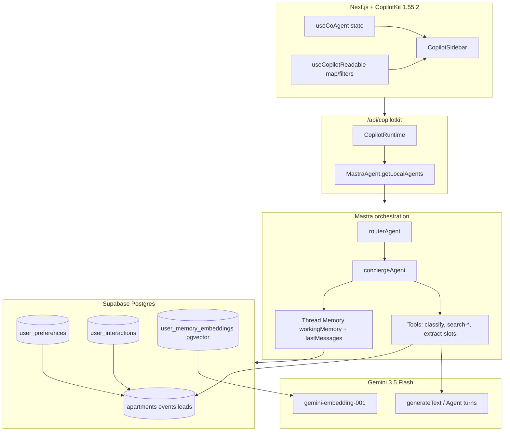
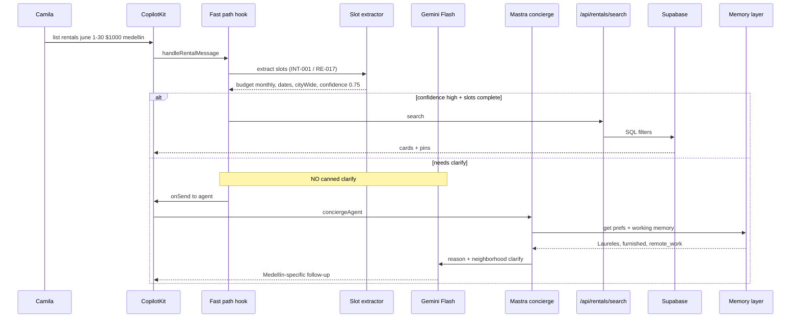
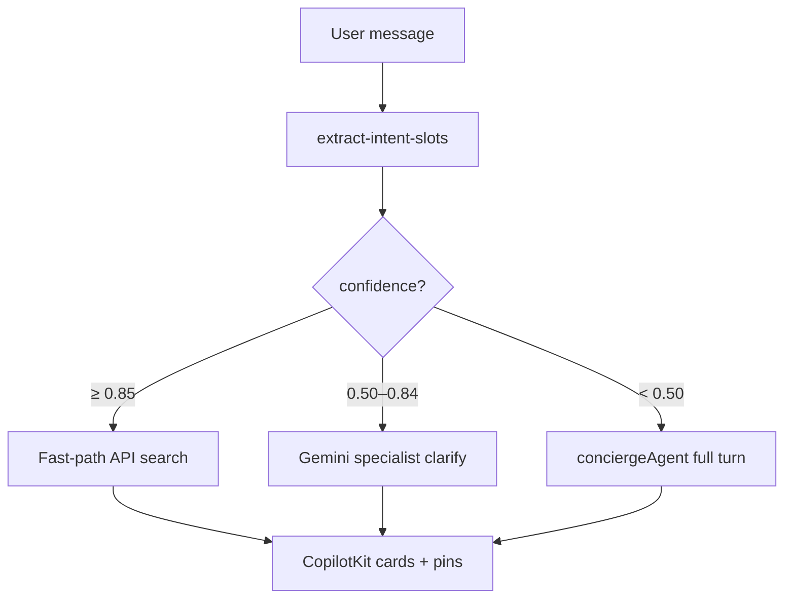
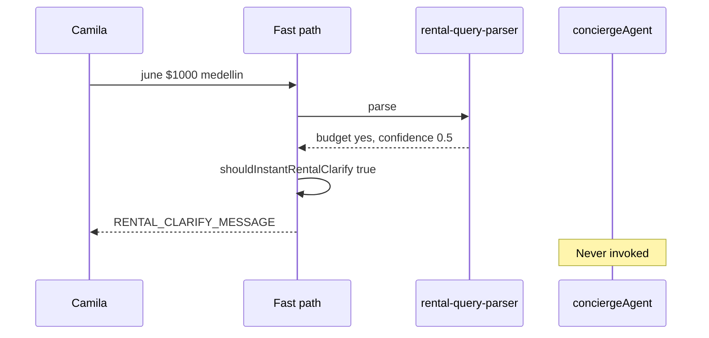
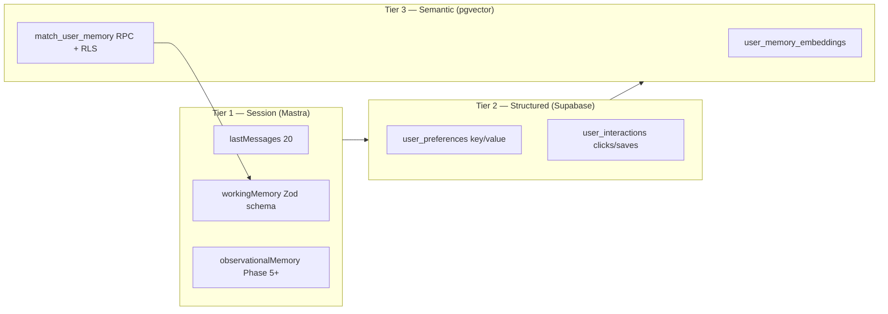
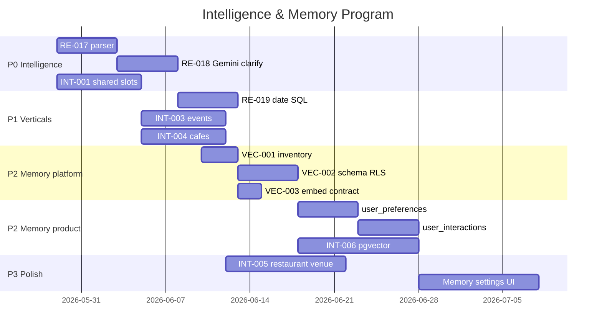
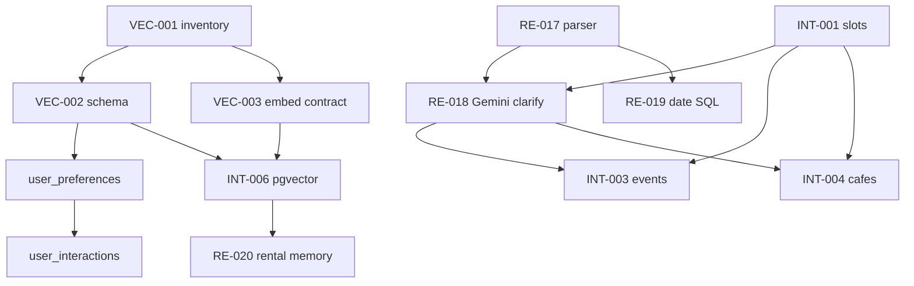

# mdeai Agent Intelligence & Shared Memory — Master Plan

## BLUF

Build **two layers**:

1. **Intelligence** (P0) — shared intent/slots + Gemini clarify; stop `regex → canned clarify → STOP`.
2. **Memory** (P1–P2) — Mastra thread memory (exists) + **durable Supabase** (prefs, interactions) + **pgvector** (semantic recall).

**Golden rule:** Mastra orchestrates; Gemini reasons; code searches; Supabase remembers; CopilotKit mirrors UI state.

### Platform definition

```text
mdeai =
  AI concierge platform
+ persistent memory
+ multi-domain intelligence
+ maps + search
+ personalization
```

### Core pattern (non-negotiable)

```text
shared reasoning → vertical specialist → deterministic search
```

| Wrong (today on ambiguous rentals) | Right (target) |
|-----------------------------------|----------------|
| Regex parser → canned question → SQL | Gemini understands → specialist refines → APIs execute → memory personalizes |

**Bottleneck is architectural, not model quality:** `shouldInstantRentalClarify()` runs **before** `conciergeAgent`. Gemini is bypassed on turn 1 — the AI is not “weak”; the fast-path gate is too aggressive.

**Do not build memory before intelligence:** Today’s P0 problem is reasoning never runs — not missing vectors. Ship **RE-017 + RE-018** before **VEC-001 / INT-006**.

### Gemini vs deterministic code

| Gemini Flash | Deterministic code |
|--------------|-------------------|
| Understand intent, dates, monthly stays | SQL / Supabase queries |
| Conversational clarify, Medellín expertise | Filtering, pricing math |
| Ranking **explanations** | Ranking **scores**, sort order |
| Preference extraction, memory summaries | Map pins, caching, API execution |

**Rule:** AI must not own ranking math. AI explains; code scores.

---

## External architecture review (2026-05-28)

Independent review of this plan — **verified correct** against `mdeapp/src` and task specs.

| Area | Verdict |
|------|---------|
| Architecture direction | ✅ Excellent |
| Mastra / CopilotKit / Gemini roles | ✅ Correct |
| Supabase + pgvector design | ✅ Correct |
| Shared intelligence + PR roadmap | ✅ Very strong |
| Memory tiers (session / structured / semantic) | ✅ Correct |
| Anti-pattern: one giant super-agent | ✅ Correctly avoided |

### Implementation readiness (plan vs disk)

| Area | Design | Shipped |
|------|--------|---------|
| Infra / maps / API / fast-path nightly | 100% | ✅ PR #10–#12 |
| Shared intelligence design | ~95% | ⚪ INT-001 |
| Memory architecture design | ~95% | ⚪ Tier 2–3 |
| Gemini reasoning on turn 1 (rentals) | Spec’d | ❌ RE-018 |
| Rental monthly/date expertise | Spec’d | ❌ RE-017 |
| Structured + semantic memory | Spec’d | ❌ VEC + INT-006 |

**Summary:** The **body** (APIs, maps, cards, infra) is production-ready. The **brain** (reasoning, memory, personalization) is this program’s next phase. This document is the approved blueprint.

---

## Review: `AGENT/01-prompt.md` & `AGENT/02-links-memory.md`

| Doc | Verdict | Notes |
|-----|---------|-------|
| **01-prompt** | ✅ Correct architecture | Three-tier memory (structured + vectors + Mastra) matches production best practice. PR1–7 order is sound; **align PR1 with RE-017/018 + INT-001** (see roadmap below). |
| **02-links-memory** | ✅ Curated link set | Mastra + Supabase + CopilotKit links valid. Remove MongoDB blog. **`useCoAgent` URL → v2 `useAgent`** — Phase 1 stays on **CopilotKit 1.55.2** + local Mastra example. |
| **Gap in 01-prompt** | Add | Does not name **instant clarify bypass** — root cause doc: [`03-rental-agent-audit.md`](../testing/prompts/real-estate/03-rental-agent-audit.md). |
| **Gap in both** | Add | **VEC-003** embedding contract (`gemini-embedding-001`, 768d) before any new vector table. |

**Consolidated memory principle (from 01-prompt):**

> Use **Mastra** for agent session context; use **Supabase + pgvector** for durable, editable, RLS-safe product memory.

---

## PRD

### Problem

| Persona | Pain today |
|---------|------------|
| **Camila** | Rich rental prompts get generic clarify; budget/dates re-asked; no monthly Medellín expertise on turn 1 |
| **Roberto** | Event follow-ups may hit same fast-path gates |
| **Tourist** | Café/restaurant queries lack shared slot extraction |
| **Patricia** | No user-visible memory audit; prefs not queryable |

**Root cause:** `shouldInstantRentalClarify()` in `use-rental-search-fast-path.ts` runs **before** `conciergeAgent` (Gemini never sees turn 1).

### Vision

One **shared intelligence layer** extracts intent + slots for every vertical; **specialist modules** add domain rules; **memory** personalizes ranking without hiding data in the model.

### Goals

| # | Goal | Metric |
|---|------|--------|
| G1 | Gemini-powered clarify on ambiguous rentals | Hero query ≠ canned `RENTAL_CLARIFY_MESSAGE` |
| G2 | Shared slot schema across verticals | INT-001 Zod used by rental + café tests |
| G3 | Fast-path preserved for high-confidence nightly queries | `01-rentals-prompt` regression green |
| G4 | Durable prefs in Supabase with RLS | `user_preferences` CRUD + policy tests |
| G5 | Semantic recall for prefs | pgvector match + INT-006 E2E |
| G6 | User can view/edit/delete memory | Settings surface (Phase 7) |

### Non-goals (Phase 1 MVP exit)

- CopilotKit v2 migration
- `rentalAgent` as default on `/` (optional Phase 2)
- OpenAI embeddings
- MongoDB / external vector DB
- Full hybrid FTS+vector for listings (Phase 2+)

---

## System architecture

### Layer diagram



### Turn sequence (target)



### Confidence routing (explicit — implement in RE-017 / INT-001)

**Schema on disk:** `mdeapp/src/lib/intent-slots.ts` — `intent`, `confidence`, `action`, `slots`; helper `canDeterministicSearch()`. Mastra tool: `extract-intent-slots`.

Replace binary `confidence < 0.6 → instant canned clarify` with three bands:

| Confidence | Action | Example |
|------------|--------|---------|
| **≥ 0.85** | **Fast-path** — deterministic search, no agent | `1BR Laureles under $80/night` |
| **0.50 – 0.84** | **Gemini clarify** — specialist follow-up only; no generic re-ask of known slots | `June 1–30 $1000 Medellín` (budget + dates parsed) |
| **< 0.50** | **Full concierge** — `conciergeAgent` + tools | `help me find a place` |



**Today on disk:** `rental-query-parser.ts` uses `0.6` threshold and `shouldInstantRentalClarify()` **before** agent — hero query at `0.5` hits canned copy. **RE-017** should adopt the table above and **delete** instant canned clarify for partial-signal queries.

**Additional gates (unchanged):** `genericAskPending`, `lastRentalQuery` in working memory, `concierge.ts` rental gate — keep; align with confidence bands.

---

### Broken path (today)



### Memory architecture (three tiers)



| Tier | Store | Lifetime | Example |
|------|-------|----------|---------|
| 1 | Mastra `@mastra/memory` + `getMastraStorage()` | Thread / resource | `lastRentalQuery`, `mapUi` |
| 2 | Supabase tables | User account | `preferred_neighborhood = Laureles` |
| 3 | pgvector | User account | “quiet remote work” ≈ “peaceful WiFi” |

**Tier analogies**

| Tier | Question it answers |
|------|---------------------|
| 1 Session | “What are we discussing *right now*?” (June rental, Laureles, furnished) |
| 2 Structured | “What do we *know* about this user?” (monthly stays, remote work, quiet areas) |
| 3 Semantic | “What *similar* things did they like before?” (calm cafés, walkable, strong WiFi) |

**Identifiers (Mastra):** `resource = user_id`, `thread = chat_id` — stable `resource` across threads per [Mastra threads/resources](https://mastra.ai/docs/memory/threads-and-resources).

---

## Agent & tool catalog

### Agents (existing + proposed)

| Agent | Status | Role | Phase |
|-------|--------|------|-------|
| `conciergeAgent` | ✅ Production on `/` | UX, tools, working memory | 0+ |
| `routerAgent` | ✅ Shipped F18 | Classify + workflow dispatch | Wire UI Phase 1 |
| `rentalAgent` | ✅ Exists | Rental specialist (optional route) | P2 |
| `eventAgent` | ✅ Exists | Events | INT-003 |
| `memorySummarizer` | 🔲 Proposed | Background: prefs → embeddings | Phase 5 |
| `extractAgent` | 🔲 Optional | Thin `generateText` clarify only | Phase 0 alt to full concierge |

### Tools — core (Phase 0–2)

| Tool | Owner | Deterministic? | Notes |
|------|-------|----------------|-------|
| `classify-intent` | Mastra | LLM JSON | Extend → `extract-intent-slots` (INT-001) |
| `search-rentals` | Mastra | ✅ SQL | Add dates RE-019 |
| `search-events` | Mastra | ✅ SQL | |
| `search-grounded-places` | Mastra | ✅ Places | Field masks required |
| `search-restaurants` | Mastra | ✅ | INT-005 |
| `search-attractions` | Mastra | ✅ | |

### Tools — advanced (Phase 3–7)

| Tool | Layer | Purpose |
|------|-------|---------|
| `retrieve-user-preferences` | Supabase | Structured prefs before search |
| `upsert-user-preference` | Supabase | Agent/HITL writes prefs |
| `log-user-interaction` | Supabase | click/save/reject |
| `retrieve-semantic-memories` | pgvector RPC | Top-k by embedding |
| `upsert-memory-embedding` | Edge/server | After summarizer |
| `rank-listings-with-memory` | App | Boost scores (deterministic) |

### CopilotKit surfaces (Phase 1 app)

| Hook | Use | Skill |
|------|-----|-------|
| `useCoAgent({ name: "conciergeAgent" })` | Shared working memory | `copilotkit-develop` |
| `useCopilotReadable` | Map viewport, selected pin, filters | `copilotkit-develop` |
| `useCopilotAction` | HITL publish, card actions | `copilotkit` |
| Fast-path providers | API search without agent | Keep; narrow clarify gate |

**Reference:** `CopilotKit/examples/integrations/mastra/` + [`copilotkit-integrations`](../../.claude/skills/copilotkit-integrations/SKILL.md).

### Gemini models (Phase 1)

| Use | Model | Skill / MCP |
|-----|-------|-------------|
| Agent reasoning | `gemini-3.5-flash` | `gemini` + gemini-api-docs-mcp |
| Embeddings | `gemini-embedding-001` (768d) | `pgvector` + **VEC-003** |
| Complex parse fallback | `gemini-3.1-pro-preview` | Rare; host event only |

---

## Roadmap — phases



### Phase 0 — Rental intelligence (P0) ⚡

**Outcome:** Camila gets Medellín-specific clarify or search on hero query.

| Work | Tasks | PR |
|------|-------|-----|
| Parser dates/city/confidence | RE-017 | C-013 |
| Remove canned clarify bypass | RE-018 | C-014 |
| Shared slot types (minimal) | INT-001 (partial OK) | C-016 |

**Acceptance:** [`03-rental-agent-audit.md`](../testing/prompts/real-estate/03-rental-agent-audit.md) hero case passes on prod/preview.

### Phase 1 — Shared intelligence (P0)

**Outcome:** One extractor contract for all chat verticals.

| Work | Task |
|------|------|
| `intent-slots.ts` + `extract-intent-slots` tool | INT-001 |
| Router uses extract before workflows | INT-001 |
| Unit tests: rental + café examples | INT-001 |

### Phase 2 — Session memory hardening (P1)

**Outcome:** Mastra memory + CopilotKit state stay in sync.

| Work | Detail |
|------|--------|
| Expand `conciergeWorkingMemorySchema` | `budgetType`, `checkIn`, `checkOut`, `stayType` |
| `useCopilotReadable` for `mapUi` | Agent sees viewport without re-ask |
| F13 Postgres storage | Already `getMastraStorage()` — verify prod `DATABASE_URL` |
| Optional observational memory | Mastra docs — Phase 5 eval |

### Phase 3 — Structured durable memory (P1)

**Outcome:** Exact prefs survive redeploys.

```sql
-- sketch — full DDL in VEC-002 / INT-006
create table user_preferences (
  id uuid primary key default gen_random_uuid(),
  user_id uuid not null references auth.users(id),
  domain text not null, -- rental | event | cafe | restaurant
  pref_key text not null,
  pref_value jsonb not null,
  confidence real default 1.0,
  source text, -- agent | user | implicit
  updated_at timestamptz default now(),
  unique (user_id, domain, pref_key)
);
```

**Memory expiration (required)** — ephemeral intents must not become permanent prefs.

| Mechanism | Example |
|-----------|---------|
| `expires_at` on `user_preferences` and `user_memory_embeddings` | “party hostels” expires after 30d |
| `source = ephemeral` + short TTL | One-off trip vibe |
| Decay in ranking boost | Old interactions weigh less after 90d |
| User edit/delete | Phase 7 settings UI |

| Work | PR |
|------|-----|
| Migration + RLS (owner-only) | INT-006 / new MEM-001 |
| `expires_at` + cleanup job or pg_cron | INT-006 |
| `retrieve-user-preferences` tool | Mastra |
| Ranking boost in search API | deterministic |

### Phase 4 — Interaction memory (P1)

```sql
create table user_interactions (
  id uuid primary key default gen_random_uuid(),
  user_id uuid not null references auth.users(id),
  item_type text not null,
  item_id text not null,
  action text not null, -- viewed | saved | rejected | contacted | search_abandoned
  metadata jsonb,       -- dwell_ms, scroll_depth, filter_snapshot, ...
  created_at timestamptz default now()
);
```

Feeds ranking + future observational summaries.

**Ranking feedback loop (extend Phase 4 / 6)** — log signals beyond click/save:

| Signal | Use |
|--------|-----|
| View duration on card/detail | Boost similar listings |
| Repeated clicks same neighborhood | Strengthen structured pref |
| Ignored listings (impression, no click) | Down-rank similar |
| Abandoned search (no click after results) | Lower confidence in last query interpretation |

All feed **deterministic** `rank-listings-with-memory`; Gemini only narrates why #1 ranked high.

### Phase 5 — Semantic memory (P2)

| Step | Task |
|------|------|
| Enable pgvector + HNSW | VEC-001, VEC-002 |
| Lock embedding model | VEC-003 (`gemini-embedding-001`, 768) |
| `user_memory_embeddings` + `match_*` RPC | INT-006 |
| RLS per [RAG with permissions](https://supabase.com/docs/guides/ai/rag-with-permissions) | `pgvector` skill |
| Retrieve before `search-rentals` | Mastra tool |

### Phase 6 — Ranking personalization (P2)

Deterministic function: `baseScore + neighborhoodBoost + priceFit + memoryBoost`.

Gemini explains **why** (#3 listing fits remote work) — not the sort key.

### Phase 7 — Cross-domain + user controls (P2)

| Vertical | Task |
|----------|------|
| Events | INT-003 |
| Cafés | INT-004 |
| Restaurants / venues | INT-005 |
| Settings UI | view / edit / delete prefs + embeddings |

### Phase 8 — Geo intelligence (future, post-MVP)

Not required for Phase 0–2. Layer on Maps + Places when ranking matures:

| Signal | Use |
|--------|-----|
| Commute time to POI | “near coworking in Manila” |
| Walkability / nightlife density | Neighborhood fit |
| Coworking proximity | Remote-work rentals |
| Safety / perception (careful sourcing) | Explain, don’t hard-code stereotypes |

Implement as **deterministic boosts** from Places/Matrix APIs; Gemini explains tradeoffs only.

---

## Architecture risks (guardrails)

| Risk | Mitigation |
|------|------------|
| **One giant super-agent** | Shared extract + small specialist prompts/tools per vertical (this plan) |
| Gemini owns ranking | Deterministic `rank-*`; Gemini explains only |
| Memory before reasoning | Phase 0 RE-017/018 before VEC-001 |
| Stale ephemeral prefs | `expires_at` + decay (Phase 3) |
| Duplicate retrieval paths | Pick Mastra semantic recall **or** Supabase RPC in VEC-002 spike |

---

## PR dependency graph



---

## Mapping: `01-prompt` PRs → repo tasks

| 01-prompt PR | Repo task(s) |
|--------------|--------------|
| PR1 rental parser | **RE-017** + **INT-001** |
| PR2 user_preferences | Phase 3 (MEM / INT-006) |
| PR3 interactions | Phase 4 |
| PR4 pgvector | **VEC-001…002**, **INT-006** |
| PR5 Mastra retrieve before search | Phase 5 tools |
| PR6 ranking boost | Phase 6 |
| PR7 memory settings UI | Phase 7 |

---

## Supabase + pgvector checklist

| Step | Doc | Skill |
|------|-----|-------|
| Extension enable | [pgvector extension](https://supabase.com/docs/guides/database/extensions/pgvector) | `pgvector`, `mde-supabase` |
| Vector columns | [vector columns](https://supabase.com/docs/guides/ai/vector-columns) | `pgvector` |
| Similarity RPC | [semantic search](https://supabase.com/docs/guides/ai/semantic-search) | `pgvector` |
| HNSW index | [vector indexes](https://supabase.com/docs/guides/ai/vector-indexes) | `pgvector` |
| RLS on chunks | [RAG permissions](https://supabase.com/docs/guides/ai/rag-with-permissions) | `mde-supabase` |
| Embeddings API | [Gemini embeddings](https://ai.google.dev/gemini-api/docs/embeddings) | `gemini` |
| Filter inside SQL fn | Supabase semantic search guide | Critical for selective prefs |

**MCP before migration:** Supabase MCP `execute_sql` for inventory (**VEC-001**).

---

## Mastra memory config (target)

```typescript
// Target pattern — extend createThreadMemory in agent-memory.ts
new Memory({
  storage: getMastraStorage(), // Postgres prod / LibSQL local
  options: {
    lastMessages: 20,
    workingMemory: {
      enabled: true,
      scope: "resource", // Phase 2+: cross-thread prefs per user
      schema: conciergeWorkingMemorySchema,
    },
    // Phase 5+
    semanticRecall: {
      topK: 5,
      messageRange: 2,
      scope: "resource",
    },
  },
});
```

**Docs:** [Memory overview](https://mastra.ai/docs/memory/overview) · [Working memory](https://mastra.ai/docs/memory/working-memory) · [Semantic recall](https://mastra.ai/docs/memory/semantic-recall) · [Storage](https://mastra.ai/docs/storage/overview).

**Note:** Product pgvector can back semantic recall **or** parallel `retrieve-semantic-memories` tool — pick one in VEC-002 design spike to avoid duplicate retrieval paths.

---

## Skills & MCP — when to load

| Work | Skills (≤5) | MCP |
|------|-------------|-----|
| INT / RE implement | `mastra`, `gemini`, `copilotkit-integrations`, `mde-task-lifecycle`, `testing` | mastra, copilotkit, gemini-api-docs-mcp |
| pgvector migration | `pgvector`, `mde-supabase`, `gemini` | supabase |
| CopilotKit UI state | `copilotkit-develop`, `copilotkit` | copilotkit |
| Done gate | `task-verifier`, `mde-task-lifecycle` | — |

---

## Example E2E (memory-aware rental)

**Turn 1:** `list rentals in june 1 to 30 $1000 medellin`

```text
1. extract-intent-slots → rental_search, monthly, June, cityWide
2. retrieve-user-preferences → furnished, Laureles lean
3. search-rentals (city-wide, ~$33/night cap) OR Gemini clarify neighborhoods only
4. rank-listings-with-memory → boost Laureles + furnished
5. Gemini: "Around $1k/month for June — Laureles fits remote work; want furnished?"
```

**Turn 2:** `Laureles furnished`

```text
1. working memory + prefs merged
2. fast-path or search-rentals
3. cards + pins; log interaction viewed
```

---

## Privacy & safety

| Rule | Implementation |
|------|----------------|
| RLS on all new tables | `auth.uid() = user_id` |
| No service role in `mdeapp/src` except F13 carve-out | Hooks enforce |
| User delete | Cascade prefs + embeddings |
| PII in embeddings | Summarize; no raw phone/email in vectors |
| Gemini-only production | No Anthropic in mdeapp |

---

## Task index (single source)

| Program | Index |
|---------|-------|
| Intelligence tasks | [`tasks/INDEX.md`](./tasks/INDEX.md) |
| Intelligence hub | [`INDEX.md`](./INDEX.md) |
| Architecture | [`00-shared-intelligence-architecture.md`](./00-shared-intelligence-architecture.md) |
| Vector platform | [`../vector/INDEX.md`](../vector/INDEX.md) |
| Rentals | [`../real-estate/tasks/INDEX.md`](../real-estate/tasks/INDEX.md) |
| Agent prompts | [`AGENT/01-prompt.md`](./AGENT/01-prompt.md) · [`AGENT/02-links-memory.md`](./AGENT/02-links-memory.md) |

---

## Immediate next actions

| # | Action | Owner |
|---|--------|-------|
| 1 | Ship **RE-017 + RE-018** (Phase 0) | Dev |
| 2 | Land **INT-001** schema in same sprint or next | Dev |
| 3 | File Linear SAN-* for INT-001, INT-002 | PM |
| 4 | **VEC-001** pgvector inventory before any migration | Dev |
| 5 | Prod evidence file for Phase 0 | QA |

---

## Appendix — canonical doc links

Consolidated from [`AGENT/02-links-memory.md`](./AGENT/02-links-memory.md) (verified 2026-05-28).

| Priority | Topic | URL |
|----------|-------|-----|
| P0 | Mastra memory | https://mastra.ai/docs/memory/overview |
| P0 | Mastra working memory | https://mastra.ai/docs/memory/working-memory |
| P0 | Mastra semantic recall | https://mastra.ai/docs/memory/semantic-recall |
| P0 | Mastra storage | https://mastra.ai/docs/storage/overview |
| P0 | CopilotKit Mastra example | https://github.com/CopilotKit/CopilotKit/tree/main/examples/integrations/mastra |
| P0 | Supabase semantic search | https://supabase.com/docs/guides/ai/semantic-search |
| P0 | Supabase vector columns | https://supabase.com/docs/guides/ai/vector-columns |
| P1 | Mastra observational memory | https://mastra.ai/docs/memory/observational-memory |
| P1 | Mastra memory processors | https://mastra.ai/docs/memory/memory-processors |
| P1 | Mastra threads/resources | https://mastra.ai/docs/memory/threads-and-resources |
| P1 | Supabase RAG permissions | https://supabase.com/docs/guides/ai/rag-with-permissions |
| P1 | Supabase RLS | https://supabase.com/docs/guides/database/postgres/row-level-security |
| P1 | Gemini embeddings | https://ai.google.dev/gemini-api/docs/embeddings |
| P2 | pgvector upstream | https://github.com/pgvector/pgvector |

**CopilotKit Phase 1:** use local `useCoAgent` patterns in `mdeapp/src/hooks/` — not v2 `useAgent` docs.
