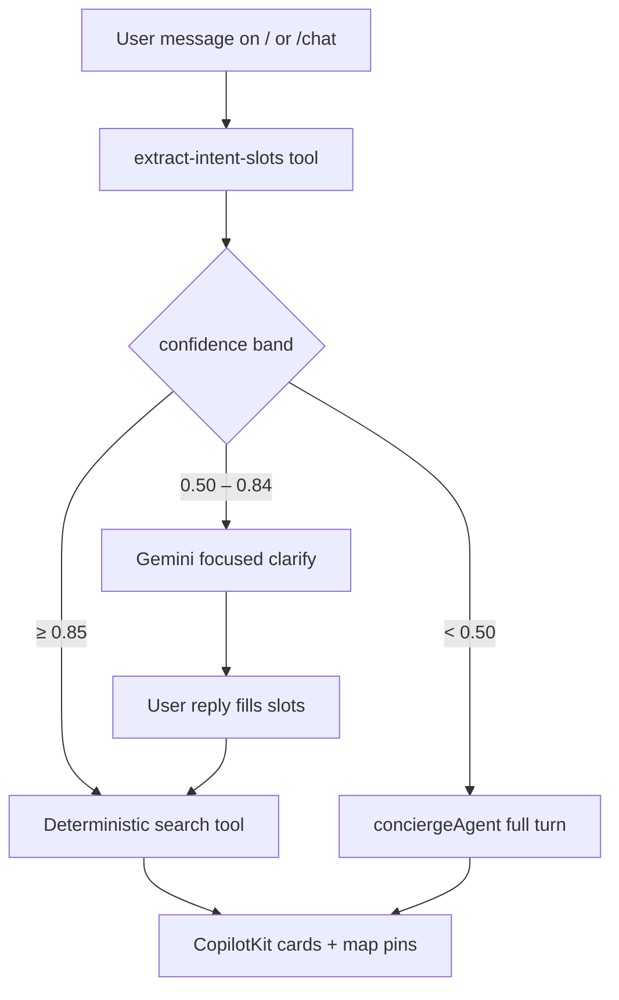

# INT-001 — Shared intent + slot schema

## Problem

Each vertical has its own regex gate. No shared `intent` + `slots` + `confidence` + `action` contract for routing.

## User story

As **Sofia**, I need one Zod schema so rental, event, and café paths share extraction and confidence bands (≥0.85 fast-path, 0.50–0.84 Gemini clarify, &lt;0.50 full agent).

## Example prompts

| Prompt | intent | slots |
|--------|--------|-------|
| `list rentals in june 1 to 30 $1000 medellin` | rental_search | monthly budget, June, cityWide |
| `quiet café in Laureles for remote work tomorrow` | cafe_search | Laureles, tomorrow, remote_work |

## Purpose & goals

- **Purpose:** Single contract for turn-1 routing across rentals, events, cafés, and restaurants.
- **Goal:** Camila, Roberto, and tourists get the right vertical without duplicate regex gates.
- **Success:** Hero prompts map to `intent` + `slots` + `confidence` + `action`; bands ≥0.85 / 0.50–0.84 / &lt;0.50 drive fast-path vs clarify vs agent.

## Workflow



## Use cases

| Persona | Prompt | Expected action |
|---------|--------|-----------------|
| Camila | `list rentals in june 1 to 30 $1000 medellin` | rental_search + monthly/date slots |
| Roberto | `salsa events this weekend near Provenza` | event_discovery + vibe/date/neighborhood |
| Tourist | `quiet café in Laureles for remote work` | cafe_search + needs + neighborhood |

## Implementation steps

1. Add `mdeapp/src/lib/intent-slots.ts` — Zod: `intent`, `confidence`, `action`, `slots`
2. Add `extract-intent-slots` Mastra tool (Gemini structured output or extend `classify-intent`)
3. Export `canDeterministicSearch(slots)` helper
4. Document confidence bands in [`../agent-plan.md`](../agent-plan.md)
5. Wire `routerAgent` to call extract before workflows (optional in same PR)

## Files likely touched

- `mdeapp/src/lib/intent-slots.ts` (new)
- `mdeapp/src/mastra/tools/classify-intent.ts`
- `mdeapp/src/mastra/tools/extract-intent-slots.ts` (new)
- `mdeapp/src/mastra/agents/router.ts`
- `mdeapp/src/lib/types.ts`

## Data requirements

None (schema only).

## RLS / security

N/A.

## Tests

- Unit: rental hero + café examples (mocked LLM)
- `canDeterministicSearch` true for `1BR Laureles $80/night`

## Acceptance criteria

- [x] Schema in repo + referenced from agent-plan
- [x] Tests pass without live Gemini (mocked)
- [ ] Does not remove fast-path API (unchanged — verify in INT-002)

## Failure points

- Mixing v1/v2 CopilotKit imports
- Duplicating rental-only fields only in rental parser (must share base slots)

## Dependencies

None.

## Verify

```bash
cd mdeapp && npm run test -- src/lib/__tests__/intent-slots.test.ts
```
