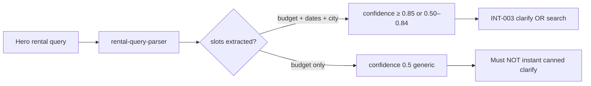

# INT-002 — Rental parser monthly/date/city

## Problem

`list rentals in june 1 to 30 $1000 medellin` parses budget but `confidence: 0.5` → generic clarify. Dates and city-wide Medellín not extracted.

## User story

As **Camila**, when I give monthly budget + date range + city, the system should not treat my query as “generic.”

## Example prompt

`list rentals in june 1 to 30 $1000 medellin` → `hasDateRange`, `cityWide`, `budgetType: monthly`, **confidence ≥ 0.85** OR **0.50–0.84** (not instant canned).

## Purpose & goals

- **Purpose:** Parse Camila's monthly stay queries with dates and city-wide Medellín scope.
- **Goal:** Hero rental query never hits generic "what dates and budget?" when those are already in the message.
- **Success:** `confidence ≥ 0.85` for fast-path; 0.50–0.84 routes to INT-003 Gemini clarify.

## Workflow



## Implementation steps

1. Extend `rental-query-parser.ts`: date ranges, `medellin` city-wide, monthly stay signals
2. Align output with INT-001 slots where possible
3. Apply confidence bands from agent-plan (replace single `0.6` gate)
4. `buildRentalSearchParams`: city-wide omits neighborhood when appropriate
5. Add `rental-query-parser.test.ts`

## Files likely touched

- `mdeapp/src/lib/rental-query-parser.ts`
- `mdeapp/src/lib/__tests__/rental-query-parser.test.ts`
- `mdeapp/src/lib/types.ts` (`lastRentalQuery` fields)

## Data requirements

Optional: `checkIn`/`checkOut` strings in working memory (SQL filter in INT-006).

## RLS / security

N/A.

## Tests

| Input | Expected |
|-------|----------|
| Hero query | NOT `isGenericRentalQuery` at 0.5 only-budget |
| `1BR Laureles $80/night` | confidence ≥ 0.85, fast-path |

## Acceptance criteria

- [ ] All parser unit tests green
- [ ] `shouldInstantRentalClarify` false for hero (empty memory)
- [ ] Implements [RE-017](../../real-estate/tasks/RE-017-rental-parser-intelligence.md)

## Failure points

- Breaking nightly fast-path regression (`01-rentals-prompt`)

## Dependencies

INT-001 (soft: can land same PR with parallel types)

## Verify

```bash
cd mdeapp && npm run test -- src/lib/__tests__/rental-query-parser.test.ts
```
