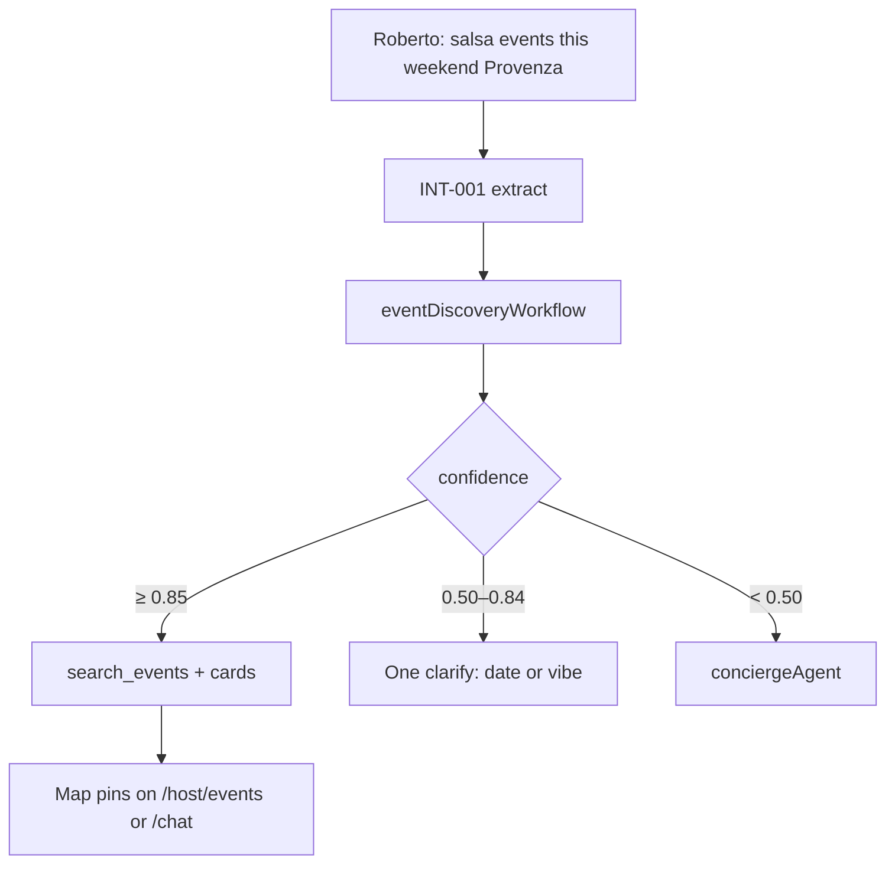

# INT-007 — Event intelligence wrapper

## Problem

Event fast-path may repeat rental failure mode (canned clarify before agent).

## User story

As **Roberto**, `salsa events this weekend near Provenza` should extract vibe + dateRange + neighborhood without generic re-ask.

## Example prompt

`salsa events this weekend near Provenza` → `event_discovery`, slots filled → search or one focused clarify.

## Purpose & goals

- **Purpose:** Event vertical uses shared INT-001 slots — no rental-only bypass.
- **Goal:** Roberto discovers salsa events near Provenza without generic re-ask.
- **Success:** Event hero searches or one focused clarify; follow-up "cheaper tickets?" keeps intent.

## Workflow



## Implementation steps

1. Map INT-001 extract to `eventDiscoveryWorkflow` inputs
2. Align `use-event-search-fast-path.ts` confidence bands with CORE
3. Extend event parser if separate from shared extract
4. Regression test in INT-005 table

## Files likely touched

- `mdeapp/src/hooks/use-event-search-fast-path.ts`
- `mdeapp/src/mastra/workflows/event-discovery-workflow.ts`
- `mdeapp/src/mastra/agents/router.ts`

## Data requirements

`events` table filters (vibe, date, neighborhood).

## RLS / security

Events RLS per existing policies.

## Tests

- Unit: salsa weekend Provenza slots
- No instant canned event clarify when date+vibe present

## Acceptance criteria

- [ ] Event hero pattern searches or focused clarify
- [ ] Follow-up “cheaper tickets?” preserves intent (router rule)

## Failure points

- Duplicating rental-only parser logic (must use INT-001)

## Dependencies

INT-001, INT-005

## Verify

```bash
cd mdeapp && npm run test -- src/hooks/__tests__/use-event-search-fast-path.test.ts
```
