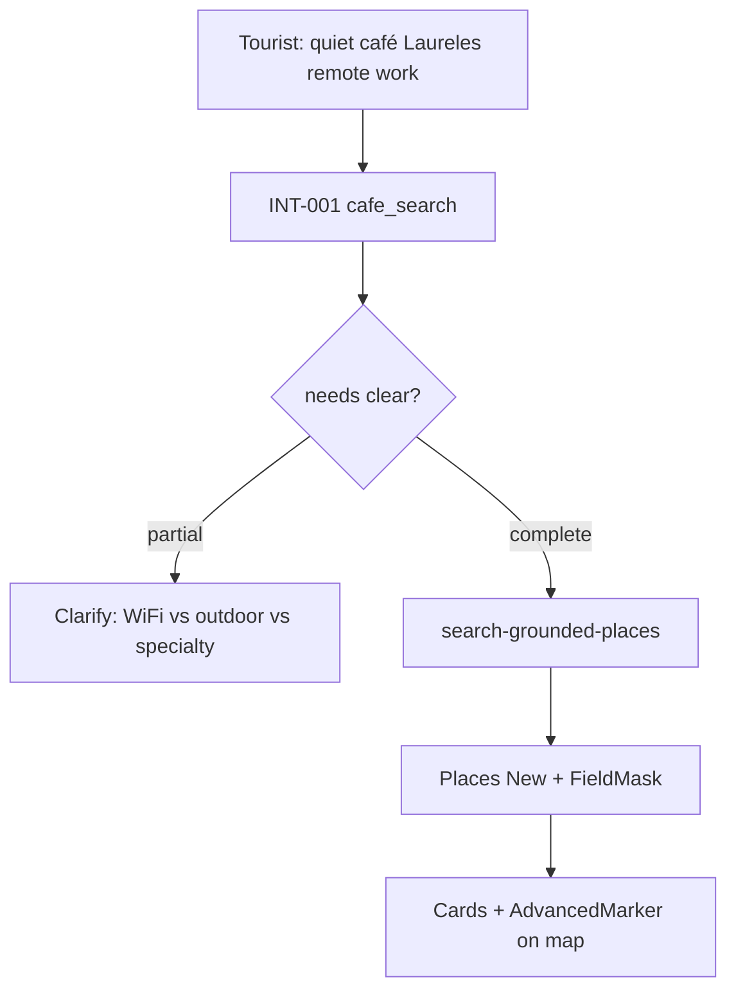

# INT-008 — Café intelligence wrapper

## Problem

Café queries lack shared slot extraction and specialist clarify.

**Not in scope:** Coffee **tour** product ([VEN-032…051](../../../venues/tasks/mvp/mvp-index.md#phase-7--coffee-tours-32-43-optional)) — different intent (`coffee_tour_search` vs `cafe_search`).

## User story

As a **Tourist**, I want: *“Do you care more about WiFi, outdoor seating, or specialty coffee?”* — not generic help text.

## Example prompt

`quiet café in Laureles for remote work tomorrow` → `cafe_search`, location, date, needs.

## Purpose & goals

- **Purpose:** Café vertical uses INT-001 slots + Places field masks for tourist discovery.
- **Goal:** Tourist gets WiFi vs outdoor vs specialty coffee clarify — not generic help text.
- **Success:** Laureles café query → grounded places + map pins with `mapId`.

## Workflow



## Implementation steps

1. INT-001 intent `cafe_search` + needs[] 
2. Specialist clarify prompt slice in concierge or thin module
3. Route to `search-grounded-places` with field masks
4. CopilotKit cards + map pins (SCREEN-021 alignment)

## Files likely touched

- `mdeapp/src/mastra/tools/search-grounded-places.ts`
- `mdeapp/src/mastra/agents/concierge.ts`
- `mdeapp/src/components/chat/`

## Data requirements

Places API New; `X-Goog-FieldMask` required.

## RLS / security

Places keys server-side only.

## Tests

- Slot extraction unit test (café example)
- Places tool called with Laureles bias

## Acceptance criteria

- [ ] Café example in INT-005 fixture table passes
- [ ] No giant prompt — specialist module only

## Failure points

- Missing `mapId` on markers (MAP rules)

## Dependencies

INT-001, INT-005, MAP-005 (soft)

## Verify

```bash
cd mdeapp && npm run test -- src/mastra/tools/__tests__/search-grounded-places.test.ts
```
