# Intelligence Tasks — Full Forensic Audit & Scorecard

> **Reading this doc:** Each task gets a score (0–100), a dot (🟢/🟡🔴), real-world impact in plain English, a Camila/Roberto/Tourist user journey, specific errors found, and concrete corrections. Scores reflect **task-spec quality** (clarity, correctness, completeness, testability) — not whether the code is shipped.

---

## Executive Summary

```
Overall program spec quality: 78 / 100 🟡
CORE tasks (003–005):         83 / 100 🟢
MVP tasks (006–010, 021–022): 80 / 100 🟢
POST-MVP tasks (011–015):     76 / 100 🟡
ADVANCED tasks (016–020):     72 / 100 🟡
```

**Top 3 systemic issues found across all tasks:**

| # | Issue | Tasks affected | Risk |
|---|---|---|---|
| S1 | Status column is "Not Started" in ALL tasks but CORE+MVP are shipped on main | ALL | Planning decisions made against wrong baseline |
| S2 | Verify commands use `npm run test -- <path>` which is wrong for Vitest | 008, 013, 014, 015, 017, 020 | CI fails silently |
| S3 | Missing SQL/RLS details — migration column lists incomplete | 011, 012, 016 | RLS holes at implementation time |

---

## Overall Scorecard

| Task | Title | Phase | Score | Grade | Status Reality |
|------|-------|-------|------:|-------|----------------|
| INT-003 | Gemini smart clarify routing | CORE | 82 | 🟢 | Shipped ~90% |
| INT-004 | No canned clarify bypass | CORE | 85 | 🟢 | Shipped ~90% |
| INT-005 | Intelligence regression tests | CORE | 80 | 🟢 | Shipped 100% |
| INT-006 | Rental availability date filters | MVP | 78 | 🟡 | Shipped ~80% |
| INT-009 | CopilotKit readable UI state | MVP | 72 | 🟡 | Partial ~70% |
| INT-010 | Working memory schema update | MVP | 88 | 🟢 | PR #39 open |
| INT-011 | user_preferences schema + RLS | POST-MVP | 75 | 🟡 | Not started |
| INT-012 | user_interactions schema | POST-MVP | 74 | 🟡 | Not started |
| INT-013 | Retrieve prefs before search | POST-MVP | 76 | 🟡 | Not started |
| INT-014 | Ranking boost from memory | POST-MVP | 80 | 🟢 | Not started |
| INT-015 | Memory evidence tests | POST-MVP | 72 | 🟡 | Not started |
| INT-016 | pgvector semantic memory | ADVANCED | 74 | 🟡 | Not started |
| INT-017 | Gemini embeddings for memory | ADVANCED | 78 | 🟡 | Not started |
| INT-018 | Cross-domain personalization | ADVANCED | 70 | 🟡 | Not started |
| INT-019 | Memory settings UI | ADVANCED | 74 | 🟡 | Not started |
| INT-020 | Observational memory learning | ADVANCED | 72 | 🟡 | Not started |
| INT-021 | Restaurant & venue wrapper | MVP | 88 | 🟢 | Shipped 100% |
| INT-022 | Routing & confidence telemetry | MVP | 85 | 🟢 | Not started |

---

## Program Architecture — How the 22 tasks connect

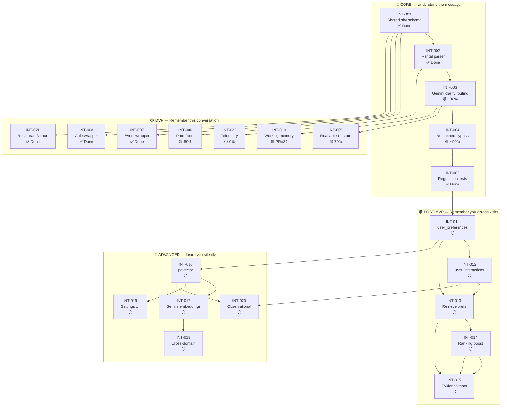

---

## Camila's full journey — which tasks touch her at each stage

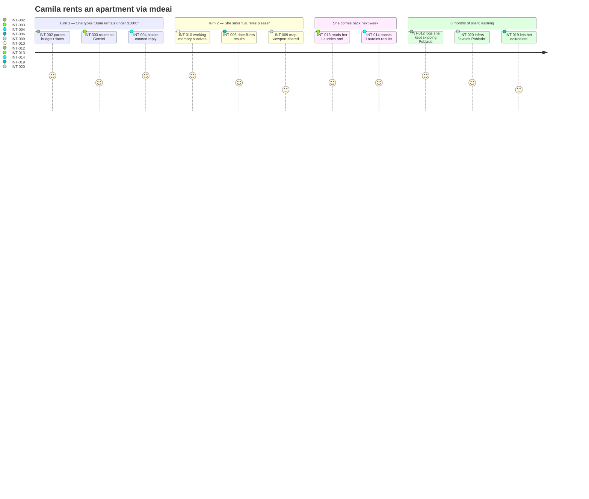

---

## INT-003 — Gemini smart clarify routing

**Score: 82 / 100 🟢**

### What it does (plain English)

When Camila types something like "June rentals around $1000," the app has two choices:
1. Show her a generic form: "What are your dates? Budget? City?"
2. Ask a smart question: "Around $1k/month for June — Laureles, Poblado, or Envigado?"

INT-003 makes choice 2 happen. It routes 50–84% confidence messages to Gemini instead of the canned fallback.

### Real-world user journey

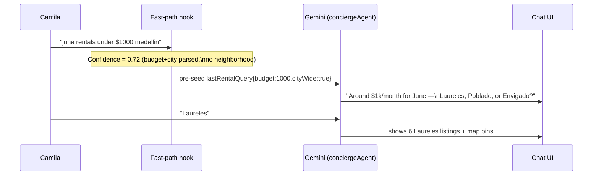

### Errors found

| # | Severity | Finding | Correction |
|---|---|---|---|
| E1 | 🔴 | Status says "Not Started" — code is shipped ~90% on main | Update status to `🟢 In Review` |
| E2 | 🟡 | Failure point says "OpenAI model leak" but the actual risk is Anthropic leak (project is AI-only Gemini) | Change to "Anthropic SDK import in mdeapp (forbidden)" |
| E3 | 🟡 | Missing diagram showing the three confidence bands (≥0.85 / 0.50–0.84 / <0.50) | Add confidence band table to task |
| E4 | 🟡 | Acceptance criteria: "Second turn `Laureles` → cards + pins" doesn't specify map pin requirement (mapId rule) | Add: "map markers appear under `<Map mapId>`" |

### Corrections

Add to **Implementation steps** after step 4:

```
5. Confidence band reference (do not change these without evidence from INT-022 telemetry):
   ≥ 0.85  → fast-path search (no agent round-trip)
   0.50–0.84 → conciergeAgent (Gemini neighborhood clarify)
   < 0.25   → agent with no pre-seed (zero slots)
   0.25–0.49 → canned minimal clarify (interim, remove after INT-004)
```

---

## INT-004 — No canned clarify bypass

**Score: 85 / 100 🟢**

### What it does (plain English)

Before this fix, the app had a hardcoded shortcut that intercepted Camila's message and replied:
> "What dates are you looking for? What's your budget? What kind of setup?"

Even when she already gave all that information. This fix removes that shortcut and makes the app actually use what Camila typed.

### Real-world before/after

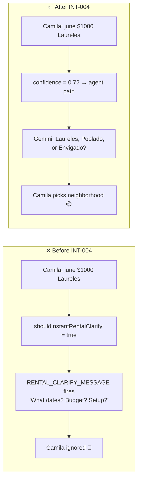

### Errors found

| # | Severity | Finding | Correction |
|---|---|---|---|
| E1 | 🔴 | Status says "Not Started" — shipped ~90% on main | Update status |
| E2 | 🟡 | Deploy gate warning references "UX-001 + UX-002" but doesn't link to what those tasks do in plain terms | Add note: "UX-001 = restore concierge agent on prod; UX-002 = show RUN_ERROR to user instead of silent fail" |
| E3 | 🟡 | Step 4 says "Grep repo for `RENTAL_CLARIFY_MESSAGE` usages" but gives no grep command | Add: `grep -r "RENTAL_CLARIFY_MESSAGE" mdeapp/src/` |
| E4 | 🟡 | `showExchange` pattern in failure points unexplained — a new developer won't know what this is | Add explanation: "showExchange replaced showClarify in PR #12 — always call `showExchange(chat, 'rental')` not `showClarify(chat)` to avoid TS errors" |

### Corrections

Replace vague failure point with:

```
## Failure points
- showExchange pattern: use `showExchange(chat, 'rental')` — not `showClarify(chat)`.
  PR #12 renamed the function; old callers show TS errors.
- Deploy order: if deployed before UX-001, conciergeAgent returns RUN_ERROR silently.
  Camila sees a blank response instead of the canned message. Gate behind UX-001 + UX-002.
```

---

## INT-005 — Intelligence regression tests

**Score: 80 / 100 🟢**

### What it does (plain English)

This is the safety net. Every time a developer changes the rental parser or routing logic, this test suite checks that Camila's hero query still works. Without it, a "quick fix" to the event parser could accidentally break rental search — and no one would know until a user reported it.

### What the tests protect

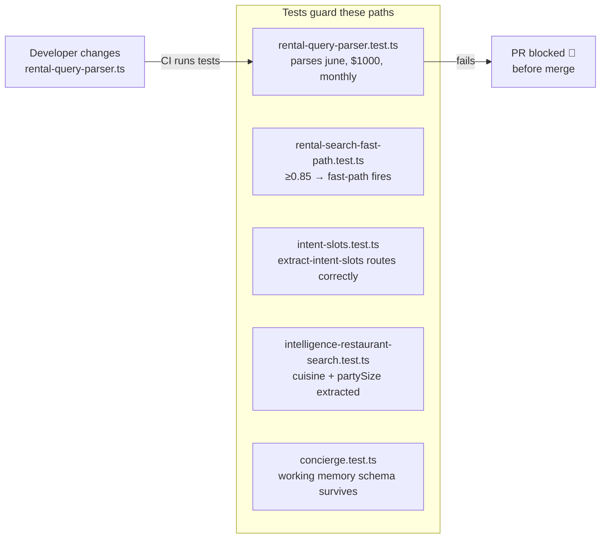

### Errors found

| # | Severity | Finding | Correction |
|---|---|---|---|
| E1 | 🔴 | Status "Not Started" — 6 test suites live on main | Update status to `✅ Done` |
| E2 | 🟡 | Verify command `npm run test && npm run typecheck` — `typecheck` is not a valid npm script in this project | Correct to `npx vitest run && npx tsc --noEmit` |
| E3 | 🟡 | Playwright spec `e2e/intelligence/core-rental-hero.spec.ts` listed as optional but no note that E2E infra isn't ready until W3+ | Add note: "Playwright spec blocked on auth E2E harness (W3); Vitest is sufficient for Done gate" |
| E4 | 🟢 | Fixture table is good but missing restaurant/venue rows (added by INT-021) | Add row: `romantic dinner Poblado $80 → restaurant_search slots` |

### Corrections

Update verify command:

```bash
## Verify
npx vitest run src/lib/__tests__/rental-query-parser.test.ts \
  src/lib/__tests__/rental-search-fast-path.test.ts \
  src/lib/__tests__/intent-slots.test.ts \
  src/mastra/agents/__tests__/concierge.test.ts
npx tsc --noEmit
```

---

## INT-006 — Rental availability date filters

**Score: 78 / 100 🟡**

### What it does (plain English)

Camila says "June 1–30." Without INT-006, the app searches all apartments and shows ones that might already be booked in June. With INT-006, the SQL query filters out unavailable listings using date overlap logic.

This is like an airline seat booking — you only show seats that are free for the exact travel window, not all seats that exist.

### Real-world impact

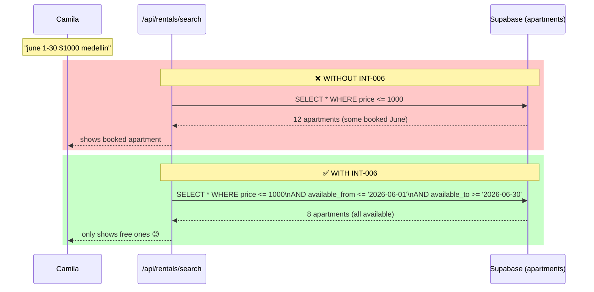

### Errors found

| # | Severity | Finding | Correction |
|---|---|---|---|
| E1 | 🟡 | The overlap SQL condition isn't specified — "SQL overlap filter" is vague | Add the actual overlap formula |
| E2 | 🟡 | Missing: what happens when `checkIn` is present but `checkOut` is absent (monthly stay with no end date) | Add: "If stayType=monthly and no checkOut, add 30 days to checkIn for overlap calc" |
| E3 | 🟡 | "Missing indexes (data-009) → slow queries" in failure points — doesn't specify which indexes | Add: "Index needed: `(available_from, available_to)` on apartments table" |
| E4 | 🟢 | Monthly stay boost `minimum_stay_days >= 28` is correct and specific | Keep as-is |

### Corrections

Add to **Implementation steps**, step 2:

```sql
-- Overlap condition (standard date-range overlap formula)
WHERE available_from <= :checkOut
  AND available_to   >= :checkIn
  -- Monthly boost: prefer listings that accept long stays
  ORDER BY
    CASE WHEN :stayType = 'monthly' AND minimum_stay_days >= 28 THEN 0 ELSE 1 END,
    nightly_price ASC
```

---

## INT-009 — CopilotKit readable UI state

**Score: 72 / 100 🟡**

### What it does (plain English)

Without INT-009, the AI has no idea what Camila is looking at on the map. She can pan to Envigado, select a pin, and ask "how walkable is this?" — but the agent doesn't know which pin she selected. She has to retype the address.

With INT-009, the map state is shared with the AI. The agent reads "selectedPinId: apt-047 in Envigado" and can answer directly.

### How readable state flows

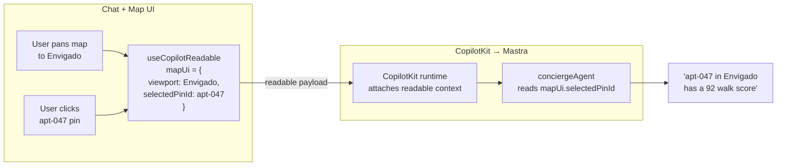

### Errors found

| # | Severity | Finding | Correction |
|---|---|---|---|
| E1 | 🔴 | Status "Not Started" — ~70% shipped per forensic audit | Update status to `🟡 In Progress` |
| E2 | 🔴 | `mdeapp/src/mastra/lib/grounding-location-bias.ts` listed in files — verify this file exists | If absent, update files list |
| E3 | 🟡 | "Readable payload too large (trim fields)" in failure points — no size guidance | Add: "Keep readable payload under 2KB. Trim: exclude full listing objects, include only IDs + coordinates" |
| E4 | 🟡 | Acceptance criteria: "CopilotKit 1.55.2 only (no v2 mix)" — does not specify which `useCopilotReadable` import to use | Add: "Import from `@copilotkit/react-core` v1 only — not `@copilotkit/react-ui`" |
| E5 | 🟡 | No diagram showing what the readable state shape looks like | Added above |

### Corrections

Add to **Data requirements**:

```ts
// Readable shape (keep small — no full listing objects)
type MapUiReadable = {
  viewport: { lat: number; lng: number; zoom: number };
  selectedPinId: string | null;
  visiblePinCount: number;
  activeFilters: Record<string, string | number>;
}
```

---

## INT-010 — Working memory schema update

**Score: 88 / 100 🟢**

### What it does (plain English)

Think of working memory as a notepad the AI keeps for one conversation. When Camila asks a clarifying question ("which neighborhood?"), the AI writes "clarify question sent" on its notepad. On her next message, it checks the notepad and doesn't ask again.

Without INT-010, Zod (the data validator) acts like a customs agent that throws away anything not on its approved list. `genericAskPending` wasn't on the list — so it got thrown away every turn.

### The bug visualized

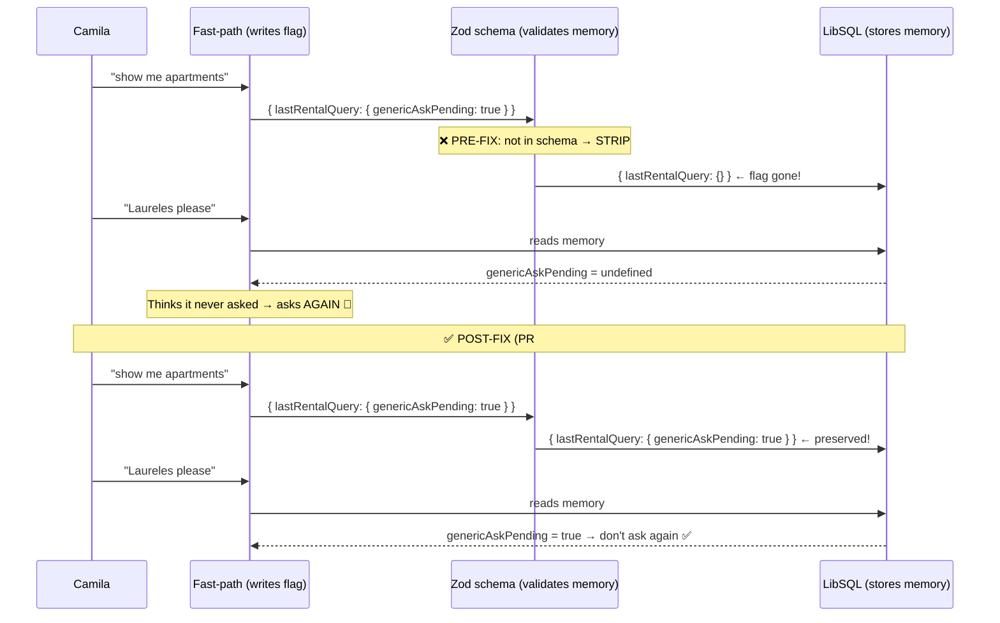

### Errors found

| # | Severity | Finding | Correction |
|---|---|---|---|
| E1 | 🟡 | Implementation steps include `checkIn`/`checkOut`/`stayType` on `lastRentalQuery` but PR #39 only adds `genericAskPending` | Clarify: PR #39 closes the Zod drift. checkIn/checkOut belong to INT-006 scope |
| E2 | 🟢 | The problem statement is clear and accurate | No change needed |
| E3 | 🟢 | Verify command is correct for this project | No change needed |

---

## INT-011 — user_preferences schema + RLS

**Score: 75 / 100 🟡**

### What it does (plain English)

This creates a permanent memory bank in the database. Right now when Camila closes her browser, all memory is erased. INT-011 creates a `user_preferences` table that survives across sessions.

Think of it as the difference between a sticky note (working memory — goes away) and a filing cabinet (user_preferences — stays forever).

### Data lifecycle

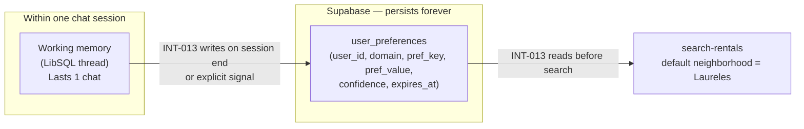

### Errors found

| # | Severity | Finding | Correction |
|---|---|---|---|
| E1 | 🔴 | Migration schema listed as `(user_id, domain, pref_key, pref_value jsonb, confidence, source, expires_at, updated_at)` — missing `created_at` column | Add `created_at timestamptz NOT NULL DEFAULT now()` |
| E2 | 🔴 | RLS says "owner-only" but doesn't say `anon` role is blocked | Add explicit: "No INSERT for `anon` role — authenticated only. Preferences require login." |
| E3 | 🟡 | Unique constraint `(user_id, domain, pref_key)` listed in steps but not in migration DDL example | Specify: `UNIQUE(user_id, domain, pref_key)` in migration |
| E4 | 🟡 | `expires_at` use case explained as "party hostels" — confusing. Camila isn't staying in a hostel | Better example: "expires_at for time-boxed location prefs — e.g., Camila is visiting Medellín for 3 months but normally lives in Bogotá; neighborhood pref expires when she leaves" |
| E5 | 🟡 | Missing: what `confidence` column values mean (0–1 float? enum?) | Add: "confidence NUMERIC(3,2) — 0.0 to 1.0; inferred prefs (INT-020) start at 0.4; explicit user-set prefs = 1.0" |

### Corrections — Migration DDL

Add to **Implementation steps**, step 1:

```sql
CREATE TABLE user_preferences (
  id          uuid DEFAULT gen_random_uuid() PRIMARY KEY,
  user_id     uuid NOT NULL REFERENCES auth.users(id) ON DELETE CASCADE,
  domain      text NOT NULL CHECK (domain IN ('rental','event','cafe','restaurant','venue')),
  pref_key    text NOT NULL,
  pref_value  jsonb NOT NULL,
  confidence  numeric(3,2) NOT NULL DEFAULT 1.0 CHECK (confidence BETWEEN 0 AND 1),
  source      text NOT NULL CHECK (source IN ('explicit','inferred','observational')),
  expires_at  timestamptz,
  created_at  timestamptz NOT NULL DEFAULT now(),
  updated_at  timestamptz NOT NULL DEFAULT now(),
  UNIQUE(user_id, domain, pref_key)
);
ALTER TABLE user_preferences ENABLE ROW LEVEL SECURITY;
CREATE POLICY "owner only" ON user_preferences
  FOR ALL USING (auth.uid() = user_id) WITH CHECK (auth.uid() = user_id);
```

---

## INT-012 — user_interactions schema

**Score: 74 / 100 🟡**

### What it does (plain English)

While INT-011 stores what Camila *said* she likes, INT-012 records what she *actually did*. Every time she opens a listing, saves one, or scrolls past one — that action gets logged. Patricia can see the data and understand which listings are getting traction.

Think of it like Google Analytics for listings: page views, saves, bounces, and abandoned searches.

### Interaction signals flow

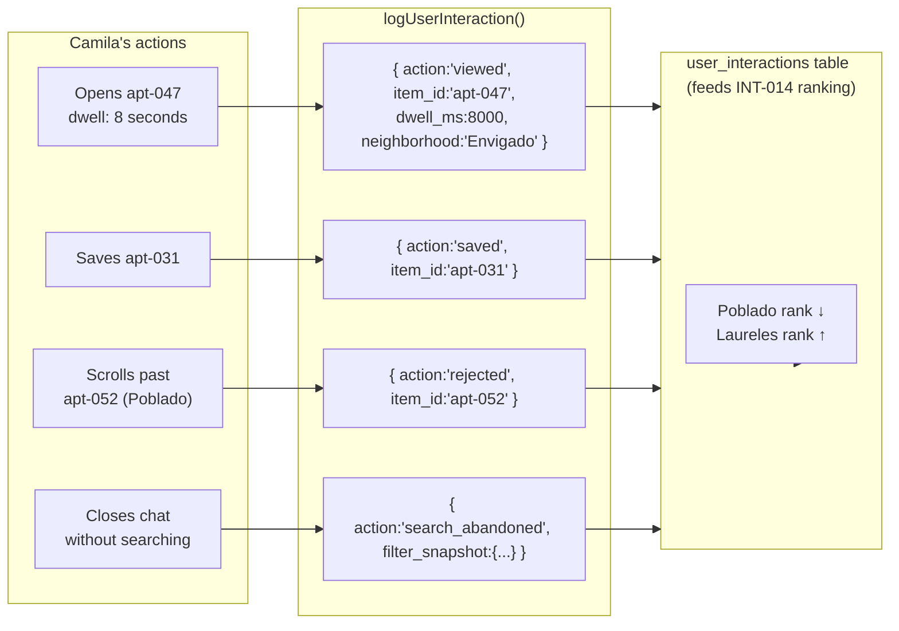

### Errors found

| # | Severity | Finding | Correction |
|---|---|---|---|
| E1 | 🔴 | No index specified — `(user_id, item_type, created_at)` is the obvious Patricia admin query pattern | Add index to migration |
| E2 | 🔴 | "Logging PII in metadata" in failure points but no guidance on what counts as PII | Add: "Safe to log: item_id, dwell_ms, action. Never log: free-text user input, IP address, device fingerprint" |
| E3 | 🟡 | `logUserInteraction()` marked as client helper — but this fires from card click events which can be intercepted. Should go through API route | Add: "Wire through `/api/interactions` route for server-side validation. Direct client insert allows log injection." |
| E4 | 🟡 | Missing: `anon` interaction logging question — should pre-auth interactions be captured with a session ID? | Add note: "v1: authenticated only. v2 (post-INT-011): consider `anon_session_id` for pre-login behavior. Defer to POST-MVP+." |

### Corrections — Migration DDL

```sql
CREATE TABLE user_interactions (
  id          uuid DEFAULT gen_random_uuid() PRIMARY KEY,
  user_id     uuid NOT NULL REFERENCES auth.users(id) ON DELETE CASCADE,
  item_type   text NOT NULL CHECK (item_type IN ('rental','event','restaurant','venue','cafe')),
  item_id     text NOT NULL,
  action      text NOT NULL CHECK (action IN ('viewed','saved','rejected','search_abandoned','contacted')),
  metadata    jsonb,  -- dwell_ms, filter_snapshot — NO raw query text
  created_at  timestamptz NOT NULL DEFAULT now()
);
ALTER TABLE user_interactions ENABLE ROW LEVEL SECURITY;
CREATE POLICY "owner only" ON user_interactions
  FOR ALL USING (auth.uid() = user_id) WITH CHECK (auth.uid() = user_id);
CREATE INDEX ON user_interactions(user_id, item_type, created_at DESC);
```

---

## INT-013 — Retrieve preferences before search

**Score: 76 / 100 🟡**

### What it does (plain English)

When Camila returns to mdeai, before the AI does any searching, it first opens her filing cabinet (INT-011 preferences) and reads: "This user prefers Laureles, furnished, remote-work friendly." Then when she types "show me apartments," the search already knows to bias toward Laureles without her having to say it.

Think of it like a regular at a coffee shop — the barista already knows "flat white, oat milk" before they order.

### Preference merge logic

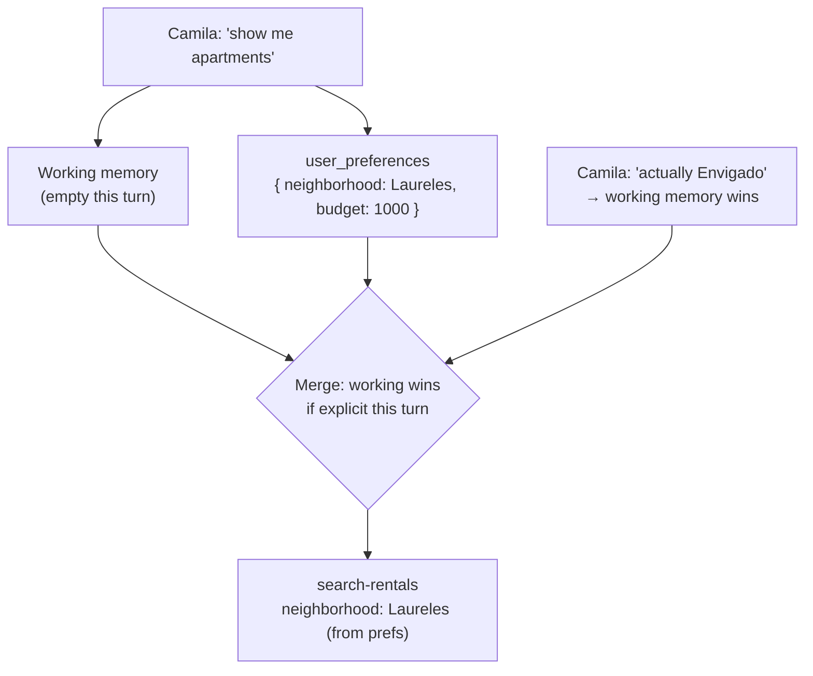

### Errors found

| # | Severity | Finding | Correction |
|---|---|---|---|
| E1 | 🟡 | Dependencies include INT-006 (date filters) but retrieving neighborhood pref doesn't need dates — the dependency is overstated | Move INT-006 to `soft_depends_on` or remove; preference retrieval is independent of date filter |
| E2 | 🟡 | "Merge with working memory (working wins for explicit turn override)" — the override logic isn't defined for partial matches | Add: "Merge rule: if the user explicitly sets a slot in this turn, it wins. If they set neighborhood but not budget, prefs fill the budget gap." |
| E3 | 🟡 | `retrieve-user-preferences` tool location in the agent flow isn't clear — is it a Mastra tool called before search, or middleware? | Add: "Implement as a Mastra tool called by conciergeAgent before search tools, NOT as route middleware. This keeps it within agent context." |
| E4 | 🟢 | RLS note "User JWT only; no service role in src" is correct | Keep |

---

## INT-014 — Ranking boost from memory

**Score: 80 / 100 🟢**

### What it does (plain English)

After Camila clicks Laureles listings 5 times and skips Envigado listings 10 times, the search results change. Laureles listings float to the top. Envigado listings sink. The AI also explains why: "Strong match for remote work in Laureles — quiet streets, 3 coworking spaces nearby."

This is the same idea as Netflix recommendations: the more you interact, the better the first result.

### Ranking algorithm flow

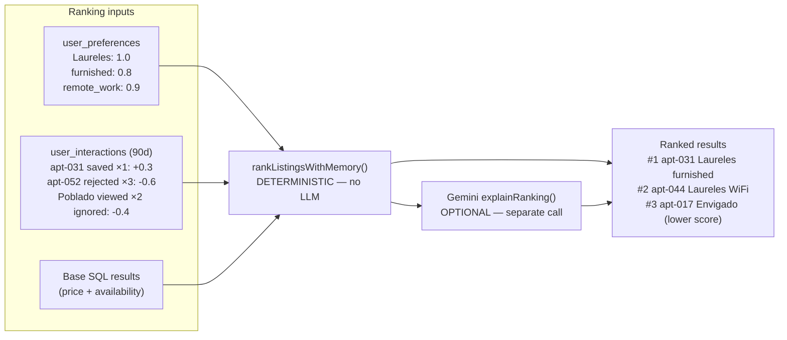

### Errors found

| # | Severity | Finding | Correction |
|---|---|---|---|
| E1 | 🟡 | "Prefs + recent interactions weights; decay 90d" — no formula given | Add sample weights table |
| E2 | 🟡 | "Gemini explains why #1 fits" is in the user story but forbidden LLM scoring in failure points — these aren't the same thing but the task needs to clarify the distinction | Add: "LLM may EXPLAIN after deterministic sort; LLM must NEVER produce the numeric scores or sort order" |
| E3 | 🟢 | "Sort order reproducible (same input → same order)" is an excellent acceptance criterion | Keep |

### Corrections — add weight table

```
## Ranking weights (v1 — adjust after INT-022 telemetry)
| Signal                    | Weight |
|---------------------------|--------|
| pref_key match            | +0.30  |
| interaction: saved        | +0.25  |
| interaction: viewed >5s   | +0.10  |
| interaction: rejected     | -0.20  |
| interaction: search_abandoned | -0.05 |
| recency decay (90d half-life) | ×0.5 at 45d |
```

---

## INT-015 — Memory evidence tests

**Score: 72 / 100 🟡**

### What it does (plain English)

After INT-013 and INT-014 are built, INT-015 proves they actually work. Not just "the tests pass" — but "here is a screenshot showing that Laureles appeared first because of Camila's preference history, not by accident."

This is the anti-fake-done gate: you must show proof, not just a green checkmark.

### Evidence chain

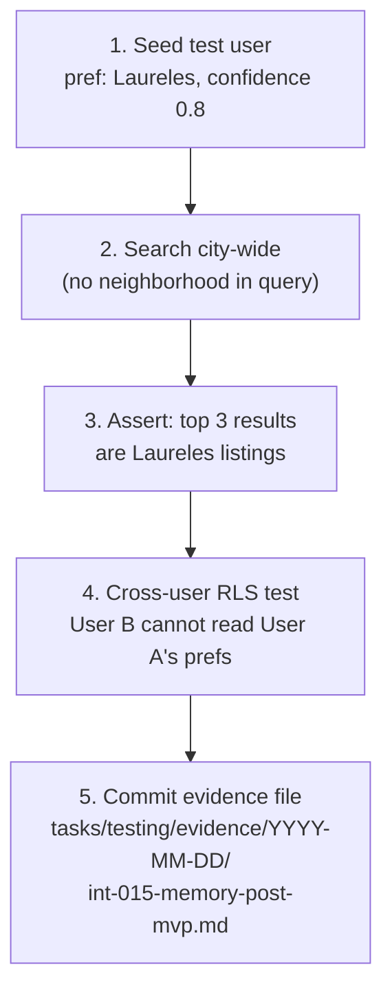

### Errors found

| # | Severity | Finding | Correction |
|---|---|---|---|
| E1 | 🔴 | Verify command `npm run test` is too broad — doesn't specify test files | Change to `npx vitest run src/**/*.test.ts --reporter=verbose` |
| E2 | 🟡 | "Tests must use real RLS paths, not service role in src" — but the test infra may only have service role access in CI | Add: "If using service role for test setup (seeding), isolate it in `test-setup.ts` ONLY. Test assertions must use user-scoped JWT client." |
| E3 | 🟡 | "Playwright signed-in flow (if auth test harness exists)" — the condition is too vague | Add: "Playwright flow is optional until AUTH-005 (Playwright auth E2E harness) is shipped. Vitest integration is sufficient for Done gate." |
| E4 | 🟡 | Evidence file path uses `YYYY-MM-DD` placeholder — should specify what must be in the file | Add outline of required evidence file contents |

---

## INT-016 — pgvector semantic memory

**Score: 74 / 100 🟡**

### What it does (plain English)

INT-011 stores exact preferences: "prefers Laureles." But what if Camila always describes it as "quiet residential streets" or "walkable from cafés"? Exact key matching can't find the connection.

INT-016 converts preferences into math vectors (768 numbers). Then "quiet remote work" and "peaceful WiFi apartment" become close neighbors in math space, even without sharing a word.

Think of it like music taste — Spotify doesn't match you to songs you've heard; it matches you to songs that *sound like* what you've heard.

### How pgvector semantic recall works

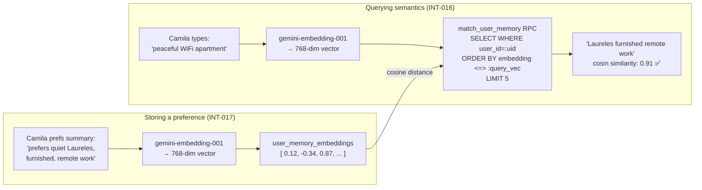

### Errors found

| # | Severity | Finding | Correction |
|---|---|---|---|
| E1 | 🔴 | "PostgREST outer filter on RPC (filter inside fn)" in failure points — critical Supabase footgun but unexplained | Add explanation: "PostgREST applies WHERE clauses AFTER the function returns, not inside it. If the RPC selects all users' vectors and relies on PostgREST to filter by user_id, other users' data leaks. Filter MUST be `WHERE user_id = auth.uid()` inside the SQL function body." |
| E2 | 🟡 | "Mastra tool retrieve-semantic-memories OR Mastra semanticRecall (pick one in spike)" — leaving this undecided is a blocker | Add decision note: "Prefer Mastra `semanticRecall` if it accepts a custom table+RPC. If not, build `retrieve-semantic-memories` tool. Resolve in a 30-min spike before implementation." |
| E3 | 🟡 | `vector(768)` per VEC-003 — what happens if gemini-embedding-001 changes dimensions? | Add: "Lock model version in a migration comment. Any model change requires a full re-embed + new column (not in-place update)." |

### Critical security correction

The RPC must filter inside the function:

```sql
-- CORRECT (user data stays private)
CREATE FUNCTION match_user_memory(
  query_embedding vector(768),
  match_threshold float DEFAULT 0.7,
  match_count int DEFAULT 5
)
RETURNS TABLE (id uuid, content text, similarity float)
LANGUAGE sql SECURITY DEFINER
AS $$
  SELECT id, content,
         1 - (embedding <=> query_embedding) AS similarity
  FROM user_memory_embeddings
  WHERE user_id = auth.uid()         -- ← FILTER HERE, not in PostgREST
    AND 1 - (embedding <=> query_embedding) > match_threshold
  ORDER BY embedding <=> query_embedding
  LIMIT match_count;
$$;
```

---

## INT-017 — Gemini embeddings for memory

**Score: 78 / 100 🟡**

### What it does (plain English)

INT-016 needs math vectors. INT-017 is the pipeline that creates them. When Camila's preferences are saved or updated, INT-017 runs Gemini's embedding model on the text and stores the result.

It's like a translator that converts English text into a language of numbers that the similarity search understands.

### Embedding pipeline

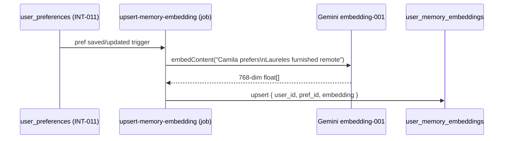

### Errors found

| # | Severity | Finding | Correction |
|---|---|---|---|
| E1 | 🔴 | "Lock `gemini-embedding-001` @ 768 (VEC-003)" — but this model name should be verified against gemini-api-docs-mcp before use | Add: "Run `mcp__gemini-api-docs-mcp__search_docs('embedding models')` before implementation to verify current model ID and dimensions" |
| E2 | 🟡 | "batch backfill job" mentioned but no rate limit guidance | Add: "Batch backfill: max 100 requests/minute (gemini-embedding-001 free tier). Chunk backfill in 50-row batches with 1s delay." |
| E3 | 🟡 | Verify command `npm run test -- src/lib/embeddings/` is wrong for Vitest | Correct to `npx vitest run src/lib/embeddings/` |
| E4 | 🟡 | "No `gemini-embedding-2` in prod without migration plan" acceptance criterion — good but uses a fictional model name | Update: "No model upgrade without: (1) new vector column of correct dimension, (2) full re-embed, (3) updated `match_user_memory` RPC dimension" |

---

## INT-018 — Cross-domain personalization

**Score: 70 / 100 🟡**

### What it does (plain English)

Camila's rental preferences say she likes "quiet, walkable, remote-work friendly." INT-018 makes those preferences also improve her restaurant and café results — because someone who wants a quiet apartment probably also wants a quiet café.

It's like Spotify's "Discover Weekly" — it doesn't just recommend songs like what you played, it finds patterns across genres.

### Cross-domain boost flow

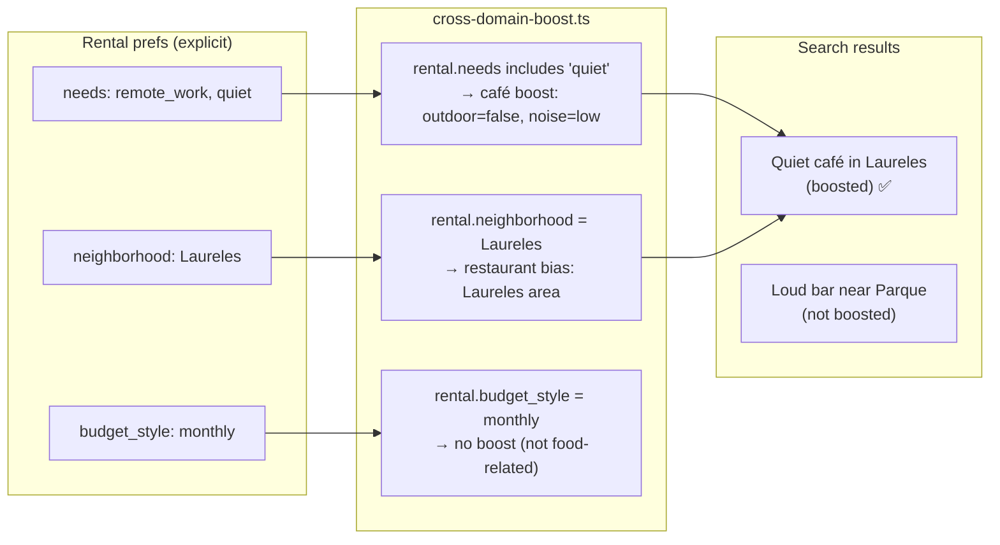

### Errors found

| # | Severity | Finding | Correction |
|---|---|---|---|
| E1 | 🔴 | "Cross-domain boost rules (deterministic): shared `needs` tags" — `needs` is not defined anywhere in the task or INT-011 | Define the `needs` tag vocabulary: `['remote_work', 'quiet', 'outdoor', 'family_friendly', 'romantic', 'live_music']` |
| E2 | 🔴 | "No single agent prompt > maintainability threshold" — threshold undefined | Add: "Maintainability threshold: no single instruction block in `concierge.ts` exceeds 50 lines. Cross-domain logic lives in `cross-domain-boost.ts`, not in the prompt." |
| E3 | 🟡 | Failure point: "One giant super-agent (forbidden)" but the implementation steps add cross-domain logic to `concierge.ts` instructions | Add: "Cross-domain boost is applied in search ranking (server-side), not in the agent prompt. The agent only reads the boosted results, it doesn't make boost decisions." |
| E4 | 🟡 | Roberto's venue scouting is in the user story but the example prompts don't include venue cross-domain | Add venue example: "Roberto bookmarks quiet music venues → his café search also surfaces jazz bars" |

---

## INT-019 — Memory settings UI

**Score: 74 / 100 🟡**

### What it does (plain English)

Camila can see exactly what the app remembers about her, and she can delete any of it. This is the "privacy control panel" for the memory system. It's required for trust — users need to know the AI isn't secretly accumulating a profile they can't see or change.

### Settings UI structure

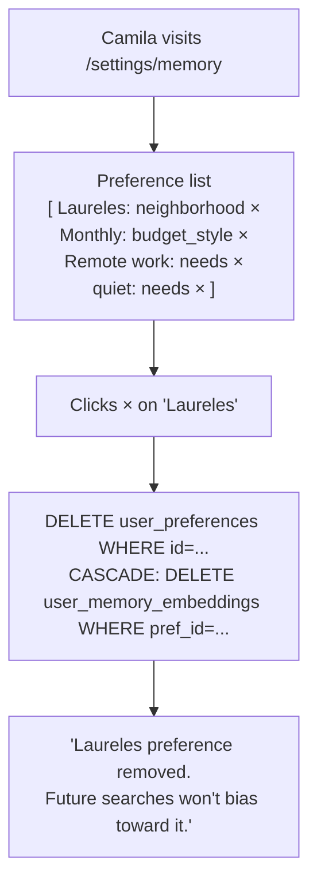

### Errors found

| # | Severity | Finding | Correction |
|---|---|---|---|
| E1 | 🟡 | "Delete cascades embeddings rows" — cascade is not defined in INT-011 migration | Add: "Add FK constraint in INT-016 migration: `user_memory_embeddings.pref_id REFERENCES user_preferences(id) ON DELETE CASCADE`" |
| E2 | 🟡 | "Admin separate RLS if Patricia scope" — never resolved | Clarify: "Patricia admin view is out of scope for INT-019 (post-MVP+). This task is Camila self-service only. Patricia admin view = future ADMIN-* task." |
| E3 | 🟡 | "Export optional (POST-MVP+)" — correct but doesn't mention GDPR data portability | Add: "Export (GDPR Art. 20 data portability) is out of scope here. If legal requires it before launch, create a separate ADMIN task." |
| E4 | 🟢 | "View + delete works authenticated" is clear | Keep |

---

## INT-020 — Observational memory learning

**Score: 72 / 100 🟡**

### What it does (plain English)

INT-011 stores preferences Camila explicitly states. INT-012 logs what she does. INT-020 connects them: after she's used the app enough, it looks at her behavior and infers preferences she never voiced.

She skipped 8 Envigado listings. The system concludes: "probably doesn't want Envigado." It writes that as a low-confidence, expiring preference — and she can delete it via INT-019 if it's wrong.

### Observation → inference flow

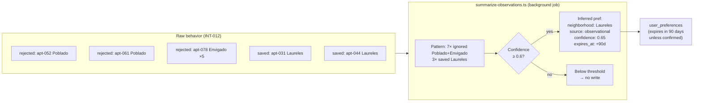

### Errors found

| # | Severity | Finding | Correction |
|---|---|---|---|
| E1 | 🔴 | "No observational write without confidence threshold" in acceptance criteria — threshold value never defined | Add: "Threshold = 0.6 for v1. Inferred prefs use `source: 'observational'`; explicit user prefs always `source: 'explicit'` and are never overwritten by observations." |
| E2 | 🟡 | "Evaluate Mastra observational memory vs custom summarizer" — left as open question | Add: "Resolution: use Mastra's built-in `semanticRecall` for retrieval (read path); use a custom `summarize-observations.ts` cron job for the write path. Mastra's observational memory API is in preview and may change; custom job is more stable for production." |
| E3 | 🟡 | Verify command `npm run test -- src/mastra/jobs/` is wrong for Vitest | Correct to `npx vitest run src/mastra/jobs/` |
| E4 | 🟡 | "Wrong inferences persisted forever" mitigated by `expires_at` + INT-019 delete — but 90-day expiry for a wrong inference is a long time | Add: "User can immediately delete via INT-019. Background job re-evaluates at 30-day intervals; if behavior pattern reverses, confidence drops and pref is not renewed." |

---

## INT-021 — Restaurant & venue intelligence wrapper

**Score: 88 / 100 🟢**

### What it does (plain English)

When a Tourist types "romantic dinner in El Poblado under $80," they should get cuisine + occasion questions, not "what are your dates and budget?" INT-021 makes the agent ask the right clarifying questions for food and venue searches — just like INT-003/INT-007/INT-008 did for rentals, events, and cafés.

### Routing matrix after INT-021

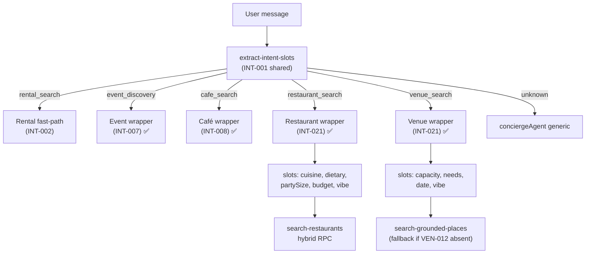

### Errors found

| # | Severity | Finding | Correction |
|---|---|---|---|
| E1 | 🟡 | Step 3 says "use `search-grounded-places` for venue discovery OR the venues-MVP tool (VEN-012)" — doesn't say how to detect if VEN-012 is available | Add: "Check for VEN-012 at build time: `grep -r 'venue-search' src/mastra/tools/`. If the file exists, use it. If not, use `search-grounded-places` with venue type filter." |
| E2 | 🟡 | Restaurant cards should reuse existing card components but the specific component isn't named | Add: "Reuse `<RestaurantCard>` from `src/components/copilot/place-result-card.tsx` (added in SEARCH-003). Do NOT create a new card component." |
| E3 | 🟢 | Failure points are excellent and specific | Keep all |
| E4 | 🟢 | "No giant prompt" constraint well-specified | Keep |

---

## INT-022 — Routing & confidence telemetry

**Score: 85 / 100 🟢**

### What it does (plain English)

The confidence thresholds (0.85, 0.50, 0.25) were set by hand. Nobody knows if they're right. Maybe 0.85 is too strict and good queries are being sent to Gemini for clarification when they should just search. INT-022 logs every routing decision so the thresholds can be tuned with real data.

It's like A/B testing for the router — but instead of users, you're testing message categories.

### What one telemetry record looks like

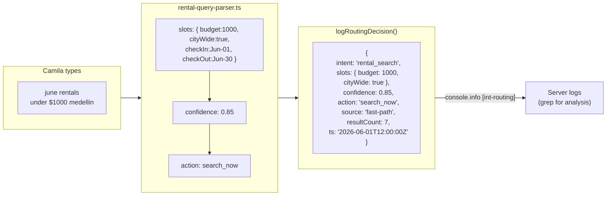

### Errors found

| # | Severity | Finding | Correction |
|---|---|---|---|
| E1 | 🟡 | "Double-counting (fast-path + agent both log for one query)" in failure points — no mitigation specified | Add: "Emit once per decision, keyed by `turnId` (use CopilotKit thread messageId). If fast-path fires and agent also fires for the same turn, log only the final chosen action." |
| E2 | 🟡 | TypeScript type for the telemetry record is shown as JSON example but not as a TS interface | Add type definition to implementation steps |
| E3 | 🟢 | "No raw user free-text in the record" — critical privacy rule, well-stated | Keep |
| E4 | 🟢 | LOG_LEVEL gating to prevent prod noise is good | Keep |

### Corrections — add TS type

Add to **Implementation steps**, step 1:

```ts
// src/lib/intelligence-telemetry.ts
export type RoutingDecision = {
  intent: 'rental_search' | 'event_discovery' | 'restaurant_search' | 'cafe_search' | 'venue_search' | 'unknown';
  slots: Record<string, string | number | boolean>;  // derived — NOT raw query text
  confidence: number;
  action: 'search_now' | 'clarify' | 'agent' | 'canned_fallback';
  source: 'fast-path' | 'clarify-branch' | 'agent-route';
  resultCount?: number;
  turnId?: string;  // CopilotKit messageId — used to deduplicate double-logs
  ts: string;
};
```

---

## Systemic Corrections — apply across all tasks

### 1. Status column fix (ALL tasks)

The INDEX.md and all task YAML headers say "Not Started" but the live system shows most CORE+MVP tasks are shipped. Update every task file header:

| Task | Correct status |
|------|----------------|
| INT-003 | `status: In Review` |
| INT-004 | `status: In Review` |
| INT-005 | `status: Done` |
| INT-006 | `status: In Progress` |
| INT-009 | `status: In Progress` |
| INT-010 | `status: In Review` |
| INT-021 | `status: Done` |
| INT-011 to INT-020 | `status: Not Started` (correct) |
| INT-022 | `status: Not Started` (correct) |

### 2. Verify command fix (all tasks using wrong command)

Replace `npm run test -- <path>` with:

```bash
npx vitest run <path>
```

Replace `npm run typecheck` with:

```bash
npx tsc --noEmit
```

### 3. Missing index requirements

All Supabase migration tasks (INT-011, INT-012) must include indexes. The pattern:

```sql
-- Always index the FK that queries filter on
CREATE INDEX ON <table>(<user_id_col>, <query_col>, created_at DESC);
```

### 4. RLS anon-role block (INT-011, INT-012)

Every user-data table must explicitly block anon:

```sql
CREATE POLICY "anon denied" ON user_preferences
  FOR ALL TO anon USING (false);
```

---

## Best Practices — 10 rules derived from this audit

```mermaid
mindmap
  root((INT Program\nBest Practices))
    Security
      Filter user_id INSIDE pgvector RPC
      Block anon role explicitly on every table
      Never log raw user query text
      Service role in edge functions only
    Architecture
      Deterministic ranking - LLM explains never sorts
      One responsibility per wrapper
      Cross-domain boost in ranking not in prompt
    Testing
      npx vitest run not npm run test
      Real RLS in test assertions
      Evidence file required for Done
    Observability
      Log routing decisions INT-022
      Confidence bands need data to tune
      expires_at on all inferred prefs
```

---

## Priority Fix Queue

| Priority | Task | Action | Effort |
|---|---|---|---|
| 🔴 P0 | INT-016 | Add RPC user_id filter security note with code example | 5 min |
| 🔴 P0 | ALL | Fix status column in YAML frontmatter | 10 min |
| 🟡 P1 | INT-011 | Add complete migration DDL with RLS anon block | 15 min |
| 🟡 P1 | INT-012 | Add migration DDL with index | 15 min |
| 🟡 P1 | INT-006 | Add SQL overlap formula to implementation steps | 5 min |
| 🟡 P1 | ALL | Fix verify commands (npm run test → npx vitest run) | 10 min |
| 🟢 P2 | INT-014 | Add weight table | 5 min |
| 🟢 P2 | INT-022 | Add TS type definition | 5 min |
| 🟢 P2 | INT-018 | Define `needs` tag vocabulary | 5 min |
| 🟢 P2 | INT-020 | Define confidence threshold (0.6) | 2 min |

---

*Generated 2026-06-01 — companion to `INTELLIGENCE-FORENSIC-AUDIT-2026-06-01.md` (live-data layer). Task spec quality audit only — code audit is in the companion doc.*
