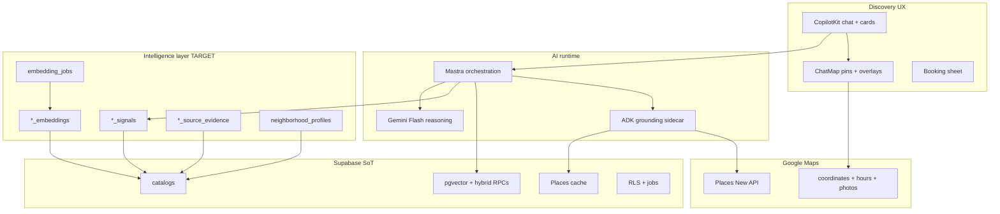
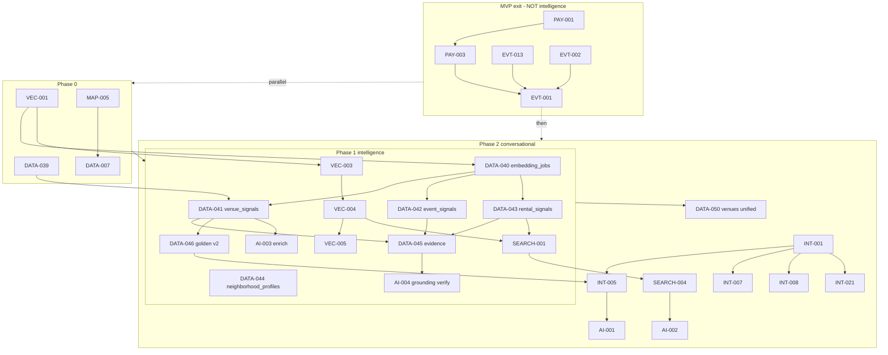
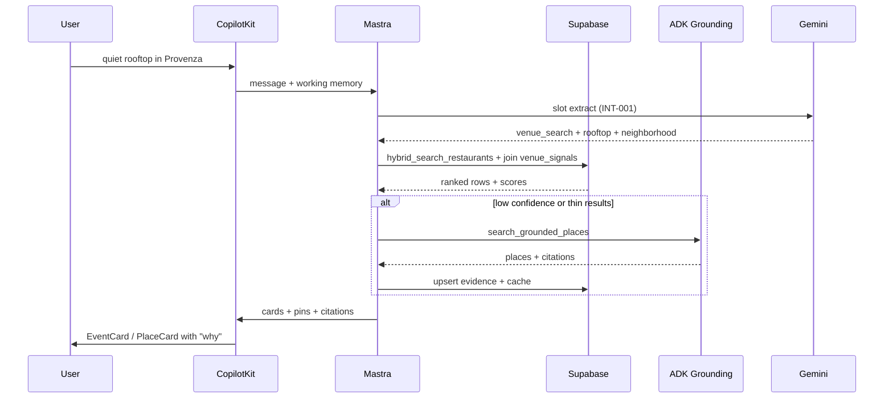

# Medellín Intelligence System (MIS)

> **Not “search nearby.”** Answer: *where should I go tonight in Medellín — and why?*

**Vision:** An AI-native **Medellín intelligence graph** where venues, events, rentals, neighborhoods, nightlife, tourism, coworking, rooftops, cafés, and attractions become **connected intelligence nodes** — ranked with **evidence**, not vibes-only LLM prose.

**Canonical data plan:** [`../data/plan/data-intelligence-plan.md`](../data/plan/data-intelligence-plan.md) · **Venue strategy:** [`../venues/data/venue-dataplan.md`](../venues/data/venue-dataplan.md)

---

## Progress tracker (read this first)

> **Forensic audit:** [`AUDIT-2026-05-31.md`](./AUDIT-2026-05-31.md) — overall **72%** correct pre-fix; **~88%** after v1.1 ID corrections below.

**Overall MIS readiness:** **~72%** — SEARCH-003 hybrid + signals live; Phase 1b blocked on commit sign-off + VEC-003/004.

| Layer | % | Status | What works | What's missing |
|-------|--:|--------|------------|----------------|
| **Catalogs + seeds** | 85% | 🟢 | 44 rentals, 49 events, **44 restaurants** (43 embedded), 30 anchors, 12 neighborhoods | Astorga row; `restaurants.neighborhood` column; **1 restaurant missing embedding** |
| **Search tools (Mastra)** | 78% | 🟡 | Hybrid restaurants (SEARCH-003); rentals/events keyword + grounding | SEARCH-001/002 hybrid |
| **CopilotKit UX** | 72% | 🟡 | Chat, cards, map pins, rank-explanation (restaurants) | Rental hybrid cards; UX-001 gate for INT-004 |
| **Embeddings (DB)** | 55% | 🟡 | 3 tables embedded; hybrid RPCs; tools call restaurant RPC | VEC-003 registry; VEC-004 worker + cache |
| **Signals + evidence** | 85% | 🟢 | 20 venue_signals + 49 event + 44 rental; evidence on all restaurant signals | Expand to 30 + café/nightlife Phase 1b |
| **Neighborhood intel** | 65% | 🟡 | 8 neighborhood_profiles + agent hints | MAP-012 expansion |
| **Agent intelligence (INT)** | 12% | 🟡 | INT-001 intent slots on disk; concierge hybrid routing | INT-002…022 mostly spec |
| **Vector platform (VEC)** | 10% | 🔴 | RPCs + rows live | VEC-001…007 Not Started |
| **Grounding (ADK)** | 75% | 🟢 | Sidecar live; Maps + web grounding tools | MAP-005 cache in app; prod hardening MAP-002B |
| **Booking / WhatsApp** | 25% | 🟡 | `venue_booking_requests` schema | VEN-015+ UI; WA orchestration Phase 4 |
| **MVP exit blockers** | — | 🟥 | EVT-013 fixed locally (uncommitted) | PAY-001/003, EVT-001 ledger — **intelligence does NOT block these** |

### Canonical DATA IDs (MIS v1.1 — overrides `data-intelligence-plan.md` §15)

| ID | Deliverable | Verify |
|----|-------------|--------|
| DATA-039 | Restaurants schema patch | neighborhood col + nullable price/hours |
| DATA-040 | `embedding_jobs` queue | dedup index + service_role RLS |
| DATA-041 | `venue_signals` + seed | golden café/restaurant query |
| DATA-042 | `event_signals` + seed | fashion/hype query |
| DATA-043 | `rental_signals` + seed | nomad rental query |
| DATA-044 | `neighborhood_profiles` + Astorga | 8 hood rows |
| DATA-045 | Evidence tables | card shows source |
| DATA-047 | `search_logs` + rank_explanation | rows on every hybrid search |
| DATA-046 | Golden queries v2 | **Phase 1b** after MIS-M1 |

### 🔒 Phase 1 FROZEN — ship only this

**Stop expanding architecture.** Plans ≠ shipped intelligence.

| Ship ✅ | Defer ❌ until MIS-M1 |
|---------|----------------------|
| VEC-001, DATA-039 | INT-001…022, AI-001+, SEARCH-004+ |
| DATA-040…045 (**1 migration each**) | unified `venues`, `semantic_embeddings` |
| DATA-047 search_logs | cross-domain orchestration, multi-agent routing |
| SEARCH-003 (restaurants + venue_signals) | relationship graph, taste vectors, trends |
| Human QA top 30 venue_signals | MAP-035/036, DATA-046, VEC-004/005 |

**Correct order:**

```text
VEC-001 → DATA-039 → DATA-040 → DATA-041 → DATA-042 → DATA-043 → DATA-044 → DATA-045 → DATA-047 → SEARCH-003
                                                                                              ↓ MIS-M1 gate
                                                                                    SEARCH-001, SEARCH-002
```

**❌ WRONG:** `DATA-040 → DATA-041 → SEARCH-001` — SEARCH-001 = **rentals**; DATA-041 = **venue_signals**. First hybrid proof = **SEARCH-003**.

**Migration rule:** 1 file = 1 concern. Never signals + embeddings + cache together.

**Linear:** [`11-intelligence-views.md`](11-intelligence-views.md) · `node scripts/linear-import-intelligence-tasks.mjs`

### Plans vs shipped

| System | Designed | Live |
|--------|----------|------|
| Embeddings | ✅ | Partial (tools unwired) |
| Signals / evidence | ✅ | **0%** |
| Hybrid retrieval | ✅ | RPCs only |
| search_logs | ✅ | **0%** |
| Ranking | ✅ | Keyword + fast path |

### Superseded / do not use

Root-level `tasks/intelligence/INT-00x-*.md` (2026-05-28) — use [`tasks/INT-*.md`](./tasks/INDEX.md) only. See [`tasks/MIGRATION.md`](./tasks/MIGRATION.md).

### Phase completion

| Phase | Name | % | Gate |
|-------|------|--:|------|
| **0** | Audit + stabilization | 40% | VEC-001 + MAP-005 + naming frozen |
| **MVP intelligence foundation** | 5% | DATA-040–045 + DATA-047 + SEARCH-003 live |
| **2** | Conversational intelligence | 0% | INT-001–010 + cross-domain rank |
| **3** | Advanced AI discovery | 0% | Hidden gem, timing, taste vectors |
| **4** | Concierge + automation | 0% | WhatsApp, trip memory, realtime events |

### Phase 1 execution order (FROZEN)

| # | ID | Title | Effort | Note |
|---|-----|-------|--------|------|
| 1 | **VEC-001** | pgvector duplicate HNSW cleanup | 2h | Pre-req |
| 2 | **DATA-039** | Restaurants schema patch | 2h | Before DATA-041 seed |
| 3 | **DATA-040** | `embedding_jobs` queue | 4h | 1 migration only |
| 4 | **DATA-041** | `venue_signals` + human QA 30 | 6h | 1 migration only |
| 5 | **DATA-042** | `event_signals` | 4h | 1 migration only |
| 6 | **DATA-043** | `rental_signals` | 4h | 1 migration only |
| 7 | **DATA-044** | `neighborhood_profiles` | 4h | 1 migration only |
| 8 | **DATA-045** | Evidence tables | 4h | 1 migration only |
| 9 | **DATA-047** | `search_logs` observability | 3h | Before hybrid tuning |
| 10 | **SEARCH-003** | hybrid restaurants + venue_signals | 4h | **First hybrid proof** |

**Phase 1b (after MIS-M1):** VEC-003 → VEC-004 → SEARCH-001 → SEARCH-002 → AI-004 → AI-003 → DATA-046 → VEC-005 · **Deferred:** INT-001, AI-010+, MAP-035

**Do not start Phase 2 unified `venues` merge until EVT-001 signed.**

### Task scorecard (audit 2026-05-31)

| Task / group | % correct | Dot | Execute? |
|--------------|----------:|-----|----------|
| MIS plan architecture | 94% | 🟢 | Yes |
| Live inventory claims | 95% | 🟢 | After v1.1 row fix |
| DATA-039 spec | 90% | 🟢 | Yes |
| DATA-040 spec | 88% | 🟡 | Yes after trigger note |
| SEARCH-001–007 registry | 85% | 🟡 | SEARCH-003 first; SEARCH-001 after DATA-043 |
| DATA-047 search_logs | 92% | 🟢 | Spec ready — ship before hybrid |
| DATA-041 spec | 90% | 🟢 | Spec ready + human QA gate |
| MAP-035/036 (was 013/014) | 92% | 🟢 | Spawn specs; IDs fixed |
| VEC-001–007 | 93% | 🟢 | VEC-001 first |
| **Overall** | **88%** | 🟡 | Phase 0–1 ready |

Full per-task corrections: [`AUDIT-2026-05-31.md`](./AUDIT-2026-05-31.md)

---

## 1. Architecture audit (2026-05-31)

### 1.1 What exists and works

| Component | Path / task | State |
|-----------|-------------|-------|
| **conciergeAgent** | `mdeapp/src/mastra/agents/concierge.ts` | 6 search tools + rich working memory |
| **Fast paths** | rental + event hooks/panels | Bypass LLM for latency (LESSONS) |
| **ADK sidecar** | `services/adk-grounding/` | Maps + web grounding; Cloud Run live |
| **pgvector tables** | `listing/event/restaurant_embeddings` | 768-dim, gemini-embedding-001 |
| **Hybrid RPCs** | `hybrid_search_*`, `semantic_search_*` | In DB — **not called from Mastra tools** |
| **Places cache** | `place_details_cache` (57 rows) | Sidecar read-through; app bypasses (MAP-005) |
| **Venue booking DDL** | DATA-009 | `venue_booking_requests` polymorphic |
| **Golden SQL Layer A** | DATA-006 | 26/26 venue queries pass |

### 1.2 Missing systems (intelligence moat)

| System | Priority | Phase |
|--------|----------|-------|
| `embedding_jobs` | P0 | 1 |
| `venue_signals`, `event_signals`, `rental_signals` | P0 | 1 |
| `neighborhood_profiles` | P0 | 1 |
| `*_source_evidence` / grounding ledger | P0 | 1 |
| `search_logs` / rank_explanation | P0 | 1 |
| Signal-aware hybrid in one tool | P0 | 1 |
| INT slot schema + vertical wrappers | **Deferred** | 2 |
| Unified `venues` catalog | P2 | 2 |
| `semantic_embeddings` single table | P2 | 2 |
| User taste vectors / prefs | P3 | 3 |
| WhatsApp concierge orchestration | P3 | 4 |

### 1.3 Live inventory (Supabase `zkwcbyxiwklihegjhuql`)

| Domain | Catalog | Rows | Embeddings | Signals |
|--------|---------|-----:|------------|---------|
| Rentals | `apartments` | 44 | 44 | ❌ |
| Events | `events` (published) | 49 | 43 | ❌ |
| Restaurants | `restaurants` | **44** | **43** | ❌ |
| Cafés / nightlife | `venue_anchors` | 30 | ❌ | ❌ |
| Neighborhoods | `neighborhoods` | 12 | ❌ | partial metadata |
| Grounding | `place_details_cache` | 57 | — | — |

**Priority neighborhoods:** Provenza · Laureles · Manila · Envigado · Sabaneta · Astorga (missing) · Centro · El Poblado.

---

## 2. Tech stack roles



| Layer | Role | mdeai rule |
|-------|------|------------|
| **Supabase** | SoT, catalogs, RLS, cache, signals, jobs | Every new table: RLS + ≥1 policy |
| **pgvector** | Semantic + hybrid retrieval, similarity | Field masks on Places; VEC-001 before new indexes |
| **Google Maps** | Geo truth, photos, hours, routing | `mapId` on every AdvancedMarker |
| **Google ADK** | Grounding, citations, long-tail discovery | Supabase first → ADK fallback |
| **Mastra** | Workflows, ranking pipelines, enrichment | Agent name = `useCoAgent` name |
| **CopilotKit** | Conversational UX, cards, map sync | v1.55.2 only; no v1/v2 mix |

---

## 3. System layers (target)

| Layer | Components | MVP (Phase 1) | Later |
|-------|------------|---------------|-------|
| **Foundation** | catalogs, embeddings, jobs, cache | ✅ catalogs; add jobs + signals | unified `venues` |
| **Intelligence** | signals, vibe scores, hood profiles | venue/event/rental_signals + NP | hidden gem engine |
| **Grounding** | ADK + evidence + Places cache | evidence tables + MAP-005 | social ingest |
| **Search** | FTS + vector + hybrid + signal rank | wire 1 hybrid tool per domain | cross-domain fusion |
| **Conversational** | slots, routing, memory | INT-001–010 | itinerary planner |
| **Discovery UX** | maps, cards, overlays | signal chips on cards | vibe overlays |
| **Automation** | WA, booking, approvals | VEN-015 booking | full concierge |

---

## 4. Implementation phases

### Phase 0 — Audit + stabilization (Week 0–1, parallel MVP)

**Goal:** Clean foundation before intelligence DDL. No mega-migrations.

| ID | Task | Owner | Done when |
|----|------|-------|-----------|
| MIS-000 | Architecture audit (this doc) | Sofia | Signed 2026-05-31 |
| VEC-001 | pgvector inventory + duplicate HNSW drop | Supabase | 3 tables, 1 HNSW each |
| DATA-039 | `restaurants` patch: neighborhood, nullable price/hours | DATA | Migration applied |
| MAP-005 | Places proxy + app cache read path | Maps | `/api/places/detail` hits cache |
| DATA-007 | `place_details_cache` audit | DATA | Evidence doc |
| GS-005 | Verify ticket/venue grounding tools | ADK | Vitest green |
| INT-022 | Routing confidence instrumentation | Mastra | Logs confidence bands |
| OPS-AUDIT | Migration + dependency audit | Sofia | INDEX files aligned |

**Exit gate:** VEC-001 Done + MAP-005 unblocks DATA-007/008.

---

### Phase 1 — MVP intelligence foundation (Week 2–4, parallel EVT-001)

**Goal:** Evidence-backed ranking in SQL. Hybrid search in at least one tool. No fake AI.

| Milestone | ID | Deliverable |
|-----------|-----|-------------|
| **M1-Jobs** | DATA-040 | `embedding_jobs` table + worker stub |
| **M2-Signals** | DATA-041–043 | `venue_signals`, `event_signals`, `rental_signals` + Gemini batch seed |
| **M3-Hoods** | DATA-044 | `neighborhood_profiles` + Astorga in `neighborhoods` |
| **M4-Evidence** | DATA-045 | `venue_source_evidence`, `event_grounding`, `rental_grounding` |
| **M5-Eval** | DATA-046, VEC-005 | Golden queries v2 + semantic eval harness |
| **M6-Search** | SEARCH-001–003 | Hybrid flag on rentals + events tools |
| **M7-Vector** | VEC-003, VEC-004 | Embedding contract + text builders |
| **M8-Maps** | MAP-035 | Signal-aware pin metadata (category + score chip) |

**Example queries that must pass (Phase 1):**

| Query | Required join |
|-------|---------------|
| quiet rooftop dinner in Provenza | `venue_signals.rooftop_score` + neighborhood |
| best coworking cafe in Laureles | anchor + `venue_signals.digital_nomad_score` |
| fashion events tonight in Poblado | `event_signals.hype_score` + date window |
| digital nomad rental in Laureles | `rental_signals.digital_nomad_score` + hood (gyms POI = Phase 2 MAP-006) |

**Explicitly NOT in Phase 1:** unified `venues` table · user taste vectors · WhatsApp automation · fake instant booking · Airbnb scrape.

---

### Phase 2 — Conversational intelligence (Week 5–8, post EVT-001)

**Goal:** Mastra orchestration uses signals + hybrid retrieval. Cross-domain chains.

| Milestone | Tasks | Outcome |
|-----------|-------|---------|
| **M2-CORE** | INT-001 → INT-005 | Gemini reasons turn 1; no canned bypass |
| **M2-WRAPPERS** | INT-007, INT-008, INT-021 | Event, café, restaurant vertical wrappers |
| **M2-UNIFIED** | DATA-050 | `venues` table + backfill + compatibility views |
| **M2-SEMANTIC** | DATA-051, VEC-002 | `semantic_embeddings` or unified read path |
| **M2-CROSS** | SEARCH-004, AI-001 | Cross-domain retrieval workflow |
| **M2-LIKE** | SEARCH-005 | "Like this place" similarity edges |
| **M2-ITINERARY** | AI-002, DATA-028 | Friday night chain: dinner → event → bar (trip_items sync) |
| **M2-MAPS** | MAP-012, MAP-036 | Neighborhood cards + multi-domain pin layers |
| **M2-NIGHT** | MIS-VEN-001, EVP-036 | Nightlife map link + event nearby intel |

**Example queries (Phase 2):**

- hidden salsa bar locals go to
- full Friday night itinerary in Medellín
- luxury rental with walkable nightlife
- best brunch before coworking

---

### Phase 3 — Advanced AI discovery (Week 9–14)

**Goal:** Moat features — local vs tourist, timing, hidden gems. Evidence still required.

| Area | Tasks | Notes |
|------|-------|-------|
| Hidden gems | AI-010, DATA-060 | `local_favorite_score` + citation threshold |
| Local vs tourist | AI-011 | `tourist_trap_score` vs `local_favorite_score` |
| Vibe extraction | AI-012, VEC-004 refresh | Batch Gemini structured output → signals |
| Nightlife timing | AI-013, MIS-VEN-002 | Peak hours, door policy, dress code fields (spawn Phase 3) |
| Rooftop detection | DATA-041 extend | `rooftop_score` + Places photo heuristic |
| Social/trends | GS-008, OCL-034 | Instagram/Facebook — post-MVP OpenClaw |
| Recommendation graph | AI-014, VEC-006 | `semantic_similarity_edges` small proof |
| User taste | INT-011–015, AI-015 | `user_preferences` + ranking boost |

---

### Phase 4 — Concierge + automation (Week 15+)

**Goal:** WhatsApp orchestration, trip memory, automated recommendations — with Patricia approval gates.

| Area | Tasks | Notes |
|------|-------|-------|
| WhatsApp | OPS-010, VEN-022 | `wa_outbox`, template messages, rate limits |
| Booking flows | VEN-015–019 | Real `venue_booking_requests` — not fake confirm |
| Approval queues | OPS-011 | Patricia `/admin` pending enrichment |
| Trip memory | INT-010, DATA-028 | Thread + trip-scoped working memory + trip_items |
| Realtime events | EVT-014, GS-006 | Live updates + web grounding refresh |
| Multi-agent | AI-020 | Router → specialists; no super-agent |

---

## 5. Full task registry

### 5.1 Naming conventions

| Prefix | Scope | Example |
|--------|-------|---------|
| **DATA-** | Supabase schema, seeds, signals, evidence | DATA-041 venue_signals |
| **VEC-** | pgvector, embeddings, eval harness | VEC-001 HNSW cleanup |
| **INT-** | Agent slots, wrappers, memory | INT-001 slot schema |
| **SEARCH-** | Retrieval pipelines (FTS, hybrid, fusion) | SEARCH-001 hybrid rentals |
| **AI-** | Mastra workflows, rankers, enrichment jobs | AI-001 cross-domain workflow |
| **MAP-** | Map pins, overlays, spatial UX | MAP-035 signal pin metadata |
| **VEN-** | Venue UI, booking, panels | VEN-015 booking sheet |
| **EVT-** | Event discovery, cards, hype | EVP-036 nearby intel |
| **RE-** | Rental search, nomad scoring | RE-019 availability |
| **GS-** | Grounding-search (ADK) | GS-005 tool verify |
| **OPS-** | WA, cron, approval queues | OPS-010 wa_outbox |
| **TEST-** | Playwright, eval runners | TEST-INT-001 golden harness |

| **Linear title format:** `{SPEC-ID} — readable title` · Labels: `track:intelligence`, `phase:intel-1`, `prefix:DATA`, etc.

**Linear title prefixes (frozen):** MAP, EVT, RE, VEN, DATA, UX, PAY, OPS, TEST, AI — per [`linear.md`](linear/docs/linear.md). **INT / VEC / SEARCH** tasks use disk IDs + labels (`track:intelligence`, `layer:vector`, `track:search`) — not necessarily title prefixes.

**Do not create:** duplicate `RESTAURANTS-SEARCH-*` — use GS-007 or SEARCH-*.

---

### 5.2 DATA tasks (new + existing)

| ID | Title | Phase | P | Status | Depends | Effort |
|----|-------|-------|---|--------|---------|--------|
| DATA-039 | Restaurants schema patch | 0 | P0 | Not Started | — | 2h |
| DATA-040 | embedding_jobs queue | 1 | P0 | Not Started | VEC-001 | 4h |
| DATA-041 | venue_signals polymorphic + seed | 1 | P0 | Not Started | DATA-039, DATA-040 | 6h |
| DATA-042 | event_signals + seed | 1 | P0 | Not Started | DATA-040 | 4h |
| DATA-043 | rental_signals + seed | 1 | P0 | Not Started | DATA-040 | 4h |
| DATA-044 | neighborhood_profiles + Astorga | 1 | P0 | Not Started | — | 4h |
| DATA-045 | Evidence + grounding tables | 1 | P0 | Not Started | DATA-041–043 | 4h |
| DATA-046 | Golden queries v2 (signal-backed) | 1 | P0 | Not Started | DATA-041–045 | 4h |
| DATA-047 | venue_source_documents (raw text) | 1 | P1 | Not Started | DATA-041 | 4h |
| DATA-048 | Batch signal enrichment edge fn | 1 | P1 | Not Started | DATA-041–043 | 6h |
| DATA-050 | Unified venues migration | 2 | P1 | Not Started | Phase 1 gate | 8h |
| DATA-051 | semantic_embeddings unified | 2 | P2 | Not Started | DATA-050, VEC-002 | 8h |
| DATA-060 | Hidden gem score columns | 3 | P2 | Not Started | DATA-041–043 | 4h |

*Existing DATA-001–035: see [`../data/tasks-data/INDEX-data.md`](../data/tasks-data/INDEX-data.md) — 20/35 Done.*

---

### 5.3 VEC tasks

| ID | Title | Phase | P | Status | Depends |
|----|-------|-------|---|--------|---------|
| VEC-001 | pgvector inventory + HNSW cleanup | 0 | P0 | Not Started | — |
| VEC-002 | Semantic V1 schema + RLS plan | 1 | P0 | Not Started | VEC-001 |
| VEC-003 | Model registry + embedding contract | 1 | P0 | Not Started | VEC-001 |
| VEC-004 | Embedding text builders | 1 | P0 | Not Started | VEC-003, DATA-040 |
| VEC-005 | Golden semantic eval harness | 1 | P0 | Not Started | VEC-004, DATA-046 |
| VEC-006 | Search logs + observability | 2 | P1 | Not Started | VEC-005 |
| VEC-007 | Coffee-tour vector compatibility | 2 | P1 | Not Started | VEC-004 |

---

### 5.4 SEARCH tasks (new namespace)

| ID | Title | Phase | P | Depends | Description |
|----|-------|-------|---|---------|-------------|
| SEARCH-001 | Hybrid search rentals tool | 1 | P0 | VEC-004, DATA-043 | Wire `hybrid_search_listings` RPC + signal boost |
| SEARCH-002 | Hybrid search events tool | 1 | P0 | VEC-004, DATA-042 | Wire `hybrid_search_events` RPC + hype |
| SEARCH-003 | Hybrid search restaurants tool | 1 | P0 | VEC-004, DATA-041 | Wire `hybrid_search_restaurants` RPC |
| SEARCH-004 | Cross-domain retrieval workflow | 2 | P1 | INT-001, DATA-041–043 | Mastra workflow: multi-tool fan-out |
| SEARCH-005 | "Like this place" similarity | 2 | P1 | VEC-002 | pgvector nearest + same neighborhood filter |
| SEARCH-006 | Conversational query planner | 2 | P1 | INT-001 | Decompose "Friday night" → sub-queries |
| SEARCH-007 | Signal fusion ranker | 2 | P1 | DATA-041–043 | Weighted score: semantic × signals × distance |

---

### 5.5 AI tasks (Mastra workflows + enrichment)

| ID | Title | Phase | P | Depends | Description |
|----|-------|-------|---|---------|-------------|
| AI-001 | Cross-domain discovery workflow | 2 | P1 | SEARCH-004 | Orchestrate rental+event+venue in one turn |
| AI-002 | Itinerary planning workflow | 2 | P1 | SEARCH-006 | Time-ordered chain with map sync |
| AI-003 | Signal enrichment batch job | 1 | P0 | DATA-048 | Gemini **`gemini-3.1-flash-lite`** structured output → signals |
| AI-004 | Grounding verification pipeline | 1 | P0 | DATA-045, GS-005 | Every card ≥1 citation or Places cache hit |
| AI-010 | Hidden gem detection job | 3 | P2 | DATA-060 | local_favorite > tourist_trap + evidence |
| AI-011 | Local vs tourist classifier | 3 | P2 | AI-010 | Batch score + manual QA sample |
| AI-012 | Vibe extraction refresh | 3 | P2 | VEC-004 | Re-run signalize on catalog change |
| AI-013 | Nightlife timing engine | 3 | P2 | MIS-VEN-002 | Peak hours, door time, dress code |
| AI-014 | Recommendation graph builder | 3 | P2 | VEC-006 | similarity_edges nightly cron |
| AI-015 | User taste vector (opt-in) | 3 | P2 | INT-011 | Preference embedding — Phase 3 only |
| AI-020 | Multi-agent concierge router | 4 | P2 | INT-001–010 | Router → vertical specialists |

---

### 5.6 INT tasks (existing program)

Full specs: [`tasks/INDEX.md`](./tasks/INDEX.md) — INT-001…022.

**MIS-critical path through INT:**

```text
INT-001 (slots) → INT-002–004 (rental clarify) → INT-005 (regression)
                → INT-007/008/021 (vertical wrappers)
                → INT-009/010 (CK state + memory schema)
                → INT-011–015 (prefs + rank boost) [Phase 3]
                → INT-016–020 (pgvector memory) [Phase 3]
```

---

### 5.7 MAP tasks (intelligence extensions)

| ID | Title | Phase | P | Depends |
|----|-------|-------|---|---------|
| MAP-005 | Places proxy + cache | 0 | P0 | — |
| MAP-035 | Signal-aware pin metadata | 1 | P1 | DATA-041–043 |
| MAP-036 | Multi-domain pin layers | 2 | P1 | MAP-035 |
| MAP-012 | Neighborhood intelligence cards | 2 | P1 | DATA-044 |
| MAP-015 | Vibe overlay toggle | 3 | P2 | DATA-041 |
| MAP-016 | Nightlife heat map (cached) | 3 | P2 | AI-013 |

*Existing MAP-001–004, 007B–031 archived Done; MAP-006+ backlog in [`../maps/INDEX.md`](../maps/INDEX.md).*

---

### 5.8 Domain-specific tasks (venues, events, rentals)

| Domain | Key tasks | Intelligence hook |
|--------|-----------|-------------------|
| **Venues** | VEN-009–013 panels, VEN-015 booking, MIS-VEN-001 nightlife map link | DATA-041 signals on cards |
| **Cafés** | INT-008, VEN-012, SCREEN-021 | anchor + nomad_score |
| **Restaurants** | INT-021, GS-007 | rooftop_score, price tier |
| **Nightlife** | MIS-VEN-001, DATA-041 anchor kind=nightclub | music_energy, door_policy |
| **Events** | EVT-013 cards, INT-007, EVP-036 | hype_score, fashion_tag |
| **Rentals** | RE-017–020, INT-006 | nomad_score, quiet_score, hood fit |
| **Neighborhoods** | DATA-044, MAP-012 | 8 priority hood profiles |
| **Tourism** | GS-001–004 Done, attractions tool | grounded + cache |
| **Coworking/gyms** | Phase 2 venue kinds | extend `venue_anchors.kind` |

---

### 5.9 Grounding (GS) + OPS

| ID | Title | Phase | Status |
|----|-------|-------|--------|
| GS-001–004 | Core grounding | 0 | Done (archived) |
| GS-005 | Verify ticket/venue tools | 0 | Not Started |
| GS-006 | Tool combination spike | 2 | Not Started |
| GS-007 | Restaurant closure verify | 2 | Not Started |
| GS-008 | Neighborhood news grounding | 3 | Not Started |
| OPS-010 | WhatsApp outbox schema | 4 | Not Started |
| OPS-011 | Enrichment approval queue | 4 | Not Started |

---

## 6. Dependency graph



---

## 7. MVP critical path

**Two tracks — do not confuse:**

| Track | Critical path | Blocks mdeai.co MVP? |
|-------|---------------|----------------------|
| **A — Product MVP** | PAY-001 → PAY-003 → EVT-013/002 → EVT-001 → AUTH-011 → OPS-002 | **Yes** |
| **B — Intelligence MVP** | VEC-001 → DATA-040 → DATA-041–045 → SEARCH-001 → DATA-046 | **No** |

Track B runs **parallel** to Track A after Phase 0. Track B unlocks the moat query: *"quiet rooftop in Provenza"* with evidence.

```text
Week 0:  VEC-001 + DATA-039 + MAP-005        (parallel PAY-001)
Week 1:  DATA-040 + DATA-041                  (parallel PAY-003, EVT-013)
Week 2:  DATA-042–045 + VEC-004               (parallel EVT-002)
Week 3:  SEARCH-001–003 + DATA-046 + VEC-005  (parallel EVT-001 prep)
Week 4:  INT-001 + AI-004 grounding verify    (post EVT-001 or overlap tail)
```

---

## 8. Recommended execution order (single agent)

1. VEC-001 — drop duplicate indexes (2h, zero product risk)
2. DATA-039 — restaurants patch (2h)
3. DATA-040 — embedding_jobs migration (4h)
4. DATA-041 — venue_signals + seed top 30 (6h) ← highest moat ROI
5. DATA-042 — event_signals (4h)
6. DATA-043 — rental_signals (4h)
7. DATA-044 — neighborhood_profiles + Astorga (4h)
8. DATA-045 — evidence tables (4h)
9. VEC-003 + VEC-004 — contract + text builders (6h)
10. SEARCH-001 — hybrid rentals tool (4h) ← first end-to-end intelligence proof
11. SEARCH-002 + SEARCH-003 — events + restaurants hybrid (6h)
12. DATA-046 + VEC-005 — golden v2 + eval harness (6h)
13. AI-004 — grounding verification on cards (4h)
14. MAP-035 — signal metadata on pins (4h)
15. INT-001 → INT-005 — agent slot layer (2 PRs, ≤400 lines each)
16. INT-007 + INT-008 + INT-021 — vertical wrappers
17. Phase 2 gate review → DATA-050 unified venues (only after EVT-001)

**Total Phase 1 estimate:** ~60–80h engineering (2–3 weeks parallel to MVP).

---

## 9. Data migration plan

### 9.1 Phase 1 migrations (small, shippable)

| Migration file | Content | Rollback |
|----------------|---------|----------|
| `YYYYMMDD_vec001_drop_dup_hnsw.sql` | Drop duplicate HNSW indexes | Recreate from VEC-001 inventory |
| `YYYYMMDD_data039_restaurants_patch.sql` | Add neighborhood; nullable price/hours | Reverse ALTER |
| `YYYYMMDD_data040_embedding_jobs.sql` | Queue table + RLS | DROP TABLE |
| `YYYYMMDD_data041_venue_signals.sql` | Polymorphic signals + RLS | DROP TABLE |
| `YYYYMMDD_data042_event_signals.sql` | 1:1 events | DROP TABLE |
| `YYYYMMDD_data043_rental_signals.sql` | 1:1 apartments | DROP TABLE |
| `YYYYMMDD_data044_neighborhood_profiles.sql` | 1:1 neighborhoods + Astorga seed | DROP + delete row |
| `YYYYMMDD_data045_evidence.sql` | source_evidence + grounding ledger | DROP TABLE |

**Rules:** one scope per migration · RLS on every table · service_role write only on signals/evidence · anon SELECT on public scores.

### 9.2 Phase 2 migrations (deferred)

| Migration | Content | Prerequisite |
|-----------|---------|--------------|
| `venues_unified.sql` | CREATE venues + backfill restaurants + anchors | Phase 1 stable 30 days |
| `semantic_embeddings.sql` | Unified vector table | DATA-050 + VEC-002 |
| `catalog_views.sql` | `restaurants_v1`, `venue_anchors_v1` views | Tool migration complete |

**Never drop:** `events` ticket tables · expose service-role to client · anon write on catalogs.

---

## 10. AI pipeline roadmap



| Stage | Phase | Implementation |
|-------|-------|----------------|
| **Ingest** | 1 | Manual seed + DATA-048 batch Gemini |
| **Normalize** | 1 | Places cache → catalog columns |
| **Summarize** | 1 | `intelligence_summary` on catalog row |
| **Signalize** | 1 | Gemini structured → `*_signals` |
| **Embed** | 1 | `embedding_jobs` → `*_embeddings` |
| **Index** | 0 | VEC-001 cleanup |
| **Retrieve** | 1 | SEARCH-001 hybrid + signal join |
| **Rank** | 1 | SQL weighted score (no LLM rank in P1) |
| **Ground** | 1 | AI-004 verify ≥1 citation |
| **Present** | 1 | CopilotKit cards + MAP-035 pins |
| **Learn** | 3 | INT-011 prefs, INT-020 observational |

**Cost controls:** Places field masks · cache TTL · embedding_jobs rate limit · batch Gemini off-peak · fast-path SQL before LLM (LESSONS).

---

## 11. Grounding strategy

**Order of truth (never invert):**

```text
1. Supabase catalog + signals (deterministic, cheap)
2. place_details_cache / places_search_cache (bounded Places)
3. ADK Maps grounding (café, long-tail POI)
4. ADK web grounding (time-sensitive events only)
5. Gemini prose (explain only — never sole fact source)
```

| Domain | Primary | Fallback | Evidence store |
|--------|---------|----------|----------------|
| Restaurants | `restaurants` + signals | hybrid + Places | `venue_source_evidence` |
| Cafés / nightlife | `venue_anchors` + ADK | Places cache | `venue_source_evidence` |
| Events | `events` + signals | web grounding (quota) | `event_grounding` |
| Rentals | `apartments` + signals | — (no scrape MVP) | `rental_grounding` |
| Neighborhoods | `neighborhood_profiles` | MAP-006 rollups | profile `sources` JSON |

**Hallucination rule:** Card shows score → must have ≥1 row in evidence table OR Places cache hit with `fetched_at` < TTL.

---

## 12. Ranking architecture

### Phase 1 — SQL signal fusion (deterministic)

```text
final_score =
  w_sem × hybrid_score
+ w_sig × composite_signal(query_slots)
+ w_geo × distance_decay(km)
+ w_fresh × recency_boost
```

| Query slot | Signal columns |
|------------|----------------|
| rooftop | `venue_signals.rooftop_score` |
| quiet / nomad | `digital_nomad_score`, `quiet_score` |
| nightlife | `nightlife_score`, `music_energy` |
| fashion event | `event_signals.hype_score`, `fashion_tag` |
| hood fit | `neighborhood_profiles.*` + rental `neighborhood_id` |

Weights live in Mastra config — not hardcoded in SQL (Phase 1: constants in tool file).

### Phase 2 — Cross-domain fusion (SEARCH-007)

Multi-tool fan-out → normalize scores per domain → merge by user intent weights from INT-001 slots.

### Phase 3 — Personalization layer (INT-014)

Add `user_preferences` boost — never override evidence minimum threshold.

---

## 13. Ingestion strategy

| Tier | Source | Frequency | Task |
|------|--------|-----------|------|
| **T0 Manual** | Curated seeds (DATA-003–005) | Done | — |
| **T1 Batch Gemini** | Signal enrichment | On seed + weekly | DATA-048, AI-003 |
| **T2 Places backfill** | Google Places New | Cron bounded | DATA-008 (blocked MAP-005) |
| **T3 ADK discovery** | Long-tail POI | On-demand | search-grounded-places |
| **T4 Web grounding** | Events/news | Quota-limited | search-web-grounded-events |
| **T5 Social** | IG/FB | Phase 3 | OCL-034 |
| **T6 User** | Reviews, saves | Phase 3 | INT-012 |

**WhatsApp ingestion (Phase 4):** venue tips → `pending_approval` → Patricia gate → signals update.

---

## 14. Evaluation + golden queries

### 14.1 Existing (Layer A — Done)

DATA-006: 19 venue queries, 26/26 SQL pass — **keyword only**, no signals.

### 14.2 Layer B — App harness (MSV-012)

CopilotKit end-to-end: prompt → tool → card → pin. Required before INT Done gates.

### 14.3 Layer C — Signal golden pack (DATA-046)

| ID | Query | Expected top-1 trait |
|----|-------|----------------------|
| GQ-S01 | quiet rooftop dinner Provenza | rooftop_score ≥ 0.7, neighborhood=Provenza |
| GQ-S02 | coworking cafe Laureles | digital_nomad ≥ 0.7, kind=cafe |
| GQ-S03 | hidden salsa bar locals | local_favorite > tourist_trap |
| GQ-S04 | fashion events tonight Poblado | hype_score, date=today |
| GQ-S05 | nomad rental near gym Laureles | digital_nomad + proximity |
| GQ-S06 | luxury rental walkable nightlife | nightlife_access + price tier |
| GQ-S07 | live music cocktails | music_energy + bar kind |
| GQ-S08 | brunch before coworking | time_of_day= morning + nomad |
| GQ-S09 | compare Laureles vs Poblado nomad | neighborhood_profiles row |
| GQ-S10 | Friday night itinerary | multi-domain ≥3 entities |

### 14.4 Semantic eval (VEC-005)

- MRR@5 on held-out paraphrases
- Latency p95 < 800ms for hybrid RPC
- Zero results rate < 10% on GQ-S01–S08

---

## 15. Production risks

| Risk | Severity | Mitigation |
|------|----------|------------|
| Big-bang `venues` breaks tools | High | Phase 2 only; compatibility views |
| AI hallucinated facts | Critical | AI-004 evidence gate |
| Embed cost spike | Medium | embedding_jobs + content_hash dedup |
| Places API bill | Medium | Field masks + cache TTL + MAP-005 |
| Stale event dates | Medium | Bogotá TZ + seed refresh cron |
| Duplicate HNSW indexes | Medium | VEC-001 immediately |
| Sync embed trigger on write | Medium | DATA-040 disable; queue only |
| Intelligence blocks MVP | High | **Explicit parallel track** — never gate PAY/EVT |
| Cross-domain latency | Medium | Fast-path SQL before LLM |
| WhatsApp without approval | High | Patricia gate Phase 4 |

---

## 16. Scalability roadmap

| Scale | Strategy |
|-------|----------|
| <1k entities/domain | Postgres + pgvector HNSW per domain (current) |
| 1k–10k | Partition embeddings by entity_type; read replica for search |
| 10k+ | Dedicated vector service — **not Phase 1** |
| Ingestion | embedding_jobs horizontal scale via edge/cron |
| Grounding | ADK sidecar autoscale; quota router existing |
| Realtime | Supabase realtime on `event_live_updates` — Phase 4 |

---

## 17. Linear labels + views

### New labels (add to MDEAPP project)

| Label | Use |
|-------|-----|
| `track:intelligence` | All MIS tasks |
| `phase:intel-0` … `phase:intel-4` | Phase gating |
| `prefix:SEARCH` | SEARCH-* tasks |
| `prefix:AI` | AI-* workflows |
| `layer:signals` | DATA-041–043 |
| `layer:grounding` | GS-*, AI-004 |
| `layer:vector` | VEC-* |

### Suggested views

| View | Filter |
|------|--------|
| **INTELLIGENCE** | `project:MDEAPP label:track:intelligence` |
| **INTEL Phase 1** | `label:phase:intel-1 state:Todo,"In Progress"` |
| **INTEL Blockers** | `label:track:intelligence has:blocked-by` |
| **SIGNALS** | `label:layer:signals` |
| **SEARCH+AI** | `label:prefix:SEARCH OR label:prefix:AI` |

Sync script (future): extend `linear-import-data-tasks.mjs` for DATA-040+.

---

## 18. Milestones

| Milestone | Date target | Exit criteria |
|-----------|-------------|---------------|
| **MIS-M0** | 2026-06-07 | VEC-001 + DATA-039 + MAP-005 Done |
| **MIS-M1** | 2026-06-14 | DATA-040–045 migrated + seeded |
| **MIS-M2** | 2026-06-21 | SEARCH-001–003 + DATA-046 10/10 pass |
| **MIS-M3** | 2026-06-28 | INT-001–005 + AI-004 grounding green |
| **MIS-M4** | 2026-07-15 | Phase 2 DATA-050 views live |
| **MIS-M5** | 2026-08+ | Phase 3 hidden gem + timing |
| **MIS-M6** | 2026-09+ | Phase 4 WhatsApp concierge |

*Dates slip with MVP — MIS-M1 can start before EVT-001.*

---

## 19. Monitoring + realtime flows

| Metric | Tool | Alert |
|--------|------|-------|
| Hybrid RPC latency | VEC-006 logs | p95 > 1s |
| Zero-result rate | DATA-046 runner | >15% weekly |
| Grounding citation rate | AI-004 | <80% cards with evidence |
| Embed job backlog | embedding_jobs COUNT pending | >100 |
| ADK quota | search-grounding-quota.ts | daily cap |
| Signal freshness | `signals.updated_at` | >30d stale |

**Realtime recommendation flow (Phase 4):**

```text
event_live_updates INSERT → edge notify → concierge working memory refresh
→ optional push via WA outbox (Patricia approved templates only)
```

---

## 20. Example query → system mapping

| User query | Slots (INT-001) | Tools | Signals | Grounding |
|------------|-------------------|-------|---------|-----------|
| quiet rooftop dinner in Provenza | venue, rooftop, hood, evening | SEARCH-003 + restaurants | rooftop_score | Places hours |
| best coworking cafe in Laureles | cafe, nomad, hood | grounded-places + SEARCH | digital_nomad | ADK + cache |
| hidden salsa bar locals go to | nightlife, local, music | grounded-places | local_favorite | ADK citations |
| fashion events tonight Poblado | event, date, hood, fashion | SEARCH-002 | hype_score | web if thin |
| digital nomad rental near gyms | rental, nomad, amenity | SEARCH-001 | digital_nomad | catalog only |
| full Friday night itinerary | multi, evening | AI-002 | all domains | evidence per stop |

---

## 21. Related indexes (do not duplicate)

| Program | Index |
|---------|-------|
| DATA tasks | [`../data/tasks-data/INDEX-data.md`](../data/tasks-data/INDEX-data.md) |
| INT tasks | [`tasks/INDEX.md`](./tasks/INDEX.md) |
| VEC tasks | [`../vector/INDEX.md`](../vector/INDEX.md) |
| MAP tasks | [`../maps/INDEX.md`](../maps/INDEX.md) |
| Grounding | [`../grounding-search/tasks/INDEX.md`](../grounding-search/tasks/INDEX.md) |
| Venues MVP | [`../venues/tasks/mvp/mvp-index.md`](../venues/tasks/mvp/mvp-index.md) |
| MVP execution | [`../MVP-EXECUTION.md`](../MVP-EXECUTION.md) |
| Linear hub | [`../linear/linear.md`](linear/docs/linear.md) |

---

## 22. Task spec spawn checklist

When creating individual task files from this registry:

1. Add row to domain INDEX (DATA-040 → `INDEX-data.md`)
2. YAML frontmatter: `id`, `depends_on`, `phase: intel-1`, `skills`, `mutation: true/false`
3. Done gate: Supabase evidence + golden query ID + localhost proof if app-touching
4. Linear: `node scripts/linear-import-data-tasks.mjs` after DATA rows added
5. Commit slice: one migration OR one tool — never both in one commit

**DATA-040:** Done — [`DATA-040-embedding-jobs.md`](../data/archive/DATA-040-embedding-jobs.md) (archived).

---

## Summary

**Medellín Intelligence System** = shared **signals · evidence · embeddings · jobs** pattern over existing catalogs — wired into Mastra hybrid search and CopilotKit cards with **grounding-first, evidence-backed ranking**.

- **Today:** keyword search + ADK grounding works; intelligence tables 0%.
- **Phase 1 (parallel MVP):** DATA-040–046 + VEC-001–005 + SEARCH-001 — ~60–80h.
- **Phase 2:** INT wrappers + unified venues + cross-domain.
- **Phase 3–4:** hidden gems, timing, WhatsApp concierge.
- **Never block MVP exit** on intelligence — ship PAY/EVT first, moat second.
