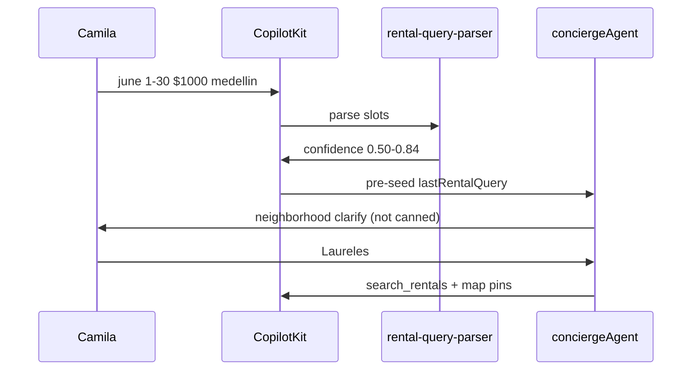

# INT-003 — Gemini smart clarify routing

## Problem

`conciergeAgent` has Medellín expertise but `shouldInstantRentalClarify` + canned copy run before the agent on turn 1.

## User story

As **Camila**, I want: *“Around $1k/month for June — which area fits: Laureles, Poblado, or Envigado?”* — not *“What dates, budget, and setup?”*

## Example prompt

`list rentals in june 1 to 30 $1000 medellin` → Gemini clarify OR search; mentions budget already parsed.

## Purpose & goals

- **Purpose:** Replace canned rental clarify with Gemini neighborhood-style questions.
- **Goal:** Camila hears *"Around $1k/month for June — Laureles, Poblado, or Envigado?"* not a generic form re-ask.
- **Success:** Hero query uses concierge path; working memory pre-seeded from INT-001/002 slots.

## Workflow



## Implementation steps

1. Route confidence **0.50–0.84** to `conciergeAgent` (or thin `generateText` with specialist prompt)
2. Pre-seed working memory from INT-001/INT-002 slots before agent turn
3. Update `concierge.ts` instructions to use parsed `budgetType`, dates, cityWide
4. Narrow/remove instant clarify path in `use-rental-search-fast-path.ts` (see INT-004)

## Files likely touched

- `mdeapp/src/mastra/agents/concierge.ts`
- `mdeapp/src/hooks/use-rental-search-fast-path.ts`
- `mdeapp/src/components/chat/concierge-chat-input.tsx`

## Data requirements

Working memory: partial `lastRentalQuery` from parser.

## RLS / security

N/A.

## Tests

- Integration/smoke: hero query does not return `RENTAL_CLARIFY_MESSAGE` verbatim
- Prod browser: network shows agent path OR search, not clarify-only stub

## Acceptance criteria

- [ ] Hero query gets neighborhood-style clarify or search
- [ ] Second turn `Laureles` → cards + pins
- [ ] Implements [RE-018](../../real-estate/tasks/RE-018-gemini-rental-clarify-routing.md)

## Failure points

- Latency regression on every message (only clarify band should hit agent)
- OpenAI model leak (Gemini only)

## Dependencies

INT-002, INT-001

## Verify

### Unit tests — parser routes 0.50–0.84 band to agent (not canned)

```bash
cd mdeapp && npx vitest run \
  src/lib/__tests__/rental-query-parser.test.ts \
  src/lib/__tests__/rental-search-fast-path.test.ts \
  src/mastra/agents/__tests__/concierge.test.ts
# Expected: all green; hero query confidence ≥ 0.85 takes fast-path; 0.50-0.84 routes to conciergeAgent
```

### Full suite + types

```bash
cd mdeapp && npm run test && npx tsc --noEmit
```

### Browser proof (requires `npm run dev` AND UX-001 green on prod)

```
1. Open http://localhost:3001/chat or /rentals
2. Send: "list rentals in june 1 to 30 $1000 medellin"
3. Assert: response is NOT the canned RENTAL_CLARIFY_MESSAGE three-bullet ask
4. Assert: response asks about neighborhood (Laureles / Poblado / Envigado) or shows search results
5. Reply: "Laureles"
6. Assert: rental cards + map pins appear (search_rentals tool was called)
```

### Network assertion (browser DevTools or playwright)

```
POST /api/copilotkit → response contains "Laureles" or "Poblado" or tool call "search_rentals"
NOT: static string "What are your preferred dates, budget, and setup?"
```

> ⚠️ **Blocked until UX-001** restores `conciergeAgent` on prod. Local dev only until then.
