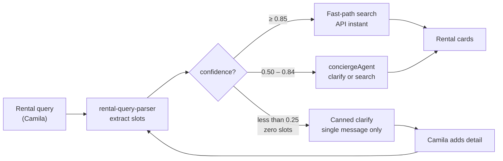

# INT-004 — No canned clarify bypass

> ⛓️ **Sequencing guard — do NOT deploy before UX-001 + UX-002 are live on prod.** This task removes the instant canned clarify and routes the 0.50–0.84 band to `conciergeAgent` (acceptance: *"`conciergeAgent` invoked for 0.50–0.84 band"*). **conciergeAgent is dead on prod today** — it returns `RUN_ERROR (EAUTHTIMEOUT)/INCOMPLETE_STREAM` (QA finding F-1). If this ships first, every ambiguous rental query stops getting the (working) canned message and instead routes to a silently-failing agent — a **regression**, not an improvement. Gate this behind: [UX-001](../../ux/UX-001-restore-concierge-agent-prod.md) (restore concierge) **and** [UX-002](../../ux/UX-002-render-user-facing-error-on-run-error.md) (surface `RUN_ERROR` so a failed reroute is at least visible). Until both are green, keep the canned fallback (step 3) as the live path.

## Problem

`RENTAL_CLARIFY_MESSAGE` in `rental-clarify-copy.ts` fires via `showClarify` without LLM — hard-coded STOP before Gemini.

## User story

As **Camila**, the app must never ignore information I already typed (budget, dates, city).

## Example prompt

Same hero rental query — must not show generic three-bullet clarify asking for budget/dates again.

## Workflow



## Implementation steps

1. Delete or restrict `shouldInstantRentalClarify` to **confidence &lt; 0.25** with **zero** extracted signals only
2. Remove `showClarify(..., rental)` for partial-signal queries in `concierge-chat-input.tsx`
3. Keep fallback string only for true empty queries (`show rentals`, `list rentals medellin` with no slots) — optional single-line, or route to agent
4. Grep repo for `RENTAL_CLARIFY_MESSAGE` usages

## Files likely touched

- `mdeapp/src/lib/rental-query-parser.ts` (`shouldInstantRentalClarify`)
- `mdeapp/src/lib/rental-clarify-copy.ts`
- `mdeapp/src/hooks/use-rental-search-fast-path.ts`
- `mdeapp/src/lib/__tests__/rental-search-fast-path.test.ts`

## Data requirements

None.

## RLS / security

N/A.

## Tests

- Update tests that expect `shouldInstantRentalClarify("list rentals medellin")` true — align with new policy
- Hero query: clarify path not called

## Acceptance criteria

- [ ] No canned clarify when budget OR dates OR cityWide present
- [ ] `conciergeAgent` invoked for 0.50–0.84 band
- [ ] Fast-path still works for ≥ 0.85

## Failure points

- Event fast-path `showClarify` type regressions (fix `showExchange` pattern from PR #12)

## Dependencies

INT-003

## Verify

### Unit tests — canned clarify does NOT fire when slots are present

```bash
cd mdeapp && npx vitest run \
  src/lib/__tests__/rental-search-fast-path.test.ts \
  src/lib/__tests__/rental-query-parser.test.ts
# Expected: shouldInstantRentalClarify("list rentals medellin") = false
#           shouldInstantRentalClarify("") or zero-slot queries = true (canned only for truly empty)
```

### Grep guard — RENTAL_CLARIFY_MESSAGE must not be in routing hot path

```bash
cd mdeapp && grep -r "RENTAL_CLARIFY_MESSAGE\|showClarify" src/hooks/ src/components/ | grep -v "\.test\."
# Expected: showClarify only called when confidence < 0.25 with zero extracted signals
```

### Full suite + types

```bash
cd mdeapp && npm run test && npx tsc --noEmit
```

### Browser proof (requires `npm run dev` AND UX-001 + UX-002 green)

```
1. Open http://localhost:3001/chat
2. Send: "list rentals in june 1 to 30 $1000 medellin"  ← has budget + dates + cityWide
3. Assert: NOT the three-bullet generic clarify
4. Send: "show rentals" (no slots)
5. Assert: canned single-line clarify IS shown (fallback for truly empty still works)
```

> ⚠️ **Deployment gate:** Do NOT ship to prod before UX-001 (restore concierge) AND UX-002 (surface RUN_ERROR) are live. See sequencing guard at top of this task.
