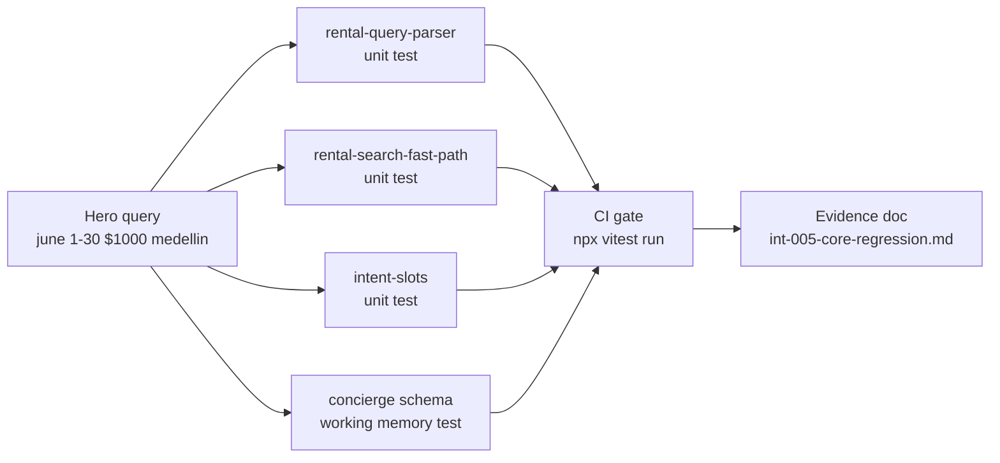

# INT-005 — Intelligence regression tests

## Problem

No single test suite guards CORE intelligence behavior across parser, routing, and prod smoke.

## User story

As **Lucía**, I need automated proof that CORE intelligence does not regress when we add memory later.

## Example prompts (fixture table)

| Prompt | Must NOT | Must |
|--------|----------|------|
| `list rentals in june 1 to 30 $1000 medellin` | Generic canned clarify | Gemini or search |
| `1BR in Laureles under $80/night` | Agent round-trip | Fast-path API 200 |
| `salsa events this weekend near Provenza` | — | event slots (INT-007 prep) |

## Workflow



## Implementation steps

1. Vitest: parser + fast-path + intent-slots (no live Gemini)
2. Optional: Playwright prod smoke spec `e2e/intelligence/core-rental-hero.spec.ts`
3. Evidence doc: `tasks/testing/evidence/YYYY-MM-DD/int-005-core-regression.md`
4. Wire into `npm run test` subset for CI

## Files likely touched

- `mdeapp/src/lib/__tests__/rental-query-parser.test.ts`
- `mdeapp/src/lib/__tests__/rental-search-fast-path.test.ts`
- `mdeapp/e2e/intelligence/core-rental-hero.spec.ts` (new)
- `tasks/testing/prompts/real-estate/03-rental-agent.md` (reference)

## Data requirements

None.

## RLS / security

N/A.

## Tests

This task **is** the test task.

## Acceptance criteria

- [ ] CI runs new tests on PR touching `rental-query-parser` or fast-path hooks
- [ ] Evidence file with localhost + optional prod URLs
- [ ] `01-rentals-prompt` narrow path still passes

## Failure points

- Flaky prod Playwright (use `data-pin-id` pattern from PR #12)

## Dependencies

INT-002, INT-003, INT-004

## Verify

### Unit tests — parser + routing + intent

```bash
cd mdeapp && npx vitest run \
  src/lib/__tests__/rental-query-parser.test.ts \
  src/lib/__tests__/rental-search-fast-path.test.ts \
  src/lib/__tests__/intent-slots.test.ts \
  src/mastra/agents/__tests__/concierge.test.ts \
  src/mastra/lib/__tests__/intelligence-rental-search.test.ts \
  src/mastra/tools/__tests__/search-rentals-date-passthrough.test.ts
```

### Full suite + types

```bash
cd mdeapp && npm run test && npx tsc --noEmit
```

### Hero query smoke (requires `npm run dev`)

```bash
# Confirm fast-path routes: confidence ≥ 0.85 → API, no agent round-trip
curl -s -X POST http://localhost:3001/api/rentals/search \
  -H "Content-Type: application/json" \
  -d '{"queryText":"1BR in Laureles under $80/night","limit":3}' | jq '{source, count: (.results | length)}'
# Expected: source "supabase", count > 0
```

### Regression guard: no canned clarify on hero query

```bash
# Hero query must not match RENTAL_CLARIFY_MESSAGE text
grep -r "RENTAL_CLARIFY_MESSAGE" src/lib/ src/hooks/ src/components/ | grep -v "\.test\." | grep -v "_tests_"
# Expected: only the definition in rental-clarify-copy.ts, not in routing paths for high-confidence queries
```
