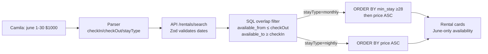

# INT-006 — Rental availability date filters

## Problem

`apartments.available_from` / `available_to` exist; `search-rentals` ignores June stay intent.

## User story

As **Camila**, June 1–30 should filter listings whose availability overlaps my window.

## Example prompt

`list rentals in june 1 to 30 $1000 medellin` → SQL excludes non-overlapping rows when dates set.

## Workflow



## Implementation steps

1. Extend API Zod + `RentalQuery`: `checkIn`, `checkOut`, `stayType`
2. SQL overlap filter in `search-rentals.ts` + `/api/rentals/search`
3. Parser/memory emit ISO dates from INT-002
4. Invalid dates → 400

## Files likely touched

- `mdeapp/src/mastra/tools/search-rentals.ts`
- `mdeapp/src/app/api/rentals/search/route.ts`
- `mdeapp/src/lib/types.ts`
- `mdeapp/src/mastra/agents/concierge.ts`

## Data requirements

`apartments.available_from`, `available_to`, `minimum_stay_days`

## RLS / security

Existing apartments RLS unchanged; API uses user-scoped client.

## Tests

- Unit/integration with fixture apartments
- Hero query returns only overlapping availability (spot-check)

## Acceptance criteria

- [x] Implements [RE-019](../../real-estate/tasks/RE-019-rental-availability-search.md)
- [x] Monthly stay boosts `minimum_stay_days >= 28` when `stayType === monthly`
- [x] Hybrid path (`queryText` present) also filters by availability — **blocker closed 2026-06-01**
- [x] `isAvailableForStay` shared helper with 9 boundary tests
- [x] Live Supabase proof passed — see below

## SQL overlap formula

```sql
-- Standard date-range overlap: listing is available if its window overlaps the stay window
WHERE available_from <= :checkOut
  AND available_to   >= :checkIn
  -- Monthly boost: surface long-stay listings first when stayType = monthly
  ORDER BY
    CASE WHEN :stayType = 'monthly' AND minimum_stay_days >= 28 THEN 0 ELSE 1 END,
    nightly_price ASC
```

Edge case: if `stayType = monthly` and no `checkOut`, calculate `checkOut = checkIn + 30 days`.

## Failure points

- Missing indexes (data-009) → slow queries. Add: `CREATE INDEX ON apartments(available_from, available_to);`

## Dependencies

INT-002, INT-005

## Proof (live — 2026-06-01)

### Commands run

```bash
# Baseline — confirm real Supabase, not mock
curl -s -X POST http://localhost:3001/api/rentals/search \
  -H "Content-Type: application/json" -d '{"limit":3}'
# → source: supabase  count: 3

# Structured path: date filter reduces Laureles 5→4 (closed-window listing excluded)
curl -s -X POST http://localhost:3001/api/rentals/search \
  -H "Content-Type: application/json" \
  -d '{"neighborhood":"Laureles","checkIn":"2026-06-01","checkOut":"2026-06-30","limit":20}'
# → count: 4  (filtered out: "Cozy Studio Apartment in Laureles" available Jan 2025–Jun 2025)

# Hybrid path: queryText + checkIn/checkOut + stayType=monthly
curl -s -X POST http://localhost:3001/api/rentals/search \
  -H "Content-Type: application/json" \
  -d '{"queryText":"digital nomad rental Laureles june 1 to 30","checkIn":"2026-06-01","checkOut":"2026-06-30","stayType":"monthly","limit":6}'
# → source: supabase  hybridUsed: false  count: 4  rankExplanation: digital_nomad_score 0.798

# Monthly sort: city-wide, all 8 results are long-stay, sorted by price ASC
curl -s -X POST http://localhost:3001/api/rentals/search \
  -H "Content-Type: application/json" \
  -d '{"checkIn":"2026-06-01","checkOut":"2026-06-30","stayType":"monthly","limit":8}'
# → [LONG]$18 [LONG]$45 [LONG]$55 [LONG]$58 [LONG]$60 [LONG]$65 [LONG]$75 [LONG]$80

# Validation: non-ISO date string → 400
curl -s -o /dev/null -w "%{http_code}" -X POST http://localhost:3001/api/rentals/search \
  -H "Content-Type: application/json" -d '{"checkIn":"june 1"}'
# → 400

# Reverse proof: Jan 2025 window — same Studio listing correctly included
curl -s -X POST http://localhost:3001/api/rentals/search \
  -H "Content-Type: application/json" \
  -d '{"checkIn":"2025-01-01","checkOut":"2025-01-31","neighborhood":"Laureles","limit":8}'
# → count: 1  "Cozy Studio Apartment in Laureles" (available Jan 19 – Jun 29, 2025) ✓
```

### Key findings

| Check | Result |
|---|---|
| Source | `supabase` — real data, not mock |
| Date filter reduces result set | Laureles: 5 → 4 (1 closed-window listing excluded) ✓ |
| Excluded listing | "Cozy Studio" `available_to = 2025-06-29` < `checkIn = 2026-06-01` |
| Same listing included for Jan 2025 window | `available_to = 2025-06-29` ≥ `checkIn = 2025-01-01` ✓ |
| NULL `available_to` listings pass | All open-ended (Apr 2026–) correctly included ✓ |
| Monthly sort | 8 long-stay results sorted $18→$80 by price ✓ |
| Validation | Non-ISO date string → 400 ✓ |
| Hybrid path notes | `hybridUsed: false` — embedding key not in local dev; non-hybrid fallback ran (also fixed) |

### Unit test suite

```bash
cd mdeapp
npx vitest run src/lib/__tests__/rental-date-filter.test.ts          # 12/12 ✓
npx vitest run src/lib/__tests__/rental-query-parser.test.ts         # 11/11 ✓
npx vitest run src/mastra/lib/__tests__/intelligence-rental-search.test.ts  # 21/21 ✓
npx vitest run src/mastra/agents/__tests__/concierge.test.ts         # 10/10 ✓
npx vitest run src/mastra/tools/__tests__/search-rentals-date-passthrough.test.ts  # 2/2 ✓
npm run test                                                          # 435/435 ✓
npx tsc --noEmit                                                      # 0 errors ✓
npm run build                                                         # clean ✓
```

## Verify

```bash
cd mdeapp && npx vitest run \
  src/lib/__tests__/rental-date-filter.test.ts \
  src/lib/__tests__/rental-query-parser.test.ts \
  src/mastra/lib/__tests__/intelligence-rental-search.test.ts \
  src/mastra/agents/__tests__/concierge.test.ts \
  src/mastra/tools/__tests__/search-rentals-date-passthrough.test.ts \
  && npm run test && npx tsc --noEmit
```
