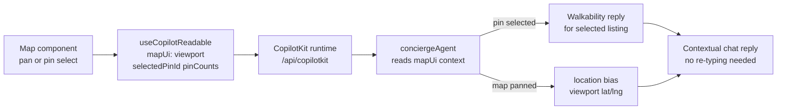

# INT-009 — CopilotKit readable UI state

## Problem

Agent does not see map viewport, selected pin, or active filters unless user types them.

## User story

As **Camila**, when I pan the map to Envigado, the agent should know my map context without re-typing.

## Example prompt

User selects rental pin → asks “how walkable is this?” — agent reads `selectedPinId` from readable state.

## Workflow



## Implementation steps

1. Add `useCopilotReadable` for `mapUi` (viewport, selectedPinId, pin counts)
2. Mirror `useCoAgent` state where duplicated
3. Document in `copilotkit-develop` skill usage
4. Concierge instructions: prefer readable state for location bias

## Files likely touched

- `mdeapp/src/components/chat/chat-filter-copilot-instructions.tsx`
- `mdeapp/src/components/maps/` (readable providers)
- `mdeapp/src/mastra/lib/grounding-location-bias.ts`

## Data requirements

`ConciergeWorkingMemory.mapUi` already partial — align shapes.

## RLS / security

No PII in readable payloads.

## Tests

- Component test: readable registers on map move
- Agent test: location bias uses viewport

## Acceptance criteria

- [ ] At least map viewport + selectedPinId readable
- [ ] CopilotKit 1.55.2 only (no v2 mix)

## Failure points

- Readable payload too large (trim fields)

## Dependencies

INT-003

## Verify

### Unit tests — readable state shape

```bash
cd mdeapp && npx vitest run \
  src/platform/contracts/__tests__/map-ui-state.test.ts \
  src/lib/__tests__/map-ui-summary.test.ts
# Expected: mapUi shape matches ConciergeWorkingMemory.mapUi; viewport + selectedPinId present
```

### Full suite + types

```bash
cd mdeapp && npm run test && npx tsc --noEmit
```

### Browser proof (requires `npm run dev`)

```
1. Open http://localhost:3001/rentals
2. Wait for map to load with rental pins
3. Click a rental pin — selectedPinId must update
4. In chat, send: "how walkable is this neighborhood?"
5. Assert: agent reply references the selected listing (not a generic answer)
   Network: POST /api/copilotkit request body contains mapUi.selectedPinId
```

### Agent context proof

```
6. Pan the map to Envigado (drag map viewport)
7. Send: "show me options here"
8. Assert: search results are for Envigado (location bias from viewport — not Laureles or Poblado)
   Network: search_rentals tool call contains neighborhood matching viewport area
```

### CopilotKit version guard

```bash
cd mdeapp && grep '"@copilotkit/' package.json | grep -v "1\.55\."
# Expected: empty — all CopilotKit packages pinned at 1.55.x
```
