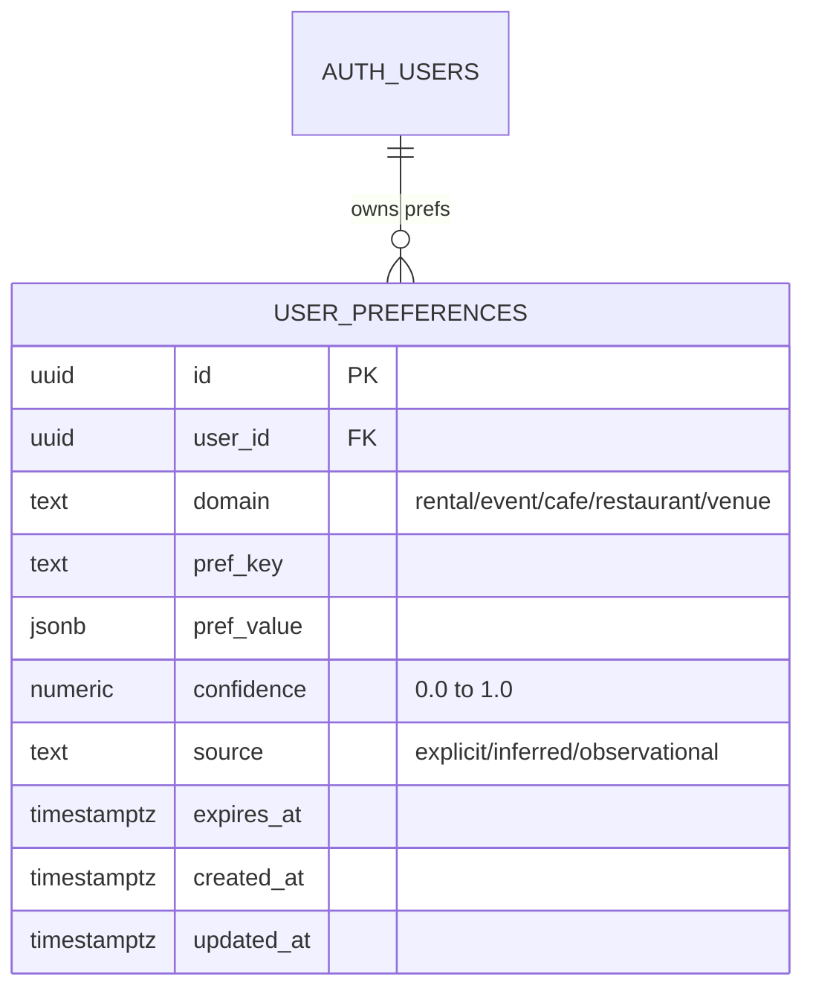

# INT-011 — user_preferences schema + RLS

## Problem

No durable cross-session prefs; only thread working memory.

## User story

As **Camila**, the app remembers I prefer Laureles + furnished + remote work across visits.

## Example

After 3 Laureles clicks → `preferred_neighborhood = Laureles` boosts future searches.

## Schema diagram



## Implementation steps

1. Migration DDL:

```sql
CREATE TABLE user_preferences (
  id          uuid DEFAULT gen_random_uuid() PRIMARY KEY,
  user_id     uuid NOT NULL REFERENCES auth.users(id) ON DELETE CASCADE,
  domain      text NOT NULL CHECK (domain IN ('rental','event','cafe','restaurant','venue')),
  pref_key    text NOT NULL,
  pref_value  jsonb NOT NULL,
  confidence  numeric(3,2) NOT NULL DEFAULT 1.0 CHECK (confidence BETWEEN 0 AND 1),
  source      text NOT NULL CHECK (source IN ('explicit','inferred','observational')),
  expires_at  timestamptz,
  created_at  timestamptz NOT NULL DEFAULT now(),
  updated_at  timestamptz NOT NULL DEFAULT now(),
  UNIQUE(user_id, domain, pref_key)
);
ALTER TABLE user_preferences ENABLE ROW LEVEL SECURITY;
CREATE POLICY "owner only" ON user_preferences
  FOR ALL USING (auth.uid() = user_id) WITH CHECK (auth.uid() = user_id);
CREATE POLICY "anon denied" ON user_preferences
  FOR ALL TO anon USING (false);
```

2. `confidence` values: explicit user-set = 1.0; inferred (INT-020) starts at 0.4; observational = 0.6 threshold
3. `expires_at` use case: time-boxed location prefs — e.g., Camila is visiting Medellín for 3 months but normally lives elsewhere; her neighborhood pref expires when she leaves. Not "hostel preferences."
4. Document in agent-plan Phase 3

## Files likely touched

- `mdeapp/supabase/migrations/*_user_preferences.sql`
- `mdeapp/src/lib/supabase/types` (generated)

## Data requirements

`auth.users` FK.

## RLS / security

**Required** — owner-only; no anon write. Service role edge-only for batch jobs if any.

## Tests

- RLS policy test: user A cannot read user B prefs
- Migration applies clean on staging

## Acceptance criteria

- [ ] Table + RLS + ≥1 policy per repo rules
- [ ] `expires_at` column for ephemeral prefs (party hostels)

## Failure points

- Skipping RLS (hard rule violation)

## Dependencies

INT-005 (CORE stable); **VEC-002** design alignment (soft)

## Verify

### Migration + RLS proof (Supabase MCP or CLI)

```bash
# Apply migration
cd mdeapp && supabase migration up

# Verify table exists with RLS enabled
supabase db query "SELECT relname, relrowsecurity FROM pg_class WHERE relname = 'user_preferences';"
# Expected: relrowsecurity = true

# Verify policies
supabase db query "SELECT policyname, cmd FROM pg_policies WHERE tablename = 'user_preferences';"
# Expected: 'owner only' (ALL) + 'anon denied' (ALL)
```

### RLS isolation test — user A cannot read user B prefs

```bash
cd mdeapp && npx vitest run src/lib/supabase/__tests__/user-scoped.test.ts
# When INT-011 test added: user_preferences rows from user A must not appear in user B's session
```

### Schema field check

```bash
supabase db query "
  SELECT column_name, data_type, is_nullable
  FROM information_schema.columns
  WHERE table_name = 'user_preferences'
  ORDER BY ordinal_position;
"
# Expected: id, user_id, domain, pref_key, pref_value (jsonb), confidence (numeric), source, expires_at, created_at, updated_at
```

### Full suite + types (after migration applied)

```bash
cd mdeapp && npm run test && npx tsc --noEmit
```
