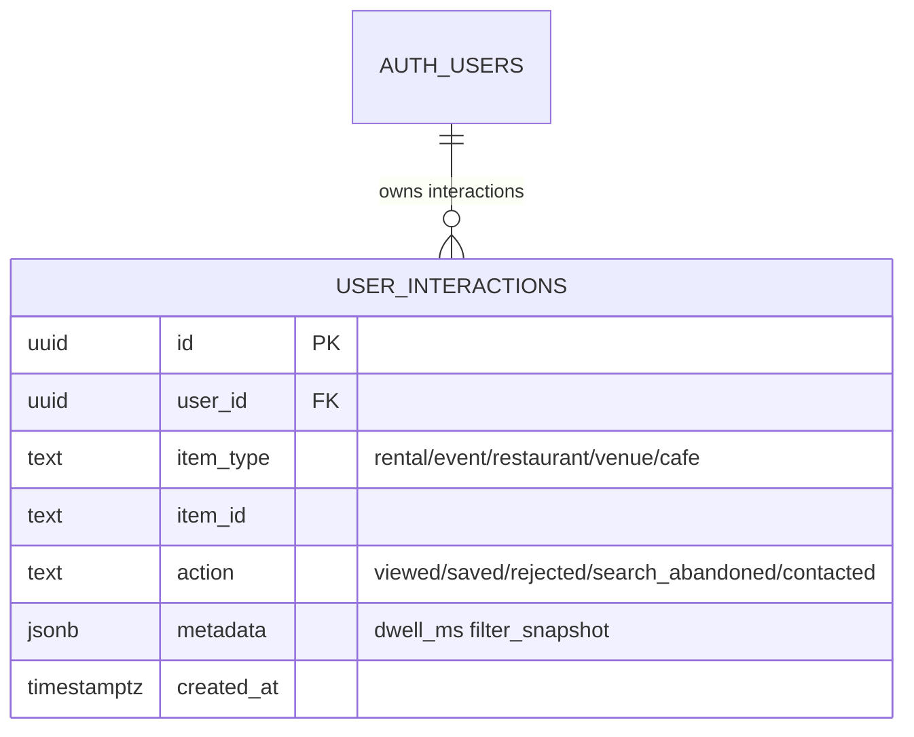

# INT-012 — user_interactions schema

## Problem

No structured log of views/saves/rejects for ranking feedback loop.

## User story

As **Patricia**, I can see which listings Camila ignored vs saved for tuning.

## Example signals

| action | metadata |
|--------|----------|
| viewed | dwell_ms, listing_id |
| saved | — |
| rejected | reason optional |
| search_abandoned | filter_snapshot |

## Schema diagram



## Implementation steps

1. Migration DDL:

```sql
CREATE TABLE user_interactions (
  id          uuid DEFAULT gen_random_uuid() PRIMARY KEY,
  user_id     uuid NOT NULL REFERENCES auth.users(id) ON DELETE CASCADE,
  item_type   text NOT NULL CHECK (item_type IN ('rental','event','restaurant','venue','cafe')),
  item_id     text NOT NULL,
  action      text NOT NULL CHECK (action IN ('viewed','saved','rejected','search_abandoned','contacted')),
  metadata    jsonb,  -- safe: dwell_ms, filter_snapshot. NEVER: raw query text, IP, device ID
  created_at  timestamptz NOT NULL DEFAULT now()
);
ALTER TABLE user_interactions ENABLE ROW LEVEL SECURITY;
CREATE POLICY "owner only" ON user_interactions
  FOR ALL USING (auth.uid() = user_id) WITH CHECK (auth.uid() = user_id);
CREATE POLICY "anon denied" ON user_interactions FOR ALL TO anon USING (false);
CREATE INDEX ON user_interactions(user_id, item_type, created_at DESC);
```

2. Server helper `logUserInteraction()` — wire through `/api/interactions` route, not direct client insert (prevents log injection)
3. Wire card click handlers (rental first)
4. v1: authenticated users only. Pre-login anonymous tracking deferred to POST-MVP+.

## Files likely touched

- `mdeapp/supabase/migrations/*_user_interactions.sql`
- `mdeapp/src/lib/interactions/log-interaction.ts` (new)
- `mdeapp/src/components/rentals/` card components

## Data requirements

`item_type`, `item_id`, `action`, `metadata jsonb`

## RLS / security

Owner-only insert/select.

## Tests

- RLS cross-user denial
- Log on card open (unit mock)

## Acceptance criteria

- [ ] At least rental `viewed` + `saved` logged
- [ ] Abandoned search action defined

## Failure points

- Logging PII in metadata

## Dependencies

INT-011

## Verify

### Migration + RLS proof

```bash
cd mdeapp && supabase migration up

# Verify RLS enabled
supabase db query "SELECT relname, relrowsecurity FROM pg_class WHERE relname = 'user_interactions';"
# Expected: relrowsecurity = true

# Verify owner-only policy
supabase db query "SELECT policyname FROM pg_policies WHERE tablename = 'user_interactions';"
```

### Unit tests — log-interaction + RLS cross-user denial

```bash
cd mdeapp && npx vitest run src/lib/interactions/
# Expected: log-interaction mock writes correct item_type/action/metadata shape;
#           RLS test confirms user A cannot select user B rows
```

### Interaction logging proof (requires `npm run dev`)

```
1. Open http://localhost:3001/rentals
2. Click a rental card (triggers "viewed" action)
3. Save a rental (triggers "saved" action)
4. Check browser network: no PII in metadata payload (only item_id, item_type, action)
```

### No-PII guard

```bash
cd mdeapp && grep -r "logInteraction\|log_interaction" src/ | grep -v "\.test\." | grep -i "email\|phone\|name\|query"
# Expected: empty — raw user text must not appear in interaction metadata
```

### Full suite + types

```bash
cd mdeapp && npm run test && npx tsc --noEmit
```
