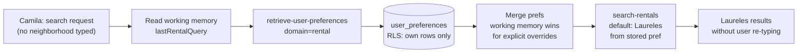

# INT-013 — Retrieve preferences before search

## Problem

Search tools do not read durable prefs before SQL.

## User story

As **Camila**, repeat visit boosts Laureles without me saying Laureles again.

## Example

Prefs: `preferred_neighborhood=Laureles` → `search-rentals` default neighborhood or boost.

## Workflow



## Implementation steps

1. Mastra tool `retrieve-user-preferences` (domain=rental)
2. Call from concierge pre-search hook or inside `search-rentals`
3. Merge with working memory (working wins for explicit turn override)
4. Respect `expires_at`

## Files likely touched

- `mdeapp/src/mastra/tools/retrieve-user-preferences.ts` (new)
- `mdeapp/src/mastra/tools/search-rentals.ts`
- `mdeapp/src/mastra/agents/concierge.ts`

## Data requirements

INT-011 table populated.

## RLS / security

User JWT only; no service role in src.

## Tests

- Tool returns only own prefs
- Search uses pref when query omits neighborhood

## Acceptance criteria

- [ ] E2E: set pref → search without neighborhood → Laureles bias
- [ ] Expired prefs ignored

## Failure points

- Service role leak in tool

## Dependencies

INT-011, INT-012, INT-006

## Verify

### Unit tests — preference retrieval + injection into search

```bash
cd mdeapp && npx vitest run \
  src/mastra/tools/__tests__/retrieve-user-preferences.test.ts \
  src/mastra/agents/__tests__/concierge.test.ts
# Expected:
#   retrieve-user-preferences returns stored Laureles preference for user A
#   concierge injects neighborhood bias from prefs when search query has no explicit neighborhood
#   expired prefs (expires_at < now()) are filtered out and not injected
```

### No service-role leak

```bash
cd mdeapp && grep -r "SERVICE_ROLE\|service_role" src/mastra/tools/ | grep -iv "test\|spec"
# Expected: empty — tool uses anon/user-scoped client, not service role
```

### E2E preference → search bias (requires `npm run dev` + auth)

```
1. Set preference: user_preferences insert {domain:'rental', pref_key:'preferred_neighborhood', pref_value:'"Laureles"'}
2. Send: "show me rentals" (no neighborhood mentioned)
3. Assert: search results are for Laureles (preference injected as location bias)
4. Set expires_at to a past date (preference expires)
5. Send: "show me rentals" again
6. Assert: no Laureles bias — expired preference ignored
```

### Full suite + types

```bash
cd mdeapp && npm run test && npx tsc --noEmit
```
