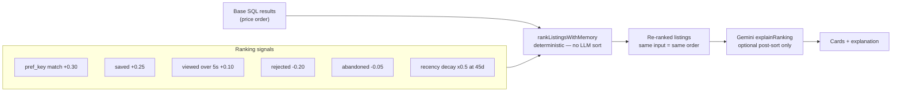

# INT-014 — Ranking boost from memory

## Problem

Results sorted only by SQL/price; prefs and interactions ignored.

## User story

As **Camila**, listings matching my saved style rank higher; Gemini explains why #1 fits.

## Example

Laureles + furnished + WiFi pref → +boost; Gemini: “Strong match for remote work in Laureles.”

## Workflow



## Implementation steps

1. Deterministic `rankListingsWithMemory(baseResults, prefs, interactions)` 
2. **Do not** let LLM set sort order
3. Gemini `explainRanking` optional separate call
4. Apply in API route + tool response

## Files likely touched

- `mdeapp/src/lib/ranking/rank-with-memory.ts` (new)
- `mdeapp/src/app/api/rentals/search/route.ts`
- `mdeapp/src/mastra/tools/search-rentals.ts`

## Data requirements

Prefs + recent interactions weights; decay 90d.

## RLS / security

N/A (ranking server-side).

## Tests

- Unit: boost math fixtures
- Ignored listings down-rank

## Acceptance criteria

- [ ] Sort order reproducible (same input → same order)
- [ ] Explanation text optional, not required for sort

## Failure points

- Using LLM for numeric scores (forbidden)

## Dependencies

INT-013

## Ranking weights (v1 — tune after INT-022 telemetry data)

| Signal | Weight |
|---|---|
| pref_key match | +0.30 |
| interaction: saved | +0.25 |
| interaction: viewed >5s | +0.10 |
| interaction: rejected | -0.20 |
| interaction: search_abandoned | -0.05 |
| Recency decay (90d half-life) | ×0.5 at 45d |

Note: LLM may EXPLAIN the ranking after the deterministic sort. LLM must NEVER produce numeric scores or determine sort order.

## Verify

### Unit tests — ranking boost calculations

```bash
cd mdeapp && npx vitest run src/lib/ranking/
# Expected:
#   listing matching pref_key="Laureles" scores +0.30 vs non-matching
#   listing with saved interaction scores +0.25 above baseline
#   listing with viewed>5s scores +0.10
#   listing with rejected interaction scores -0.20 (demoted)
#   90d-old interaction applies 0.5× recency decay
#   LLM does NOT produce numeric scores (test asserts sort order, not LLM output)
```

### Ranking integration proof (requires `npm run dev` + seeded preferences)

```
1. Seed: user_interactions {item_id: "apt-X", action: "saved"}
2. Send: "show rentals in Laureles"
3. Assert: apt-X appears in top 3 (saved boost applied)
4. Seed: user_interactions {item_id: "apt-X", action: "rejected"}
5. Send: "show rentals in Laureles" again
6. Assert: apt-X is demoted in results (rejected penalty applied)
```

### Full suite + types

```bash
cd mdeapp && npm run test && npx tsc --noEmit
```

```bash
cd mdeapp && npx vitest run src/lib/ranking/ && npx tsc --noEmit
```
