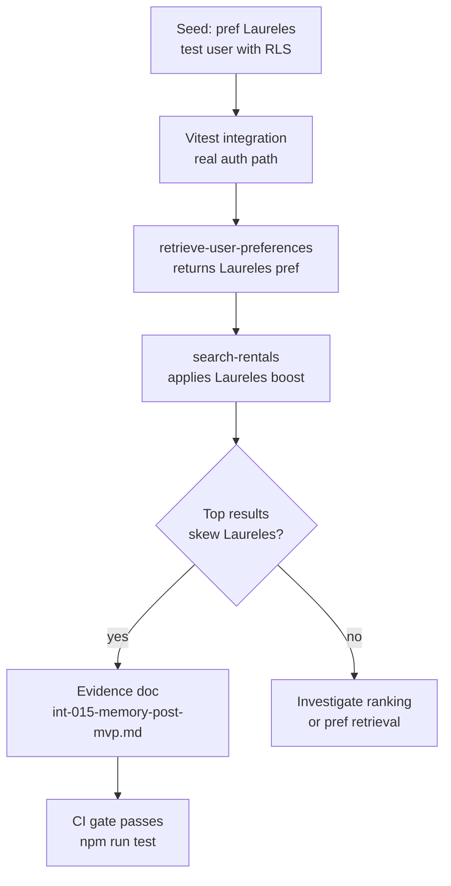

# INT-015 — Memory evidence tests

## Problem

No anti-fake-done evidence for memory program.

## User story

As **Lucía**, I need proof prefs affect search before ADVANCED pgvector ships.

## Example E2E

1. Seed pref Laureles
2. Search city-wide
3. Top results skew Laureles
4. Evidence markdown + screenshots

## Workflow



## Implementation steps

1. Vitest integration with test user + RLS
2. Playwright signed-in flow (if auth test harness exists)
3. `tasks/testing/evidence/YYYY-MM-DD/int-015-memory-post-mvp.md`
4. task-verifier checklist

## Files likely touched

- `mdeapp/src/**/*.test.ts`
- `tasks/testing/evidence/`

## Data requirements

Test fixtures or seed script.

## RLS / security

Tests must use real RLS paths, not service role in src.

## Tests

This task produces evidence artifacts.

## Acceptance criteria

- [ ] Evidence file committed
- [ ] RLS denial test included
- [ ] localhost dev boot in evidence

## Failure points

- Skipping auth in tests (false green)

## Dependencies

INT-013, INT-014

## Verify

### Full test suite (memory + ranking + RLS)

```bash
cd mdeapp && npm run test && npx tsc --noEmit
# Expected: all suites green including INT-011 migration, INT-012 interaction logging,
#           INT-013 preference retrieval, INT-014 ranking boost
```

### RLS isolation test (must be included in evidence file)

```bash
cd mdeapp && npx vitest run src/lib/supabase/__tests__/user-scoped.test.ts
# Expected: user A cannot read user B's user_preferences or user_interactions rows
```

### localhost boot proof (required in evidence file)

```bash
cd mdeapp && npm run dev &
sleep 5
curl -s http://localhost:3001/ -o /dev/null -w "%{http_code}"
# Expected: 200 — server booted clean, no startup errors
```

### Evidence file location

```
tasks/testing/evidence/YYYY-MM-DD/int-015-memory-evidence.md
# Must contain:
#   - localhost boot screenshot or curl 200 proof
#   - RLS denial test result
#   - Preference→search bias E2E walkthrough
#   - Ranking boost before/after result comparison
```
