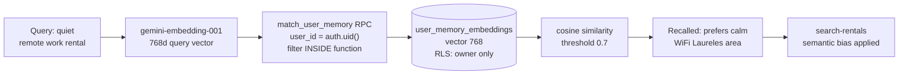

# INT-016 — pgvector semantic memory

## Problem

“Quiet remote work” cannot match “peaceful WiFi rental” without embeddings.

## User story

As **Camila**, semantic recall finds related prefs I never stored as exact keys.

## Example

Query embedding ≈ memory: “prefers calm streets and reliable WiFi”.

## Workflow



## Implementation steps

1. Complete **VEC-001** inventory + duplicate index cleanup
2. **VEC-002** `user_memory_embeddings` + `match_user_memory` RPC (filter in SQL)
3. RLS per [RAG with permissions](https://supabase.com/docs/guides/ai/rag-with-permissions)
4. Mastra tool `retrieve-semantic-memories` OR Mastra semanticRecall (pick one in spike)

## Files likely touched

- `mdeapp/supabase/migrations/*_user_memory_embeddings.sql`
- `mdeapp/src/mastra/tools/retrieve-semantic-memories.ts`

## Data requirements

`vector(768)` per VEC-003.

## RLS / security

**Critical** — vector RPC must filter `user_id` inside function.

## Tests

- RPC returns only own rows
- Wrong dimension rejected at migration

## Acceptance criteria

- [ ] VEC-001/002 Done evidence linked
- [ ] Implements partial [RE-020](../../real-estate/tasks/RE-020-rental-preference-memory.md)

## Critical security pattern — filter inside the RPC function

PostgREST applies WHERE clauses **after** a function returns, not inside it. If the RPC selects all users' vectors and relies on PostgREST to filter by `user_id`, **other users' data is exposed**. The `user_id = auth.uid()` filter MUST be inside the SQL function body:

```sql
-- CORRECT — user data stays private
CREATE FUNCTION match_user_memory(
  query_embedding vector(768),
  match_threshold float DEFAULT 0.7,
  match_count int DEFAULT 5
)
RETURNS TABLE (id uuid, content text, similarity float)
LANGUAGE sql SECURITY DEFINER
AS $$
  SELECT id, content,
         1 - (embedding <=> query_embedding) AS similarity
  FROM user_memory_embeddings
  WHERE user_id = auth.uid()          -- filter HERE, not via PostgREST
    AND 1 - (embedding <=> query_embedding) > match_threshold
  ORDER BY embedding <=> query_embedding
  LIMIT match_count;
$$;
-- WRONG: SELECT * FROM match_user_memory(...) WHERE user_id = auth.uid()
--        PostgREST adds this AFTER the function returns all rows
```

## Failure points

- Duplicate HNSW indexes (VEC-001)
- PostgREST outer filter on RPC — see security pattern above; filter inside fn body
- Model dimension lock: `vector(768)` is tied to `gemini-embedding-001`. Any model upgrade requires a new column + full re-embed — never in-place update

## Dependencies

VEC-001, VEC-002, INT-011

## Verify

### Migration + extension proof

```bash
cd mdeapp && supabase migration up

# Verify pgvector extension enabled
supabase db query "SELECT extname FROM pg_extension WHERE extname = 'vector';"
# Expected: vector

# Verify table + HNSW index exists
supabase db query "SELECT indexname FROM pg_indexes WHERE tablename = 'user_memory_embeddings';"
# Expected: user_memory_embeddings_embedding_idx (or similar HNSW index)
```

### RLS filter-inside-function proof

```bash
supabase db query "
  SELECT proname, prosrc FROM pg_proc WHERE proname = 'match_user_memory';
" | grep "auth.uid()"
# Expected: auth.uid() appears INSIDE the function body (not filtered by PostgREST after return)
```

### Semantic search proof (requires embedding seeded)

```bash
cd mdeapp && npx vitest run src/mastra/lib/__tests__/query-embedding.test.ts
# When INT-017 ships: npx vitest run src/lib/embeddings/
# Expected: vector(768) dimensions match gemini-embedding-001 output
```

### Full suite + types

```bash
cd mdeapp && npm run test && npx tsc --noEmit
```
