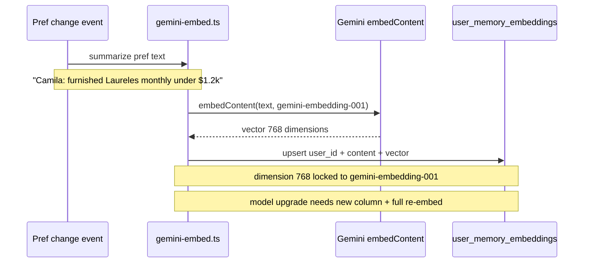

# INT-017 — Gemini embeddings for memory

## Problem

No pipeline to embed preference summaries into `user_memory_embeddings`.

## User story

As **Sofia**, query and document embeddings use the same model/dimensions (VEC-003).

## Example

Summarize: “Camila prefers furnished Laureles monthly under $1.2k” → `embedContent` → store 768d vector.

## Workflow



## Implementation steps

1. Lock `gemini-embedding-001` @ 768 (VEC-003)
2. Server-only embed helper (edge fn or Mastra tool)
3. `upsert-memory-embedding` on pref change + batch backfill job
4. gemini-api-docs-mcp verify before model name

## Files likely touched

- `mdeapp/src/lib/embeddings/gemini-embed.ts` (new)
- `mdeapp/supabase/functions/embed-user-memory/` (optional)

## Data requirements

`GOOGLE_GENERATIVE_AI_API_KEY` server-side.

## RLS / security

Embed worker uses service role in edge only.

## Tests

- Dimension 768 assert
- Same model for query + doc embed

## Acceptance criteria

- [ ] VEC-003 contract documented in migration comment
- [ ] No `gemini-embedding-2` in prod without migration plan

## Failure points

- Mixed models in same table (invalid distances)

## Dependencies

VEC-003, INT-016

## Verify

### Pre-implementation: verify embedding model name via MCP

```bash
# ALWAYS run this before touching any embedding model name in code:
# mcp__gemini-api-docs-mcp__search_docs('embedding models')
# Expected: confirm current model ID (e.g. "gemini-embedding-001") and vector dimensions (768)
# Model names change — do not hardcode without MCP verification
```

### Unit tests — embedding generation

```bash
cd mdeapp && npx vitest run \
  src/lib/embeddings/ \
  src/mastra/lib/__tests__/query-embedding.test.ts
# Expected:
#   embedText returns Float32Array of length 768
#   API key absent → returns null gracefully (no throw)
#   Model dimension assertion: vector length === 768
```

### Live embedding smoke (requires GOOGLE_GENERATIVE_AI_API_KEY in .env.local)

```bash
cd mdeapp && node -e "
  const { embedQueryText } = require('./src/mastra/lib/query-embedding');
  embedQueryText('test rental in Laureles').then(v => console.log('dims:', v?.length ?? 'null (no key)'));
"
# Expected: dims: 768  OR  dims: null (no key — acceptable for CI without key)
```

### Vector dimension lock assertion

```bash
cd mdeapp && grep -r "vector(768)\|dimensions.*768\|768.*dimension" src/ supabase/
# Expected: consistent 768 everywhere — mismatch between embedding output and table column type causes silent failures
```

### Full suite + types

```bash
cd mdeapp && npm run test && npx tsc --noEmit
```
