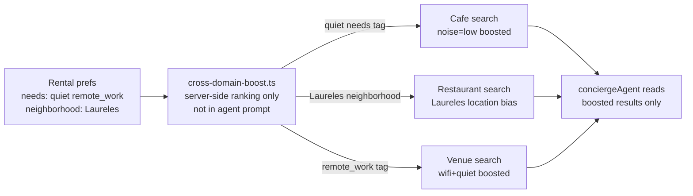

# INT-018 — Cross-domain personalization

## Problem

Rental prefs don’t inform café/restaurant suggestions (shared “quiet / walkable” taste).

## User story

As **Camila**, remote-work rental prefs boost quiet cafés in Laureles on `/chat`.

## Example prompts

| Domain | Prompt |
|--------|--------|
| Rental | (prefs: Laureles, remote_work) |
| Café | `quiet café in Laureles for remote work tomorrow` |
| Restaurant | `romantic dinner in El Poblado under $80` |
| Venue | `birthday venue for 20 people with music` |

## needs tag vocabulary

Shared `needs` tags used across domains (all optional on any slot):

```
remote_work · quiet · outdoor · family_friendly · romantic · live_music
pet_friendly · accessible · vegan · group_dining · date_night · quick_bite
```

## Workflow



## Implementation steps

1. `domain` column on prefs/embeddings (rental | event | cafe | restaurant | venue)
2. Cross-domain boost rules (deterministic, NOT in prompt): shared `needs` tags drive boosts at ranking time
   - rental.needs includes 'quiet' → café boost: noise=low, outdoor=false
   - rental.neighborhood = Laureles → restaurant location bias: Laureles area
   - Cross-domain boost lives in `cross-domain-boost.ts` (server-side ranking), NOT in the agent prompt
3. Specialist modules read cross-domain prefs (no mega-prompt). The agent reads boosted results, not boost logic.
4. Restaurant/venue slot extension (defer venue booking to future task)

## Files likely touched

- `mdeapp/src/lib/personalization/cross-domain-boost.ts`
- `mdeapp/src/mastra/agents/concierge.ts`
- INT-007, INT-008 wrappers

## Data requirements

INT-011/016 populated.

## RLS / security

Domain-scoped prefs still user-owned.

## Tests

- Rental pref affects café ranking boost (unit)
- Event prefs isolated when domain filter on

## Acceptance criteria

- [ ] At least rental→café boost demonstrated
- [ ] No single agent prompt > maintainability threshold

## Failure points

- One giant super-agent (forbidden)

## Dependencies

INT-016, INT-007, INT-008

## Verify

### Unit tests — cross-domain preference propagation

```bash
cd mdeapp && npx vitest run src/lib/personalization/
# Expected:
#   Rental Laureles preference propagates as neighborhood bias to restaurant + event search
#   Café quiet preference propagates to rental workspace_score signal boost
#   Test isolation: domain A pref does NOT leak to unrelated domain B (no false cross-pollination)
#   Agent calls domain-specific tool (search-restaurants vs search-rentals) — no giant single-agent call
```

### Cross-domain E2E (requires `npm run dev` + seeded prefs)

```
1. Set rental pref: preferred_neighborhood = "El Poblado"
2. Send: "find me a good dinner spot"  (restaurant query, no neighborhood)
3. Assert: restaurant results are near El Poblado (cross-domain bias applied)
4. Send: "show events this weekend"  (event query, no neighborhood)
5. Assert: events near El Poblado surface (cross-domain propagated to events too)
```

### No-giant-agent guard

```bash
cd mdeapp && grep -r "conciergeAgent\|searchAgent" src/mastra/agents/ | grep -v "\.test\." | grep -i "all\|every\|universal"
# Expected: empty — no single agent handling all domains; specialist routing preserved
```

### Full suite + types

```bash
cd mdeapp && npm run test && npx tsc --noEmit
```
