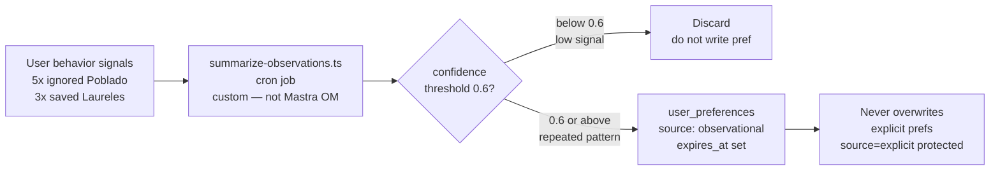

# INT-020 — Observational memory learning

## Problem

Long threads overflow context; implicit preferences from behavior not summarized.

## User story

As **Camila**, after many clicks the agent learns I avoid Poblado without me stating it.

## Example

Interactions: 5× ignored Poblado, 3× saved Laureles → observation: “prefers Laureles over Poblado nightlife.”

## Workflow



## Implementation steps

1. Evaluate Mastra [observational memory](https://mastra.ai/docs/memory/observational-memory) vs custom summarizer
2. Background job: interactions → structured pref OR embedding
3. `expires_at` on inferred prefs (low confidence)
4. Do not auto-write high-confidence prefs without threshold

## Files likely touched

- `mdeapp/src/mastra/lib/agent-memory.ts`
- `mdeapp/src/mastra/jobs/summarize-observations.ts` (new)

## Data requirements

INT-012 interaction volume.

## RLS / security

Summaries stored with same RLS as prefs.

## Tests

- Synthetic interaction stream → one pref candidate
- Ephemeral observations expire

## Confidence threshold

- **v1 threshold: 0.6** — inferred prefs start at 0.4 (low); reach 0.6 only after repeated consistent behavior (e.g., 5+ rejections of same neighborhood)
- Inferred prefs always use `source: 'observational'`; explicit user-set prefs are `source: 'explicit'` and are NEVER overwritten by observations
- Architecture decision: use custom `summarize-observations.ts` cron job for write path (Mastra's observational memory API is preview-only and unstable). Use Mastra `semanticRecall` for read path only.

## Acceptance criteria

- [ ] Design doc: Mastra OM vs custom chosen → decision = custom job (see above)
- [ ] No observational write below confidence threshold 0.6

## Failure points

- Wrong inferences persisted forever (mitigate: expires_at + user delete INT-019)

## Dependencies

INT-012, INT-016

## Verify

### Unit tests — observation pipeline

```bash
cd mdeapp && npx vitest run src/mastra/jobs/
# Expected:
#   Synthetic interaction stream (5× "rejected" for Envigado) → inferred pref candidate generated
#   Candidate below 0.6 confidence threshold → NOT written to user_preferences
#   Candidate at/above 0.6 threshold → written with source="observational", confidence set
#   Explicit pref (source="explicit") is NEVER overwritten by observational write
#   Ephemeral observations expire (created_at + TTL < now() → filtered out in candidate scoring)
```

### Confidence gate proof

```bash
cd mdeapp && npx vitest run src/mastra/jobs/ -- --reporter=verbose 2>&1 | grep -i "confidence\|threshold\|0\.4\|0\.6"
# Expected: test names or log lines confirming 0.4 (initial) and 0.6 (write gate) threshold tests pass
```

### Full suite + types

```bash
cd mdeapp && npm run test && npx tsc --noEmit
```

### Observational learning E2E (requires `npm run dev` + seeded interactions)

```
1. Seed 6× user_interactions: {item_id: various-envigado-apt-ids, action: "rejected", neighborhood: "Envigado"}
2. Trigger cron job: POST /api/cron/summarize-observations (or Mastra scheduled job)
3. Check user_preferences: {pref_key: "rejected_neighborhood", pref_value: "Envigado", source: "observational"}
4. Verify: confidence >= 0.6 (threshold met after 5+ rejections)
5. Send: "show me rentals" → Envigado results are NOT boosted (negative pref applied)
```
