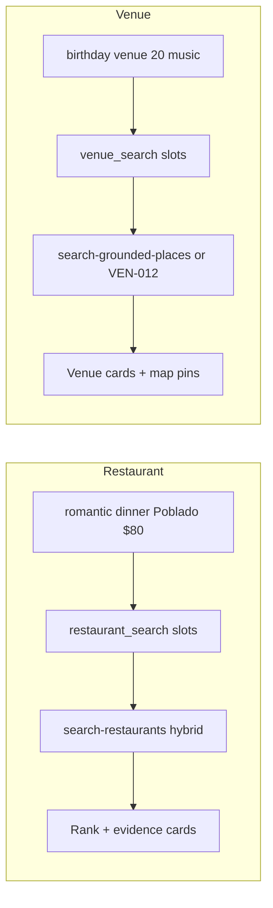

# INT-021 — Restaurant & venue intelligence wrapper

> ➕ **Additive (post-audit).** The 00-program-report scored "Restaurant/venue dedicated MVP task" at **80% — deferred to INT-018**, and [`MIGRATION.md`](./MIGRATION.md) parks the superseded root `INT-005-restaurant-venue-intelligence.md` as *"fold into INT-018 or future INT-021."* This is that future INT-021: the program ships event ([INT-007](./INT-007-event-intelligence-wrapper.md)) and café ([INT-008](./INT-008-cafe-intelligence-wrapper.md)) wrappers, but the shared architecture and INDEX examples promise **restaurant** and **venue** verticals with no wrapper. This closes that gap without bloating INT-018.

## Problem

`restaurant_search` and `venue_search` are named target intents in the [shared architecture](../00-shared-intelligence-architecture.md#design-rules) and appear in the INDEX example table (`romantic dinner in El Poblado under $80`, `birthday venue for 20 people with music`), but there is **no specialist wrapper** for either. Restaurant/venue queries fall back to the generic concierge prompt with no slot extraction and no focused clarify, so they get generic help text instead of cuisine/capacity-aware questions.

## User story

- As a **Tourist**, I want *"What cuisine are you in the mood for — and is this a date, a group, or solo?"* — not a generic re-ask.
- As **Roberto** scouting a space, I want *"For how many guests, and do you need a stage/sound or just seating?"* — capacity-first, not a list of every venue.

## Example prompt

| Vertical | Prompt | Expected slots |
|----------|--------|----------------|
| Restaurant | `romantic dinner in El Poblado under $80` | `restaurant_search`; location=El Poblado; budget=80; vibe=romantic; partySize=2 (inferred) |
| Restaurant | `vegan lunch near Laureles for 4` | `restaurant_search`; dietary=vegan; location=Laureles; partySize=4; meal=lunch |
| Venue | `birthday venue for 20 people with music` | `venue_search`; capacity=20; needs=[music]; vibe=celebration |

## Purpose & goals

- **Purpose:** Restaurant and venue verticals get specialist clarify + search routing (MIS hybrid search for restaurants).
- **Goal:** Tourist gets cuisine/occasion clarify; Roberto gets capacity-first venue questions.
- **Success:** `search-restaurants` for dining; Places/venue tool for events spaces; INT-005 fixtures green.

## Workflow



## Implementation steps

1. **INT-001 intents:** confirm `restaurant_search` + `venue_search` are in the shared intent enum + slot set; **add them if absent** (`cuisine`, `dietary`, `partySize`, `capacity`, `needs[]` already fit the shared `slots` shape). This wrapper depends on that contract.
2. **Restaurant specialist clarify** — a small prompt slice (in `conciergeAgent` instructions or a thin module): asks cuisine / dietary / party size / occasion, **never** a generic budget+dates re-ask. Route confirmed searches to the existing `search-restaurants` tool.
3. **Venue specialist clarify** — capacity-first (guest count), then date + needs (music/AV/catering). Route to `search-grounded-places` (Google Places, with `X-Goog-FieldMask`) for discovery, **or** the venues-MVP tool ([VEN-012](../../venues/tasks/mvp/mvp-index.md)) if it has shipped — pick whichever exists at build time; do not invent a new tool if one is available.
4. **Confidence routing** (shared bands, same as rentals/café): complete slots → search; partial → specialist clarify; empty → router. No instant canned bypass.
5. **CopilotKit cards + map pins** reuse the existing result-card + `<AdvancedMarker>` path (every marker under a `<Map mapId>` — MAP rule). No new card system.

## Files likely touched

- `mdeapp/src/mastra/agents/concierge.ts` (restaurant/venue clarify slices + intent handling)
- `mdeapp/src/mastra/tools/search-restaurants.ts` (existing — wire slots; verify field masks if Places-backed)
- `mdeapp/src/mastra/tools/search-grounded-places.ts` (venue discovery path) **or** the venues-MVP tool
- `mdeapp/src/mastra/agents/__tests__/` + parser/intent fixtures (restaurant + venue rows)

## Data requirements

- Restaurants: existing `search-restaurants` source (Supabase inventory and/or Places New — `X-Goog-FieldMask` required on any Places call).
- Venues: `search-grounded-places` (Places New) or venues-MVP inventory. No new table required for this wrapper; if a `venues` table is introduced by the venues program, RLS + ≥1 policy applies there (out of scope here).

## RLS / security

Places/Maps keys server-side only. No service-role in `src/**`. This task adds **no** new table; it reuses existing tools and inventory.

## Tests

- **Vitest:** intent + slot extraction for the three example prompts (restaurant cuisine/dietary/partySize; venue capacity/needs) — no live Gemini.
- **Tool routing:** restaurant query calls `search-restaurants`; venue query calls the chosen venue/Places tool with a neighborhood bias.
- Add the restaurant + venue rows to the INT-005 fixture table so regression covers them (mirrors how INT-007/008 register their fixtures).

## Acceptance criteria

- [ ] `restaurant_search` + `venue_search` extract correct slots in unit tests.
- [ ] Restaurant query routes to `search-restaurants`; venue query routes to a real venue/Places tool (not a stub).
- [ ] No giant prompt — specialist slices only (shared-extract + specialist-clarify pattern).
- [ ] Restaurant + venue rows added to the INT-005 regression fixture and green.
- [ ] Every venue/restaurant map marker sits under a `<Map mapId>`; Places calls carry `X-Goog-FieldMask`.
- [ ] `npm run test` + `npm run typecheck` green on touched files.

## Failure points

- INT-001 missing `restaurant_search`/`venue_search` → wrapper has no intent to attach to (do step 1 first).
- Venue tool does not exist yet → fall back to `search-grounded-places`; do not block this task on the full venues MVP.
- Generic clarify regression (asking budget/dates instead of cuisine/capacity) — assert against it in tests, same as the rental canned-clarify guard (INT-004).
- Missing `mapId` on venue markers (MAP rule) → broken pins.

## Dependencies

INT-001 (shared intent/slot schema), INT-005 (regression fixture to extend). Soft: venues-MVP ([VEN-012](../../venues/tasks/mvp/mvp-index.md)) for the venue tool; `search-grounded-places` is the fallback so this task is not hard-blocked.

## Verify

### Unit tests — slot extraction for restaurant + venue intents

```bash
cd mdeapp && npx vitest run \
  src/mastra/lib/__tests__/intelligence-restaurant-search.test.ts \
  src/mastra/tools/__tests__/search-restaurants-logic.test.ts \
  src/mastra/agents/__tests__/concierge.test.ts
# Expected:
#   "romantic dinner in El Poblado under $80" → intent=restaurant_search, vibe=romantic, budget=80
#   "vegan lunch near Laureles for 4" → dietary=vegan, partySize=4, neighborhood=Laureles
#   "birthday venue for 20 people with music" → intent=venue_search, capacity=20, needs=[music]
```

### Tool routing assertion

```bash
cd mdeapp && npx vitest run \
  src/mastra/tools/__tests__/search-restaurants-tool-fallback.test.ts \
  src/lib/__tests__/restaurant-search-fast-path.test.ts
# Expected: restaurant intent → search-restaurants called; venue intent → search-grounded-places called
```

### Full suite + types + build

```bash
cd mdeapp && npm run test && npx tsc --noEmit && npm run build
```

### API smoke (requires `npm run dev`)

```bash
# Restaurant search — expect Supabase source, real results
curl -s -X POST http://localhost:3001/api/restaurants/search \
  -H "Content-Type: application/json" \
  -d '{"neighborhood":"El Poblado","limit":3}' | jq '{source, count: (.results | length)}'

# Venue search via grounded places
curl -s "http://localhost:3001/api/grounded/search?q=event+venue+El+Poblado&limit=3" | jq '{count: (.places | length)}'
```

### No-generic-clarify guard

```bash
# "romantic dinner in El Poblado" must NOT trigger the canned rental clarify ask
cd mdeapp && grep -r "shouldInstantRentalClarify\|RENTAL_CLARIFY_MESSAGE" src/ | grep -v "\.test\." | grep -i "restaurant\|venue"
# Expected: empty — restaurant/venue paths must not touch rental clarify logic
```

### Map rules check

```bash
cd mdeapp && grep -r "AdvancedMarker" src/components/ | grep -v "mapId"
# Expected: empty — every AdvancedMarker has a mapId on its parent Map
```
