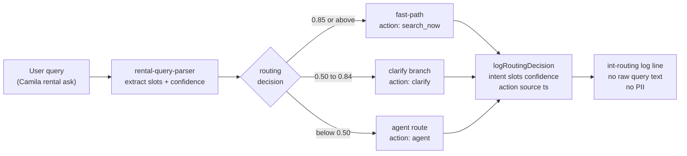

# INT-022 — Routing & confidence instrumentation

> ➕ **Additive (post-audit).** The confidence bands that [INT-002](./INT-002-rental-parser-monthly-date-city.md)/[INT-003](./INT-003-gemini-smart-clarify-routing.md)/[INT-004](./INT-004-no-canned-clarify-bypass.md) introduce (≥0.85 fast-path · 0.50–0.84 clarify · <0.50 agent) are tuned **by hand** against a single `0.6` gate today (`rental-query-parser.ts:165-166`). Nothing records what the parser actually scored, what action was chosen, and whether it was right — so the thresholds can't be tuned against real traffic. This is the telemetry that makes the bands data-driven. It is **not** a test suite (that's [INT-005](./INT-005-intelligence-regression-tests.md)) and **not** a prod uptime monitor (that's [UX-009](../../ux/UX-009-prod-synthetic-concierge-monitor.md)) — it is per-decision logging.

## Problem

When a user query is classified, the system picks one of three paths (fast-path search / clarify / agent) from a confidence score, but **discards the decision**. There is no record of `{ query, extracted slots, confidence, chosen action, outcome }`. So:

- We can't tell whether 0.85 is too high (good queries forced into clarify) or 0.50 too low (junk reaching the agent).
- We can't see misroutes (e.g. a complete query that fell to clarify) without manual QA.
- Tuning the bands in INT-003/INT-004 is guesswork instead of evidence.

## User story

As **Sofía**, when I adjust a confidence threshold I want a log of real decisions — score, slots, action, outcome — so I can see how many queries each band caught and whether the change helped or hurt, instead of guessing.

## Example prompt

`list rentals in june 1 to 30 $1000 medellin` → one structured telemetry record:

```json
{ "intent": "rental_search", "slots": { "budget": 1000, "budgetType": "monthly", "dateRange": "jun 1-30", "cityWide": true },
  "confidence": 0.85, "action": "search_now", "source": "fast-path", "resultCount": 7, "ts": "..." }
```

## Workflow



## Implementation steps

1. **Thin logger** — `src/lib/intelligence-telemetry.ts` (new): one function `logRoutingDecision(record)` that emits a single structured line (`console.info` with a stable `[int-routing]` tag, or `LOG_LEVEL`-gated). No DB writes in v1.

```ts
// TS type for the telemetry record
export type RoutingDecision = {
  intent: 'rental_search' | 'event_discovery' | 'restaurant_search'
        | 'cafe_search' | 'venue_search' | 'unknown';
  slots: Record<string, string | number | boolean>;  // derived — NOT raw query text
  confidence: number;
  action: 'search_now' | 'clarify' | 'agent' | 'canned_fallback';
  source: 'fast-path' | 'clarify-branch' | 'agent-route';
  resultCount?: number;
  turnId?: string;  // CopilotKit messageId — deduplicate double-logs
  ts: string;
};
```
2. **Call sites** — emit one record at each decision point: the rental fast-path hook (`use-rental-search-fast-path.ts`), the clarify branch, and (post-UX-001) the agent route. Record `intent`, `slots`, `confidence`, `action` (`search_now`/`clarify`/`agent`), `source`, and `resultCount` when known.
3. **No PII** — log the **derived slots and score**, not raw free-text the user typed (or hash/truncate it). This keeps the log safe to ship and analyze.
4. **Optional (defer):** a follow-up could persist to `ai_runs` via the server-only `src/mastra/lib/**` carve-out — **out of scope for v1**; structured logs are the MVP.
5. **Analysis note** — document in evidence how to grep the logs into a quick band-distribution table (how many queries per band, % that searched vs clarified).

## Files likely touched

- `mdeapp/src/lib/intelligence-telemetry.ts` (**new**)
- `mdeapp/src/hooks/use-rental-search-fast-path.ts`
- `mdeapp/src/components/chat/concierge-chat-input.tsx` (clarify branch)
- `mdeapp/src/lib/__tests__/intelligence-telemetry.test.ts` (**new**)

## Data requirements

None (v1 is log-only). No new table → no migration, no RLS change.

## RLS / security

N/A for v1 (no DB write). No service-role. Must **not** log raw user PII — derived slots + score only.

## Tests

- **Vitest:** `logRoutingDecision` produces the expected shape; redaction holds (no raw query text in the record); a high-confidence input is tagged `search_now`, a partial one `clarify`.
- Assert the logger is a no-op (or debug-only) when `LOG_LEVEL` is not verbose, so prod isn't spammed.

## Acceptance criteria

- [ ] Each routing decision emits exactly one structured record with `confidence` + `action` + `slots`.
- [ ] No raw user free-text in the record (derived slots/score only).
- [ ] Log-only; no new table, no service-role, no migration.
- [ ] Evidence shows a band-distribution table built from real local logs (e.g. 10 sample queries across the three bands).
- [ ] `npm run test` + `npm run typecheck` green.

## Failure points

- Over-logging in prod (cost/noise) → gate behind `LOG_LEVEL` / sampling.
- Logging raw queries → privacy regression; assert against it in tests.
- Double-counting (fast-path + agent both log for one query) → emit once per decision, keyed by turn.

## Dependencies

INT-002 (the confidence score must exist to log). Soft-related: INT-005 (regression) and UX-009 (prod monitor) — three different observability layers; do not merge them.

## Verify

### Unit tests — telemetry shape + PII redaction

```bash
cd mdeapp && npx vitest run src/lib/__tests__/intelligence-telemetry.test.ts
# Expected: all assertions green — structured record emitted, no raw query text in output
```

### Full suite + types

```bash
cd mdeapp && npm run test && npx tsc --noEmit
```

### Live log proof (requires `npm run dev`)

```bash
# Start dev server with debug logging, then send a rental query and grep for the [int-routing] tag
LOG_LEVEL=debug cd mdeapp && npm run dev &
sleep 5
curl -s -X POST http://localhost:3001/api/rentals/search \
  -H "Content-Type: application/json" \
  -d '{"queryText":"1BR in Laureles under $80","limit":3}'
# Then grep server stdout for structured telemetry line:
# grep '\[int-routing\]' — expect: {"intent":"rental_search","confidence":0.85,"action":"search_now",...}
```

### Band-distribution check (10 sample queries across three bands)

```bash
# Manually send 10 queries spanning <0.50, 0.50-0.84, >=0.85 and grep logs:
# grep '\[int-routing\]' server.log | jq -r '.action' | sort | uniq -c
# Expected: counts for search_now / clarify / agent — no count of 0 if all bands were exercised
```
