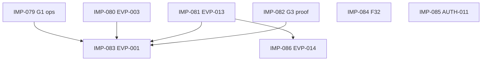

# CORE + MVP — Linear organization plan

**Initiative:** Phase 1 MVP Exit  
**Workspace:** [Sanjiovani](https://linear.app/sanjiovani) · Project [MDEAPP](https://linear.app/sanjiovani/project/mdeapp-099cd7795071)  
**Disk source:** [`core-mvp-order.json`](core-mvp-order.json) · [`../plan.md`](../../plan.md)

---

## Linear best practices applied

| Concept | How we use it | Reference |
|---------|---------------|-----------|
| **Initiative** | Single initiative *Phase 1 MVP Exit* — groups 4 outcome projects | [Initiatives](https://linear.app/docs/initiatives) |
| **Projects** | Outcome-based (not folder names): Andrés Commerce, Roberto Host, Camila Discovery, Sofía Platform | [Projects](https://linear.app/docs/projects) |
| **Milestones** | P0 (exit) → P1 (polish) → P2 (quality parallel) | [Milestones](https://linear.app/docs/project-milestones) |
| **Issues** | 1:1 with `tasks/**` spec; title `[IMP-NNN] TASK-ID — title` | [Creating issues](https://linear.app/docs/creating-issues) |
| **Sub-issues** | Proof slices under EVP-001, AUTH-011, G3 | [Sub-issues](https://linear.app/docs/parent-and-sub-issues) |
| **Labels** | `phase:core\|mvp` · `project:*` · `track:events\|maps\|core\|data` · `type:feature\|chore` | [Labels](https://linear.app/docs/labels) |
| **Dependencies** | `blocked_by` / `blocks` in frontmatter → Linear blocked-by | [Conceptual model](https://linear.app/docs/conceptual-model) |
| **Views** | P0 only · Manual Todo sort · Blocked filter | [Custom views](https://linear.app/docs/custom-views) |
| **Manual order** | Todo column sort = IMP ascending; never sort by updated date | [02-views-sort.md](02-views-sort.md) |

---

## Projects under Phase 1 MVP Exit

| Project | Persona (user story) | Operator | Exit |
|---------|---------------------|----------|------|
| **Andrés Commerce** | Ticket buyer | sanjiovani | G1 paid + EVP proof |
| **Roberto Host** | Event host | sanjiovani | G3 publish + `/host/events` |
| **Camila Discovery** | Chat + cards + map | sanjiovani | G2 ✅ + optional map panel |
| **Sofía Platform** | Dev/ops/CI | **sanjiovani** | F32 smoke + AUTH-011 |

---

## Milestone mapping

| Milestone | Linear name | Tasks |
|-----------|-------------|-------|
| **P0** | 🚨 Launch Critical | IMP-079 … 092 + UX 093–101 |
| **P1** | P1 — MVP polish | IMP-086 … 089 |
| **P2** | P2 — Platform quality | IMP-090 (AUTH-005) |

**ADV / Phase 2 / Deferred** — keep existing Linear milestones 4–9; **exclude from Todo sort** until P0 Done.

---

## Import gaps (next sync)

| Task ID | Action |
|---------|--------|
| G3-core-host-publish-proof | Create issue in Roberto Host · P0 |
| AUTH-011 | Create issue in Sofía Platform · P0 |
| AUTH-005 | Create issue in Sofía Platform · P2 |

After import, update spec `linear: SAN-*` and re-run `linear-build-implementation-order.mjs`.

---

## Recommended Linear views

### 1. Now — P0 MVP
```
project:MDEAPP milestone:"🚨 Launch Critical"
```
Sort: **Manual** (IMP order)

### 2. P1 polish
```
project:MDEAPP (milestone:"P1 — Events polish" OR milestone:"P1 — Screens & café" OR milestone:"P1 — Maps & core")
```

### 3. Blocked
```
project:MDEAPP has:blocked-by state:Todo,In Progress
```

### 4. By project (group)
Board grouped by **Project** — Andrés / Roberto / Camila / Sofía

---

## Dependency graph (P0)



F32 and AUTH-011 can run parallel to EVP-001 once unblocked items complete.

---

## Sync checklist

- [ ] Run build + import + organize + sort scripts (see [`plan.md`](../../plan.md))
- [ ] Create 4 Linear projects under initiative
- [ ] Move P0 issues to correct project
- [ ] Add blocked-by relations for EVP-001
- [ ] Create sub-issues on EVP-001 and AUTH-011
- [ ] Set Todo Manual sort; verify IMP-079 at top
- [ ] Close SAN-114 (SCREEN-021 Done) if still In Progress
- [ ] Do **not** import ADV into P0 views

*Updated: 2026-05-27*
