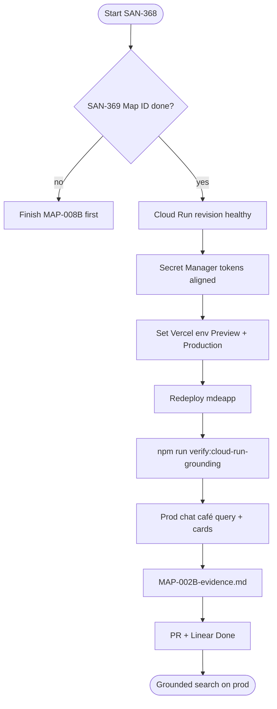
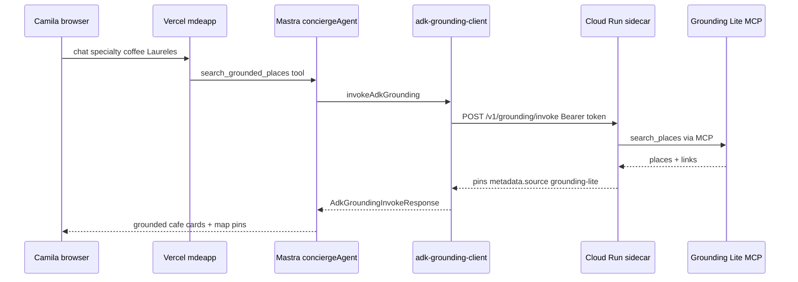

# MAP-002B — Production ADK deploy

> **Summary:** Wire the Cloud Run grounding sidecar to Vercel so *"specialty coffee Laureles"* returns real café cards on [mdeai.co](https://www.mdeai.co). Linear [SAN-368](https://linear.app/sanjiovani/issue/SAN-368).

**Persona:** Tourist / Camila · **Surface:** `/chat` concierge · **Queue:** `tasks.md` row 7

**Skills:** `mde-maps` · `mde-vercel` · `google-agents-cli-adk-code` · `testing`

**Official docs (MCP-verified):**

| Topic | Link |
|-------|------|
| Maps Grounding Lite (Experimental) | [developers.google.com/maps/ai/grounding-lite](https://developers.google.com/maps/ai/grounding-lite?utm_source=gmp-code-assist) |
| MCP `search_places` | [Grounding Lite MCP reference](https://developers.google.com/maps/ai/grounding-lite/reference/mcp/search_places?utm_source=gmp-code-assist) |
| API key restrictions | [Restrict API keys](https://developers.google.com/maps/api-security-best-practices?utm_source=gmp-code-assist#restricting-api-keys) |
| mdeAI grounding modes | `.agents/skills/mde-maps/references/maps-grounding.md` |

Sidecar calls **Grounding Lite MCP** at `https://mapstools.googleapis.com/mcp` with `X-Goog-Api-Key` (server key, IP-restricted — not browser referrer key).

---

## At a glance

**Problem:** `adk-grounding-client.ts` defaults `ADK_GROUNDING_URL` to `http://localhost:8000`. Vercel **cannot** reach localhost → prod chat returns `metadata.reason: adk_unavailable` and no grounded café cards.

**Fix:** Healthy Cloud Run revision + Vercel env (`ADK_GROUNDING_URL`, `ADK_INTERNAL_TOKEN`) + remote smoke + prod UI proof.

**Duplicate:** [SAN-463](https://linear.app/sanjiovani/issue/SAN-463) — use **SAN-368** only.

---

## Execution flow



---

## Runtime path (prod chat)



---

## Verification gates

```mermaid
stateDiagram-v2
    accTitle: MAP-002B proof layers
    [*] --> Disk
    Disk --> SidecarHealth
    SidecarHealth --> VercelEnv
    VercelEnv --> RemoteScripts
    RemoteScripts --> ProdUI
    ProdUI --> Done
    SidecarHealth --> FailCR
    RemoteScripts --> FailScript
    ProdUI --> FailUI
    FailCR --> CR
    FailScript --> VERCEL
    FailUI --> REDEPLOY
    state CR as Cloud Run deploy
    state VERCEL as Vercel env set
```

---

## Steps (operator)

| Step | Action | Links |
|------|--------|-------|
| 0 | **SAN-369** Map ID on prod merged / verified | [SAN-369](https://linear.app/sanjiovani/issue/SAN-369) |
| 1 | Confirm Cloud Run service healthy | Default URL in `verify-cloud-run-grounding.mjs` or your revision |
| 2 | GCP Secret Manager: `ADK_INTERNAL_TOKEN`, `GOOGLE_MAPS_SERVER_API_KEY`, Supabase keys for sidecar | GCP Console |
| 3 | [Vercel env](https://vercel.com/amo100/mdeapp/settings/environment-variables): `ADK_GROUNDING_URL` + `ADK_INTERNAL_TOKEN` on **Production + Preview** | **Never** `NEXT_PUBLIC_*` for token |
| 4 | Redeploy mdeapp after env change | [Deployments](https://vercel.com/amo100/mdeapp/deployments) |
| 5 | Run remote verification scripts (below) | `mdeapp/` |
| 6 | Prod UI: café query on [mdeai.co/chat](https://www.mdeai.co/chat) | Screenshot |
| 7 | PR `ai/san-368-map-002b-adk-grounding-on-production` + evidence | GitHub |
| 8 | Linear SAN-368 → Done | After prod proof |

### Vercel env (preview + production)

```text
ADK_GROUNDING_URL=https://mdeai-adk-grounding-<hash>.run.app
ADK_INTERNAL_TOKEN=<same as Secret Manager / sidecar>
```

### Cloud Run prerequisites (sidecar only — not in `mdeapp/src`)

| Secret | Used by |
|--------|---------|
| `GOOGLE_MAPS_SERVER_API_KEY` | Grounding Lite MCP (`X-Goog-Api-Key`) |
| `GOOGLE_GENERATIVE_AI_API_KEY` | Optional fallback paths |
| `ADK_INTERNAL_TOKEN` | Bearer auth on `/v1/grounding/invoke` |
| `SUPABASE_URL` | `place_details_cache` enrich |
| `SUPABASE_SERVICE_ROLE_KEY` | Cache writes (sidecar only) |

---

## Success criteria

| # | Criterion | Pass signal |
|---|-----------|-------------|
| S1 | Cloud Run `/health` returns 200 | `verify:cloud-run-grounding` step 1 |
| S2 | Invoke returns ≥1 pin, `metadata.source=grounding-lite` | `verify:grounding` exit 0 |
| S3 | Mask v3 enriched fields on pins | `verify:cloud-run-grounding` mask check |
| S4 | Sidecar rejects missing token with 401 | Manual curl without `Authorization` |
| S5 | Vercel env set Preview + Production | Redacted evidence doc |
| S6 | Prod chat café query shows grounded cards | ≥1 `[data-testid="grounded-card"][data-result-kind="cafe"]` |
| S7 | Attribution compliant | Google Maps sources visible per [Grounding Lite attribution](https://developers.google.com/maps/ai/grounding-lite/attribution?utm_source=gmp-code-assist) |
| S8 | Floor green before merge | `npm run floor` exit 0 |

---

## Production-ready checklist (PR body)

- [ ] **Depends:** [SAN-369](https://linear.app/sanjiovani/issue/SAN-369) Map ID verified on prod
- [ ] Cloud Run revision deployed; `/health` 200
- [ ] `ADK_GROUNDING_URL` + `ADK_INTERNAL_TOKEN` on Vercel Production + Preview
- [ ] `ADK_INTERNAL_TOKEN` **not** in any `NEXT_PUBLIC_*` var
- [ ] Server Maps key enabled for [Maps Grounding Lite API](https://console.cloud.google.com/apis/library/mapstools.googleapis.com) (IP restriction on Cloud Run egress)
- [ ] Billing enabled on GCP project (required even while Experimental — per Google docs)
- [ ] Redeploy after env change
- [ ] `npm run verify:cloud-run-grounding` exit 0 against **remote** URL
- [ ] `npm run verify:grounding` exit 0 against **remote** URL
- [ ] Prod [mdeai.co/chat](https://www.mdeai.co/chat): *"specialty coffee Laureles"* → grounded café cards
- [ ] `npm run floor` green
- [ ] `tasks/notes/MAP-002B-evidence.md` with revision id + redacted URLs
- [ ] Linear SAN-368 → Done with proof link

---

## Tests to run (verify / validate)

Run from `mdeapp/`. **Use remote Cloud Run URL** — localhost default proves nothing for prod.

### Layer 1 — Disk

```bash
test -f src/mastra/lib/adk-grounding-client.ts
test -f scripts/verify-grounding-invoke.mjs
test -f scripts/verify-cloud-run-grounding.mjs
grep -q 'MAP-002B' scripts/verify-task.mjs
```

### Layer 2 — Sidecar remote (required)

```bash
export ADK_GROUNDING_URL=https://mdeai-adk-grounding-4huwyjbclq-ue.a.run.app  # or your revision
export ADK_INTERNAL_TOKEN=...   # from env — never commit

npm run verify:grounding
npm run verify:cloud-run-grounding
```

| Command | Expected | Validates |
|---------|----------|-----------|
| `verify:grounding` | exit 0, `source: grounding-lite`, ≥1 pin | MAP-002 invoke contract |
| `verify:cloud-run-grounding` | exit 0, mask v3, ≥1 pin | Cloud Run + enrichment |
| `curl -s -o /dev/null -w "%{http_code}" $ADK_GROUNDING_URL/health` | 200 | Sidecar up |
| `curl -X POST .../invoke` without Bearer | 401 | Token gate |

Optional:

```bash
npm run verify:grounding-enrichment
npm run smoke:grounding-attribution   # localhost UI + ADK — dev only
```

### Layer 3 — Task registry + floor

```bash
npm run verify:task -- MAP-002B --skip-floor
npm run verify:task -- MAP-002B
npm run floor
```

Registry runs: `verify:cloud-run-grounding`, `verify:grounding`, vitest `adk-grounding-client.test.ts`, e2e `maps-grounding.spec.ts` (localhost).

### Layer 4 — Production UI (required for Done)

```bash
curl -s -o /dev/null -w "prod GET /chat -> %{http_code}\n" https://www.mdeai.co/chat
```

**Browser / Playwright on prod:**

1. Open [https://www.mdeai.co/chat](https://www.mdeai.co/chat)
2. Send: *"specialty coffee Laureles"* or *"quiet cafés Laureles"*
3. Assert ≥1 `[data-testid="grounded-card"][data-result-kind="cafe"]`
4. Assert map pin sync if lat/lng present (after SAN-369)
5. Console: no browser-side `places.googleapis.com` calls from client (server-only Places)

Local e2e (pre-prod):

```bash
npm run dev   # fresh restart
npm run test:e2e:grounding
# or: npx playwright test e2e/maps-grounding.spec.ts
```

---

## Already shipped (do not rebuild)

| Item | Location |
|------|----------|
| ADK HTTP client | `src/mastra/lib/adk-grounding-client.ts` |
| `search_grounded_places` tool | `src/mastra/tools/search-grounded-places.ts` |
| Vitest | `src/mastra/lib/adk-grounding-client.test.ts` |
| Remote smoke scripts | `scripts/verify-grounding-invoke.mjs`, `verify-cloud-run-grounding.mjs` |
| E2E MAP-007 UI | `e2e/maps-grounding.spec.ts` |

---

## Out of scope

- MAP-002A full ADK LlmAgent package
- Moving MCP into Mastra TS directly (sidecar owns MCP)
- `compute_routes` (MAP-011A)
- PR-15 Phase 2 ADK audit ([SAN-444](https://linear.app/sanjiovani/issue/SAN-444))

---

## Links

| Resource | URL |
|----------|-----|
| Linear | [SAN-368](https://linear.app/sanjiovani/issue/SAN-368) |
| Vercel env | [amo100/mdeapp settings](https://vercel.com/amo100/mdeapp/settings/environment-variables) |
| GCP Grounding Lite API | [Enable mapstools.googleapis.com](https://console.cloud.google.com/apis/library/mapstools.googleapis.com) |
| Prod chat | [mdeai.co/chat](https://www.mdeai.co/chat) |
| Blocked by | [SAN-369](https://linear.app/sanjiovani/issue/SAN-369) Map ID |
