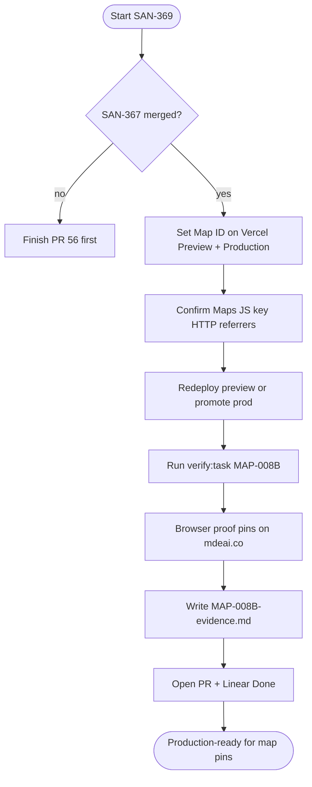
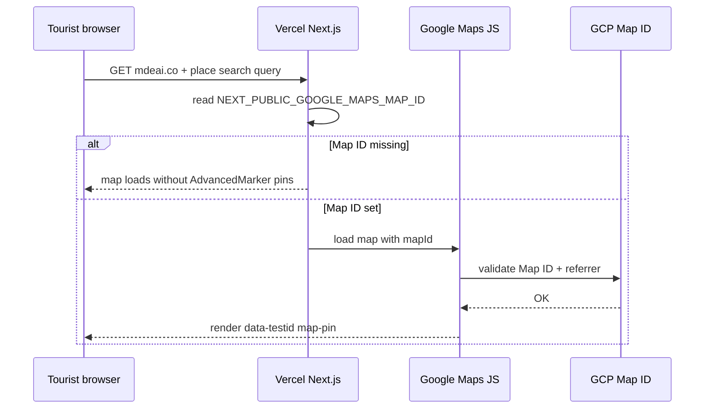

# MAP-008B — Vercel Map ID verify

> **Summary:** Set real Map ID on Vercel so tourists see pins on mdeai.co — mostly env + proof, code already shipped. Linear [SAN-369](https://linear.app/sanjiovani/issue/SAN-369).

**Persona:** Tourist · **Surface:** `/` + `/chat` map · **Queue:** `tasks.md` row 6

---

## At a glance

**Problem:** MAP-008 code gates `<AdvancedMarker>` on `mapId`. Missing `NEXT_PUBLIC_GOOGLE_MAPS_MAP_ID` on Vercel → **no pins** on preview/prod (not a code gap).

**Fix:** Vercel env + GCP referrer audit + redeploy proof.

---

## Execution flow



---

## Runtime path (prod)



---

## Verification gates

```mermaid
stateDiagram-v2
    accTitle: MAP-008B verification gates
    accDescr: Three proof layers before Linear Done.
    [*] --> Disk: spec + code on main
    Disk --> Automated: verify task + vitest
    Automated --> Runtime: dev restart + prod pins
    Runtime --> Done: evidence + PR merged
    Automated --> FailAuto: fix env or script
    Runtime --> FailRuntime: fix Vercel or GCP referrer
    FailAuto --> Automated
    FailRuntime --> ENV
    state ENV as Vercel env set
```

---

## Steps (operator)

| Step | Action | Owner |
|------|--------|-------|
| 0 | Merge [SAN-367](https://linear.app/sanjiovani/issue/SAN-367) / PR #56 | Operator |
| 1 | [Vercel env](https://vercel.com/amo100/mdeapp/settings/environment-variables): set `NEXT_PUBLIC_GOOGLE_MAPS_MAP_ID` on **Production + Preview** | Admin |
| 2 | [GCP Credentials](https://console.cloud.google.com/apis/credentials): Maps JS key HTTP referrers include `mdeai.co`, `*.vercel.app`, localhost | Admin |
| 3 | Redeploy; confirm no `DEMO_MAP_ID` in runtime | CI / Vercel |
| 4 | Run tests below (automated + visual) | Agent |
| 5 | Commit `tasks/notes/MAP-008B-evidence.md`; open PR `ai/san-369-map-008b-map-id-on-production` | Agent |
| 6 | Linear SAN-369 → Done after prod proof | Operator |

---

## Success criteria

| # | Criterion | Pass signal |
|---|-----------|-------------|
| S1 | Real Map ID on Vercel Preview + Production | Env UI shows non-empty ID ≠ `DEMO_MAP_ID` |
| S2 | Maps JS key referrer-locked | No `RefererNotAllowedMapError` in browser console |
| S3 | Pins render after search | ≥1 `[data-testid="map-pin"]` visible on map |
| S4 | Automated verify green | `npm run verify:task -- MAP-008B` exit 0 |
| S5 | Floor green | `npm run floor` exit 0 before merge |
| S6 | Evidence on disk | `tasks/notes/MAP-008B-evidence.md` with redacted env + screenshot |
| S7 | No secret leakage | No Places/server keys in `NEXT_PUBLIC_*` |

---

## Production-ready checklist

Copy into PR body before merge:

- [ ] **Depends:** SAN-367 / AUTH-011 merged and prod login smoke OK
- [ ] **Vercel:** `NEXT_PUBLIC_GOOGLE_MAPS_MAP_ID` set on Production + Preview
- [ ] **Vercel:** `NEXT_PUBLIC_GOOGLE_MAPS_API_KEY` present (browser key only)
- [ ] **GCP:** HTTP referrers include `https://www.mdeai.co/*`, `https://*.vercel.app/*`, localhost ports
- [ ] **Deploy:** Latest production/preview deployment after env change
- [ ] **Console:** No Map ID required error; no referrer errors on `/` or `/chat`
- [ ] **UI:** Tourist query → map pins visible (screenshot attached)
- [ ] **Tests:** `verify:task MAP-008B` + `floor` exit 0
- [ ] **Evidence:** `MAP-008B-evidence.md` committed
- [ ] **Linear:** SAN-369 comment with proof URL → Done
- [ ] **Out of scope respected:** No ADK (SAN-368), no Places backfill (DATA-008)

---

## Tests to run (verify / validate)

Run from `mdeapp/` after env changes. **Fresh dev** before localhost UI claims (`pkill` stale `[ui]`/`[agent]`, then `npm run dev`).

### Layer 1 — Disk (no server)

```bash
test -f src/lib/google-maps-map-id.ts
test -f src/lib/__tests__/google-maps-map-id.test.ts
test -f scripts/verify-maps-env.mjs
grep -q 'MAP-008B' scripts/verify-task.mjs
```

### Layer 2 — Automated

| Command | Expected | Maps what |
|---------|----------|-----------|
| `npm test -- --run src/lib/__tests__/google-maps-map-id.test.ts` | exit 0 | Prod never uses DEMO_MAP_ID |
| `npm run verify:task -- MAP-008B --skip-floor` | exit 0* | Registry probes |
| `VERIFY_MAPS_PRODUCTION=1 node --env-file=.env.local scripts/verify-maps-env.mjs` | exit 0 | Map ID present in prod-like mode |
| `npm run verify:task -- MAP-008B` | exit 0 | Full task gate incl. floor |

\*Places API 403 in `verify-maps-env` is **DATA-008** — not a Map ID blocker if Map ID + vitest pass.

### Layer 3 — Runtime localhost

```bash
pkill -f "next dev" 2>/dev/null; pkill -f "mastra dev" 2>/dev/null; sleep 2
npm run dev
# new terminal:
curl -s -o /dev/null -w "GET / -> %{http_code}\n" http://localhost:3001/
npx playwright test e2e/maps-layout-desktop.spec.ts --grep "map" 2>/dev/null || true
```

### Layer 4 — Production (required for Done)

```bash
curl -s -o /dev/null -w "prod GET / -> %{http_code}\n" https://www.mdeai.co/
# Browser or Playwright on prod:
# 1. Open https://www.mdeai.co/
# 2. Run place search (restaurants Provenza or café Laureles)
# 3. Assert [data-testid="map-pin"] count >= 1
# 4. Console: no RefererNotAllowedMapError
```

Optional prod smoke (if script exists on branch):

```bash
PROD_SMOKE_BASE_URL=https://www.mdeai.co npm run verify:task -- MAP-008B --skip-floor
```

---

## Links

| Resource | URL |
|----------|-----|
| Linear | [SAN-369](https://linear.app/sanjiovani/issue/SAN-369) |
| Vercel env | [amo100/mdeapp settings](https://vercel.com/amo100/mdeapp/settings/environment-variables) |
| GCP Map IDs | [Maps Studio](https://console.cloud.google.com/google/maps-apis/studio/maps) |
| Prod | [mdeai.co](https://www.mdeai.co) |

---

## Out of scope

- MAP-034 marker UX polish
- Creating new Map ID in Console (verify existing only)
- Places backfill / hours (DATA-008)
- ADK grounding ([SAN-368](https://linear.app/sanjiovani/issue/SAN-368))
