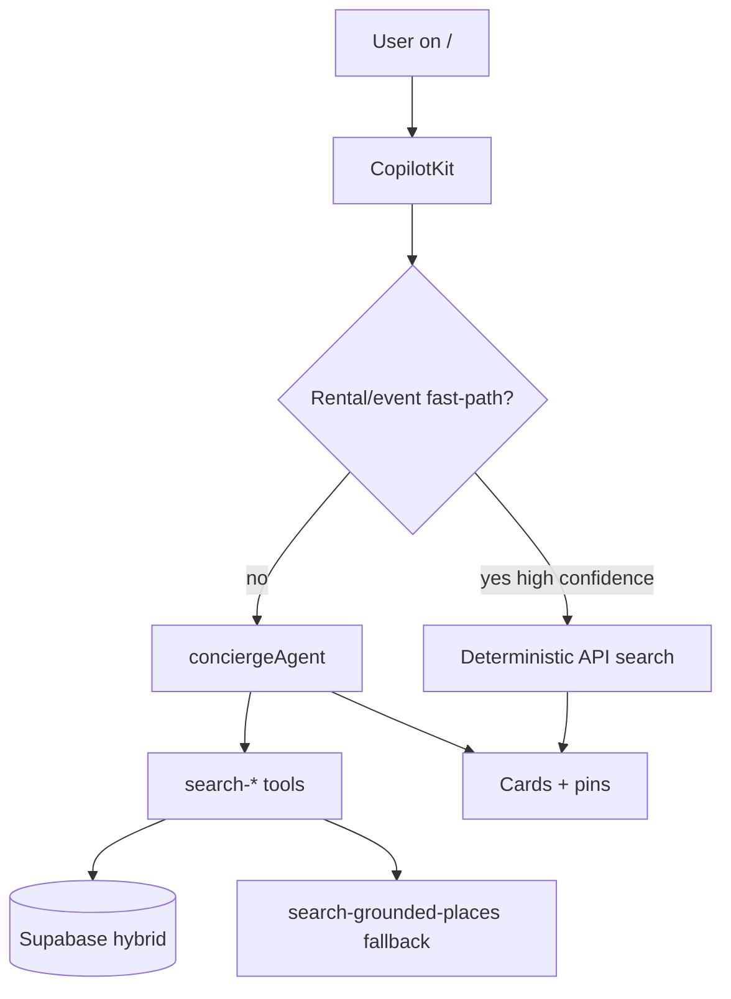

# MASTRA-MIS-001 — Canonical production routing

## Decision (frozen)

| Surface | Agent / path | Notes |
|---------|--------------|-------|
| **`/` `/chat`** | `conciergeAgent` via CopilotKit Pattern 1 | **Only prod chat path** |
| Rental fast-path | `/api/rentals/search` + `use-rental-search-fast-path` | Before agent when confidence ≥0.85 |
| Event fast-path | `use-event-search-fast-path` | Category/date chips |
| **`routerAgent`** | Mastra Studio / tests only | **Not** mounted on `/` |
| **`conciergeRoutingWorkflow`** | Dev / smoke tests | Does not pass `queryText` — do not wire to CK |
| **`rentalSearchWorkflow`** | Invoked by routerAgent only | Rerank labels for workflow demos |
| **`hostEventAgent`** | `/host/event/new` only | HITL wizard |

## Architecture diagram



## Anti-patterns (do not do)

- Mount `routerAgent` on `CopilotKit` layout
- Use workflow as primary chat orchestrator
- Route curated restaurants through `search-grounded-places`
- Add supervisor / A2A / ACP for vertical routing

## Files reference (not modified by this doc task)

- `mdeapp/src/app/layout.tsx` — `conciergeAgent`
- `mdeapp/src/mastra/agents/concierge.ts`
- `mdeapp/src/mastra/agents/router.ts` — dev only
- `mdeapp/src/mastra/workflows/*` — batch/dev

## Done gate

- [x] This doc exists
- [ ] `CLAUDE.md` or `mdeapp/docs/ARCHITECTURE.md` links here (optional one line)
- [ ] New agents default to tools-on-concierge, not new routers

## Verify

Grep prod mount:

```bash
rg 'getCopilotKitClientProps|useCoAgent' mdeapp/src/app mdeapp/src/components --glob '*.tsx' | rg -v conciergeAgent | rg -v hostEventAgent || true
```

Expected: no primary chat agent other than `conciergeAgent`.
