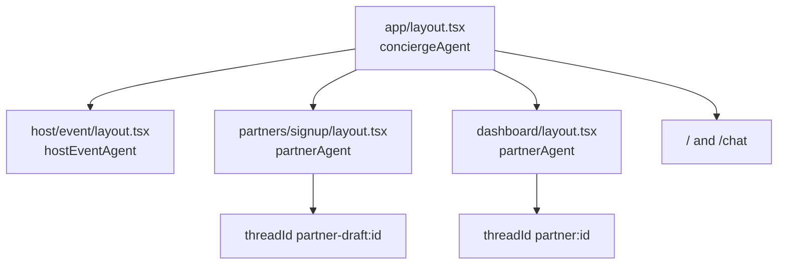
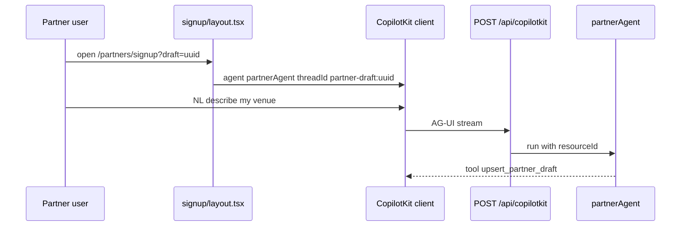

# AGT-PTR-00 — CopilotKit route architecture

## Purpose

Define how `/partners/signup` and `/dashboard` mount `partnerAgent` without breaking the root `conciergeAgent` provider on `/` and `/chat`. Blocks PTR-03 and PTR-04 until decided.

**Persona:** Roberto on signup — copilot must talk to `partnerAgent`, not `conciergeAgent`.

## Decision (frozen for Phase 1)

**Mirror the host wizard pattern** — route-level Agent Lock layout, same as `/host/event/new`:

| Surface | Provider | Reference |
|---|---|---|
| `/` `/chat` | `MdeCopilotKitProvider` → `conciergeAgent` + `ThreadNavProvider` | `app/layout.tsx` |
| `/host/event/*` | Nested `<CopilotKit agent="hostEventAgent">` | `host/event/layout.tsx` |
| `/partners/signup` | Nested `<CopilotKit agent="partnerAgent" threadId={draftThreadId}>` | **new** `partners/signup/layout.tsx` |
| `/dashboard` | Nested `<CopilotKit agent="partnerAgent" threadId={partnerThreadId}>` | **new** `dashboard/layout.tsx` |

CopilotKit docs discourage nested providers; host path is **proven on disk** — partner routes follow it until a route-group opt-out refactor ships.

## Thread and resource conventions

| Context | `threadId` (CK client) | `resourceId` (Mastra server) |
|---|---|---|
| Onboarding draft | `partner-draft:{draftId}` | same |
| Activated partner | `partner:{partnerId}` | `auth.users.id` or `partner:{partnerId}` per SAN-597 |

Do **not** reuse `ThreadNavProvider` concierge thread ids on partner layouts.

## Acceptance criteria

- [ ] `partners/signup/layout.tsx` calls `getCopilotKitClientProps("partnerAgent")` + stable `threadId` from `?draft=` or new uuid
- [ ] `dashboard/layout.tsx` same pattern with `partner:{partnerId}` thread
- [ ] Vitest or Playwright: POST `/api/copilotkit` on signup page sends `agent=partnerAgent` (not concierge)
- [ ] Document in `mdeapp/docs/ARCHITECTURE.md` one paragraph under multi-agent surfaces
- [ ] No second `MdeCopilotKitProvider` — only route layouts

## Architecture



## Sequence — signup turn



## Verify

```bash
cd mdeapp && npm run dev
# Manual: Network tab on signup — copilot POST body references partnerAgent
rg 'getCopilotKitClientProps\("partnerAgent"\)' mdeapp/src/app/partners mdeapp/src/app/dashboard
```

## Rollback

Remove partner layouts; routes render without copilot (form-only fallback).
