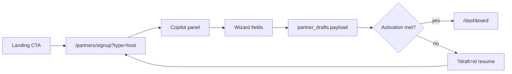
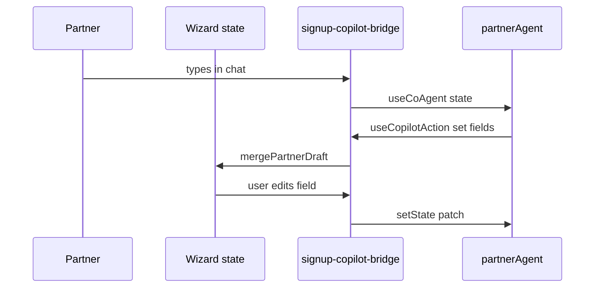

# AGT-PTR-03 — Onboarding copilot

## Purpose

CopilotKit on `/partners/signup` where `partnerAgent` reads/writes `partner_drafts.payload` via PTR-02 tools. Form + agent stay in sync (INT-009 / SAN-412).

**Persona:** Venue owner describes business in plain English; wizard fields fill; draft resumes on return.

**Agent name:** `partnerAgent` only — not `partnerOnboardingAgent` (align SAN-665 prose).

## User journey



## Acceptance criteria

- [ ] `partners/signup/layout.tsx` per AGT-PTR-00 — `getCopilotKitClientProps("partnerAgent")`
- [ ] `threadId={`partner-draft:${draftId}`}` on layout; server `resourceId` matches
- [ ] `useCoAgent({ name: "partnerAgent" })` with React state + `setState` (host bridge pattern)
- [ ] `useCopilotAction` handlers mirror wizard fields (SAN-665 step matrix)
- [ ] Autosave: debounced PATCH via `upsert_partner_draft`; resume `?draft={id}`
- [ ] First slice: `?type=host` only; other types "coming soon"
- [ ] Activation checklist gates submit (SAN-683 fields)
- [ ] Playwright: NL prompt → ≥1 field populated
- [ ] localhost `/partners/signup?type=host` → 200; copilot POST 200

## State sync (INT-009)



## Reuse

- `host-event-copilot-bridge.tsx` — external state + `useCopilotAction`
- [SAN-412](https://linear.app/sanjiovani/issue/SAN-412) INT-009 state mirror
- `05-signup-wizard.md` step matrix

## hostEventAgent migration

`/host/event/new` stays on `hostEventAgent` until SAN-675 e2e passes on unified signup. Do not remove host wizard in this task.

## Files (expected touch)

- `mdeapp/src/app/partners/signup/layout.tsx`
- `mdeapp/src/app/partners/signup/page.tsx`
- `mdeapp/src/components/partners/partner-signup-copilot-bridge.tsx`
- `mdeapp/src/components/partners/signup-wizard.tsx` (coordinate SAN-665)

## Verify

```bash
cd mdeapp && npm run dev
npx playwright test e2e/partners-signup-copilot.spec.ts
npm run floor
```

## Rollback

Remove layout copilot; wizard remains manual form entry.

## Coordination

**SAN-665** owns 10-step UX; **this task** owns agent wiring + draft persistence.
