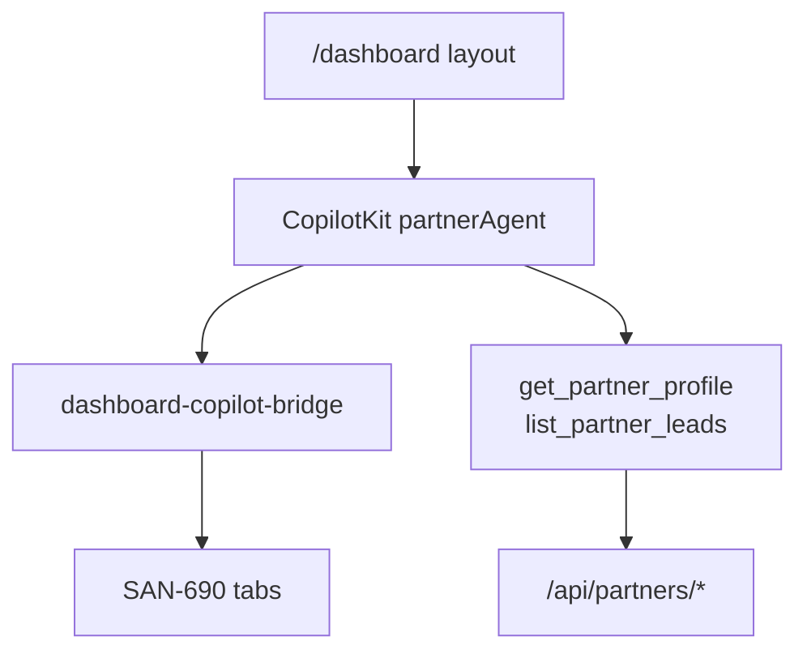

# AGT-PTR-04 — Dashboard copilot shell

## Purpose

Partner dashboard mounts `partnerAgent` with `capability: "dashboard"` in working memory. Read-only KPIs and navigation help first.

**Persona:** Activated partner asks "how many leads this week?" without leaving `/dashboard`.

## Layout architecture



## Acceptance criteria

- [ ] `dashboard/layout.tsx` per AGT-PTR-00 — `threadId={`partner:${partnerId}`}`
- [ ] CopilotKit sidebar or embedded panel
- [ ] `useCoAgent({ name: "partnerAgent" })` initial state `{ capability: "dashboard", partnerId }`
- [ ] Read-only tools: `get_partner_profile`, `list_partner_leads` (requires SAN-706)
- [ ] No booking/Postiz/revenue mutations without PTR-05/06 HITL
- [ ] Auth: unauthenticated → `/login`; no partner row → `/partners/signup`
- [ ] Register `/dashboard` in `sitemap.md` when route ships
- [ ] Vitest: bridge renders with mocked agent state

## Out of scope (MVP)

- Postiz (SAN-687) · Revenue ML (SAN-668) · Booking approve (SAN-686)

## Files (expected touch)

- `mdeapp/src/app/dashboard/layout.tsx`
- `mdeapp/src/components/partners/partner-dashboard-copilot-bridge.tsx`

## Verify

```bash
cd mdeapp && npm run dev
curl -s -o /dev/null -w "%{http_code}" http://localhost:3001/dashboard
npm run floor
```

## Coordination

**SAN-690** owns tabs/KPI UI; **this task** owns copilot mount + read tools.
