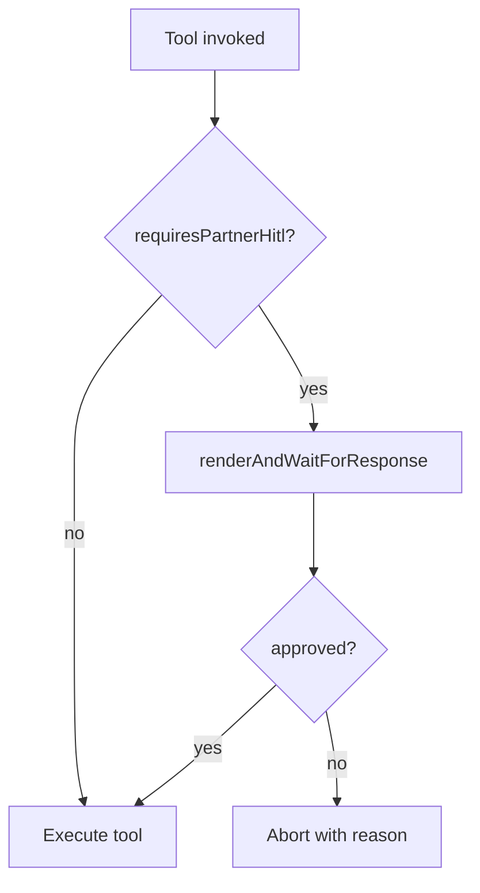

# AGT-PTR-06 — Partner HITL policy module

## Purpose

Shared module listing which partner (and host) actions require `renderAndWaitForResponse`. Ship **before or with** PTR-05 so lead reply uses policy from day one.

**Persona:** Patricia ops — one policy table for money/public actions across host + partner agents.

## Policy decision flow



## Policy table (MVP)

| Action | HITL required |
|---|---|
| `send_lead_reply` | yes |
| `preview_and_publish` (host) | yes |
| Approve booking + charge | yes |
| Schedule social post | yes |
| Read KPIs / drafts | no |
| `upsert_partner_draft` autosave | no |

## Acceptance criteria

- [ ] `mdeapp/src/mastra/lib/partner-hitl-policy.ts` exports `requiresPartnerHitl(action: string): boolean`
- [ ] `partnerAgent` tool wrapper checks policy before execute
- [ ] Host publish may import same policy (optional same PR)
- [ ] Unit tests: each action class covered
- [ ] Documented in `partnerAgent` system prompt appendix

## Files (expected touch)

- `mdeapp/src/mastra/lib/partner-hitl-policy.ts`
- `mdeapp/src/mastra/lib/partner-hitl-policy.test.ts`
- `mdeapp/src/mastra/agents/partner.ts`

## Verify

```bash
cd mdeapp && npm test -- --run src/mastra/lib/partner-hitl-policy
npm run floor
```

## Blocks

SAN-708 lead HITL · SAN-686 booking HITL · SAN-687 Postiz actions
