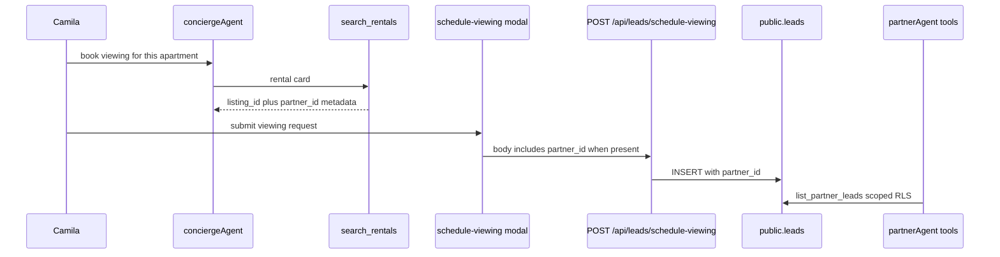
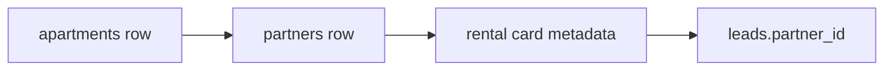

# AGT-PTR-07 — Concierge `leads.partner_id` attribution

## Purpose

When Camila's concierge captures a lead from a partner listing, persist `leads.partner_id` so partner dashboards show demand.

**Persona:** Camila books a viewing → broker sees lead in `/dashboard` via `list_partner_leads`.

## Data flow



## Listing to partner bridge



Requires `partners.landlord_profile_id` or event `organizer_id` bridge (SAN-683 + vertical e2e).

## Acceptance criteria

- [ ] **`POST /api/leads/schedule-viewing`** sets `partner_id` when listing context present (primary path on disk today)
- [ ] Rental/event/grounded search tools expose `partner_id` in tool result metadata when resolvable
- [ ] Concierge path only — no `partnerAgent` on `/chat`
- [ ] RLS: partner members see leads via ptr012 policies
- [ ] Vitest: capture with `listingPartnerId` → row has `partner_id`
- [ ] Organic query → `partner_id` null

## Files (expected touch)

- `mdeapp/src/app/api/leads/schedule-viewing/route.ts`
- `mdeapp/src/lib/leads/submit-schedule-viewing.ts`
- `mdeapp/src/mastra/tools/search-rentals.ts` (card metadata)
- `mdeapp/src/mastra/tools/search-events.ts` (organizer bridge)

## Verify

```bash
cd mdeapp && npm test -- --run src/lib/leads
npm run floor
```

## Coordination

Parent [SAN-673](https://linear.app/sanjiovani/issue/SAN-673). Ship after at least one partner type live (SAN-675 or SAN-677).
