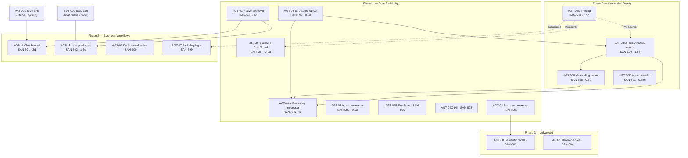

# Mastra Agent Adoption Plan — v2

> **What changed from v1:** v1 was a flat AGT-01…10 feature list that buried the
> two things that actually move the grade (scorers, tracing) under "do the audit
> P0s separately, first." v2 **pulls those into the plan as Phase 0**, splits the
> overloaded AGT-04 into three, demotes native-approval from P0→P1 (the gate it
> would protect isn't built yet), and **drops one task the audit was wrong about**
> (`search-venue-anchors.ts` is not orphaned — see §Corrections). Every task is a
> Linear issue under epic **SAN-588**.

---

## 1. One-line answer

**Wire the hallucination/grounding scorers + AI tracing first (Phase 0) — they move the grade from B− and they're cheap. Everything else is reliability polish that must not delay launch.** We use **~25% of Mastra's total surface** but **~60–70% of the useful MVP surface** (agents + tools high; workflows/streaming low; workspace/RAG intentionally ignored). Adoption is config + wiring on `@mastra/core@1.35.0`, not upgrades.

---

## 2. Final roadmap (re-prioritized)

| Phase | Goal | Tasks | Effort | Linear |
|---|---|---|---|---|
| **0 — Production Safety** | Stop shipping blind; close the quality gap | 00A, 00B, 00C, 00D | **2.75d** | SAN-589/590/591/605 |
| **1 — Core Reliability** | Enforce grounding, protect inputs, cut cost/latency | 03, 04A, 05, 06, 01, 04B, 04C | **4.25d** | SAN-592/606/593/594/595/596/598 |
| **2 — Business Workflows** | Make the money + publish paths deterministic | 15, 11, 12, **02**, 14, 16, 09, 07 | **5.5d** | SAN-607/601/602/**597**/608/609/600/599 |
| **3 — Advanced** | Memory tail + interop, post-launch | 13, 08, 10 | **2.5d** | SAN-610/603/604 |

> **Reviewer reprioritization (2026-06-05):** AGT-02 → Phase 3 to cluster with AGT-13 + AGT-08. **External review (2026-06-06, 95/100):** AGT-02 **moved earlier** — after 601/602, before 608/609 (end of Phase 2 / head of memory cluster). AGT-15 mandatory with AGT-11/12. **AGT-17** golden query suite proposed. Surface gaps: [`2-mastra-surface-gap-analysis.md`](./2-mastra-surface-gap-analysis.md).

**Total: ~14.5 engineer-days.** Phase 0+1 (the launch-relevant slice) = **7.5d**.

### Priority within phases (do in this order)

```
Phase 0:  00C (tracing, 0.5d) → 00A (scorer, 1.5d) → 00B (extend, 0.5d) → 00D (allowlist, 0.25d)
Phase 1:  03 → 04A → 05 → 06 → 01(publish half) → 04B → 04C
Phase 2:  (after PAY-001) 15(mandatory) → 11+15 → 12+15 → 02(resource memory) → 14 → 16 → 09 → 07
Phase 3:  13 → 08 (memory tail), 10  (post-launch)
Optional: 17 golden query suite — after 00A/00B; trust gate for scorers (proposed, not filed)
```

00C goes first because **you can't measure the impact of any other task without traces.**

---

## 3. Task → Linear → priority map

| AGT | Title | SAN | Phase | Priority | Effort | Persona |
|---|---|---|---|---|---|---|
| **00** | Epic — Agent Feature Adoption | **588** | — | Urgent | — | — |
| **00A** | Hallucination / faithfulness scorer | **590** | 0 | **P0** | 1.5d | All |
| **00B** | Grounding-coverage scorer | **605** | 0 | **P0** | 0.5d | All |
| **00C** | Telemetry & AI tracing | **589** | 0 | **P0** | 0.5d | Patricia, all |
| **00D** | Runtime agent allowlist | **591** | 0 | P1 (cheap) | 0.25d | Sofía |
| **03** | Structured output (scorer judge) | **592** | 1 | P1 | 0.5d | All |
| **04A** | Grounding-assertion output processor | **606** | 1 | P1 | 1d | All |
| **05** | Input-processor coverage | **593** | 1 | P1 | 0.5d | Roberto |
| **06** | ResponseCache + CostGuard | **594** | 1 | P1 | 0.5d | Camila, Sofía |
| **01** | Native tool-approval | **595** | 1 | P1 (was P0) | 1d | Roberto, Andrés |
| **04B** | SystemPromptScrubber | **596** | 1 | P2 | 0.25d | All |
| **02** | Resource-scoped memory | **597** | **2 tail** | P2 | 0.5d | Camila |
| **04C** | PII protection | **598** | 1 | P2 | 0.5d | All |
| **11** | Checkout workflow (Mastra) | **601** | 2 | P2 | 2d | Andrés |
| **12** | Host publish workflow | **602** | 2 | P2 | 1.5d | Roberto |
| **09** | Background tasks (slow grounding) | **600** | 2 | P2 | 1d | Tourist |
| **07** | Tool output shaping + activeTools | **599** | 2 | P2 | 0.5d | Sofía |
| **08** | Semantic recall (pgvector) | **603** | 3 | P3 | 1.5d | Camila |
| **10** | Channels / A2A / ACP spike (doc) | **604** | 3 | P3 | 0.5d | — |
| **17** | Golden query evaluation suite *(proposed)* | — | 1 tail | P2 | 1d | Lucía, Patricia |

### AGT-17 — Golden query evaluation suite (proposed, not yet Linear)

**Not a launch blocker** — but scorers (00A/00B) are hard to trust without a fixed dataset.

| Bucket | Count | Example |
|---|---|---|
| Rental | 20 | *"2 bedroom apartment in Laureles under 3M"* |
| Venue / grounded | 20 | *"quiet rooftop dinner in Provenza"* |
| Restaurant | 20 | *"best bandeja paisa near Parque Lleras"* |
| Event | 10 | *"salsa events this weekend"* |

**Pass threshold (sampled in CI):** faithfulness ≥90 · grounding coverage ≥90 · trace attached.

Wire to `evals.json` + scorer pipeline after SAN-590/605. File as SAN-611 when Phase 0 lands.

---

## 4. What changed vs v1 — and why (be critical)

| Change | v1 | v2 | Reason |
|---|---|---|---|
| **Scorers + tracing are now IN the plan** | "do separately, first" footnote | **Phase 0, AGT-00A/B/C** | They're the only two things that move the B− grade. Burying them under-prioritized them. |
| **AGT-01 native approval demoted** | **P0** | **P1** | The gate protects checkout — which **doesn't exist in Mastra yet**. Host publish already has working CopilotKit HITL. So this is hardening, not a missing gate. P0 was overstated. |
| **AGT-04 split into 3** | one "output guardrails" task | **04A grounding (P1) / 04B scrubber (P2) / 04C PII (P2)** | Only 04A carries real logic + real tests; 04B/04C are ~1-line built-in processors. Splitting clarifies that 2 of the 3 are trivial config, not a 1-day task each. |
| **AGT-00B is a thin extension, not a parallel build** | — | **shares 00A's judge + schema** | The audits list "hallucination / grounding" as **one** P0. Building two independent scorer pipelines would be over-engineering. |
| **AGT-00D priority honesty** | — | **P1 severity, Phase-0 slot only because it's 15 min** | The june5 audit explicitly downgraded the allowlist P0→P1 (the `agent=` prop already pins selection). We keep it early because it's cheap, not because it's severe. |
| **Resource/semantic memory** | P1/P2 mixed | **02 = P2 (Phase-1 tail), 08 = P3** | Durable prefs are a nice-to-have, not a launch blocker. Don't let them crowd the scorers. |
| **Checkout/publish workflows added** | implied | **AGT-11 / AGT-12 (Phase 2)** | From the june5 audit's "missing workflows." Scoped to NOT duplicate PAY-001/EVT-002. |
| **`search-venue-anchors.ts` cleanup DROPPED** | audit P1 #6 | **no task** | **Audit was wrong** — see §Corrections. |

### Overengineering risks called out (and avoided)
- **Supervisor agents** — not adopted. Concierge self-routes; the frozen `MASTRA-MIS-001` says `/` = concierge only. Adding a supervisor map is solution-looking-for-a-problem.
- **MCP servers in the runtime** — skip for MVP (typed Supabase/Places clients are better). Revisit Stripe/Gmail MCP in Phase 2.
- **Two independent scorers** — collapsed to one judge + two assertions (00A → 00B).
- **A2A/ACP/Channels as three runtime tasks** — collapsed to one scope **doc** (AGT-10).
- **CopilotKit v2 migration** — explicitly **not** in this plan (june-v2-audit: closes 0 of 2 P0s; Phase 2, Path A).

---

## 5. Corrections to the audits (forensic)

| Audit claim | Reality (verified) | Action |
|---|---|---|
| june5 §2 / P1 #6: `search-venue-anchors.ts` "in source but NOT in the live registry… delete if orphaned" | **NOT orphaned.** Imported by `src/lib/cafe-browse.ts`, `src/lib/nightlife-browse.ts`, and the grounded-places fallback — it's the backend for the **D-08/D-09 browse-card reskin** shipped this week (`isNightlifeVenueQuery`, café/nightlife browse). | **No cleanup task.** It's a deliberately non-agent-tool helper. Leave it. |
| june5 §1: allowlist is a fix on its own | Confirmed: `logging-mastra-agent.ts:83` `mastra.listAgents()` is unconditional (no allowlist). | AGT-00D, as planned. |
| june5 §7: no telemetry in `index.ts` | Confirmed: zero `telemetry`/`observability`/`exporter` keys. | AGT-00C, as planned. |

---

## 5b. Spec verification — every Mastra API re-probed (`@mastra/core@1.35.0`, 2026-06-05)

Ran the `task-verifier` protocol against `node_modules/@mastra/core` (not the v1 appendix). **No 🔴 blockers; 2 🟡 precision fixes folded into the specs.**

| Spec | API claimed | Probe result | Verdict |
|---|---|---|---|
| AGT-00A/B | Mastra **scorer** | `createScorer` (116×) + `MastraScorer` (431×) in `dist/evals/base.d.ts`; subpaths `./evals`, `./evals/scoreTraces`, `./storage/domains/scorer-definitions` | ✅ exists |
| AGT-00A/B | `@mastra/evals` package | `ls node_modules/@mastra/evals` → **absent** | 🟡 **use core `createScorer`, NOT `@mastra/evals`** |
| AGT-01 | `requireApproval` / `suspendSchema` / `approveToolCall` | all present in tool/agent `.d.ts` | ✅ |
| AGT-03 | `structuredOutput` | present on agent `.d.ts` | ✅ |
| AGT-04A | custom output processor (`BaseProcessor`) | `class BaseProcessor` present | ✅ |
| AGT-04B | `SystemPromptScrubber` | `system-prompt-scrubber.d.ts` · `class SystemPromptScrubber` | ✅ |
| AGT-04C | `PIIDetector` | `pii-detector.d.ts` · `class PIIDetector` | ✅ |
| AGT-05 | `getDefaultInputProcessors` / `TokenLimiter` / `UnicodeNormalizer` | wrapper in `agent-input-processors.ts`; class is `TokenLimiterProcessor` (repo imports a working `TokenLimiter` alias); `unicode-normalizer.d.ts` present | 🟡 canonical name `TokenLimiterProcessor` — spec uses the repo wrapper, so non-breaking |
| AGT-06 | `ResponseCache` + `CostGuardProcessor` | `response-cache.d.ts` + `cost-guard.d.ts` · both classes present | ✅ |
| AGT-02 / 08 | memory `scope:'resource'` + `semanticRecall` | both in memory `.d.ts`; `agent-memory.ts` already uses `scope:` | ✅ |
| AGT-09 | `backgroundTasks` + `streamUntilIdle` + `./background-tasks` | symbols + subpath present | ✅ |
| AGT-10 | `./a2a` + `./channels` subpaths | both in `package.json` exports | ✅ |
| AGT-00C | no telemetry in `index.ts` | 0 `telemetry`/`observability`/`exporter` keys | ✅ gap real |
| AGT-00D | `listAgents()` unconditional | `logging-mastra-agent.ts:83` | ✅ gap real |
| AGT-03 target | `evaluationAgent` | `src/mastra/agents/evaluation.ts` | ✅ |
| AGT-01 target | `preview_and_publish` | referenced in `host-event-prompt.ts` | ✅ |
| AGT-00A input | `evals.json` | `.claude/skills/mastra/evals/evals.json` (3.2 KB) | ✅ |

**Two fixes applied to the Linear specs:** (1) AGT-00A/00B now say "built-in `createScorer` from `@mastra/core` — the `@mastra/evals` package is **not installed**"; (2) AGT-05 notes the canonical `TokenLimiterProcessor` name. Everything else verified true as written.

---

## 6. Dependency map



Solid arrow = hard blocker (`blockedBy` set in Linear). Dotted = "impact only visible through". Wired in Linear: 00A→00B, {00A,00B,03}→04A, PAY-001/EVT-002 relations on 01/11/12.

---

## 7. MVP impact analysis

| Journey | Today | After Phase 0 | After Phase 1 |
|---|---|---|---|
| **Camila (rental + chat)** | ~85%, silent-hallucination risk | hallucination measured + traced | grounding **enforced**, repeat-query latency cut, durable prefs |
| **Tourist (venues)** | ~80%, no grounding gate | grounding-quality scored | fabricated-venue replies blocked at runtime |
| **Roberto (host publish)** | ~65%, unprotected wizard | publish traced | input-guarded wizard; (Phase 2) deterministic publish workflow |
| **Andrés (ticket buy)** | ~20%, no Mastra checkout | (no change — not a Phase-0 item) | native-approval ready; (Phase 2) checkout workflow |
| **Patricia (ops)** | blind (0 spans) | **traces + scorer dashboards** | cost caps + cache-hit metrics |

**Launch-relevant verdict:** Phase 0 + the P1 half of Phase 1 (03, 04A, 05, 06) is the launch slice — ~5.5d. It converts "tool results are the only truth" from a prompt clause into a measured + enforced contract, and turns the lights on for operations.

---

## 8. Production-readiness impact

| Metric (june5 audit) | Now | After Phase 0 | After Phase 0+1 |
|---|---|---|---|
| Overall grade | **B−** | **B / B+** | **B+ / A−** |
| Production readiness | 62% | ~75% | ~85% |
| Scorers | 1/10 (F) | **7/10** | 7/10 |
| Observability | 3/10 (D) | **7/10** | 8/10 |
| Processors | 6/10 | 6/10 | **8/10** (output stack) |
| Biggest risk (silent hallucination + blind ops) | open | **closed (measured)** | **closed (measured + enforced)** |

The grade is dragged down almost entirely by the empty quality + observability layers. **Phase 0 alone is the single highest-leverage move** — ~2.75d to take both off an F/D.

---

## 9. Final recommendation

1. **Do Phase 0 this cycle, in order: 00C → 00A → 00B → 00D (~2.75d).** It moves the grade and turns on the lights. None of it is risky (config + one scorer).
2. **Then the P1 spine of Phase 1: 03 → 04A → 05 → 06 (~2.5d).** Enforcement + input coverage + cost/latency. This is the launch-quality slice.
3. **Defer the Phase-1 tail (01 publish-half, 04B, 02, 04C) to fill-in slots** — useful, none launch-blocking.
4. **Phase 2 workflows (11/12) come AFTER PAY-001/EVT-002** — they wrap those, don't replace them. Don't start AGT-11 before the Stripe path exists.
5. **Phase 3 (08, 10) is explicitly post-launch.** Don't let semantic recall or interop spikes touch the launch cycle.
6. **Do NOT** migrate CopilotKit v2 to "fix" the audit — it fixes none of it (june-v2-audit).

### Open decision for the owner
Phase 0 issues are labeled `phase:mvp` (not `phase:launch`) and priority **Urgent**, to avoid polluting the official 12-issue MVP-exit view. **If you consider the scorers/tracing true launch gates, promote SAN-589/590/605 to `phase:launch` and add them to Cycle 1.** I left them off the launch ledger conservatively — your call.

---

## Sequencing checklist (every task)

- Branch `ai/san-NNN-agt-NN-slug`; one worktree, one PR.
- 445+ Vitest + Playwright e2e green before/after.
- Localhost runtime proof before Done (CLAUDE.md gate; N/A only for AGT-10 doc).
- All APIs already in `@mastra/core@1.35.0` — config + wiring, no upgrades.

---

### Appendix — evidence (verified 2026-06-05)

| Claim | Source |
|---|---|
| `@mastra/core@1.35.0` installed | `node -e require('@mastra/core/package.json').version` → 1.35.0 |
| No telemetry in `index.ts` | `grep telemetry\|observability\|exporter src/mastra/index.ts` → 0 hits |
| `listAgents()` unconditional (no allowlist) | `logging-mastra-agent.ts:83` |
| `search-venue-anchors.ts` NOT orphaned | imported by `lib/cafe-browse.ts`, `lib/nightlife-browse.ts`, fallback test |
| 0 scorers / 0 spans | june5 audit §5/§7 (live :4111 API) |
| 20+ processors incl. ResponseCache/CostGuard/PIIDetector/SystemPromptScrubber | `import('@mastra/core/processors')` keys (plan v1 appendix) |
| All 18 issues created under SAN-588 | Linear, 2026-06-05 |
