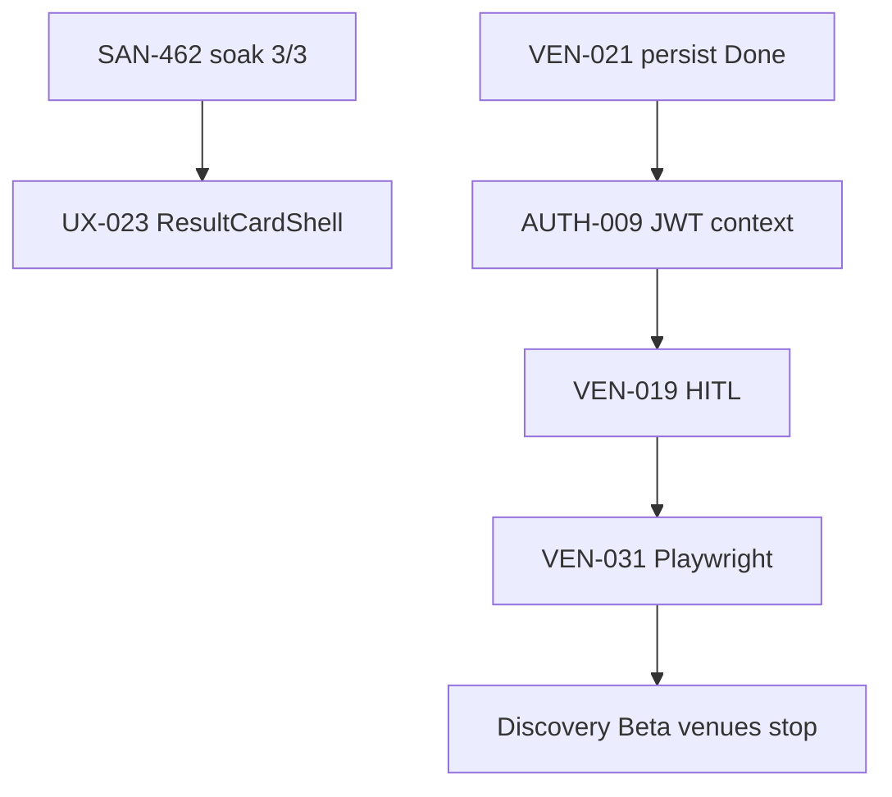
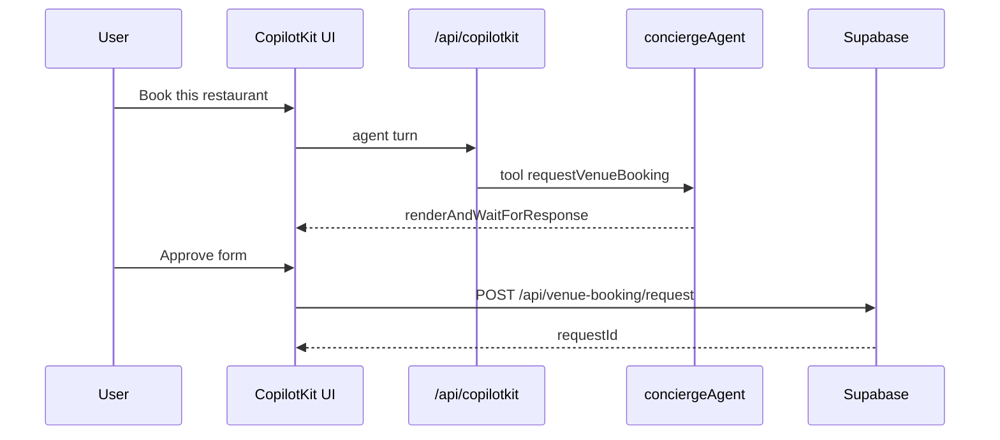

> **Summary:** Operator playbook — how to implement any task without fake-done: skills, MCP probes, tests, evidence, and PR proof. Canonical “how to ship” doc.

# How to implement plan tasks so they stay correct

> **Problem we hit:** specs said Done while `tasks.md` was stale; Linear IDs drifted; localhost proof ≠ prod proof.  
> **Fix:** every task ships with **verifiable DoD**, **skill + MCP probes before code**, and **PR-body proof** (durable evidence files reserved for persona-visible / prod gates) that outlives the agent session.

---

## 1. Release track first (30 seconds)

Before touching code, name the track:

| Track | Queue | Done means |
|-------|-------|------------|
| **Discovery Beta** | `tasks.md` rows 1–50 | Persona journey passes on **prod** + floor green |
| **Commerce Exit** | `tasks.md` D1–D5 | PAY→EVT sequence + EVT-001 ledger — **only when reopened** |

If work is Discovery Beta, **do not** block on Stripe rows. Update `tasks.md` % and dot in the **same PR** as the code slice.

---

## 2. Task spec minimum (copy into every new spec)

Every task under `tasks/**` should have frontmatter + these sections:

```yaml
task_id: VEN-0XX
status: Not Started          # never trust without re-probe
depends_on: [VEN-021]
unblocks: [VEN-031]
skills: [copilotkit-develop, mde-supabase]   # ≤3 primary
mcp: [supabase, mastra]                      # probe before code
persona: Carlos
surface: /chat
evidence: tasks/venues/tasks/evidence/VEN-0XX-verify-YYYY-MM-DD.md
```

| Section | Required content |
|---------|------------------|
| **Persona + surface** | Who notices on which route |
| **DoD table** | Each AC → command + expected exit/shape |
| **Integration surface** | CopilotKit in-process vs Mastra HTTP — Phase 1 = in-process only |
| **Anti-fake-done** | What would fool us (status field, localhost-only, mocked DB) |

**Gate new specs:** load `task-verifier` → `references/task-spec-rubric.md` (≥80 before execution).

---

## 3. Skills routing (load ≤5, in order)

| Work type | Load first | Then | MCP |
|-----------|------------|------|-----|
| Flip task → Done | `task-verifier` | `testing` | touch-surface MCP |
| CopilotKit / HITL | `copilotkit` → `copilotkit-develop` | `copilotkit-integrations` if broken | copilotkit MCP |
| Mastra agent/tool | `mastra` | `gemini` | mastra MCP |
| Supabase / RLS / API | `mde-supabase` | — | Supabase MCP |
| Maps / Places / pins | `mde-maps` | — | `google-maps-code-assist` → **retrieve-instructions first** |
| UI / cards / sheets | `shadcn` | `copilotkit-develop` if generative UI | — |
| Screen task | `copilotkit-develop` | `shadcn`, `testing` | — |
| Deploy / prod proof | — | `mdeai-live-prod-check` rule | — |

**Rule:** read `SKILL.md` — do not guess APIs from memory. If MCP contradicts skill, fix implementation.

---

## 4. MCP probes before writing code

Run probes **before** the first line of product code. Log tool name + pass/fail in evidence (no secret values).

| Touching | MCP | Probe |
|----------|-----|-------|
| New/changed table | Supabase MCP (`mcp__ed3787fc…`) | `list_tables` · `execute_sql` RLS · `get_advisors` |
| Gemini model id | Gemini docs MCP | `list_doc_sources` → `fetch_docs` (no `search_docs` tool); cross-check `google-developer-knowledge` |
| CopilotKit hook/API | copilotkit MCP | `search-docs` / `search-code` — fallback: `CopilotKit/examples/integrations/mastra/` |
| Mastra tool/agent | mastra MCP | `searchMastraDocs` / `readMastraDocs` for `createTool`, registry |
| Places / field mask | `google-maps-code-assist` | `retrieve-instructions` → `retrieve-google-maps-platform-docs` |
| Maps implementation | same | Every Places call: `X-Goog-FieldMask` |

**Postgres ENUM:** never invent `agent_type` labels — query `pg_enum` first (`task-verifier` §2c).

---

## 5. Test pyramid — production-ready verification

### Layer A — Floor (every code commit)

```bash
cd mdeapp && npm run floor    # lint + tsc + test + build + audit
```

Per-task subset (faster when registry exists):

```bash
cd mdeapp && npm run verify:task -- VEN-031          # floor + task vitest/e2e/smoke
npm run verify:task -- SEARCH-003 --skip-floor       # task probes only
```

### Layer B — Unit / integration (Vitest)

| Task type | Test pattern | Example |
|-----------|--------------|---------|
| Pure logic | `*.test.ts` next to module | `signalBoost`, `venueKindForBookingQuery` |
| API route | `route.test.ts` | `venue-booking/request/route.test.ts` |
| Live DB optional | `*.integration.test.ts` + skip if no env | `search-003-ranking.integration.test.ts` |
| CopilotKit render | RTL + parse tool output | `search-tool-renders` tests |

```bash
cd mdeapp && npm test -- --run path/to/changed.test.ts
```

**Target:** new business logic without a test is a 🟡 unless explicitly UI-only polish.

### Layer C — Localhost runtime (anti-fake-done gate 9)

```bash
cd mdeapp && npm run dev
# watch [ui] port — :3001 if :3000 busy
node tasks/testing/scripts/chat-smoke.mjs --base http://localhost:3001
```

Persona prompt from task spec or [`09-prod-live-journey-matrix.md`](../testing/09-prod-live-journey-matrix.md).

### Layer D — Playwright (release gates)

| Gate task | Spec | When |
|-----------|------|------|
| **VEN-031** | venue screens e2e | Venues MVP stop |
| **SAN-462** | `e2e/prod-synthetic-smoke.spec.ts` | 3/3 scheduled prod |
| **TRIP-011** | trips suite | Trips Phase 2 stop |

```bash
cd mdeapp
SMOKE_BASE_URL=http://localhost:3001 npx playwright test e2e/<spec>.spec.ts --project=chromium
```

### Layer E — Production (required for persona-visible Done)

Per [`.cursor/rules/mdeai-live-prod-check.mdc`](../../.cursor/rules/mdeai-live-prod-check.mdc):

```bash
curl -s -o /dev/null -w "%{http_code}\n" https://www.mdeai.co/
node tasks/testing/scripts/chat-smoke.mjs --base https://www.mdeai.co
# Tier 3 — SAN-462 matrix (npm scripts set PW_SKIP_WEBSERVER=1 — required vs prod)
npm run test:e2e:prod-synthetic        # e2e/prod-synthetic-smoke.spec.ts
npm run test:e2e:prod-venues-journey   # J05–J08 venue journeys
```

**OPS-JOURNEY (row 10):** manual or future Playwright for **J05–J20** — log in `tasks/testing/evidence/YYYY-MM-DD/prod-live-RESULTS.md`.

---

## 6. Evidence file template (persona-visible / prod gates)

Default proof lives in the **PR body**. Spawn a durable evidence file only for persona-visible / prod-verified tasks (Layer E gates: SAN-462, VEN-031, J05–J20) where the proof must outlive the PR.

Path: `tasks/**/evidence/<TASK-ID>-verify-YYYY-MM-DD.md`

```markdown
# VEN-0XX verify — YYYY-MM-DD

| Field | Value |
|-------|-------|
| Task | … |
| Track | Discovery Beta |
| prod_sha | bf40ef9 |
| Grade | B+ / 88 |
| Persona | Carlos on /chat |

## Probes

| Probe | Result |
|-------|--------|
| vitest | 488/488 + N new |
| floor | pass |
| MCP supabase RLS | relrowsecurity=true |
| localhost journey | prompt → assert testid |
| prod journey | PASS / FAIL |

## Files touched

- mdeapp/src/...

## Known gaps

- embed 403 non-blocking …
```

Then: update **`tasks.md`** row (% + dot) and Linear in same session.

---

## 7. When to use Mermaid (and when not)

Use **`mermaid-diagrams`** skill — validate before commit (Mermaid MCP or mermaid.live).

| Use Mermaid | Don't use Mermaid |
|-------------|-------------------|
| Release track / dependency graph in specs | Replacing evidence tables |
| CopilotKit → Mastra → tool sequence (one request) | Every task by default |
| Booking state: draft → pending → confirmed | UI mockups (use wireframes) |
| Trips add-to-trip rollback flow | Duplicating `tasks.md` tables |

### Template — task dependency (flowchart)



### Template — CopilotKit HITL booking (sequence)



**Stack rule:** mdeapp diagrams = Next.js + CopilotKit 1.55.2 + Mastra in-process + Gemini — **not** legacy edge `ai-chat`.

---

## 8. Implementation workflow (one task end-to-end)

```text
1. Read tasks.md row → confirm track + deps green
2. Read task spec + sitemap.md route status
3. Load skills (§3) + run MCP probes (§4)
4. Implement smallest slice
5. Layer A–C tests
6. PR-body proof — evidence file (§6) only for persona-visible / prod gates
7. Layer E prod if persona-visible
8. Patch tasks.md + plan.md rollup if % changed
9. Linear Done + commit (mdeapp slice → parent evidence)
```

**Commit discipline:** one logical slice per commit; never merge with stale `tasks.md`.

---

## 9. Queue hygiene (prevent audit-01 recurrence)

| After | Action |
|-------|--------|
| PR merges to main | Grep task ID in `tasks.md` — flip dot or move to Done section |
| Linear closed | Verify SAN-* maps to **one** task_id (SEARCH-002=SAN-387, SEARCH-003=SAN-388) |
| Shipped without HITL | Fix spec `depends_on` / `unblocks` (VEN-020 shipped before VEN-019) |
| Weekly | Re-run spot audit: disk vs `tasks.md` for rows 1–10, 17–37 |

**Single source for order:** [`tasks.md`](../../tasks.md) · **rollup only:** [`plan.md`](../../plan.md)

---

## 10. Task-type cheat sheet

| Task | Must-have tests | Prod proof |
|------|-----------------|------------|
| **DATA-041** style | SQL count + anon read + unit join | golden query ranks on prod |
| **SEARCH-003** style | integration test + golden smoke | J05 restaurant prompt |
| **VEN-012** style | unit parse + Playwright routing | J06 nightlife panel |
| **VEN-021** style | route.test.ts + signed-in insert | booking row in DB |
| **MAP-008B** | unit mapId helper | no DEMO_MAP_ID on prod console |
| **F13** | thread survives dev restart | turn 11 remembers turn 1 post-redeploy |
| **AUTH-009** | JWT in Mastra context in tool test | user-scoped booking |
| **SCREEN-023** | page renders + API wired | `/restaurants` 200 |

---

## 11. Tooling (shipped 2026-06-03)

| Item | Location | Usage |
|------|----------|--------|
| PR checklist | [`mdeapp/.github/pull_request_template.md`](../../mdeapp/.github/pull_request_template.md) | evidence + tasks.md + verify:task |
| Task verify | `cd mdeapp && npm run verify:task -- VEN-031` | [`scripts/verify-task.mjs`](../../mdeapp/scripts/verify-task.mjs) · **[docs](../../mdeapp/scripts/verify-task.md)** |
| Queue stale hints | `node tasks/scripts/sync-tasks-queue-hints.mjs` | read-only; does not edit tasks.md |
| J05–J08 Playwright | `npm run test:e2e:prod-venues-journey` | [`e2e/prod-venues-journey.spec.ts`](../../mdeapp/e2e/prod-venues-journey.spec.ts) |
| Spec template | [`tasks/templates/task-spec-template.md`](../templates/task-spec-template.md) | copy for new tasks |

Add registry entries in `verify-task.mjs` when a task gets a repeatable probe set.

---

## 12. Quick reference links

| Doc | Purpose |
|-----|---------|
| [`audit-01-tasks.md`](./audit-01-tasks.md) | Forensic baseline |
| [`tasks.md`](../../tasks.md) | Operator queue |
| [`09-prod-live-journey-matrix.md`](../testing/09-prod-live-journey-matrix.md) | J05–J20 prompts |
| [`VEN-VERIFY-STANDARD.md`](../venues/tasks/mvp/VEN-VERIFY-STANDARD.md) | Venues Done gate |
| [`task-spec-template.md`](../templates/task-spec-template.md) | Copy for new task specs |
| [`mermaid-diagrams` SKILL](../../.claude/skills/mermaid-diagrams/SKILL.md) | Diagram rules |

*Keep this file operational — no Phase 2 speculation. Update when a gate fails in prod and we add a new probe.*
