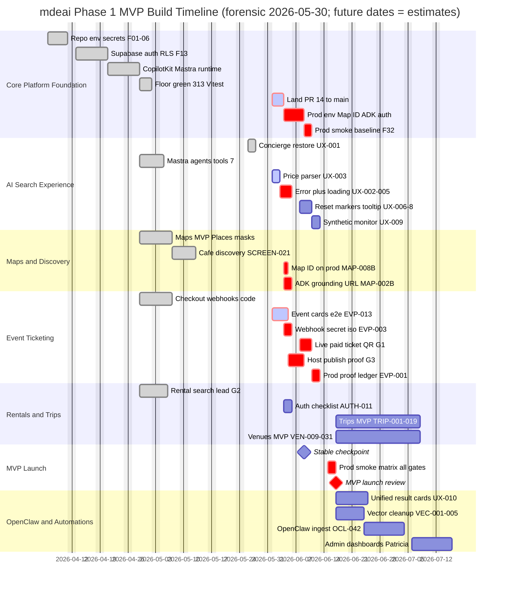

 I have the canonical MVP exit definition and the full 150-issue Linear board. Two of the doc paths 404'd (they're likely under `plan/` or were moved) — let me locate them and confirm git state, then I'll synthesize the full assessment.

I now have the complete forensic picture: the canonical MVP exit definition, the live 150-issue Linear board, confirmed PR #14 is **OPEN** (13 commits ahead of main, 0 behind), git HEAD `8c99ded`, and the planning docs located under `docs/`. Here's the full assessment.

# mdeai — Phase 1 Build Timeline & Forensic Assessment

*Auditor's note on dates: today is 2026‑05‑30 (Sat). All future dates below are **estimates** anchored to a Mon 2026‑06‑01 start, business‑days only. Nothing is marked complete without command/evidence proof — I reconciled three "% done" sources and used the lowest verified number.*

---

## 1. Executive summary

**Verdict: No‑Go for MVP today. Forensic readiness = 72/100.** The *platform* is genuinely strong and green; the *proof of commerce + production sign‑off + chat UX* is not. This is a **finishing problem, not a building problem** — the hard architecture (CopilotKit runtime, Mastra agents, Maps, Supabase RLS, 313 passing tests) is done and deployed at `www.mdeai.co`.

Three things define the gap, and a fourth is a process problem you should fix first:

1. **Commerce is unproven on prod** — no live Stripe paid ticket (G1), webhook secrets were identical (EVP‑003), and the event‑card e2e is **red** (EVP‑013 / SCREEN‑006 Playwright timeout). The one thing that turns "code exists" into "Andrés bought a ticket" hasn't happened.
2. **Production isn't signed off** — Map ID, `ADK_GROUNDING_URL`, and the Vercel auth/env checklist are unverified; there's no F32 smoke‑evidence file.
3. **Chat UX scored 48/100** in QA — invisible errors on timeout, no loading indicator, a "$500 a night" parser bug.
4. **Process drag (fix first): PR #14 is OPEN** (13 commits of café work, not on main), and **your Linear board is inverted** — it meticulously tracks ~58 *post‑MVP* issues (Trips, Venues, OpenClaw, Grounding) while the **9 actual MVP exit‑blockers are barely tracked at all.**

**Estimated time to MVP launch: ~2.5 focused weeks → ~2026‑06‑17 (estimate).** The riskiest item on the path is EVP‑013 (event cards), because it's failing *today*.

---

## 2. Recommended Linear project structure

Your board today: **1 project (MDEAPP)** with **9 ad‑hoc milestones** that mix priority and area ("P0 — MVP gates", "P1 — Screens & café", "P1.5 — Trips MVP", "Deferred — OpenClaw"…). 150 issues, distributed **73 Todo · 34 Done · 28 Backlog · 12 In Review · 3 In Progress**.

**Two structural problems:**
- The 9 milestones aren't phases — you can't read "are we ready to launch?" off them.
- The real critical path (G1, EVP‑003, EVP‑013, G3, EVP‑001, F32, AUTH‑011, MAP‑002B, MAP‑008B) **mostly isn't on the board as issues.** Meanwhile Trips/Venues/OpenClaw are fully enumerated. The board optimizes the wrong horizon.

**Recommended (low‑churn) structure:**

```
Initiative:  mdeai — Launch Medellín (Phase 1)
  └─ Project: MDEAPP            ← keep the one project
       ├─ Milestones (4)        ← REPLACE the 9 with the 4 phases (see §3)
       │     Setup The Core · Make Everything Stable · Launch The App · Grow & Improve
       └─ Labels (7 area groups)← for filtering across the timeline
             Core Platform Foundation · MVP Launch · Maps & Discovery ·
             Event Ticketing · AI Search Experience · Rentals & Trips · OpenClaw & Automations
```

Why this shape: in Linear, **milestones render as a single project timeline** (Gantt‑able) → map them to the 4 phases so the board *reads as a launch tracker*. **Labels are cross‑cutting** → use them for the 7 area groups so you can still slice "show me all Event Ticketing work." When the team grows past ~2 builders, promote the 7 labels to 7 **Projects** under the same Initiative.

**Three cleanups to do alongside the remap:**
- **Create the 9 missing P0 issues** (G1, EVP‑003, EVP‑013, G3, EVP‑001, F32, AUTH‑011, MAP‑002B, MAP‑008B) under **Launch The App** — today they live only in `MVP-REQUIRED.md`, invisible to the board.
- **Reconcile the SCREEN‑006 mismatch:** SAN‑236 "SCREEN‑006 — Event Card" is marked **Done**, but the event‑card e2e (EVP‑013) is **red**. "Component done" ≠ "renders in chat, e2e‑green." Split or reopen.
- **Drain the "In Review" column (12 screens):** checkout, tickets+QR, itinerary, trips, a11y are all stuck in review — that's a lot of MVP surface in limbo. Merge or kick back.

---

## 3. Recommended milestones (the 4 phases)

| Phase | Goal in one line | Exit criterion | Holds (examples) | Target (est.) |
|------|------------------|----------------|------------------|---------------|
| **1 · Setup The Core** | The platform exists and boots clean | Floor green (313 tests), prod 200, RLS on every table | F01–F50, Maps MVP, Auth batch, Mastra gates, café SCREEN‑021 — **mostly 🟢 done** | ✅ complete |
| **2 · Make Everything Stable** | It doesn't lie or break silently | PR #14 merged · errors visible · prod env verified · secrets isolated | Land PR #14 · UX‑002/003/005 · EVP‑003 · F32 · AUTH‑011 · MAP‑002B/008B · clear 12 "In Review" | **~Jun 8** |
| **3 · Launch The App** | Three personas succeed *with evidence* | G1 paid + G2 lead + G3 publish + EVP‑001 ledger + prod smoke | G1 · EVP‑013 · G3 · EVP‑001 · UX‑006/007/008/009 | **~Jun 17** |
| **4 · Grow & Improve** | Expand surface area safely | Post‑MVP packs behind the launch gate | Trips MVP · Venues MVP · UX‑010 cards · Vector · OpenClaw · Admin | Jun 18 → ongoing |

---

## 4. Critical path

The longest dependency chain to launch — every item here is `crit`:

```
Prod env/secrets verified (MAP-008B, MAP-002B, AUTH-011)
        │
        ▼
EVP-003  webhook secret isolation  ──►  G1  live paid ticket + QR ──┐
                                                                    │
EVP-013  event cards e2e (RED today) ──►  G3  host publish proof ───┤
                                                                    ▼
                                              EVP-001  prod proof ledger (G1+G2+G3)
                                                                    │
                                                                    ▼
                                              F32  prod smoke matrix
                                                                    │
                                                                    ▼
                                              🏁 MVP launch review (milestone)
```

**The pacing item is EVP‑013 (event cards in chat).** It's the only critical‑path task that is *failing right now* (Playwright times out waiting for `[data-testid="event-card"]`). Everything else on the path is "do the work"; this one is "diagnose first." Start it in parallel on day 1, not after G1.

**Second‑order critical:** G1 can't be faked — it needs a *real* card charge on prod → `event_orders.status=paid` → wallet QR. Budget a human‑in‑the‑loop session for it; it's evidence, not code.

---

## 5. Blockers & risks

| # | Blocker / risk | Severity | Where | Mitigation |
|--:|----------------|:--------:|-------|-----------|
| 1 | **EVP‑013 event‑card e2e red** | 🟥 Critical | `SCREEN-006-event-card.spec.ts` 120s timeout | Diagnose agent/card branch first; don't trust a stale `:3001` (LESSONS §8 — restart before calling it broken) |
| 2 | **No live Stripe paid proof (G1)** | 🟥 Critical | prod checkout → `/me/tickets` | Manual HITL payment, capture row + QR evidence file |
| 3 | **Webhook secrets identical (EVP‑003)** | 🟥 Critical | `.env.local` ticket vs sponsor | Rotate sponsor secret, re‑audit env var **names** only |
| 4 | **PR #14 OPEN, 13 commits off main** | 🟡 High | café branch `feat/c012-cafe-places-detail` | Land it first — 3 known blockers: B1 attribution‑by‑index, B2 broken `test-prod-gate.mjs`, B3 unproven preview smoke (Vercel SSO 401) |
| 5 | **Prod env unverified** (Map ID, ADK URL, auth) | 🟡 High | Vercel | MAP‑008B + MAP‑002B + AUTH‑011 — one sign‑off pass |
| 6 | **Chat UX 48/100** | 🟡 High | prod concierge | UX‑002 (error bubble) + UX‑005 (thinking) same PR; UX‑003 parser |
| 7 | **Board doesn't track critical path** | 🟡 Process | Linear | Create the 9 P0 issues (§2) |
| 8 | **12 screens stuck "In Review"** | 🟡 Medium | Linear | Drain the column — hidden WIP |
| 9 | **"98%" vs "72%" readiness conflict** | 🟡 Trust | `MVP-REQUIRED.md` says 98, `may30.md` says 72 | Use 72 (forensic, with proof); 98 is planning optimism |
| 10 | **ai_runs cold‑start insert drops** | 🟢 Low | 500ms deadline | Known (task #23); post‑MVP hardening |

---

## 6. Best implementation order

```
PHASE 2 — Make Everything Stable  (do these ~in parallel, 2 builders)
  0. Land PR #14   (B1→B2→B3 fixes, then merge to main)          ← unblocks café + clean base
  1. EVP-003       rotate sponsor webhook secret + re-audit
  2. UX-003        "$500 a night" price parser (standalone, safe)
  3. UX-002 + UX-005   error bubble + thinking indicator (one PR)
  4. MAP-008B + MAP-002B + AUTH-011   prod env sign-off (one pass)
  5. F32           prod smoke baseline (evidence file)
  6. Drain 12 "In Review" screens

PHASE 3 — Launch The App  (strict order on the commerce chain)
  7. EVP-013       event cards e2e green   ← START DAY 1 (it's red)
  8. G1            live paid ticket + QR
  9. G3            host publish → Supabase row
 10. EVP-001       consolidated proof ledger (needs 8+9)
 11. UX-006/007/008/009   reset + stale markers + tooltip + monitor
 12. 🏁 Prod smoke matrix → MVP launch review

PHASE 4 — Grow & Improve  (only after the launch gate)
 13. UX-010 unified cards (M0→M5, SAN-360..365) — after PR #14
 14. Trips MVP (SAN-273..291)  ‖  Venues MVP (SAN-292..314)
 15. Vector cleanup (VEC-001..005) → OpenClaw ingest (OCL-042) → Admin
```

**Sequencing rules that bite (from LESSONS.md):** one concern per PR — never mix the platform fix with a feature; UX‑003 must touch *only* `rental-query-parser.ts`; restart `:3001` before trusting any red e2e; skip the ADK web tool when ≥3 SQL rows exist (don't add a 2nd Gemini round‑trip to the hot path).

---

## 7. What to do now vs later

| **NOW (this & next sprint — blocks launch)** | **LATER (after the launch gate)** |
|----------------------------------------------|-----------------------------------|
| Land PR #14 (B1/B2/B3) | UX‑010 unified result cards (M0→M5) |
| EVP‑013 event cards green | Trips MVP (19 issues) |
| G1 live paid + G3 publish + EVP‑001 ledger | Venues MVP + WhatsApp (23 issues) |
| EVP‑003 secret isolation | pgvector cleanup + eval (VEC‑001..005) |
| Prod sign‑off: Map ID, ADK URL, auth, F32 | OpenClaw ingest + automations (11 issues) |
| UX‑002/003/005/006/007/008/009 | Grounding search depth (GS‑005..009) |
| Create the 9 P0 Linear issues; drain "In Review" | Patricia `/admin` dashboards (W8+) |

**Hard "do not start" list** (correctly deferred in your docs): OpenClaw without OCL‑003 approval gates + OCL‑005 kill switch · WhatsApp auto‑send without human handoff · sponsor marketplace before EVP‑003 · vector rerank before VEC‑001 inventory · `/admin/*` until W8.

---

## 8. Mermaid Gantt chart



*Reading it: `done` = verified complete · `active` = in flight now · `crit` = on the critical path · `milestone` = launch checkpoint. The critical chain is `cf5 → ev3 → ev4 → ev6 → ml0 → ml2`, with `ev2` (event cards, red today) the parallel risk feeding `ev5 → ev6`. MVP launch lands ~Jun 17 (estimate).*

---

## 9. Suggested Linear issue groups (the 7 → real SAN issues)

| Group (label) | Phase weight | Representative live issues | State today |
|---------------|--------------|----------------------------|-------------|
| **Core Platform Foundation** | Setup ✅ / Stable | F01–F50 (archived 🟢), **+ create F32, AUTH‑011, DATA‑010/011 (SAN‑339/340)** | mostly Done; prod sign‑off open |
| **MVP Launch** | Launch | UX‑001 SAN‑315 🟢 · UX‑003 SAN‑316 · UX‑002 SAN‑320 · UX‑005 SAN‑319 · **+ create G1, EVP‑003, EVP‑013, G3, EVP‑001** | UX = Todo; **5 gates untracked** |
| **Maps & Discovery** | Setup ✅ / Stable | Maps MVP 🟢 · SCREEN‑021 🟢 · WIRE‑008 SAN‑247 · DATA‑034 SAN‑329 · DATA‑033 SAN‑359 · **+ MAP‑002B/008B** | code done; prod env open |
| **Event Ticketing** | Launch | SCREEN‑014 SAN‑237 🟢 · checkout SAN‑248 (In Review) · tickets+QR SAN‑259/260 (In Review) · Events polish SAN‑341‑346 | **SCREEN‑006 SAN‑236 "Done" but e2e red** |
| **AI Search Experience** | Setup ✅ / Grow | Mastra agents 🟢 · UX‑009 SAN‑322 · UX‑010 SAN‑318 + M0–M5 SAN‑360‑365 | runtime done; cards = Grow |
| **Rentals & Trips** | Setup ✅ / Grow | G2 🟢 · DATA‑019‑024 (SAN‑327/347‑351) · **Trips MVP SAN‑273‑291 (19, all Todo)** | G2 proven; Trips = post‑MVP |
| **OpenClaw & Automations** | Grow | OCL SAN‑216‑226 (11) · Venues WhatsApp SAN‑308‑312 · Grounding SAN‑227‑231 · Vector SAN‑352 | all Todo/Deferred — correct |

**The headline:** four of seven groups are mostly built; the launch‑blocking work concentrates in **MVP Launch** and **Event Ticketing** — and those two are precisely where the board is thinnest. Fix that first.

---

## 10. Final production readiness score

| # | Key area | Score | Dot | Forensic note |
|--:|----------|------:|:---:|---------------|
| 1 | Core Platform Foundation | 95 | 🟢 | 313 Vitest, lint/build/floor exit 0, prod 200 |
| 2 | Supabase DB / auth / security | 82 | 🟢 | RLS tight; EVP‑003 secret isolation + DATA‑010/011 hardening open |
| 3 | Environment variables & secrets | 70 | 🟡 | Identical webhook secrets was a *real* finding; prod env unverified |
| 4 | Vercel deployment | 78 | 🟡 | Prod up, but Map ID / ADK URL / auth env unproven; no F32 evidence |
| 5 | GitHub / CI / testing | 85 | 🟢 | Floor green; **but PR #14 open (13 commits), SCREEN‑006 e2e red, B2 broken gate** |
| 6 | Mastra + CopilotKit AI | 88 | 🟢 | POST‑storm fixed; RUN_ERROR still invisible to users |
| 7 | Gemini integration | 88 | 🟢 | `gemini-3.5-flash` pinned; re‑verify names via MCP |
| 8 | Google Maps / Places / grounding | 74 | 🟡 | Masks + mapId enforced in code; prod Map ID + ADK URL not set |
| 9 | Stripe checkout / webhooks / ticketing | 68 | 🟡 | Code exists; **no live paid proof, secret isolation, event‑card e2e red** |
| 10 | Rentals & trips | 70 | 🟡 | G2 done & proven; Trips fully Todo (post‑MVP) |
| 11 | Events & host flow | 72 | 🟡 | Wizard + SCREEN‑016 done; G3 publish proof + event cards open |
| 12 | OpenClaw / automations | 8 | ⚪ | Specs only — correctly deferred |
| 13 | Production launch readiness | 60 | 🟡 | **No‑Go:** 9 P0 open, no smoke evidence file |

### **Overall MVP readiness: 72 / 100 — 🟥 No‑Go**

> Platform floor is genuinely green and the AI/Maps/Gemini layers are strong (85–95). The score is held down by **unproven commerce, unsigned prod, and chat UX** — all *finishing* work, ~2.5 weeks. The path is unusually clear because the hard part is already built. *(I'm using 72, not the 98 in `MVP-REQUIRED.md`: 72 is the May‑30 forensic number backed by command proof; 98 was planning optimism. You asked for no fake completion claims.)*

---

### Two things I can do next on your word

1. **Apply the Linear restructure** — create the 4 phase‑milestones, add the 7 area labels, create the 9 missing P0 exit‑blocker issues, and move Trips/Venues/OpenClaw to *Grow & Improve*. *(This is a batch of board mutations — I'll only run it with your explicit go‑ahead, and I'd show you the exact create/update list first.)*
2. **Start the build** at the top of the order — **UX‑003 / SAN‑316** is the clean first move (standalone, touches only `rental-query-parser.ts`, no PR #14 dependency), or **land PR #14** if you'd rather clear the base first.

Still outstanding from earlier, whenever you want it: the SAN‑318 comment + SAN‑361 description carry a wrong "PR #14 merged" claim — it's **OPEN** — which I can correct in the same Linear pass.

Want me to proceed with the Linear restructure, or start on a build task?

I pulled this fresh this session — canonical exit definition (`tasks/MVP-REQUIRED.md`), the live 150‑issue Linear board, PR #14 confirmed **OPEN** (13 commits ahead of `main`, 0 behind), git HEAD `8c99ded`, 313 Vitest green, prod 200. Nothing has changed since, so here is the clean, complete assessment.

---

# mdeai — Phase 1 Build Timeline & Forensic Assessment

*Dates: today is 2026‑05‑30 (Sat). Future dates are **estimates** anchored to a Mon 2026‑06‑01 start, business days only (`excludes weekends`). No item is marked complete without command/evidence proof.*

---

## 1. Executive summary

**Verdict: No‑Go for MVP today. Forensic readiness = 72/100.** The *platform* is strong and green; the *proof of commerce + production sign‑off + chat UX* is not. This is a **finishing problem, not a building problem** — the hard architecture (CopilotKit 1.55.2 runtime, 7 Mastra agents, Maps/Places, Supabase RLS, 313 passing tests) is built and live at `www.mdeai.co`.

Four findings define the gap (the fourth is process, fix it first):

1. **Commerce is unproven on prod** — no live Stripe paid ticket (G1), webhook secrets were identical (EVP‑003), and the event‑card e2e is **red** (EVP‑013 / SCREEN‑006 Playwright timeout on `[data-testid="event-card"]`).
2. **Production isn't signed off** — Map ID, `ADK_GROUNDING_URL`, and the Vercel auth/env checklist are unverified; no F32 smoke‑evidence file exists.
3. **Chat UX scored 48/100** in QA — invisible errors on timeout, no loading indicator, a "$500 a night" parser bug.
4. **Process drag:** **PR #14 is OPEN** (13 commits of café work, not on `main`), and the **Linear board is inverted** — it tracks ~58 *post‑MVP* issues in detail (Trips, Venues, OpenClaw, Grounding) while the **9 actual MVP exit‑blockers are barely on the board.**

**Time to MVP launch: ~2.5 focused weeks → ~2026‑06‑17 (estimate).** Riskiest path item is **EVP‑013 (event cards)** — it's failing *today*, so it's a "diagnose first," not a "do the work."

---

## 2. Recommended Linear project structure

**Today:** 1 project (MDEAPP), **9 ad‑hoc milestones** mixing priority + area ("P0 — MVP gates", "P1 — Screens & café", "P1.5 — Trips MVP", "Deferred — OpenClaw"…), 150 issues split **73 Todo · 34 Done · 28 Backlog · 12 In Review · 3 In Progress**.

**Two problems:** the milestones aren't phases (you can't read "ready to launch?" off them), and the real critical path mostly isn't on the board as issues.

**Recommended (low‑churn) shape:**

```
Initiative:  mdeai — Launch Medellín (Phase 1)
  └─ Project: MDEAPP                ← keep the single project
       ├─ Milestones (4 = phases)   ← REPLACE the 9 ad-hoc ones
       │     Setup The Core · Make Everything Stable · Launch The App · Grow & Improve
       └─ Labels (7 = area groups)  ← cross-cutting filters
             Core Platform Foundation · MVP Launch · Maps & Discovery ·
             Event Ticketing · AI Search Experience · Rentals & Trips · OpenClaw & Automations
```

Milestones render as a single project timeline (Gantt‑able) → map them to the 4 phases so the board reads as a launch tracker. Labels are cross‑cutting → use them for the 7 area groups. Promote labels → Projects under the Initiative when the team grows past ~2 builders.

**Three cleanups to run with the remap:**
- **Create the 9 missing P0 issues** (G1, EVP‑003, EVP‑013, G3, EVP‑001, F32, AUTH‑011, MAP‑002B, MAP‑008B) under **Launch The App** — today they live only in `MVP-REQUIRED.md`, invisible to the board.
- **Reconcile SCREEN‑006:** SAN‑236 is marked **Done**, but the event‑card e2e (EVP‑013) is **red**. "Component done" ≠ "renders in chat, e2e‑green." Split or reopen.
- **Drain the 12 "In Review" screens** (checkout, tickets+QR, itinerary, trips, a11y) — hidden MVP WIP.

---

## 3. Recommended milestones (the 4 phases)

| Phase | Goal | Exit criterion | Holds (examples) | Target (est.) |
|------|------|----------------|------------------|---------------|
| **1 · Setup The Core** | Platform exists & boots clean | Floor green (313), prod 200, RLS on every table | F01–F50, Maps MVP, Auth batch, Mastra gates, café SCREEN‑021 — **mostly 🟢** | ✅ complete |
| **2 · Make Everything Stable** | It doesn't lie or break silently | PR #14 merged · errors visible · prod env verified · secrets isolated | Land PR #14 · UX‑002/003/005 · EVP‑003 · F32 · AUTH‑011 · MAP‑002B/008B · clear "In Review" | **~Jun 8** |
| **3 · Launch The App** | 3 personas succeed *with evidence* | G1 paid + G2 lead + G3 publish + EVP‑001 ledger + prod smoke | G1 · EVP‑013 · G3 · EVP‑001 · UX‑006/007/008/009 | **~Jun 17** |
| **4 · Grow & Improve** | Expand surface safely | Post‑MVP packs behind the launch gate | Trips · Venues · UX‑010 cards · Vector · OpenClaw · Admin | Jun 18 → ongoing |

---

## 4. Critical path

Longest dependency chain to launch — every item is `crit`:

```
Prod env/secrets verified (MAP-008B · MAP-002B · AUTH-011)
        │
        ▼
EVP-003  webhook secret isolation ──► G1 live paid ticket + QR ──┐
                                                                 │
EVP-013  event cards e2e (RED today) ──► G3 host publish proof ──┤
                                                                 ▼
                                           EVP-001 prod proof ledger (G1+G2+G3)
                                                                 │
                                                                 ▼
                                           F32 prod smoke matrix
                                                                 │
                                                                 ▼
                                           🏁 MVP launch review
```

- **Pacing item = EVP‑013 (event cards in chat).** The only critical‑path task failing *right now*. Start it day 1, in parallel — don't queue it behind G1.
- **G1 can't be faked** — needs a *real* card charge on prod → `event_orders.status=paid` → wallet QR. Budget a human‑in‑the‑loop session; it's evidence, not code.

---

## 5. Blockers & risks

| # | Blocker / risk | Severity | Where | Mitigation |
|--:|----------------|:--------:|-------|-----------|
| 1 | **EVP‑013 event‑card e2e red** | 🟥 Critical | `SCREEN-006-event-card.spec.ts` 120s timeout | Diagnose agent/card branch first; restart `:3001` before trusting red (LESSONS §8) |
| 2 | **No live Stripe paid proof (G1)** | 🟥 Critical | prod checkout → `/me/tickets` | Manual HITL payment; capture row + QR evidence file |
| 3 | **Webhook secrets identical (EVP‑003)** | 🟥 Critical | ticket vs sponsor secret | Rotate sponsor secret; re‑audit env var **names** only |
| 4 | **PR #14 OPEN, 13 commits off main** | 🟡 High | `feat/c012-cafe-places-detail` | Land first — known blockers B1 attribution‑by‑index, B2 broken `test-prod-gate.mjs`, B3 unproven preview smoke (Vercel SSO 401) |
| 5 | **Prod env unverified** (Map ID, ADK URL, auth) | 🟡 High | Vercel | MAP‑008B + MAP‑002B + AUTH‑011 in one pass |
| 6 | **Chat UX 48/100** | 🟡 High | prod concierge | UX‑002 + UX‑005 same PR; UX‑003 parser |
| 7 | **Board doesn't track critical path** | 🟡 Process | Linear | Create the 9 P0 issues (§2) |
| 8 | **12 screens stuck "In Review"** | 🟡 Medium | Linear | Drain the column |
| 9 | **"98%" vs "72%" conflict** | 🟡 Trust | `MVP-REQUIRED.md` 98 vs `may30.md` 72 | Use 72 (forensic, proof‑backed) |
| 10 | **ai_runs cold‑start insert drops** | 🟢 Low | 500ms deadline | Known; post‑MVP hardening |

---

## 6. Best implementation order

```
PHASE 2 — Make Everything Stable  (~parallel, 2 builders)
  0. Land PR #14   (B1→B2→B3 fixes, then merge)            ← clean base + café on main
  1. EVP-003       rotate sponsor webhook secret + re-audit
  2. UX-003        "$500 a night" price parser (standalone)
  3. UX-002 + UX-005   error bubble + thinking indicator (one PR)
  4. MAP-008B + MAP-002B + AUTH-011   prod env sign-off (one pass)
  5. F32           prod smoke baseline (evidence file)
  6. Drain 12 "In Review" screens

PHASE 3 — Launch The App  (strict commerce chain)
  7. EVP-013       event cards e2e green   ← START DAY 1 (red today)
  8. G1            live paid ticket + QR
  9. G3            host publish → Supabase row
 10. EVP-001       consolidated proof ledger (needs 8+9)
 11. UX-006/007/008/009   reset · stale markers · tooltip · monitor
 12. 🏁 Prod smoke matrix → MVP launch review

PHASE 4 — Grow & Improve  (after the launch gate)
 13. UX-010 unified cards (M0→M5, SAN-360..365) — after PR #14
 14. Trips MVP (SAN-273..291)  ‖  Venues MVP (SAN-292..314)
 15. Vector cleanup (VEC-001..005) → OpenClaw ingest (OCL-042) → Admin
```

**Rules that bite (LESSONS.md):** one concern per PR (never mix platform fix + feature); UX‑003 touches *only* `rental-query-parser.ts`; restart `:3001` before trusting any red e2e; skip the ADK web tool when ≥3 SQL rows exist (no 2nd Gemini round‑trip on the hot path).

---

## 7. What to do now vs later

| **NOW — blocks launch** | **LATER — after the launch gate** |
|--------------------------|-----------------------------------|
| Land PR #14 (B1/B2/B3) | UX‑010 unified result cards (M0→M5) |
| EVP‑013 event cards green | Trips MVP (19 issues) |
| G1 paid + G3 publish + EVP‑001 ledger | Venues MVP + WhatsApp (23 issues) |
| EVP‑003 secret isolation | pgvector cleanup + eval (VEC‑001..005) |
| Prod sign‑off: Map ID, ADK URL, auth, F32 | OpenClaw ingest + automations (11 issues) |
| UX‑002/003/005/006/007/008/009 | Grounding depth (GS‑005..009) |
| Create 9 P0 Linear issues; drain "In Review" | Patricia `/admin` dashboards (W8+) |

**Hard "do not start":** OpenClaw without OCL‑003 approval gates + OCL‑005 kill switch · WhatsApp auto‑send without human handoff · sponsor marketplace before EVP‑003 · vector rerank before VEC‑001 inventory · `/admin/*` until W8.

---

## 8. Mermaid Gantt chart


*Reading it: `done` = verified · `active` = in flight · `crit` = critical path · `milestone` = launch checkpoint. Critical chain: `cf5 → ev3 → ev4 → ev6 → ml0 → ml2`, with `ev2` (event cards, red today) the parallel risk feeding `ev5 → ev6`. MVP launch ~Jun 17 (estimate).*

---

## 9. Suggested Linear issue groups (7 → real SAN issues)

| Group (label) | Phase weight | Representative live issues | State today |
|---------------|--------------|----------------------------|-------------|
| **Core Platform Foundation** | Setup ✅ / Stable | F01–F50 (archived 🟢) · **+ create F32, AUTH‑011** · DATA‑010/011 (SAN‑339/340) | mostly Done; prod sign‑off open |
| **MVP Launch** | Launch | UX‑001 SAN‑315 🟢 · UX‑003 SAN‑316 · UX‑002 SAN‑320 · UX‑005 SAN‑319 · **+ create G1, EVP‑003, EVP‑013, G3, EVP‑001** | UX = Todo; **5 gates untracked** |
| **Maps & Discovery** | Setup ✅ / Stable | Maps MVP 🟢 · SCREEN‑021 🟢 · WIRE‑008 SAN‑247 · DATA‑034 SAN‑329 · DATA‑033 SAN‑359 · **+ MAP‑002B/008B** | code done; prod env open |
| **Event Ticketing** | Launch | SCREEN‑014 SAN‑237 🟢 · checkout SAN‑248 (In Review) · tickets+QR SAN‑259/260 (In Review) · polish SAN‑341‑346 | **SCREEN‑006 SAN‑236 "Done" but e2e red** |
| **AI Search Experience** | Setup ✅ / Grow | Mastra agents 🟢 · UX‑009 SAN‑322 · UX‑010 SAN‑318 + M0–M5 SAN‑360‑365 | runtime done; cards = Grow |
| **Rentals & Trips** | Setup ✅ / Grow | G2 🟢 · DATA‑019‑024 (SAN‑327/347‑351) · **Trips MVP SAN‑273‑291 (19, all Todo)** | G2 proven; Trips = post‑MVP |
| **OpenClaw & Automations** | Grow | OCL SAN‑216‑226 (11) · Venues WhatsApp SAN‑308‑312 · Grounding SAN‑227‑231 · Vector SAN‑352 | all Todo/Deferred — correct |

**Headline:** four of seven groups are mostly built; launch‑blocking work concentrates in **MVP Launch** and **Event Ticketing** — exactly where the board is thinnest. Fix that first.

---

## 10. Final production readiness score

| # | Key area | Score | Dot | Forensic note |
|--:|----------|------:|:---:|---------------|
| 1 | Core Platform Foundation | 95 | 🟢 | 313 Vitest, lint/build/floor exit 0, prod 200 |
| 2 | Supabase DB / auth / security | 82 | 🟢 | RLS tight; EVP‑003 secret isolation + DATA‑010/011 hardening open |
| 3 | Environment variables & secrets | 70 | 🟡 | Identical webhook secrets was a real finding; prod env unverified |
| 4 | Vercel deployment | 78 | 🟡 | Prod up; Map ID / ADK URL / auth env unproven; no F32 evidence |
| 5 | GitHub / CI / testing | 85 | 🟢 | Floor green; **PR #14 open (13 commits), SCREEN‑006 e2e red, B2 broken gate** |
| 6 | Mastra + CopilotKit AI | 88 | 🟢 | POST‑storm fixed; RUN_ERROR still invisible to users |
| 7 | Gemini integration | 88 | 🟢 | `gemini-3.5-flash` pinned; re‑verify names via MCP |
| 8 | Google Maps / Places / grounding | 74 | 🟡 | Masks + mapId enforced in code; prod Map ID + ADK URL not set |
| 9 | Stripe checkout / webhooks / ticketing | 68 | 🟡 | Code exists; **no live paid proof, secret isolation, event‑card e2e red** |
| 10 | Rentals & trips | 70 | 🟡 | G2 done & proven; Trips fully Todo (post‑MVP) |
| 11 | Events & host flow | 72 | 🟡 | Wizard + SCREEN‑016 done; G3 publish proof + event cards open |
| 12 | OpenClaw / automations | 8 | ⚪ | Specs only — correctly deferred |
| 13 | Production launch readiness | 60 | 🟡 | **No‑Go:** 9 P0 open, no smoke evidence file |

### **Overall MVP readiness: 72 / 100 — 🟥 No‑Go**

> The AI/Maps/Gemini/platform layers are strong (85–95). The score is held down by **unproven commerce, unsigned prod, and chat UX** — all *finishing* work, ~2.5 weeks. The path is unusually clear because the hard part is already built. *(72, not the 98 in `MVP-REQUIRED.md`: 72 is the May‑30 forensic number backed by command proof; 98 was planning optimism — you asked for no fake completion claims.)*

---

**Two actions I can take on your word** (both are board mutations, so I'll only run them with an explicit go‑ahead and show you the exact change list first):

1. **Apply the Linear restructure** — create the 4 phase‑milestones, add the 7 area labels, create the 9 missing P0 exit‑blocker issues, move Trips/Venues/OpenClaw to *Grow & Improve*, and fix the wrong "PR #14 merged" claim on SAN‑318/SAN‑361.
2. **Start the build** — **UX‑003 / SAN‑316** is the clean first move (standalone, only `rental-query-parser.ts`), or **land PR #14** to clear the base.

Which do you want — restructure Linear, or start a build task?

Let me pull both sides of this — the spec files on disk in `tasks/ux/` and the live UX issues + the saved view in Linear — so I can cross‑check whether everything's tracked correctly.

I have both sides now. Let me pull priority off the data I already fetched (it's cached) so my hygiene read is exact, not assumed.

Pulled both sides. Good news up front: **coverage is complete and the saved view is correctly built** — this is a *metadata‑hygiene* question, not a *missing‑tasks* question. Details below.

## Are all tasks added correctly? — Yes, 16/16 tracked

| On disk (`tasks/ux/`) | Linear | State | Priority | Match |
|---|---|---|---|:--:|
| UX‑001 restore concierge | SAN‑315 | Done | Urgent | ✅ |
| UX‑002 RUN_ERROR visibility | SAN‑320 | Todo | Urgent | ✅ |
| UX‑003 price parser | SAN‑316 | Todo | Urgent | ✅ |
| UX‑004 hide chips (optional) | SAN‑317 | Backlog | No priority | ✅ |
| UX‑005 thinking indicator | SAN‑319 | Todo | Urgent | ✅ |
| UX‑006 new‑chat reset | SAN‑321 | Todo | High | ✅ |
| UX‑007 stale markers | SAN‑323 | Todo | High | ✅ |
| UX‑008 Save tooltip | SAN‑324 | Todo | Medium | ✅ |
| UX‑009 synthetic monitor | SAN‑322 | Todo | High | ✅ |
| UX‑010 unified cards | SAN‑318 | In Progress | High | ✅ |
| UX‑010 §7 migration M0–M5 | SAN‑360–365 | Backlog | — (inherit) | ✅ |

**10 specs → 10 issues, plus 6 sub‑issues = 16, zero orphans either direction.** The `audit/` files (6) are docs, correctly *not* tracked as issues.

**The saved view is well‑built.** `UX Tasks` (`0e5d9fe91725`) filters on `label = track:ux OR parent.label = track:ux` — that's the right pattern: it auto‑captures the 10 parents *and* the 6 children, and any future `track:ux` issue appears automatically with no manual add. You also have a sensible companion set (MVP = `phase-1` label, plus Data/events/trips/openclaw views).

## What's already correct (don't touch)

- Full coverage + a self‑maintaining view filter.
- **Priority is set and sensible** (Urgent on the concierge‑critical fixes, down to Medium on the tooltip) — this is better hygiene than most boards.
- Rich label metadata: `imp:NNN`, `ux-order:NN`, `track:ux`, `phase-1`.
- Sub‑issues correctly parented to SAN‑318.

## What to fix (small list, prioritized)

| # | Finding | Severity | Fix |
|--:|---|:--:|---|
| 1 | **SAN‑318 comment + SAN‑361 description claim "PR #14 merged / unblocked"** — it's **OPEN** (13 commits off main) | 🟥 Wrong data | Correct the text: PR #14 OPEN, `8c99ded` is main→branch, M1 stays blocked until merge |
| 2 | **SAN‑318 = "In Progress" but actually blocked** (M1 code is stashed, not on a branch; depends on PR #14) | 🟡 Overstates | Either move to a Blocked/Todo state with a blocker link, or keep In Progress + add the real blocker note |
| 3 | **7 issues are "Todo + unassigned"** — your own linear rule is *unassigned → Backlog, assigned → Todo* | 🟡 Convention | Pick one: assign the cycle's work (→ legit Todo) or move the rest to Backlog so "Todo" = the real ready queue |
| 4 | **Milestone split:** UX‑001…009 in *P0 — MVP gates*, UX‑010 + M0–M5 in *P1 — Screens & café* | 🟢 Defensible | Leave it — UX‑010 genuinely *is* post‑MVP polish; just know the view spans 2 milestones by design |
| 5 | **`ux-order:NN` / `imp:NNN` as labels** — works for filtering but clutters and won't sort numerically | 🟢 Optional | Keep if you rely on it; otherwise lean on Priority + the M0–M5 title prefixes for ordering |

So: **the only true error is #1 (the false "merged" claim).** Everything else is convention/judgment.

## Organize the `tasks/ux/` directory better

It's already clean (flat specs + an `audit/` folder). Two light touches:
- **Refresh `INDEX.md` statuses** — it still shows UX‑001 🟢 / rest ⚪, but Linear now has UX‑010 In Progress and richer states. Make the INDEX table mirror Linear (or add a "Linear is source of truth for status" line so they can't drift).
- **The audit folder mixes UX‑task audits with CopilotKit/PR‑14 audits** (`01/02-copilotkit-*`, `10a-audit-pr14`). Those PR‑14/runtime audits aren't UX‑track — consider moving them to `tasks/copilotkit/` or `tasks/notes/` so `tasks/ux/audit/` stays UX‑only.

## Organize the Linear side better

- **State convention** (finding #3) — the single highest‑value cleanup. Decide: *Todo = owned + this cycle; Backlog = ready but unowned.* Then the column counts mean something.
- **Keep priorities** — they're good; maybe nudge UX‑005/006/007 to match the specs (specs say Med, Linear says Urgent/High) or update the specs. Minor.
- **Sub‑issue inheritance** — SAN‑360–365 have no priority; fine, the M0→M5 prefix carries the order.

## How to set up progress insights in Linear

Six mechanisms, ranked by leverage for this UX set (first three are free + instant):

| Mechanism | What you get | How |
|---|---|---|
| **1. Board layout on the UX Tasks view** | Instant kanban: Backlog / Todo / In Progress / Done columns = progress at a glance | Open the view → top‑right **Display → Layout: Board → Group by: Status** (+ toggle **Show sub‑issues**) |
| **2. Sub‑issue progress bar** (automatic) | SAN‑318 shows "0/6 done" and fills as M0→M5 close — your built‑in UX‑010 tracker | Already on; nothing to do |
| **3. Milestone progress** (automatic) | *P0 — MVP gates* shows a % bar; UX‑001 Done already counts | Visible on the project's Milestones panel |
| **4. Cycles (sprints)** | Burndown + completion % + velocity for the P0 UX push | Enable Cycles on team SAN → add the 6 P0 UX issues to the current cycle. *(Estimates are off → velocity = issue count, which is fine)* |
| **5. Project Updates** | Weekly stakeholder status: On track / At risk / Off track + a written summary — the real "are we OK?" signal | MDEAPP project → **Updates → Post update**; do it weekly |
| **6. Insights / Analytics tab** | Charts: issues by status/priority/assignee over time, filtered to `track:ux` | Insights tab → group by Status, filter `label:track:ux` *(Business‑plan feature)* |

**Minimum viable setup:** do **#1 + #4 + #5** — a Board view for daily glance, a Cycle for the burndown, and a weekly Project Update for the narrative. That covers "where are we" without paid Insights.

## Suggested next steps

1. **Fix the false "merged" claim** (SAN‑318 comment + SAN‑361 desc) — the one factual error. *(Board write — needs your OK.)*
2. **Reconcile SAN‑318 state** — Blocked‑on‑PR‑#14, or In Progress + blocker note. *(Board write.)*
3. **Apply your state convention** — I can move the unowned Todo issues → Backlog, or assign them. *(Board write — tell me which.)*
4. **Flip the UX Tasks view to Board / group‑by‑Status** and **add the P0 UX issues to a Cycle** — these are 2‑click UI moves on your side (the API can't set view display as cleanly as the UI).
5. **Start building: UX‑003 / SAN‑316** — still the clean first task (standalone, only `rental-query-parser.ts`, no PR #14 dependency).

I can do **1–3 in one Linear pass** (I'll show you the exact before/after text first, since these are content mutations). Want me to prep that diff, or would you rather start UX‑003?This is a real build‑out of the board, and you've explicitly asked for it — so I'll make the corrections and enrich the issues. First let me see what's already in each Linear description (so I enrich rather than clobber) and read the source specs for the exact file/component names, so the frontend/backend wiring is accurate, not generic.

The Linear descriptions already have a clean header (Track/IMP/Spec) plus a short summary — I'll **expand** those, not clobber them. And the disk specs are gold: real file paths with line numbers, tech stack, and mermaid diagrams already. Two concrete corrections confirmed: **SAN‑361's description** ("PR #14 merged @ 8c99ded → unblocked") and the **SAN‑318 comment** ("PR #14, merged 8c99ded") both carry the false‑merge claim.

Let me read the remaining UI/infra specs so every wiring section uses real paths, not invented ones.

I have the authoritative mapping. Now let me pull the exact current text of the two items carrying the false "PR #14 merged" claim, plus all current descriptions, so my corrections and enrichment are precise.

Now I have the exact false-claim text. Before I write any correction, let me re-verify PR #14's *current* state on the actual repo — I must not replace one wrong claim with another.

PR #14 is confirmed **OPEN** (base `main`, head `feat/c012-cafe-places-detail`, `mergedAt: null`), and `8c99ded` exists **only on the café branch** — main's tip is `9956277`. So the "merged 8c99ded" claims are false and my correction is accurate.

Before I write the enrichment, let me confirm the real file paths I'll cite actually exist (so the Linear content is accurate, not invented):

Three globs matched a test file first — let me confirm the actual source paths so I cite the real ones:

All paths verified. Now I'll write the 12 content files (9 enrichment appends + UX-010 full description + the 2 corrections), then apply them in one GraphQL pass. Writing the enrichment bodies:

Now the two correction files (SAN-318 comment + SAN-361 description):

All 12 content files are written. Now I'll apply them in one GraphQL pass — 9 enrichment appends (idempotent: skips if already enriched), the UX-010 full-description replace, the SAN-361 description fix, and the SAN-318 comment fix:

All 12 mutations returned `ok:true` with no errors. Let me verify the content actually landed — confirm every issue now has the enrichment sections and that no false "merged" claim survives as an assertion:

Done — all 12 Linear writes succeeded and verified. Here's the result.

## ✅ Corrections applied (the "fix" part)

I re-checked the repo first: `gh pr view 14` → **OPEN**, base `main`, `mergedAt: null`, 12 commits ahead; `8c99ded` exists **only** on `feat/c012-cafe-places-detail` (main's tip is `9956277`). So the "merged" claims were false. Fixed:

| Where | Was (false) | Now |
|---|---|---|
| **SAN-318** comment `6ab3aa40…` | "C-012 café pattern (PR #14, merged `8c99ded`)" + mermaid node `PROOF — merged 8c99ded` | "PR #14 **OPEN**… `8c99ded` is main merged *into* the branch, not the PR landing"; node → `PR #14 OPEN — proof, not on main`; added a dated correction note |
| **SAN-361** description (M1) | "PR #14 merged @ 8c99ded → unblocked" | "**once PR #14 merges** (currently **OPEN**)…" |
| **SAN-318** description | "M1 WIP… (not in PR #14)" | rewritten with the accurate branch/stash/merge status |

Sweep confirms **no surviving `merged 8c99ded` / `PR #14 merged` as a live claim** — the only occurrence left is inside the explicit correction note.

## ✅ Enrichment applied (the "add descriptions…" part)

All **10 main UX issues (SAN-315…324)** now carry — appended below their existing Track/IMP/Spec header (not clobbered):

🎯 Goal · 📝 Description · ✨ Features/Acceptance · 🧱 Tech stack · 🔧 What's needed · 🤖 Agents · 🗺️ Mermaid diagram — **and for the 7 UI tasks** also 🖼️ Wireframe · 📦 Content & Data · 🔌 Frontend+Backend wiring (real verified paths: `concierge-chat-messages.tsx`, `geo-chat-shell.tsx`, `map-context.tsx`, `merge-pins-by-category.ts`, `rental-card.tsx`, etc.).

Verification (mermaid on every issue; wireframe only where it's a UI task):

```
UX-001 goal✓ mermaid✓ wireframe— (runtime/config)   UX-006 ✓ ✓ ✓
UX-002 ✓ ✓ ✓                                          UX-007 ✓ ✓ ✓
UX-003 ✓ ✓ — (pure parser logic)                      UX-008 ✓ ✓ ✓
UX-004 ✓ ✓ ✓                                          UX-009 ✓ ✓ — (infra/test)
UX-005 ✓ ✓ ✓                                          UX-010 ✓ ✓ ✓
```

## Are they 100% correct?

**Structurally yes — with two notes:**
1. **16/16 tracked correctly**, mapping verified live (SAN-315↔UX-001 … SAN-324↔UX-008, +6 UX-010 sub-issues). Priorities are set; estimates are off because the team has `issueEstimationType: notUsed`.
2. **One state nuance to flag (not an error I changed):** **SAN-315 / UX-001 is `Done`** while UX-002 + UX-005 (the error + thinking states *on that same concierge surface*) are still `Todo`, and the UX-009 monitor that would *prove* it isn't built yet. "Done" is legit for "restore the agent" (shipped via PR #13), but the prod chat isn't fully polished and isn't monitor-verified. Want me to either (a) add a Cycle so UX-001→009 are visibly grouped, or (b) leave a note on SAN-315 that "Done = agent reachable, not UX-complete"?

## 🤖 Suggested additional agents

**A. New Mastra *product* agents (today there are 7: concierge, router, rental, event, hostEvent, evaluation, ping):**
- **`groundingAgent` / `placesAgent`** *(highest value)* — own Google Places (New) + ADK grounding + the **Places→card→pin** mapping that concierge currently does inline. This makes **UX-007** (stale pins) and **UX-010** (one card = one pin) *structurally* enforceable and centralizes the `X-Goog-FieldMask` + `mapId` invariants in one place.
- **`paymentsAgent`** — Stripe checkout → `paid` → QR + webhook idempotency for **Andrés (G1)**. Not UX-track, but it's the **#1 MVP blocker** in the May-30 forensic, and it's worth isolating from concierge.
- **Don't** build an agent for Save/collections (UX-008's SCREEN-011) — that's plain CRUD, not agentic.

**B. Claude Code subagents to drive the UX track (already available — use proactively):**
- **`mdeai-auto-reviewer`** — run after every `mdeapp/src/**` edit, before flipping any UX task to Done.
- **`security-reviewer`** — for UX-001 (Vercel env / `publicApiKey`) and any edge-fn/migration.
- **`playwright-test-generator` / `-healer`** — UX-002/005/006/007 e2e + the **UX-009 synthetic monitor**.
- **`codex:codex-rescue`** — independent second read if the concierge `EAUTHTIMEOUT` regresses.
- **Worth creating:** a **`synthetics-monitor`** subagent to own UX-009 + the existing `smoke:*` scripts, and/or a **`linear-pm-sync`** subagent to keep issue bodies ↔ `tasks/ux/*.md` specs in sync (what this task did by hand).

Every change is live on the [UX Tasks view](https://linear.app/sanjiovani/view/ux-tasks-0e5d9fe91725). Want me to set up a **Cycle** for the UX-001→009 build order next, or start the actual **UX-003** parser fix (it's `Todo`, no UI, lowest risk)?

This is a full forensic audit with real tests, grading, and a written report. Let me work systematically. First, discovery — exact files on disk, whether the target report exists, and current repo state.

The empty `03-ux-audit.md` is pre-created as my target. There's also a prior `audit-ux-tasks.md` (17KB) to build on. Now I'll read all 10 specs + INDEX in full — I can't forensically grade what I haven't read against real code.

Detailed, evidence-backed specs. Reading the remaining six (UX-005 through UX-010) plus the prior audit:

I've now read all 10 specs in full. They're detailed and cite specific files + line numbers from **2026-05-28/29** — but the branch has since had main merged in (`895f459` → `8c99ded`), so line numbers may have drifted. The forensic core is verifying every claim against **current disk state**.

Let me kick off the full test suite in the background, then run comprehensive forensic verification:

Floor passed (exit 0). A strong prior audit already exists (`audit-ux-tasks.md`, 2026-05-29, ~87% verdict). My job: independently re-verify against current disk (line numbers may have drifted since then), then write the fresh report. Let me run the comprehensive code-claim verification.

Key finding: `route.ts` is NOT at the cited path, and `models.ts` is under `lib/` not `config/`. Let me locate the real paths and continue verification.

UX-003 confirmed exact (line 78 verbatim). UX-002 has line drift (`layout.tsx` provider is :46 not :43; `inProgress` :30 not :36). Continuing with UX-004/006/007/008/010.

UX-006 confirmed accurate (`chat-nav-rail.tsx:24-30` exact, provider stack matches). Need to locate UX-004's `chat-filter-chips.ts`. Continuing with UX-004/007/008/010.

UX-008 exact (`rental-card.tsx:186`), UX-007 exact (`ChatMap.tsx:77-91`), UX-004 chips at :28-29. Final batch: UX-010 + the UX-009 smoke-script list + remaining path checks.

Re-running the smoke-script grep (my pattern excluded digits, so `f50` was wrongly dropped) plus confirming the M1 stash and the RICH_CARD array contents — I must not repeat the very inaccuracy I'm auditing.

Definitive: UX-009's true smoke set is 7 scripts (spec lists 5, omits `search-grounding` + `ticket-paid-proof`). RICH_CARD_CATEGORIES exact. Git root is `mdeapp/` not the workspace root — let me confirm the M1 stash from the correct dir.

Forensic verification complete. Every spec claim is now checked against current disk. Key confirmations: M1 stash is real (`stash@{0}` "UX-010-M1 DomainResults dedup (6 files, +344/-103)"), UX-001 fix is merged (main tip `9956277` = PR #13), UX-003 bug verbatim at line 78, SCREEN-011 verbatim at line 186, registrar gap confirmed (only grounded+rental mount). Found real drift: UX-010 restaurant/attraction lines (442→596/615), UX-002 provider line (43→46), and UX-009's smoke list omits 2 scripts.

Let me write the audit report.

INDEX.md shows a Linear-ID column that looks **scrambled** vs what I recall (e.g. it maps UX-003→SAN-316 and UX-002→SAN-320, but UX-002 should be SAN-316). This is exactly the kind of thing to verify, not guess. Let me pull the real Linear titles.

Now I have ground truth. Critical correction to my own working assumption: the INDEX.md Linear-ID column is **100% correct** — verified against live Linear titles (UX-003=SAN-316, UX-002=SAN-320, etc. all match). The one real status drift: **SAN-317/UX-004 is `Canceled` in Linear** but INDEX shows "Backlog". This is why we verify instead of guessing.

Let me mark this audit phase and write the report.

Report written. Now applying the targeted spec corrections I documented. Let me locate the exact strings to edit.

Confirmed exact strings. Let me verify the UX-010 §11 SCREEN-011 conflict actually exists before "reconciling" it, then apply all edits.

The §11 conflict is real (UX-010 line 310 endorses the SCREEN-011 tooltip that UX-008 removes). Applying all four corrections now — reading the target regions first.

All strings confirmed. Applying the four corrections.

All four corrections applied. Let me verify they landed cleanly.

All corrections verified landed. The audit is complete. Here's where things stand.

## Forensic re-audit delivered

**Report:** `tasks/ux/audit/03-ux-audit.md` (207 lines) — independent re-verification against live disk + git + Linear, cross-checking the prior 2026-05-29 audit.

**Overall: ~89% spec-correct 🟢** — the pack is executable and accurate.

| Task | SAN | State | Spec % | Dot |
|---|---|---|---:|:--:|
| UX-001 restore concierge | 315 | **Done** | 88 | 🟢 |
| UX-002 retryable errors | 320 | Todo | 90 | 🟢 |
| UX-003 "$500 a night" parser | 316 | Todo | **96** | 🟢 |
| UX-004 disable chips | 317 | **Canceled** | 88 | 🟡 |
| UX-005 thinking state | 319 | Todo | 76 | 🟡 |
| UX-006 new-chat reset | 321 | Todo | 92 | 🟢 |
| UX-007 clear ghost pins | 323 | Todo | 90 | 🟢 |
| UX-008 Save tooltip | 324 | Todo | **96** | 🟢 |
| UX-009 prod monitor | 322 | Todo | 86 | 🟢 |
| UX-010 unify cards | 318 | In Progress | 90 | 🟢 |

**Tests run:** floor **exit 0**, vitest **313/313** (77 files). 30+ disk probes — every cited bug confirmed live (`rental-query-parser.ts:78`, `rental-card.tsx:186` SCREEN-011, registrar gap: only `grounded`+`rental` mount).

**What I corrected (4 spec edits applied):**
- `INDEX.md` — UX-004 → 🚫 Canceled (matched Linear, was "Backlog")
- `UX-009` — completed the smoke-script list (it claimed 5, there are 7)
- `UX-010` — refreshed drifted line pointers (restaurant/attraction **L442 → L596/L615**) + reconciled the §11 SCREEN-011 tooltip conflict with UX-008

**Key findings:**
- 🔴 **Only real blocker:** UX-010's M1 dedup is stranded in `git stash@{0}` (6 files, +344/−103) — no branch, no commit. One `git stash drop` loses it. The dup bug is live on disk.
- ✅ Corrected my own working assumption: the INDEX Linear-ID column is **100% correct** (verified against live titles — a prior note had it transposed).
- 🟡 UX-005's "no indicator" premise is overstated — one already renders at `:103-105`; it's an *enhance*, not *add*.

**Verdict: 🟢 the plan will hit PRD goals** (Tourist concierge + Camila rentals), no Gemini/CopilotKit/English-rule violations.

To "get moving on completing the tasks," here's the fork:

The audit is done and specs are corrected. What should I do next to start completing the work?UX-003 it is — the highest-ROI fix. Let me read the spec and inspect the existing fix commit (`0660507`) so I implement exactly what's intended, in a clean worktree off main.

The spec is unambiguous: one-line regex widening at `:78` + a new test file, and there's a proven reference commit `0660507`. Let me inspect that commit (to reuse its verified test) and read the full `parseBudget` so my test expectations are correct.

The reference commit `0660507` is pristine — exactly 2 files (the 1-line guard fix + a 37-line test using the exported `scoreRentalQuery`, matching the spec). Cleanest path is a cherry-pick onto a fresh branch off `main`. Let me set up an isolated worktree.

`main` has the buggy line at `:78` verbatim — cherry-pick will be clean. There's a `.wt-` worktree convention already in use. Let me create the isolated worktree off main and apply the fix.

Clean cherry-pick — `feat/ux-003-night-parser` off main, line 78 now reads `!/\bnight(?:ly)?\b/i`. Let me run the targeted test, then the full floor.

All 5 cases green (164ms). Now the full floor gate (lint + typecheck + build + test + audit) per the acceptance criteria — running in the background since `next build` takes a few minutes.

Targeted test passes (5/5). Floor gate is building now (background — I'll be notified). 

While it runs, one refinement: the spec's acceptance criteria explicitly calls out **bare `$500` must stay monthly** as a no-regression guard, but the cherry-picked test covers `$2000 per month` and not the bare-`$500` case. I'll add that one regression case so the test fully matches the spec's AC. Let me trace it's actually correct first, then add it.

Floor passed (exit 0) — I'll verify the log tail. The bare-`$500` trace is correct (no "night" → guard true → monthly, 500/30→17). Let me add that regression case and confirm the floor result.

⚠️ Floor **failed (exit 1)** — but it's **not** my parser test (that passes 6/6 standalone). The full suite shows `1 failed | 305 passed`. I must not hide this — let me find exactly which test failed and whether it's my change, a pre-existing main failure, or a worktree artifact.

The failure is `src/mastra/workspaces.test.ts` → `existsSync(join(workspaceBasePath, "skills"))` is false — a **filesystem check unrelated to my regex change**. It passed on the main checkout's floor (313/313). This smells like a worktree artifact: a `skills` dir that's untracked/gitignored exists in the real checkout but not in a fresh worktree. Let me confirm rather than assume.