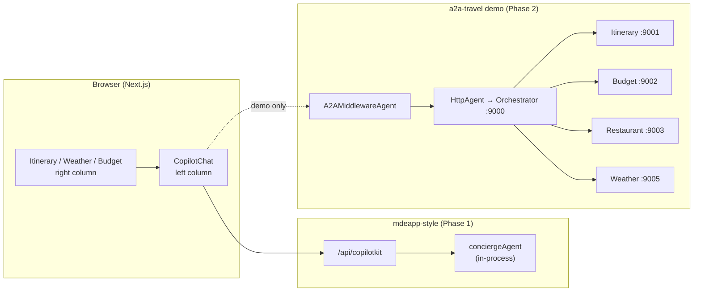
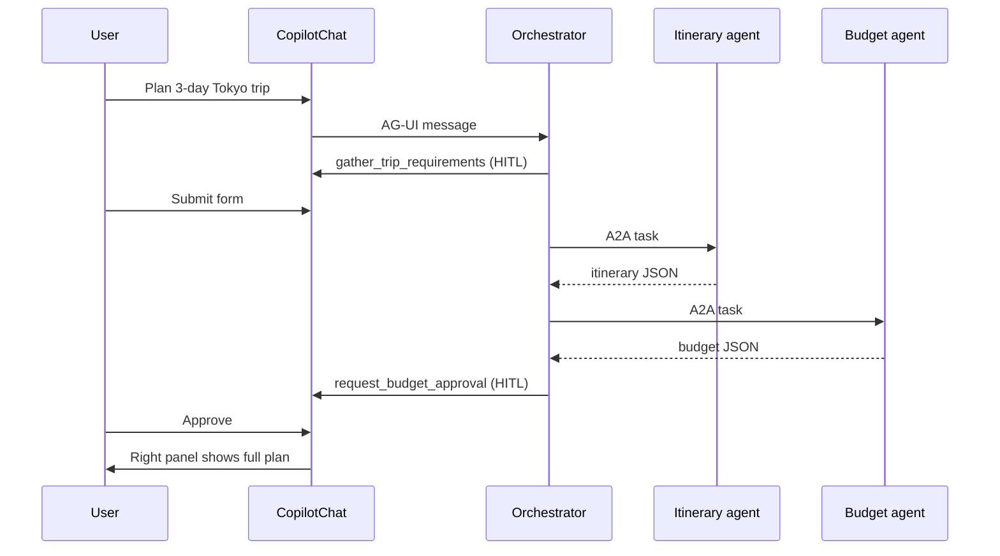
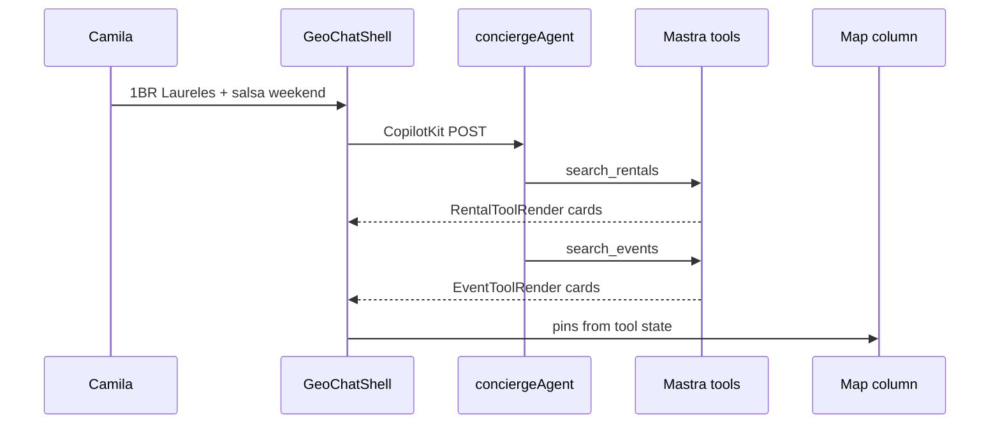

# a2a-travel → mdeai adaptation guide

**Source:** [`CopilotKit/examples/showcases/a2a-travel`](../../CopilotKit/examples/showcases/a2a-travel)  
**Skills:** [`.agents/skills/copilotkit/V1/showcases/a2a-travel/`](../../.agents/skills/copilotkit/V1/showcases/a2a-travel/README.md)  
**Updated:** 2026-06-02

Plain-language guide: what the demo does, which patterns matter for mdeai, and how to adapt them **without** copying Python microservices into Phase 1.

---

## 1. What is a2a-travel? (30 seconds)

A **travel planning demo** where one chat assistant coordinates **four specialist agents** (itinerary, restaurants, weather, budget) built in **different frameworks** (LangGraph + Google ADK). They talk to each other over the **A2A protocol**; the browser talks to the orchestrator over **AG-UI + CopilotKit**.

**User story:** Camila says *"Plan a 3-day trip to Medellín"* → form collects dates/budget → agents run in sequence → budget needs her approval → full plan appears in the right panel.

**Important for mdeai:** The **UI patterns** (dual-pane, HITL forms, approval gates) are reusable now. The **A2A middleware + 6 Python processes** are Phase 2 architecture — mdeapp today uses **one Mastra agent in Next.js** (Pattern 1).

---

## 2. Architecture at a glance



| Layer | a2a-travel | mdeapp today |
|-------|------------|--------------|
| UI | Next.js + CopilotKit 1.x **latest** | Next.js + CopilotKit **1.55.2** |
| Runtime | `A2AMiddlewareAgent` + `HttpAgent` | `MastraAgent.getLocalAgents({ mastra })` |
| Agents | 4 Python services + orchestrator | `conciergeAgent`, `hostEventAgent` in TS |
| AI models | OpenAI + Gemini mix | **Gemini only** |
| Deploy | 6 local processes | Single Vercel Next app |

---

## 3. Features in the demo

| Feature | What the user sees | Where in repo |
|---------|-------------------|---------------|
| **Multi-agent coordination** | Chat says it's calling Itinerary → Weather → Restaurant → Budget | `agents/orchestrator.py`, middleware `instructions` in `route.ts` |
| **A2A message visualization** | Green/blue boxes: Orchestrator ↔ specialist agent | `MessageToA2A.tsx`, `MessageFromA2A.tsx` |
| **Trip requirements HITL** | Form in chat: city, days, people, budget tier (pre-filled from message) | `gather_trip_requirements`, `TripRequirementsForm.tsx` |
| **Budget approval HITL** | Approve/reject card in chat before plan is final | `request_budget_approval`, `BudgetApprovalCard.tsx` |
| **Dual-pane layout** | Chat fixed left (~450px); plan cards scroll right | `app/page.tsx` |
| **Structured panel updates** | Itinerary, weather, budget cards populate as agents finish | `ItineraryCard`, `WeatherCard`, `BudgetBreakdown` |
| **Sequential workflow** | Agents run one-at-a-time (no parallel tool storms) | Middleware + orchestrator prompts |
| **CLI client (optional)** | Same agent in terminal with state snapshots | `src/cli/index.ts` |

---

## 4. Patterns (what to steal vs skip)

### 🟢 Adapt now (Phase 1) — no A2A required

These work with **existing Mastra + CopilotKit 1.55.2** in `mdeapp/`.

| Pattern | Demo code idea | mdeai adaptation |
|---------|----------------|------------------|
| **Dual-pane chat + content** | Left chat, right `ItineraryCard` | Already on `/` (`GeoChatShell`). Extend `/trips/[id]` with chat column + `ItineraryPanel` |
| **HITL form with pre-fill** | `renderAndWaitForResponse` + form seeded from `args` | Trip planner: destination/dates/guests from Camila's message → form in chat |
| **HITL approval gates panel** | Budget only hits right panel after approve | Ticket checkout confirm; trip budget; Roberto publish (already have publish panel) |
| **Sequential tool discipline** | "ONE agent at a time" in prompts | `conciergeAgent` instructions: search rentals → then events; host wizard step order |
| **Generative UI for tools** | `useCopilotAction` + `render` | Same as `search-tool-renders.tsx` (disabled action mirrors Mastra tools) |

### 🟡 Phase 2 — when `/trips` multi-agent is scoped

| Pattern | Demo | mdeai future |
|---------|------|--------------|
| **A2A middleware runtime** | `A2AMiddlewareAgent` in `route.ts` | Separate specialist agents (itinerary optimizer, restaurant grounder) as services |
| **Agent hop visualizer** | Render on `send_message_to_a2a_agent` | Patricia debug / transparency UI |
| **Multi-process dev** | `concurrently` 6 services | Local only; not Vercel |

### 🔴 Do not copy

| Demo habit | Why |
|------------|-----|
| Scrape `useCopilotChat().visibleMessages` for JSON | Fragile — use typed callbacks or tool renders |
| Nested `<CopilotKit>` inside `TravelChat` | mdeapp uses one provider + nested agent only on host layout |
| Python ADK + LangGraph sidecars | Phase 2; ADK MCP disabled for Phase 1 |
| OpenAI agents | Gemini-only rule |
| `@copilotkit/*` latest | Pin 1.55.2 |

---

## 5. Use cases → mdeai personas

| Demo flow | Persona | mdeai surface | Phase |
|-----------|---------|---------------|-------|
| "Plan 3 days in Tokyo" | **Camila** | `/trips` create + `/trips/[id]` workspace | P2 |
| Trip requirements form | Camila | Chat HITL before writing `trips` row | P2 |
| Day-by-day itinerary card | Camila | `ItineraryPanel` + `trip_items` (DB exists) | P1 shell → P2 AI fill |
| Restaurant per day | Tourist | `search_grounded_places` + save to trip | P1 tools exist |
| Weather forecast card | Tourist | Phase 2 enrichment (not MVP) | POST |
| Budget breakdown + approve | Camila / Andrés | `trips.budget` field + approval HITL | P2 |
| Orchestrator calls specialists | Platform | Single `conciergeAgent` + Mastra tools today | P1 |
| Green/blue agent messages | **Patricia** / Sofía | Ops visibility | P2 |

**Real Medellín example (Camila):**

> "I'm in Medellín for 4 nights, two of us, mid-range budget. Build an itinerary with one salsa night and a coffee tour in Poblado."

**Phase 1 (no A2A):** `conciergeAgent` calls `search_events`, `search_grounded_places`, cards + pins update in right column; Camila manually saves to `/saved`.

**Phase 2 (a2a-inspired UI, Mastra backend):** Same chat → HITL form confirms 4 nights / 2 guests / Comfort → tools populate `trip_items` → itinerary tab on `/trips/[uuid]` → budget approval before showing total COP estimate.

---

## 6. Code patterns (demo → mdeai)

### 6.1 Dual-pane layout

**Demo** (`app/page.tsx`):

```tsx
<div className="flex flex-1 overflow-hidden">
  <div className="w-[450px] flex-shrink-0">
    <TravelChat onItineraryUpdate={setItineraryData} … />
  </div>
  <div className="flex-1 overflow-y-auto">
    {itineraryData && <ItineraryCard data={itineraryData} />}
  </div>
</div>
```

**mdeai today** — home already splits chat + map (`GeoChatShell`). **Trips target:**

```tsx
// Concept: app/trips/[id]/page.tsx (client shell)
<div className="flex h-screen">
  <aside className="w-full max-w-md border-r">
    <CopilotChat … />  {/* or link back to / with threadId */}
  </aside>
  <main className="flex-1 overflow-y-auto">
    <TripWorkspaceView trip={trip} />  {/* existing ItineraryPanel */}
  </main>
</div>
```

Files to extend: `mdeapp/src/app/trips/[id]/page.tsx`, `trip-workspace-view.tsx`.

---

### 6.2 HITL trip requirements (pre-filled form)

**Demo:**

```tsx
useCopilotAction({
  name: "gather_trip_requirements",
  renderAndWaitForResponse: ({ args, respond }) => (
    <TripRequirementsForm args={args} respond={respond} />
  ),
});
```

**mdeai adaptation** — Mastra tool + matching frontend action (Pattern 1):

```tsx
// Frontend: components/trips/trip-requirements-hitl.tsx
useCopilotAction({
  name: "gather_trip_requirements",  // must match Mastra createTool id
  renderAndWaitForResponse: ({ args, respond }) => (
    <TripRequirementsForm
      defaultDestination={args.destination ?? "Medellín"}
      defaultNights={args.nights}
      onSubmit={(data) => respond?.(data)}
    />
  ),
}, []);
```

```ts
// Mastra: src/mastra/tools/gather-trip-requirements.ts
export const gatherTripRequirementsTool = createTool({
  id: "gather_trip_requirements",
  description: "Collect trip destination, dates, guests, budget tier",
  // HITL: agent pauses until frontend respond() — same as preview_and_publish
});
```

**Roberto precedent:** `host-event-copilot-bridge.tsx` already uses `renderAndWaitForResponse` on `preview_and_publish`.

---

### 6.3 Budget / approval gates the main panel

**Demo:**

```tsx
// Chat: user must approve
respond?.({ approved: true, message: "Budget approved" });

// Panel: only update parent state if approved
if (approvalStates[budgetKey]?.approved) {
  onBudgetUpdate?.(parsed);
}
```

**mdeai adaptations:**

| Flow | Panel gated | Existing code |
|------|-------------|---------------|
| Roberto publish | Event goes live | `EventPublishApprovalPanel` |
| Andrés checkout | Ticket confirmation | Stripe checkout overlay (shell) |
| Camila trip budget | Show COP total on `/trips/[id]` | New — mirror budget approval card |

---

### 6.4 Tool render (what we already do — better than the demo)

**Demo** also scrapes chat messages for JSON (avoid).

**mdeai** — production pattern:

```tsx
// mdeapp/src/components/copilot/search-tool-renders.tsx
useCopilotAction(
  { name: "searchRentalsTool", available: "disabled", render: RentalToolRender },
  [],
);
```

When Camila asks for rentals, Mastra runs `searchRentalsTool` → AG-UI streams tool call → card renders in chat → pins sync to map. **No message scraping.**

---

### 6.5 A2A middleware (Phase 2 reference only)

**Demo** (`app/api/copilotkit/route.ts`):

```ts
const orchestrationAgent = new HttpAgent({ url: "http://localhost:9000" });
const a2aMiddlewareAgent = new A2AMiddlewareAgent({
  agentUrls: ["http://localhost:9001", …],
  orchestrationAgent,
  instructions: `… sequential workflow …`,
});
const runtime = new CopilotRuntime({ agents: { a2a_chat: a2aMiddlewareAgent } });
```

**Do not add to mdeapp** until product signs off on multi-service ops. Until then, keep:

```ts
// mdeapp/src/app/api/copilotkit/[[...path]]/route.ts (Pattern 1)
agents: getLocalAgentsWithLogging({ mastra }),
```

---

## 7. End-to-end flows (comparison)

### Demo: "Plan a 3-day trip to Tokyo"



### mdeai Phase 1: "Find a 1BR in Laureles + salsa this weekend"



### mdeai Phase 2 target: "Plan my Medellín trip" (a2a-travel UX, Mastra backend)

Same **dual-pane + HITL** as demo, but:

- One `tripPlannerAgent` or orchestration workflow in Mastra (TS)
- Tools: `gather_trip_requirements`, `append_trip_item`, `request_budget_approval`
- Persist to Supabase `trips` + `trip_items` (tables exist)
- Render itinerary in existing `ItineraryPanel`

---

## 8. File map: demo → mdeai

| a2a-travel file | Purpose | mdeai equivalent / target |
|-----------------|---------|---------------------------|
| `app/page.tsx` | Dual-pane shell | `geo-chat-shell.tsx`, future `trips/[id]` layout |
| `components/travel-chat.tsx` | HITL + A2A renders | New `trip-copilot-bridge.tsx` |
| `TripRequirementsForm.tsx` | Slot-filling HITL | `components/trips/trip-requirements-form.tsx` |
| `BudgetApprovalCard.tsx` | Approval HITL | `components/trips/budget-approval-card.tsx` |
| `ItineraryCard.tsx` | Structured plan UI | `itinerary-panel.tsx` (day groups from DB) |
| `app/api/copilotkit/route.ts` | A2A middleware | **Keep** `api/copilotkit/[[...path]]/route.ts` Pattern 1 |
| `agents/orchestrator.py` | Multi-agent brain | `conciergeAgent` / future `tripPlannerAgent` instructions |
| `MessageToA2A.tsx` | Debug UX | Phase 2 ops only |

---

## 9. Implementation checklist (when picking up `/trips` AI)

**Phase 1 — UI patterns only (no new runtime):**

- [ ] Split `/trips/[id]` into chat + workspace columns (or deep-link to `/` with `threadId`)
- [ ] Add `gather_trip_requirements` HITL form (frontend action + Mastra tool)
- [ ] Wire tool results → `trip_items` insert (server action or Mastra tool with Supabase)
- [ ] Reuse `ItineraryPanel` for display; conflict detection already shipped
- [ ] Document sequential prompt rules in `conciergeAgent` for multi-intent trip planning

**Phase 2 — multi-agent (optional):**

- [ ] Architecture review: stay Mastra workflows vs A2A middleware
- [ ] If A2A: new env vars for agent URLs; never mix with Pattern 1 in same route
- [ ] Agent hop visualizer for Patricia

**Verification:**

- [ ] `npm run dev` — single process boot (Phase 1)
- [ ] Playwright: trip form HITL → itinerary row appears
- [ ] No `visibleMessages` JSON scraping in production code

---

## 10. Quick reference links

| Doc | Path |
|-----|------|
| CopilotKit skills (a2a-travel) | `.agents/skills/copilotkit/V1/showcases/a2a-travel/` |
| Mastra Pattern 1 | `.agents/skills/copilotkit-integrations/references/integrations/mastra.md` |
| Prior review notes | `tasks/notes/notes-20-a2a-travel.md` |
| Trips shell | `mdeapp/src/app/trips/`, `components/trips/` |
| Host HITL reference | `mdeapp/src/components/host/host-event-copilot-bridge.tsx` |
| Search card renders | `mdeapp/src/components/copilot/search-tool-renders.tsx` |
| Sitemap status | `sitemap.md` — `/trips` ⚠️ SHELL |

---

## 11. One-line takeaway

**Steal the UX** (chat + plan panel, forms and approvals in chat, sequential planning). **Keep mdeai's engine** (Mastra in-process, Gemini, disabled tool renders, Supabase trips). **Defer A2A middleware** until multi-service agents are a deliberate Phase 2 bet—not a launch blocker.
