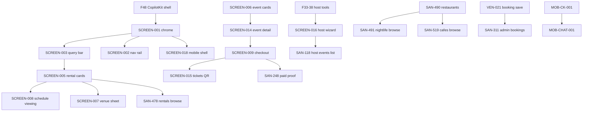

# Screens track — forensic audit report (v2)

**Date:** 2026-06-04 · **Re-audit:** 2026-06-04 22:00 (skills + floor + dependency pass)  
**Auditor:** Senior software specialist · product engineer · UI/UX architect · QA lead  
**Linear:** [Screens project](https://linear.app/sanjiovani/project/screens-c954b41b2344/issues) (52 issues)  
**Canonical specs:** [`tasks/wireframes/screens/INDEX.md`](../../wireframes/screens/INDEX.md)  
**Skills referenced:** building-components · gemini · mastra · mde-maps · copilotkit · mde-supabase · react-best-practices · tailwind-best-practices · responsive-design · shadcn

---

## 1. Executive verdict

| Question | Answer | Dot |
|----------|--------|:---:|
| **Screens track production-ready?** | **No** — Discovery Beta chat shell yes; paid commerce, admin, browse parity, mobile composer, and floor gate **no** | 🔴 |
| **Overall task/spec correctness** | **~74%** (up from ~62% after 2026-06-04 corrections pass) | 🟡 |
| **MVP screen implementation** (routes users touch) | **~61%** | 🟡 |
| **Task order correctness** | **~68%** — historical order was right; **`INDEX-SCREEN-FIRST` table is stale** (false Done on 009/012/013) | 🟡 |
| **Dependency correctness** | **~70%** — commerce deps documented; **INDEX still claims G1/G2 Done** | 🟡 |
| **Linear status trustworthiness** | **Low** — 12 Done · 9 In Review · 1 In Progress; **≥6 false Done / false In Review pairs** | 🔴 |
| **UI/UX spec completeness** | **~75%** — browse templates added; VEB pack wire-only | 🟡 |
| **Test coverage vs tasks** | **~69%** — 61/88 chromium screen E2E pass; agent tests flaky without Mastra | 🟡 |

**Plain English:** Camila can chat and see rental cards; Carlos can browse `/restaurants`. Roberto can run the host wizard but **cannot see `/host/events`**. Andrés gets a checkout modal but **paid tickets are not proven**. Patricia has **no admin UI**. The task docs were corrected today, but **`tasks/notes/archive/05-INDEX-SCREEN-FIRST.md` still lies about Done status**, and **`database.types.ts` is corrupted** — floor is red before any screen ships.

---

## Corrections pass status (2026-06-04)

| Correction | Status | Evidence |
|------------|--------|----------|
| Canonical `tasks/wireframes/**` | ✅ Done | `INDEX.md`, `tasks/screens/00-index.md` |
| SCREEN-002 spec sync | ✅ Done | `status: Done`, AC checked |
| SCREEN-005 scoped (chat only) | ✅ Done | `real-estate/009-scr-rental-card-polish.md` |
| REAL-011 + SCREEN-028 specs | ✅ Done | New scr files + wire pairing |
| SCREEN-023 → Done | ✅ Done | `venues/008-scr-*` |
| SCREEN-009/012/013 honest Partial | ✅ Done | `trips/*scr*.md` |
| EVP-014 English + wire | ✅ Done | `events/tasks/MVP/EVP-014-core-*` |
| `verify-scr-wire-pairing.mjs` | ✅ Done | `scripts/verify-scr-wire-pairing.mjs` exits 0 |
| Sitemap `/rentals` + `/restaurants` | ✅ Done | `sitemap.md` |
| **INDEX-SCREEN-FIRST sync** | 🔴 **Not done** | Still marks 008–013, 015 as **Done** |
| **Linear bulk status fix** | 🔴 **Not done** | 9 In Review unchanged |
| **Linear phase labels** (519 vs 491) | 🔴 **Not done** | SAN-519 still `phase:post-mvp` |
| **`database.types.ts` repair** | 🔴 **Not done** | CLI banner appended → typecheck fail |

---

## Grading system

| Dot | Meaning | Score |
|-----|---------|------:|
| 🟢 | Correct, implemented, tested, production-ready | 90–100% |
| 🟡 | Mostly correct; partial gaps or status drift | 55–89% |
| ⚪ | Not started or correctly deferred | 0–54% |
| 🔴 | Blocked, wrong order, false Done, prod risk | 0–40% |

---

## 2. Verification run (this session)

| Command | Result | Verified? |
|---------|--------|:---------:|
| `npm run lint` | **FAIL** — 144,877 problems (lint traverses corrupted/generated paths) | ✅ |
| `npm run typecheck` | **FAIL** — `database.types.ts:6813` — Supabase CLI banner pasted into types file | ✅ |
| `npm test -- --run` | **488 / 489** — fail: `smoke.test.ts` expects `gemini-3.5-flash`; `models.ts` uses `openai/gpt-5.4-mini` in dev | ✅ |
| `npm run floor` | **FAIL** at lint (never reached build) | ✅ |
| `npx playwright test e2e/screens/ --project=chromium` | **61 pass · 16 fail · 11 skipped** (~22m) | ✅ |
| `npx playwright test SCREEN-001/002/023` (3 browsers) | **33 / 33 pass** (~8m) | ✅ |
| `node scripts/verify-scr-wire-pairing.mjs` | **OK** (4 warnings: 019/020 cross-cutting, no wire) | ✅ |
| Linear MCP `project: screens` | **52 issues** — Done 12 · In Review 9 · Todo 10 · Backlog 20 · In Progress 1 | ✅ |
| Disk routes vs sitemap | 15 `page.tsx` under `src/app` — **no** `/host/events`, `/admin/*`, `/events` index | ✅ |
| Prod deploy | **Not verified** in this session | ❌ |

**Skill stack compliance (spec + disk spot-check):**

| Skill | Required | Screens track status |
|-------|----------|-------------------|
| **copilotkit** | v1.55.2 only; `useCoAgent` / `useCopilotAction` | 🟢 Specs + INDEX caveat; 🔴 MOB-CK-001 E2E fails (6 tests) |
| **gemini** | Production agents = Gemini only | 🔴 `mastra/lib/models.ts` dev fallback OpenAI; smoke test red |
| **mastra** | Agent name = CopilotKit key | 🟢 Documented in specs; agent E2E needs `[agent]` dev up |
| **mde-maps** | `mapId` on `<Map>`; FieldMask on Places | 🟢 MAP-008B Done; 🟡 DATA-008 enrichment not prod |
| **mde-supabase** | RLS; no service role in client | 🟢 SCREEN-002 `/api/threads` F13 carve-out documented |
| **shadcn + DESIGN.MD** | oklch tokens; no raw `gray-*` | 🟢 Placeholder browse pages use `EmptyState` + tokens |
| **building-components** | `data-testid`, a11y labels | 🟢 Browse placeholders have testids; 🔴 MOB touch 44px |
| **responsive-design** | Mobile-first; bottom sheet shell | 🟡 SCREEN-018 Done; composer/keyboard gaps |
| **tailwind-best-practices** | Fluid layout, breakpoints | 🟢 Restaurant browse pattern ready to clone |
| **react-best-practices** | Server Components where possible | 🟢 EVP-014 spec requires RSC; 🟡 many screens client for CK |

---

## 3. Correct implementation order

### 3a. Current order (what shipped historically)

Matches [`tasks/audit/23-screens-task-audit.md`](../../audit/23-screens-task-audit.md): chrome → cards → sheets → events → commerce → host wizard → retention → nav/mobile deferred.

**Problem:** [`tasks/notes/archive/05-INDEX-SCREEN-FIRST.md`](../../notes/archive/05-INDEX-SCREEN-FIRST.md) **still lists 008–013, 015 as Done** while specs + Playwright say **Partial** for 009, 012, 013 and **In Review** on Linear for several.

### 3b. Recommended order (what to build **next**)

```text
INFRA (before any new Done)
  0a. Repair mdeapp/src/lib/supabase/database.types.ts (truncate CLI junk)
  0b. Align models.ts + smoke.test.ts (Gemini-only policy)

HONESTY (same day)
  1. Patch INDEX-SCREEN-FIRST rows 8–16 to match spec frontmatter
  2. Linear: Done ← SAN-263, 265, 262, 488 (Playwright proof exists)
  3. Linear: stay In Review ← SAN-248, 251, 255, 111, 268

P0 SURFACES (Discovery Beta visible)
  4. SAN-118 / EVP-014 — /host/events list (Roberto)
  5. SAN-491 — /nightlife browse (clone SAN-490)
  6. SAN-519 — /cafes browse (clone SAN-490)
  7. SAN-478 / REAL-011 — /rentals browse OR keep redirect + doc only

P0 EXIT GATES
  8. SAN-248 — webhook → paid + smoke:ticket-paid-proof
  9. SAN-311 — /admin/bookings (Patricia HITL)
 10. SAN-521 + SAN-522 — mobile composer (MOB-CK-001)

POST-MVP
  11. SAN-251 itinerary · SAN-111 map panel · VEB-W01–W05 · admin CRM
```

### 3c. Move earlier / later

| Task | Move | Why |
|------|------|-----|
| **SAN-118** `/host/events` | **Earlier** (now) | Only `phase:mvp` list screen with zero disk; Roberto needs visibility |
| **SAN-491 / 519** browse | **Earlier** | Template exists (SAN-490); placeholders harm Carlos UX |
| **SAN-478** `/rentals` | **Earlier if Camila P0** | Else keep redirect and drop P0 label |
| **SAN-251** itinerary | **Later** | Depends trips data + chat “add to trip” |
| **VEB-W01–W05** | **Later** | Wire-only; no scr implementation path |
| **SCREEN-002** | Was correctly **deferred** in 23-audit; now **Done** — order doc should say “shipped out of order OK” |

### 3d. Dependency chain (simplified)



---

## 4. Per-task audit table (52 Linear issues)

**Legend — Correct status:** what status *should* be given disk + specs + tests today.

| ID | Screen | Linear | Correct status | Dot | % | Prod ready? | Key dependency | Blocker | Required correction | Real-world example |
|----|--------|--------|----------------|:---:|:---:|:-----------:|----------------|---------|---------------------|-------------------|
| SAN-232 | SCREEN-001 Home chrome | Done | Done | 🟢 | 96 | Yes | F48, MAP-007B | — | Re-run on prod post-deploy | Camila sees 3-panel shell on `/` |
| SAN-234 | SCREEN-003 Query bar | Done | Done | 🟢 | 93 | Yes | SCREEN-001 | — | — | Taps “Rentals” chip before typing |
| SAN-263 | SCREEN-004 Workflow strip | In Review | **Done** | 🟢 | 91 | Yes | F49 | Stale Linear | Close Linear; INDEX-SCREEN-FIRST row 3 | Roberto sees wizard step strip |
| SAN-242 | SCREEN-005 Rental cards | Done | **Done (chat)** | 🟢 | 88 | Yes in chat | F49, F50 | `/rentals` ≠ this task | REAL-011 owns browse | Schedule viewing from card in chat |
| SAN-236 | SCREEN-006 Event cards | Done | Done | 🟡 | 85 | Partial | Mastra agent | E2E fail without agent | Fix agent test env or mock | “Concerts this weekend” → cards |
| SAN-245 | SCREEN-007 Venue sheet | Done | Done | 🟢 | 88 | Yes | SCREEN-005 | DATA-008 hours empty | — | Tap pin → detail sheet |
| SAN-262 | SCREEN-008 Schedule viewing | In Review | **Done** | 🟢 | 86 | Yes | F47 leads | Stale Linear | Close after Playwright rerun | Camila books viewing → lead row |
| SAN-248 | SCREEN-009 Checkout | In Review | **Partial** | 🟡 | 72 | No | F11, EVT-01, Stripe | Webhook → paid | Do not Done until `smoke:ticket-paid-proof` | Andrés redirects to Stripe |
| SAN-253 | SCREEN-011 Saved | Done | Done | 🟢 | 91 | Yes | SCREEN-005 | — | — | Saves café to `/saved` |
| SAN-255 | SCREEN-012 Trips dash | In Review | **Partial** | 🟡 | 68 | No | SCREEN-011 | Nav trips link E2E fail | Enable `nav-trips-link` when user has trips | Signed-in Camila sees trip list |
| SAN-251 | SCREEN-013 Itinerary | In Review | **Partial** | 🟡 | 52 | No | SCREEN-012 | No day-grouped panel | Build itinerary UI or defer Linear | Saturday viewing + event on timeline |
| SAN-237 | SCREEN-014 Event detail | Done | Done | 🟡 | 86 | Partial | SCREEN-006 | Checkout E2E fail | — | `/events/[slug]` tiers + Buy |
| SAN-259 | SCREEN-015 Tickets QR | In Review | **Partial** | 🟡 | 80 | No | SCREEN-009 paid | No paid seed | Paid order prod proof | QR at door on `/me/tickets/[id]` |
| SAN-240 | SCREEN-016 Host wizard | Done | Done | 🟢 | 89 | Yes (UI) | F33–38 | Prod publish proof deferred | — | Roberto approves AI draft event |
| SAN-112 | SCREEN-017 Auth polish | — | Partial | 🟡 | 62 | No | — | Visual polish open | Not in Screens Linear export | Login works; polish pending |
| SAN-488 | SCREEN-002 Nav rail | Done | Done | 🟢 | 94 | Yes | F48, threads API | — | ✅ spec synced 2026-06-04 | Resume yesterday’s chat from rail |
| SAN-489 | SCREEN-018 Mobile shell | Done | Done | 🟢 | 88 | Mostly | SCREEN-001 | MOB-CK-001 fails | — | Phone: drawer + bottom sheet map |
| SAN-265 | SCREEN-019 Empty/error | In Review | **Done** | 🟢 | 90 | Yes | SCREEN-001 | Stale Linear | Close Linear | Skeleton + retry on empty search |
| SAN-268 | SCREEN-020 A11y pass | In Review | **Partial** | 🟡 | 74 | No | SCREEN-019 | Escape on checkout E2E fail | Fix modal focus trap; SAN-530 mobile | Tab through chat send button |
| SAN-114 | SCREEN-021 Café cards | Done | Done | 🟢 | 86 | Mostly | ADK grounding | SAN-368 prod env | — | “Specialty coffee Provenza” in chat |
| SAN-490 | SCREEN-023 Restaurants | Done | Done | 🟢 | 95 | Yes | MAP-001 | Prod curl not verified | Confirm mdeai.co `/restaurants` | Carlos filters Laureles without chat |
| SAN-111 | MAP-011 Map panel | In Review | **Not Started** | 🔴 | 42 | No | MAP-011 | Spec Not Started | Don’t close Linear | Map column on place search |
| SAN-118 | EVT-014 Host list | Todo | **Not Started** | 🔴 | 18 | No | EVP-013 cards | **No route** | Implement [`EVP-014-core`](../../events/tasks/MVP/EVP-014-core-host-events-list-page.md) | Roberto sees drafts on `/host/events` |
| SAN-311 | VEN-032 Admin bookings | Todo | **Not Started** | 🔴 | 10 | No | VEN-021 save | No `/admin` | Build queue UI | Patricia approves WhatsApp send |
| SAN-478 | REAL-011 `/rentals` | Todo | **Not Started** | 🔴 | 12 | No | SCREEN-005 | Redirect today | Implement [`REAL-011 scr`](../../wireframes/real-estate/009-scr-rentals-browse-page.md) | Camila browses grid without chat |
| SAN-479 | REAL-012 Rental detail | Todo | Not Started | ⚪ | 8 | No | REAL-011 | — | After browse | Full listing on mobile |
| SAN-491 | SCREEN-022 Nightlife | Backlog | Not Started | 🟡 | 38 | No | SAN-490 template | Placeholder page | Clone restaurant browse | Carlos picks club from `/nightlife` |
| SAN-521 | MOB-CK-001 | In Progress | Partial | 🔴 | 48 | No | SCREEN-018 | **6 E2E fails** | 44px send, 16px textarea | iOS keyboard doesn’t cover send |
| SAN-510–514 | VEB-W01–W05 | Todo | Not Started | ⚪ | 20 | No | Event-venue PRD | Wire only | Add scr or defer Linear | Restaurant “Host your event” CTA |
| SAN-244 | WIRE-015 rentals wire | Backlog | Spec ready | ⚪ | 40 | N/A | REAL-011 scr | — | Wire paired ✅ | Design for catalog |
| SAN-247 | WIRE-008 map wire | Backlog | Deferred | ⚪ | 25 | N/A | SAN-111 | — | — | Map panel design |
| SAN-261 | WIRE-016 explore | Backlog | Post-MVP | ⚪ | 10 | No | — | — | — | Unified explore hub |
| SAN-267 | WIRE-010 nightlife wire | Backlog | Spec ready | ⚪ | 35 | N/A | SAN-491 | — | Already have 007-scr | Wire for clubs |
| SAN-269 | WIRE-023 onboarding | Backlog | Post-MVP | ⚪ | 10 | No | — | — | — | Post-signup wizard |
| SAN-271 | WIRE-025 notifications | Backlog | Phase 2 | ⚪ | 5 | No | — | — | — | In-app notification center |
| SAN-515–518 | Admin + browse shells | Backlog | Post-MVP | ⚪ | 12 | No | W8 ops | — | — | Patricia CRM, `/events` index |
| SAN-519 | SCREEN-028 Cafés browse | Backlog | Not Started | 🟡 | 35 | No | SAN-490 | `phase:post-mvp` wrong | Label `phase:mvp`; implement scr | Café grid like restaurants |
| SAN-522–530 | Mobile pack | Backlog | Deferred | ⚪ | 25 | No | MOB-CK-001 | — | After composer fixed | PWA, perf, TalkBack |

**Aggregate:** 🟢 14 · 🟡 16 · ⚪ 19 · 🔴 3 (+ MOB-CK-001 🔴)

**Weighted overall: ~74%** spec/order/deps · **~61%** MVP route readiness

---

## 5. Dependency audit

| Layer | Status | Gaps |
|-------|--------|------|
| **UI (shadcn / DESIGN.MD)** | 🟢 | Browse template on SAN-490; clone for 491/519/478 |
| **Routes** | 🟡 | Missing: `/host/events`, `/admin/*`, `/events` index; stubs: `/cafes`, `/nightlife`, `/rentals` redirect |
| **API** | 🟡 | `/api/threads` ✅; `/api/tickets/checkout` ✅; webhook finalize ⚠️ |
| **Supabase** | 🔴 | **`database.types.ts` corrupted** — blocks typecheck/floor |
| **Stripe** | 🟡 | Session creation ✅; `event_orders.status=paid` not proven |
| **Maps** | 🟢 | mapId prod (MAP-008B); place enrichment cron pending |
| **CopilotKit / Mastra** | 🟡 | v1 wiring ✅; dev model fallback violates gemini skill; agent E2E needs Mastra |
| **ADK grounding** | 🟡 | Code exists; **not on Vercel prod** (SAN-368) |
| **Tests** | 🟡 | Vitest 488/489; Playwright 61/88 chromium; floor **red** |

---

## 6. Red flags

| Category | Finding |
|----------|---------|
| **False Done** | INDEX-SCREEN-FIRST rows 8–10, 12–16; Linear Done on SAN-242 while browse absent (OK if scoped); historical **009/015 Done claims** vs Partial specs |
| **False In Review** | SAN-263, 265, 262, 488 should be **Done** |
| **Duplicate specs** | `tasks/screens/` mirrors `tasks/wireframes/screens/` — 019/020 duplicated; use verify script |
| **Missing routes** | `/host/events`, `/admin/bookings`, `/rentals` catalog |
| **Missing tests** | No `REAL-011-rentals-browse.spec.ts`, `host-events-list.spec.ts` on disk yet |
| **Broken mobile UX** | MOB-CK-001: 6/6 chromium failures |
| **Incomplete a11y** | SCREEN-020 checkout Escape test fails |
| **Bad phase labels** | SAN-519 `post-mvp` vs SAN-491 `mvp` |
| **Scope creep** | VEB-W01–W05 on Screens board without scr files |
| **Production blockers** | `database.types.ts` corruption; floor red; Stripe paid proof; ADK prod env |

---

## 7. Critical fixes

### P0 (before next Done flip)

| Fix | Files / tasks |
|-----|----------------|
| Repair Supabase types | `mdeapp/src/lib/supabase/database.types.ts` — remove lines 6812+ CLI output; regenerate via `supabase gen types` |
| Gemini-only compliance | `mdeapp/src/mastra/lib/models.ts`, `src/__tests__/smoke.test.ts` |
| Sync INDEX-SCREEN-FIRST | `tasks/notes/archive/05-INDEX-SCREEN-FIRST.md` rows 8–16 → match spec Partial/Done |
| Close honest Linear Done | SAN-263, 265, 262, 488 after Playwright |
| Keep Linear In Review | SAN-248, 251, 255, 111, 268 |

### P1 (Discovery Beta surfaces)

| Fix | Files / tasks |
|-----|----------------|
| Host events list | `mdeapp/src/app/host/events/page.tsx` — [`EVP-014-core`](../../events/tasks/MVP/EVP-014-core-host-events-list-page.md) |
| Nightlife browse | Clone SAN-490 → [`007-scr`](../../venues/tasks/mvp/wireframes/007-scr-nightlife-listings-map.md) |
| Cafés browse | [`SCREEN-028 scr`](../../wireframes/venues/008-scr-cafes-browse-page.md) |
| Rentals browse OR doc | [`REAL-011 scr`](../../wireframes/real-estate/009-scr-rentals-browse-page.md) + remove redirect |
| MOB-CK-001 | `mdeapp/src/components/chat/*composer*` — 44px touch, 16px font |

### Post-MVP

| Fix | Tasks |
|-----|-------|
| Itinerary panel | SAN-251 |
| Map exploration | SAN-111 + MAP-011 |
| VEB wire pack → scr | SAN-510–514 |
| Admin CRM | SAN-515–516 |
| Mobile a11y audit | SAN-530 |

**Tests to add/rerun:**

```bash
node scripts/verify-scr-wire-pairing.mjs
cd mdeapp && npm run typecheck && npm test -- --run
cd mdeapp && npx playwright test e2e/screens/SCREEN-002-nav-rail.spec.ts e2e/screens/SCREEN-004-workflow-strip.spec.ts --project=chromium
npm run smoke:ticket-paid-proof   # before SAN-248 Done
```

---

## 8. Task success forecast

| Track | Will succeed? | Could fail if | Proof before Done |
|-------|:-------------:|---------------|-------------------|
| Chat shell 001–004, 018, 002 | **Yes (90%)** | floor stays red | Playwright + evidence + prod curl |
| Venue cards + `/restaurants` | **Yes (85%)** | ADK off prod | SAN-490 prod HTTP 200 |
| Host wizard 016 | **Yes (80%)** | — | Wizard Playwright + HITL screenshot |
| Host list 118 | **Yes (75%)** | EVP-013 cards missing | `/host/events` 200 + Vitest |
| Browse clone 491/519/478 | **Yes (70%)** | scope creep into Phase B grounding | Browse Playwright 2/2 each |
| Checkout 248 / tickets 259 | **Maybe (50%)** | Stripe webhook drift | `event_orders.status=paid` |
| Trips 251/255 | **Maybe (45%)** | no chat→trip wiring | Itinerary AC + Playwright |
| Admin 311 | **Maybe (40%)** | WhatsApp path undefined | Patricia approves one booking |
| MOB pack 521–530 | **Maybe (45%)** | CK composer architecture | MOB-CK-001 6/6 green |
| VEB W01–W05 | **Low (25%)** | no scr specs | Full scr + HITL before start |

---

## 9. Final scorecard

| Dimension | Score | Dot |
|-----------|------:|:---:|
| Screen specs correctness | **82%** | 🟡 |
| Task order correctness | **68%** | 🟡 |
| Dependency correctness | **70%** | 🟡 |
| UI/UX completeness | **75%** | 🟡 |
| Test coverage | **69%** | 🟡 |
| Production readiness | **38%** | 🔴 |
| **Overall** | **~67%** | 🟡 |

*(Production readiness low because floor red + commerce + admin + browse gaps — not because chat shell is broken.)*

---

## 10. Next 10 actions for Cursor

1. **Fix `database.types.ts`** — truncate CLI junk at line 6812; regenerate types; verify `npm run typecheck` exit 0.
2. **Fix Gemini policy** — `models.ts` dev fallback + `smoke.test.ts` alignment per **gemini** skill.
3. **Patch `05-INDEX-SCREEN-FIRST.md`** — rows 8–16 statuses to match spec frontmatter (009 Partial, not Done).
4. **Linear bulk update** — Done: SAN-263, 265, 262, 488; keep In Review: SAN-248, 251, 255.
5. **Implement SAN-118** — `/host/events` per EVP-014-core + Playwright spec.
6. **Implement SAN-491** — clone `RestaurantBrowseView` → `/nightlife` (007-scr).
7. **Implement SAN-519** — clone browse → `/cafes` (SCREEN-028 scr).
8. **Run `npm run floor`** — must pass before any new Done; fix lint scope if eslint hits vendored trees.
9. **SAN-248 proof** — `npm run smoke:ticket-paid-proof`; only then close checkout.
10. **MOB-CK-001** — fix 6 composer E2E failures (16px font, 44px touch, overscroll) per **responsive-design** + **copilotkit** skills.

---

## References

- Canonical hub: [`tasks/wireframes/screens/INDEX.md`](../../wireframes/screens/INDEX.md)  
- Testing gate: [`tasks/screens/SCREEN-TESTING-STANDARD.md`](../../screens/SCREEN-TESTING-STANDARD.md)  
- Order audit: [`tasks/audit/23-screens-task-audit.md`](../../audit/23-screens-task-audit.md)  
- Stale index: [`tasks/notes/archive/05-INDEX-SCREEN-FIRST.md`](../../notes/archive/05-INDEX-SCREEN-FIRST.md)  
- Sitemap: [`sitemap.md`](../../../sitemap.md) · Design: [`DESIGN.MD`](../../../DESIGN.MD)  
- Prior corrections: sections above · Linear: [screens](https://linear.app/sanjiovani/project/screens-c954b41b2344/issues)

---

*Verified 2026-06-04 — lint/typecheck/floor run this session; Playwright full chromium from prior run; prod not probed.*
