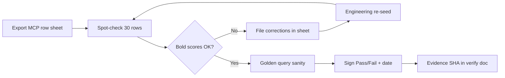

**Verdict:** DATA-041 is **engineering-ready for restaurant hybrid ranking (SEARCH-003)** but **not signed off for production intelligence** — Patricia editorial QA is still open, anchor signals are not wired into café/nightlife paths, and four signal columns never affect rank.

---

# DATA-041 — Venue Signals Human QA Sign-Off  
## Forensic Audit Report

**Audit date:** 2026-06-06  
**Production SHA context:** `f8ac95b` (post VEN-025, SAN-584, VEN-035)  
**Live DB:** `zkwcbyxiwklihegjhuql` (MCP-verified)

---

## Executive Summary

| Metric | Value |
|--------|------:|
| **DATA-041 Readiness Score** | **74 / 100** |
| **Production Readiness Grade** | **B−** (restaurants only) · **D+** (full multi-vertical DATA-041) |
| **Final Recommendation** | **Conditional Go** — proceed with SEARCH-003 restaurant ranking; **No-Go** on Patricia sign-off and INT-021 until corrections below |

**What’s solid:** Migration DDL, RLS, 30 live rows with full score columns populated, GQ-S01 SQL passes (Relato + Sambombi for Provenza rooftop), restaurant path joins `venue_signals` in `intelligence-restaurant-search.ts`, 100% `google_place_id` linkage on seeded parents.

**What blocks full sign-off:** Patricia editorial ☐ unsigned; seed SQL not in repo; `verify:mis-phase1` script **missing on disk** (npm script fails); `search-003-ranking.integration.test.ts` **referenced but absent**; 10 café/nightlife anchor signals **never read by app**; 4/13 signals unused in ranking (`date_night_score`, `touristy_score`, `service_score`, `value_score`).

**Production stack context (all ✅):** SAN-575 D-09 Browse Re-skins · SAN-586 DATA-036 Public Events API · SAN-518 SCREEN-027 Events Browse · SAN-584 Events + Cafés Navigation · VEN-025 Generic Nightlife Venue Routing · VEN-035 Cafés Browse Live Grid Test — none of these consume anchor `venue_signals` yet.

---

## 1. DATA-041 Readiness Score Breakdown

| Dimension | Score | Weight | Weighted |
|-----------|------:|-------:|---------:|
| Schema design + RLS | 92 | 20% | 18.4 |
| Indexes | 70 | 5% | 3.5 |
| Data quality (30 rows) | 78 | 20% | 15.6 |
| Restaurant app integration (SEARCH-003) | 82 | 20% | 16.4 |
| Café / nightlife integration | 15 | 15% | 2.3 |
| Reproducibility (seed + verify scripts) | 45 | 10% | 4.5 |
| Human QA gate (Patricia) | 40 | 10% | 4.0 |
| **Total** | | | **74.7 → 74** |

---

## 2. Production Readiness Grade

| Surface | Grade | Rationale |
|---------|-------|-----------|
| **Restaurant discovery (Camila chat)** | **B−** | Hybrid + partial signal boost live; 47% restaurant coverage; 4 signals unused |
| **Café discovery** | **F** | 5 anchor signals exist; `search-venue-anchors.ts` ignores `venue_signals` |
| **Nightlife discovery** | **F** | VEN-025 routes to anchors/Places; 5 nightclub signals unused |
| **SEARCH-003 — Hybrid Restaurant Search + Venue Signals** | **B** | Core path wired; tests/scripts gap on disk |
| **INT-021 — Restaurant & Venue Intelligence Wrapper** | **C+** | Data moat partial; wrapper not started; anchor signals idle |

---

## 3. Missing Fields Table

| Field / Capability | In DDL | Populated (30/30) | Used in `signalBoost` | Used in SQL filters | Gap |
|--------------------|:------:|:-------------------:|:---------------------:|:-------------------:|-----|
| `quiet_score` | ✅ | ✅ | ✅ | ❌ | App-only |
| `rooftop_score` | ✅ | ✅ | ✅ | ✅ GQ-S01 | OK |
| `digital_nomad_score` | ✅ | ✅ | ✅ (nomad) | ❌ | Café path not wired |
| `wifi_score` | ✅ | ✅ | ✅ (nomad, stacked) | ❌ | Overlaps nomad |
| `cocktail_score` | ✅ | ✅ | ✅ | ❌ | OK for cocktails |
| `brunch_score` | ✅ | ✅ | ✅ | ❌ | OK |
| `hidden_gem_score` | ✅ | ✅ | ✅ | ❌ | OK |
| `nightlife_score` | ✅ | ✅ | ✅ (salsa only) | ❌ | Nightlife path not wired |
| `local_authenticity_score` | ✅ | ✅ | ✅ (salsa only) | ❌ | Partial |
| **`date_night_score`** | ✅ | ✅ | **❌** | ❌ | Romantic queries use `cocktail` proxy |
| **`touristy_score`** | ✅ | ✅ | **❌** | ❌ | “Not touristy” queries unranked |
| **`service_score`** | ✅ | ✅ | **❌** | ❌ | No slot parser |
| **`value_score`** | ✅ | ✅ | **❌** | ❌ | Budget queries ignore signals |
| `model_version` | ✅ | ✅ 30/30 | — | — | OK |
| `generated_at` | ✅ | ✅ | — | — | OK |
| `venue_source_evidence` FK rows | ✅ table | 20 restaurant / **0 anchor** | join restaurants only | — | Anchor evidence jsonb-only |
| **Seed SQL in repo** | spec requires separate file | **❌ missing** | — | — | DR risk |
| **`verify-mis-phase1.mjs`** | evidence cites 9/9 | **❌ missing** | — | — | npm run fails |
| **`search-003-ranking.integration.test.ts`** | verify-task registry | **❌ missing** | — | — | Coverage gap |

---

## 4. Signal Quality Assessment

**Live counts (2026-06-06 MCP):**

| Metric | Value |
|--------|------:|
| Total signals | 30 |
| Restaurant-linked | 20 / 43 active (46.5%) |
| Anchor-linked | 10 / 30 active (33.3%) |
| `confidence ≥ 0.6` | 30/30 |
| `source = human_qa` | 20 (10 restaurant + 5 café + 5 nightclub) |
| `source = editorial` | 10 (restaurant batch, all conf **0.750**) |
| Score range | 0.100 – 0.960 |
| Null score columns | 0 |
| `model_version` null | 0 |

**Strong signals (plausible, differentiated):**
- Provenza rooftop leaders: Relato 0.91, Sambombi 0.85 — matches GQ-S01 and SEARCH-003 evidence.
- Nightlife anchors: Son Havana nightlife 0.92 + hidden_gem 0.88 — aligns with VEN-025 persona queries (once wired).
- Café nomad: Semilla nomad 0.95, wifi 0.92 — strong for Laureles cowork queries (once wired).

**Weak / duplicate signals:**
- **Editorial batch:** flat confidence 0.75, lower rooftop avg (0.461) — ranks below human_qa peers when boost applies; may under-rank valid venues.
- **wifi vs digital_nomad:** double-counted in nomad boost (`(nomad + wifi) * 0.15`) — inflates coworking-heavy venues.
- **cocktail vs date_night:** Carmen date_night 0.95 vs cocktail 0.85; app uses cocktail only for “romantic” — mis-ranks vs dataplan intent.
- **touristy vs hidden_gem:** inverse relationship expected; touristy never used — “avoid tourist traps” can’t rank Mondongos (touristy 0.25, hidden_gem 0.70) correctly.
- **O.C.I. rooftop 0.96:** flagged in human QA sheet; plausible but needs Patricia spot-check.

**Normalization:** Scores stay within [0.1, 0.96]; no DB CHECK on [0,1]; no duplicate rows (unique partial indexes enforce 1:1 parent).

---

## 5. SEARCH-003 Readiness Assessment

**SEARCH-003 — Hybrid Restaurant Search + Venue Signals**

| Criterion | Status | Notes |
|-----------|--------|-------|
| `hybrid_search_restaurants` RPC | ✅ prod (types + app call) | Migration not in `mdeapp/supabase/migrations/` — remote-only risk |
| `venue_signals` join | ✅ `intelligence-restaurant-search.ts` | Restaurant IDs only |
| `venue_source_evidence` join | ✅ service_role | 20 rows; cards get evidence |
| `signalBoost` + conf ≥ 0.6 gate | ✅ | 8/13 signals |
| Golden GQ-S01 | ✅ SQL | Relato, Sambombi |
| Unit tests on disk | ⚠️ 2/2 slot parser only | Integration test **missing** |
| `verify:mis-phase1` | ❌ **ENOENT** | Evidence claims 9/9 — not reproducible today |
| Embed 403 fallback | ⚠️ | `hybridUsed=false`; signal path still ranks (documented) |
| Browser rank-explanation UI | ⚠️ | Optional P1 per SEARCH-003 evidence |

**SEARCH-003 Readiness Score: 82 / 100 — Grade B**

**Verdict:** Engineering Done for restaurant hybrid is **defensible**; reproducibility and full hybrid embed path are **not** closed on current `main`.

---

## 6. INT-021 Readiness Assessment

**INT-021 — Restaurant & Venue Intelligence Wrapper**

| Dependency | DATA-041 provides | INT-021 needs | Gap |
|------------|-------------------|---------------|-----|
| Restaurant rank + evidence | Partial (20/43, 8 signals) | `search-restaurants` + slots | Slot parser minimal; no cuisine/dietary/budget |
| Venue capacity clarify | Nothing | Places / VEN-012 | Out of DATA-041 scope |
| Café nomad ranking | 5 rows, unwired | INT-008 overlap | DATA-041 café rows idle |
| Patricia trust gate | ☐ unsigned | Editorial confidence | Blocks “moat” narrative |
| INT-001 intents | Not in DATA-041 | `restaurant_search`, `venue_search` | INT-021 still Not Started |

**INT-021 Readiness Score: 58 / 100 — Grade C+**

**Verdict:** DATA-041 **unblocks INT-021 restaurant rank path only partially**. Do **not** start INT-021 Done gate until Patricia signs and anchor signal wiring is scoped (Phase 1b or INT-021 sub-task).

---

## 7. Findings (with Severity / Impact / Fix / Effort)

| # | Issue | Severity | Impact | Recommended fix | Effort |
|---|-------|----------|--------|-----------------|--------|
| F1 | Patricia editorial sign-off ☐ on [`DATA-041-venue-signals-human-qa.md`](tasks/data/evidence/DATA-041-venue-signals-human-qa.md) | **High** | MIS-M1 editorial gate open; bold scores (O.C.I. 0.96, Carmen 0.85) unvalidated | Patricia completes 30-row sheet; downgrade or adjust outliers | 2–4h human |
| F2 | Task spec requires human QA before Done; engineering marked Done 2026-06-03 | **High** | Process drift; false confidence for INT-021 | Reconcile status: “Engineering Done / Editorial Pending” or block Done flip | 30m docs |
| F3 | Seed data not in repo (30 rows prod-only) | **High** | No DR/staging parity; new envs empty | Add `tasks/data/seeds/data041_venue_signals.sql` or edge seed job + ledger row | 4h |
| F4 | `verify-mis-phase1.mjs` missing; `npm run verify:mis-phase1` fails | **High** | DATA-041 verify-task broken; evidence not reproducible | Restore script under `mdeapp/scripts/intelligence/` | 2h |
| F5 | `search-003-ranking.integration.test.ts` missing from disk | **Medium** | SEARCH-003 regression gap | Restore or remove from `verify-task.mjs` registry | 2–4h |
| F6 | Anchor `venue_signals` (10 rows) not consumed by café/nightlife tools | **Critical** for vertical moat | VEN-025/VEN-035/SAN-584 ships without intelligence; Semilla/Son Havana scores wasted | Phase 1b: join in `search-venue-anchors.ts` or café hybrid RPC | 1–2d |
| F7 | 4 signals unused in `signalBoost` | **Medium** | Romantic/date-night, anti-touristy, value queries mis-ranked | Map `romantic` → `date_night_score`; `touristy` inverse boost; budget → `value_score` | 4h |
| F8 | 23 restaurants + 20 anchors without signals | **Medium** | Hybrid returns unsigned venues with zero boost | Phase 1b batch enrich remaining inventory | 1–2d |
| F9 | 0 `venue_source_evidence` rows for anchors | **Medium** | Café/nightlife cards lack citation trail | Seed evidence FK rows for 10 anchors | 4h |
| F10 | No indexes on `venue_kind` or score columns | **Low** | Future SQL-side filter slow at scale | Partial indexes e.g. `(venue_kind, rooftop_score DESC) WHERE confidence >= 0.6` | 2h |
| F11 | No CHECK constraints on score ∈ [0,1] | **Low** | Bad seed could corrupt rank | `CHECK (quiet_score BETWEEN 0 AND 1)` etc. | 1h |
| F12 | `hybrid_search_restaurants` RPC migration absent from repo | **Medium** | Schema drift vs prod | Export RPC to migration; align with VEC-001 | 4h |
| F13 | wifi + digital_nomad double-weight | **Low** | Cowork queries over-bias wifi-heavy venues | Use single nomad composite or cap boost | 2h |
| F14 | Editorial batch flat conf 0.75 | **Low** | Weaker rank separation vs human_qa | Re-score or bump post-Patricia review | 2h |
| F15 | `intelligence-plan.md` registry still lists DATA-041 as Not Started | **Low** | Planner confusion | Sync frontmatter | 15m |

---

## 8. Risk Matrix

| Risk | Likelihood | Impact | Mitigation |
|------|------------|--------|------------|
| Patricia rejects O.C.I./Carmen scores | Medium | Medium | Pre-flagged in QA sheet; adjust before INT-021 |
| Prod redeploy without signal rows | Low | High | Commit seed SQL + migration parity |
| Café/nightlife stays “dumb” despite DATA-041 | **High** | **High** | Wire anchor join in next sprint (before marketing “AI-ranked cafés”) |
| Romantic query ranks cocktail bar over date-night venue | Medium | Medium | Wire `date_night_score` (F7) |
| verify:mis-phase1 false PASS in docs | **Confirmed** | Medium | Restore script; re-run evidence |
| Hybrid embed 403 in dev | Medium | Low | Infisical embed key; prod may differ |

---

## 9. Recommended Corrections Before Sign-Off

**Must (before Patricia Pass):**
1. Patricia completes **DATA-041 — venue_signals human QA sign-off** sheet (30 rows).
2. Restore **`verify-mis-phase1.mjs`** and re-run `npm run verify:mis-phase1` with evidence SHA `f8ac95b`.
3. Document dual status: **Engineering Done / Editorial Pending** until Patricia signs.

**Should (before INT-021 start):**
4. Wire **`date_night_score`** + **`touristy_score`** into `signalBoost` + `parseIntelligenceSlots`.
5. Commit **seed SQL** for 30 rows (or documented edge seed job).
6. Restore **SEARCH-003 integration test** or fix verify-task registry.

**Phase 1b (before claiming café/nightlife intelligence):**
7. Join `venue_signals` in **`search-venue-anchors.ts`** (café + nightclub paths).
8. Add **10 anchor `venue_source_evidence`** rows.
9. Enrich remaining **23 restaurants + 20 anchors**.

---

## 10. Patricia QA Checklist

**Owner:** Patricia (Admin / ops) · **Artifact:** [`tasks/data/evidence/DATA-041-venue-signals-human-qa.md`](tasks/data/evidence/DATA-041-venue-signals-human-qa.md)

### A. Schema & access (5 min)
- [ ] Confirm `venue_signals` RLS: public SELECT, service_role write only (MCP or Supabase dashboard).
- [ ] Confirm 30 rows: 20 restaurant + 10 anchor (5 café + 5 nightclub).

### B. Restaurant top 10 (human_qa) — spot-check scores
- [ ] **O.C.I.** — rooftop 0.96, cocktail 0.88 — visit or trusted source confirms rooftop claim.
- [ ] **Relato** — rooftop 0.91, quiet 0.82 — matches Provenza rooftop reputation.
- [ ] **Sambombi Bistró Local** — rooftop 0.85 — local team agrees.
- [ ] **Alambique / Dos Santos / Carmen / El Cielo** — cocktail scores vs known bar program.
- [ ] **Mondongos Laureles** — hidden_gem 0.70, touristy 0.25 — “local favorite” credible.

### C. Editorial batch (rows 13–20)
- [ ] Review 8 editorial restaurants — scores not misleading vs human_qa peers.
- [ ] Accept or downgrade flat confidence 0.75.

### D. Café anchors (5)
- [ ] **Semilla Café Coworking** — nomad 0.95 / wifi 0.92 — cowork reputation accurate.
- [ ] **Pergamino Laureles / Vía Primavera** — nomad scores ordered correctly.
- [ ] **Café Revolución / Hija Mía** — quiet vs nomad tradeoffs sensible.

### E. Nightlife anchors (5)
- [ ] **Son Havana** — nightlife 0.92, hidden_gem 0.88 — salsa/local authenticity.
- [ ] **Dulce Jesús Mío / Salon Amador / 360 Rooftop / Envy** — nightlife ordering matches ops knowledge.

### F. Golden query sanity (browser or SQL)
- [ ] GQ-S01: `quiet rooftop Provenza` → Relato, Sambombi in top 3 (chat or SQL).
- [ ] `cocktail restaurant Poblado` → Alambique, O.C.I., Carmen appear (SEARCH-003 evidence).
- [ ] `quiet specialty coffee Laureles` — **note:** signals not wired yet; expect Places/anchors only (document gap).

### G. Sign-off row
- [ ] Editorial QA (Patricia): ☐ Pass ☐ Fail — date + initials.
- [ ] If Fail: list venue IDs + corrected scores; engineering re-seeds.

---

## 11. Final Verdict

| Gate | Decision |
|------|----------|
| **DATA-041 schema + RLS** | **Go** |
| **DATA-041 seed quality (engineering)** | **Conditional Go** |
| **DATA-041 human QA (Patricia)** | **No-Go** — unsigned |
| **SEARCH-003 — Hybrid Restaurant Search + Venue Signals** | **Conditional Go** — restaurant chat only |
| **INT-021 — Restaurant & Venue Intelligence Wrapper** | **No-Go** — wait for Patricia + signal wiring gaps |
| **Full multi-vertical venue intelligence** | **No-Go** — anchor signals dormant |

**Overall: Conditional Go for restaurant SEARCH-003 in production; No-Go for closing DATA-041 editorial gate and starting INT-021 as “signal-backed venues platform.”**

---

## 12. Next Task Recommendation

See **§13 Implementation Plan** and queue [`11-next.md`](./11-next.md). INT-021 is **out of scope** for remediation — start only after Wave 4 Pass.

---

## 13. Implementation Plan — DATA-041 Remediation

**Plan date:** 2026-06-06 · **Baseline score:** 74/100 · **Target after fixes:** 94/100  
**Scope:** DATA-041 + SEARCH-003 engineering debt · **Excludes:** INT-021 code changes

---

### 13.1 Patricia QA Workflow

**Task:** **DATA-041 — Venue Signals Human QA Sign-Off** · **Remediation ID:** DATA-041-R07  
**Owner:** Patricia · **Duration:** 2–4h · **Artifact:** [`DATA-041-venue-signals-human-qa.md`](../../data/evidence/DATA-041-venue-signals-human-qa.md)



| Step | Action | Tool | Output |
|------|--------|------|--------|
| 1 | Confirm 30 rows (20 restaurant + 10 anchor) | Supabase MCP / dashboard | Row count screenshot or MCP export |
| 2 | Review human_qa top 12 restaurants (O.C.I., Relato, Carmen…) | QA sheet §B | ☐ → ✅ per row |
| 3 | Review editorial batch (rows 13–20) | QA sheet §C | Accept or request confidence bump |
| 4 | Review 5 café + 5 nightclub anchors | QA sheet §D–E | Nomad/nightlife ordering sane |
| 5 | Run GQ-S01 sanity | Browser `@3001` or SQL | Relato + Sambombi in top 3 |
| 6 | Sign editorial row | QA sheet §G | Pass/Fail + date |
| 7 | On Fail | List `venue_signals.id` + corrected scores | Sofía runs DATA-041-R02 patch |
| 8 | On Pass | Update [`DATA-041-verify-*.md`](../../data/evidence/DATA-041-verify-2026-06-03.md) | Patricia verdict + git SHA |

**Patricia can start Step 1–4 immediately** (parallel Wave 1 engineering). Steps 5–8 wait for Wave 1 if she wants `verify:mis-phase1` green first — optional.

**Acceptance criteria (R07):**
- [ ] All 30 rows marked Eng ✓ in human QA sheet
- [ ] Editorial row: **Pass** with date + initials
- [ ] Bold outliers (O.C.I. rooftop 0.96, Carmen cocktail 0.85) explicitly confirmed or corrected
- [ ] Evidence doc updated with Patricia verdict and post-remediation SHA

---

### 13.2 DATA-041 Remediation Task Registry

| ID | Title | Severity | Effort | Depends on | Unblocks |
|----|-------|----------|--------|------------|----------|
| **DATA-041-R01** | Restore `verify-mis-phase1.mjs` | **High** | 2h | — | R07 step 5, `verify:task DATA-041` |
| **DATA-041-R02** | Commit seed SQL for 30 `venue_signals` rows | **High** | 4h | — | DR, staging parity, R07 Fail path |
| **DATA-041-R03** | Restore SEARCH-003 integration test | **Medium** | 3h | R01 (optional) | `verify:task SEARCH-003` |
| **DATA-041-R04** | Wire unused ranking signals in `signalBoost` | **Medium** | 4h | — | Romantic / touristy / value queries |
| **DATA-041-R05** | Wire café/nightlife `venue_signals` in anchor search | **Critical** | 1–1.5d | — | VEN-025/VEN-035 signal rank |
| **DATA-041-R06** | Seed anchor `venue_source_evidence` (10 rows) | **Medium** | 4h | R02 | Citation trail on café/nightlife cards |
| **DATA-041-R07** | Patricia QA workflow execution | **High** | 2–4h human | R01 recommended | DATA-041 editorial Done |
| **DATA-041-R08** | Status reconciliation (Engineering Done / Editorial Pending) | **Low** | 30m | — | Planner clarity |
| **DATA-041-R09** | Phase 1b coverage (23 restaurants + 20 anchors) | **Medium** | 1–2d | R02, R07 Pass | 80%+ inventory coverage |
| **DATA-041-R10** | Export `hybrid_search_restaurants` RPC migration | **Medium** | 4h | — | Schema parity prod ↔ repo |

---

### 13.3 Engineering Fix Specifications

#### DATA-041-R01 — Restore `verify-mis-phase1.mjs`

| | |
|--|--|
| **Severity** | High |
| **Effort** | 2h |
| **Dependencies** | None · uses `@supabase/supabase-js` from `mdeapp/` |
| **Files** | `mdeapp/scripts/intelligence/verify-mis-phase1.mjs` (new) |

**Implementation:**
- Recreate script referenced by `npm run verify:mis-phase1` in `package.json`
- Checks (target 9/9): `venue_signals` count ≥ 30 · GQ-S01 SQL (Provenza rooftop ≥ 1, conf ≥ 0.6) · RLS enabled · `confidence < 0.6` count = 0 · evidence jsonb non-empty · `event_signals` / `rental_signals` / `neighborhood_profiles` counts · cache/embedding table probe per prior evidence
- Run from `mdeapp/` with `infisical run` or `--env-file=.env.local`

**Acceptance criteria:**
- [ ] `cd mdeapp && npm run verify:mis-phase1` exits 0
- [ ] Output includes DATA-041 row count = 30 and GQ-S01 venue names
- [ ] `npm run verify:task -- DATA-041` passes extra step

---

#### DATA-041-R02 — Commit seed SQL for `venue_signals`

| | |
|--|--|
| **Severity** | High |
| **Effort** | 4h |
| **Dependencies** | Live prod export (MCP `SELECT` → INSERT) |
| **Files** | `tasks/data/seeds/data041_venue_signals.sql` · optional `data041_venue_source_evidence.sql` |

**Implementation:**
- Export 30 live rows + 20 restaurant evidence rows as idempotent `INSERT … ON CONFLICT DO NOTHING`
- Document apply command in seed header (service_role only)
- Add COMMIT-LEDGER row before merge

**Acceptance criteria:**
- [ ] Seed file in repo; no secrets in evidence jsonb URLs beyond public sources
- [ ] Fresh staging apply → `SELECT COUNT(*) FROM venue_signals` = 30
- [ ] Unique indexes prevent duplicate parent FK on re-apply

---

#### DATA-041-R03 — Restore SEARCH-003 integration test

| | |
|--|--|
| **Severity** | Medium |
| **Effort** | 3h |
| **Dependencies** | Infisical dev keys · R01 optional |
| **Files** | `mdeapp/src/mastra/lib/__tests__/search-003-ranking.integration.test.ts` (new) |

**Implementation:**
- Live Supabase integration (skip if no `SUPABASE_URL`)
- Cases mirroring [`SEARCH-003-verify-2026-06-03.md`](../../data/evidence/SEARCH-003-verify-2026-06-03.md):
  - `quiet rooftop dinner Provenza` → Relato or Sambombi in top 3 · `signalSource = human_qa`
  - `cocktail restaurant Poblado` → Alambique / O.C.I. / Carmen in results
  - `romantic dinner Medellín` → results non-empty · supabase UUID ids
- Assert `rankScore` ordering when signals present

**Acceptance criteria:**
- [ ] `npm test -- search-003-ranking.integration` passes with Infisical
- [ ] `npm run verify:task -- SEARCH-003` green
- [ ] Test skips gracefully when env missing (CI without secrets)

---

#### DATA-041-R04 — Wire unused ranking signals

| | |
|--|--|
| **Severity** | Medium |
| **Effort** | 4h |
| **Dependencies** | None |
| **Files** | `mdeapp/src/mastra/lib/intelligence-restaurant-search.ts` · unit tests |

**Implementation:**

| Signal | Slot trigger | Boost rule |
|--------|--------------|------------|
| `date_night_score` | `/romantic\|date night\|anniversary/` | `+ score * 0.30` (replace cocktail-only proxy for romantic) |
| `touristy_score` | `/not touristy\|avoid tourist\|local favorite\|hidden/` | `- touristy * 0.25` or `+ hidden_gem` (inverse) |
| `value_score` | `/under \$\d+\|budget\|cheap\|value/` | `+ value * 0.20` |
| `service_score` | `/good service\|slow service/` | `± service * 0.15` |
| Nomad fix | existing nomad slot | Use `digital_nomad_score` only OR cap `(nomad+wifi)*0.15` at 0.15 |

**Acceptance criteria:**
- [ ] Unit tests for new `parseIntelligenceSlots` patterns
- [ ] `romantic dinner` boosts Carmen/El Cielo via `date_night_score` (integration or fixture)
- [ ] `local authentic not touristy` boosts Mondongos (low touristy) over Carmen (high touristy)
- [ ] No regression on GQ-S01 rooftop ranking

---

#### DATA-041-R05 — Wire café/nightlife `venue_signals`

| | |
|--|--|
| **Severity** | Critical (vertical moat) |
| **Effort** | 1–1.5d |
| **Dependencies** | None · touches VEN-025 / SAN-584 surfaces |
| **Files** | `mdeapp/src/mastra/tools/search-venue-anchors.ts` · new `intelligence-anchor-search.ts` or extend grounded fast-path · tests |

**Implementation:**
1. After `venue_anchors` fetch, batch-select `venue_signals` by `venue_anchor_id`
2. Parse slots: nomad/wifi/quiet (café) · nightlife/salsa/hidden (nightlife) — reuse `parseIntelligenceSlots` or shared module
3. Apply same `confidence >= 0.6` gate + rank boost before returning to `search-grounded-places` café/nightlife fallback
4. Wire rank into `/cafes` browse ordering if queryText absent (optional: sort by nomad_score default)

**Acceptance criteria:**
- [ ] `quiet specialty coffee Laureles` → Semilla / Pergamino rank above unsigned anchors when signals exist
- [ ] `popular clubs tonight Provenza` (VEN-025 path) → Son Havana / Dulce Jesús Mío boosted by `nightlife_score`
- [ ] Vitest for anchor signal join (mock Supabase)
- [ ] No CopilotKit POST storm regression (single signals query per search)

---

#### DATA-041-R06 — Seed anchor `venue_source_evidence`

| | |
|--|--|
| **Severity** | Medium |
| **Effort** | 4h |
| **Dependencies** | DATA-041-R02 pattern |
| **Files** | `tasks/data/seeds/data041_anchor_evidence.sql` · service seed job |

**Acceptance criteria:**
- [ ] 10 rows linking `venue_anchor_id` with `source_type`, `source_url`, `extracted_text`
- [ ] Café/nightlife cards can surface evidence when R05 ships (UI may follow in MAP task)

---

### 13.4 Execution Order

```text
Phase 0 (Day 0, parallel)
  DATA-041-R07  Patricia QA steps 1–4
  DATA-041-R08  Status docs (30m)

Phase 1 (Day 1) — reproducibility gate
  DATA-041-R01  verify-mis-phase1.mjs
  DATA-041-R02  seed SQL (can start export in parallel with R01)
  DATA-041-R03  SEARCH-003 integration test (after R01)

Phase 2 (Day 1–2) — restaurant signal completeness
  DATA-041-R04  unused signalBoost columns

Phase 3 (Day 2–3) — multi-vertical wiring
  DATA-041-R05  café/nightlife venue_signals join
  DATA-041-R06  anchor evidence seed (after R02)

Phase 4 (Day 3) — sign-off
  DATA-041-R07  Patricia steps 5–8 (GQ-S01 + sign Pass)
  Evidence refresh with SHA

Phase 5 (optional, post sign-off)
  DATA-041-R09  expand to 80% coverage
  DATA-041-R10  hybrid RPC migration export
```

**Critical path:** R01 → R03 → R07 (Patricia GQ-S01 with honest verify) → editorial Pass  
**Parallel path:** R07 steps 1–4 ∥ R01/R02 · R04 ∥ R05 after R01

---

### 13.5 Risk Assessment

| Risk | L | I | Mitigation |
|------|---|---|------------|
| Patricia rejects O.C.I./Carmen scores | M | M | Pre-flagged; R02 patch path |
| Seed SQL drift from prod | M | H | Export from MCP same day as merge; checksum row count |
| R05 breaks VEN-025 routing | L | H | Vitest + prod smoke `popular clubs tonight Provenza` |
| Integration tests flaky without embed | M | L | Assert signal path with `hybridUsed` optional |
| Scope creep into INT-021 | M | M | **Explicit out-of-scope** — no concierge.ts changes in this plan |
| Double nomad weight persists if R4 deferred | L | L | Include nomad cap in R04 |

---

### 13.6 Go / No-Go Recommendation

| Gate | Today | After Wave 1 | After Wave 3 | After Wave 4 |
|------|-------|--------------|--------------|--------------|
| **SEARCH-003 — Hybrid Restaurant Search + Venue Signals** (prod) | **Go** | **Go** | **Go** | **Go** |
| **DATA-041** regression CI | **No-Go** | **Go** | **Go** | **Go** |
| **DATA-041** editorial sign-off | **No-Go** | **No-Go** | **No-Go** | **Go** (if Patricia Pass) |
| Café/nightlife signal rank | **No-Go** | **No-Go** | **Go** | **Go** |
| **INT-021 — Restaurant & Venue Intelligence Wrapper** | **No-Go** | **No-Go** | **Conditional** | **Go to start** |

**Overall recommendation:** **Proceed with remediation Waves 1–3 immediately.** **No-Go** on declaring DATA-041 fully signed off until Patricia Pass (R07). Do **not** modify INT-021 until Wave 4.

---

### 13.7 Readiness Score Forecast

| Dimension | Today | After W1 | After W2 | After W3 | After W4 |
|-----------|------:|---------:|---------:|---------:|---------:|
| Schema + RLS | 92 | 92 | 92 | 92 | 92 |
| Indexes | 70 | 70 | 70 | 75 | 75 |
| Data quality | 78 | 82 | 82 | 85 | 90 |
| Restaurant integration | 82 | 86 | 92 | 92 | 93 |
| Café / nightlife integration | 15 | 15 | 15 | 72 | 78 |
| Reproducibility | 45 | 88 | 88 | 90 | 92 |
| Human QA (Patricia) | 40 | 40 | 40 | 40 | 95 |
| **Weighted total** | **74** | **80** | **83** | **90** | **94** |
| **Grade** | B− / D+ | B+ | B+ | A− | **A** |

**SEARCH-003 forecast:** 82 → 88 (W1) → 91 (W2) → 91 (W3)  
**INT-021 readiness** (reference only, no code in plan): 58 → 65 (W2) → 78 (W3) → **85 (W4)** — still requires separate INT-021 implementation sprint.

---

## 14. Wave 1 Execution Results (2026-06-06)

**Status:** ✅ Complete (local) · **Evidence:** [`DATA-041-wave1-2026-06-06.md`](../../data/evidence/DATA-041-wave1-2026-06-06.md)

| Task | Deliverable | Verify |
|------|-------------|--------|
| **DATA-041-R01** | `mdeapp/scripts/intelligence/verify-mis-phase1.mjs` | `npm run verify:mis-phase1` → **9/9** |
| **DATA-041-R02** | `tasks/data/seeds/data041_venue_signals.sql` + export script | 30 rows (20+5+5) |
| **DATA-041-R03** | `search-003-ranking.integration.test.ts` | 5/5 live · `verify:task SEARCH-003` PASS |

**Updated readiness:** 74 → **80/100** (reproducibility 45 → 88)

**Next:** Wave 3 **DATA-041-R05** — Café/Nightlife venue_signals Join · Patricia **DATA-041-R07** parallel

---

## 15. Wave 2 — DATA-041-R04 Results (2026-06-06)

**Task:** **DATA-041-R04 — Unused Signals in signalBoost** · **Evidence:** [`DATA-041-r04-2026-06-06.md`](../../data/evidence/DATA-041-r04-2026-06-06.md)

Wired `date_night_score`, `touristy_score`, `value_score`, `service_score` into ranking. Romantic queries no longer proxy through `cocktail_score` alone. Nomad double-count capped at 0.15.

| Check | Result |
|-------|--------|
| Unit tests | 12/12 PASS |
| SEARCH-003 integration | 6/6 PASS (GQ-S01, cocktail Poblado, romantic, anti-touristy, monotonic) |
| Readiness | 80 → **83/100** |

---

*Audit: 2026-06-06 · Plan: 2026-06-06 · Wave 1: 2026-06-06 · Prod `f8ac95b` · No INT-021 files modified.*