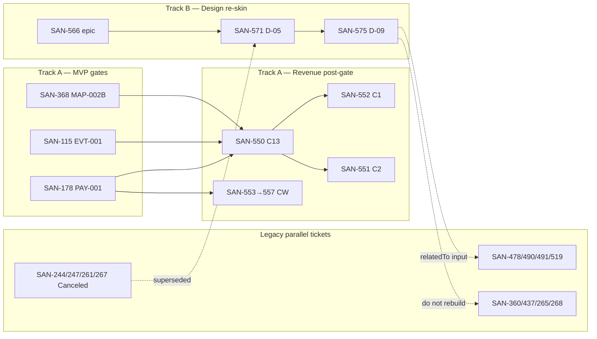

# Linear workspace audit — mdeai (2026-06-05)

## Scorecard at a glance

**Overall workspace: 68 / 100** — Partially Correct. MVP + revenue pilot are usable; design track is structurally sound; ~40% of roadmap still has no Linear home.

### Workspace areas (cross-cutting)

| Area | Org | Order | Complete | **Overall** | What's missing / wrong |
|------|----:|------:|---------:|------------:|----------------------|
| **MVP gate queue** (`phase:launch`) | 62 | 85 | 80 | **76** | Label polluted by contest rows; AUTH-367 Done ✓; commerce chain documented on disk |
| **Revenue pilot** (SAN-550–557) | 90 | 92 | 55 | **79** | R2–R5 not imported; SAN-563 still separate from 551 |
| **Design track** (SAN-566, D-01–D-14) | 85 | 60 | 82 | **76** | No `blockedBy` on D-chain; relations to legacy ✓ |
| **Labels & views** | 55 | 50 | 65 | **57** | `track:ux` on contest issues; `ux-tasks` view too narrow |
| **Dependencies / blockers** | 70 | 65 | 60 | **65** | Revenue gates ✓; design + TRP + REAL lack Linear blockers |
| **Roadmap ↔ Linear** | 50 | 45 | 35 | **43** | Improvement roadmap Phase 0–6 mostly on disk only |
| **Duplicate / stale hygiene** | 75 | 80 | 70 | **75** | 564/558/WIRE fixed ✓; 14+ In Review with disk Done |

**Legend:** Org = labels, project fit, dedupe, descriptions · Order = execution sequence + blockers match disk INDEX · Complete = spec coverage vs `tasks/**` indexes.

---

### Per-project scores (verified 2026-06-05 via Linear MCP)

| Project | Issues | Active | Org | Order | Complete | **Overall** | Order verdict | Gaps |
|---------|-------:|-------:|----:|------:|---------:|------------:|---------------|------|
| [**Core Foundation**](https://linear.app/sanjiovani/project/core-foundation-3a69b76c57ca) | 24 | ~12 | 85 | 88 | 75 | **83** | ✓ Good | PAY-001, MAP-002B, soak gate, PR-16 — INT-003/004 live here but belong under AI |
| [**Commerce Platform**](https://linear.app/sanjiovani/project/commerce-platform-902371cd69e8) | 1 | 1 | 90 | 92 | 55 | **79** | ✓ SAN-551 only | PAY-001/003 not in project; entire R1 checkout chain is one issue |
| [**Growth & Operations**](https://linear.app/sanjiovani/project/growth-and-operations-2effa6c5b651) | 6 | 6 | 92 | 95 | 70 | **86** | ✓ Best chain | CW 553→557 + C1 (552) wired; OCL/admin/contest backlog not imported |
| [**Real Estate**](https://linear.app/sanjiovani/project/real-estate-43bea599dc09) | 20 | ~18 | 82 | 85 | 88 | **85** | ✓ REAL-001→020 | Dup REAL-003 (469/470); REAL-011 `/rentals` is SAN-478 in **screens**; 562 shell |
| [**Events Platform**](https://linear.app/sanjiovani/project/events-platform-46150ec19346) | 73 | 71 | 68 | 72 | 70 | **70** | ~ Mixed | EVT gate SAN-115 ✓; **CTEST/contest** bloats project; SAN-561 promo shell |
| [**Discovery Platform**](https://linear.app/sanjiovani/project/discovery-platform-23d24b177348) | 17 | ~11 | 80 | 78 | 72 | **77** | ~ OK | MVP gates SAN-368/369 live in **Core** (463/464 Duplicate ✓); VEC-001–007 absent |
| [**Venues**](https://linear.app/sanjiovani/project/venues-b003fe68b767) | 40 | 29 | 78 | 76 | 74 | **76** | ~ OK | SAN-558→519 dup ✓; shells 559/560; browse pages split to **screens** |
| [**AI & Intelligence**](https://linear.app/sanjiovani/project/ai-and-intelligence-fe206edb90b2) | 56 | 39 | 75 | 82 | 58 | **72** | ✓ Revenue | SAN-550 C13 ✓; 564 dup ✓; 563/565 shells; INT-006–022 mostly missing |
| [**Trips**](https://linear.app/sanjiovani/project/trips-14c2b4268402) | 27 | 27 | 80 | 70 | 85 | **78** | ~ Disk only | TRP-009→027 numbered on disk; **no Linear blockers**; TRP-001–008 coffee-tour legacy mixed in |
| [**screens**](https://linear.app/sanjiovani/project/screens-c954b41b2344) | 62+ | ~44 | 72 | 68 | 80 | **73** | ~ Epic OK | SAN-566 + D-01–D-14 ✓; **14 In Review** stale; ~30% issues belong in other projects |
| [**Platform Infrastructure**](https://linear.app/sanjiovani/project/platform-infrastructure-099cd7795071) | 162 | 94 | 70 | 65 | 60 | **65** | ✗ Noisy | UX-*/AIA-* + PR-* + DATA-* dump; overlaps **screens** + **Core**; 94 active = not a queue |

**Project ranking (execution-ready):** Growth & Ops (86) → Real Estate (85) → Core (83) → Commerce (79) → Trips (78) → Discovery (77) → Venues (76) → AI (72) → Events (70) → screens (73)* → Platform Infra (65).

\*screens scores high on **completeness** (design epic + SCREEN specs exist) but low on **order** (folder, not queue — use `track:ux` OR `scr` view instead).

---

### Quick read — why scores differ

| High scores (80+) | Low scores (<75) |
|-------------------|------------------|
| Revenue CW chain is linear and gated | Platform Infra is a catch-all (162 issues, 94 open) |
| REAL-001→020 matches disk INDEX | Events mixes launch EVT + Phase 2 contest |
| Core holds real MVP blockers | Roadmap items (R2, VEC, OCL) not in Linear |
| Growth Ops pilot import is clean | Design D-chain order exists only in `index-design.md` |

---

## Executive verdict

**Partially Correct**

The workspace is **organized enough for MVP execution** if the team follows **`label:phase:launch` / MVP view** and **`INDEX-revenue.md`** — but **not safe as a single “pick anything open” queue**. Revenue pilot wiring (R1 + CW) is largely fixed after the SAN-564/558 dedupe session. Design track SAN-566 is structurally sound but **missing execution blockers**, **split across two label systems (`track:ux` vs `scr`)**, and **~65% of the improvement roadmap still has no Linear home**.

## Overall score

**68 / 100**

| Area | Score | Why |
|------|------:|-----|
| Project topology | 82 | 11 projects, clear domain split; `screens` is a folder not a queue (by design) |
| Revenue pilot (550–557) | 88 | Gates, C13→C1/C2 order, CW chain, spec URLs → mdeai ✓ |
| Revenue overlap shells (559–565) | 72 | Triaged + blockedBy 551 ✓; 565 still mixed scope; 563 still separate ticket |
| Design epic SAN-566 | 75 | 14 subtasks, dedup relations ✓; no `blockedBy` between D-01…D-14 |
| Label hygiene | 55 | `phase:launch` polluted; `track:ux` on contest issues; legacy `phase:phase2` |
| Roadmap ↔ Linear coverage | 40 | R2–R5 mostly absent; Phase 0/5/6 narrative not imported |
| Views / queues | 60 | `ux-tasks` filter not yet widened per 2026-06-05 decision |
| Duplicate execution risk | 65 | Worst dupes fixed; card/checkout/reskin paths still forkable |

---

## Why it feels like “tasks all over the place”

Three **parallel planning systems** were never fully merged:

1. **MVP gate queue** — `phase:launch` / Cycle 1 (PAY, EVT, MAP, AUTH) — lives mostly in Core / Events / Discovery projects.
2. **Revenue North-Star queue** — `INDEX-revenue.md` — only **8 pilot issues** imported (550–557); everything else is shells or not in Linear.
3. **Design re-skin queue** — epic **SAN-566** (D-01…D-14) — rides **alongside** MVP, linked to **legacy SCREEN/UIX/WIRE** issues from the pre-June screens import.

Agents (and humans) can pull from **MVP view**, **`track:ux` view**, **`screens` project**, or **improvement shells** and hit **different “canonical” owners** for the same work — unless they read disk specs first.



---

## 1. Workspace audit

### Projects (11 active)

| Project | Status | Role | Audit |
|---------|--------|------|-------|
| Core Foundation | In Progress | Auth, deploy, MAP-002B | ✓ Correct home for SAN-368, SAN-178 |
| Platform Infrastructure | In Progress | UX pack, PR train, DATA | ✓ Legacy UX-*/AIA-* mostly here |
| Events Platform | In Progress | EVT, host, tickets | ✓ SAN-115, SAN-561 |
| Commerce Platform | In Progress | Stripe, checkout | ✓ SAN-551 |
| Real Estate | In Progress | Camila rentals | ✓ SAN-478, SAN-562 |
| Discovery Platform | In Progress | Maps, grounding | ✓ SAN-368 related |
| Venues | In Progress | Cafés, restaurants, nightlife | ✓ SAN-558 dup → 519 |
| AI & Intelligence | Backlog | Agents, INT | ✓ SAN-550, SAN-565, SAN-563 |
| Growth & Operations | Backlog | Chatwoot, ops | ✓ SAN-552, SAN-553–557 |
| Trips | Backlog | TRP, saved, itineraries | ✓ Phase 2 module |
| **screens** | Backlog | **Folder** for SCREEN/UIX/D-* | ✓ Epic SAN-566 + 70 tagged issues; **not** a second queue |

**Initiatives:** Phase 1 — mdeai MVP launch spans most projects ✓

**Orphans:** No project-less issues found in spot-check. Improvement shells correctly sit in domain projects (Venues, Events, Real Estate, AI).

**Duplicated at project level:** Same surface sometimes has **SCREEN build** (`screens`) + **UX polish** (`Platform Infrastructure`) + **D-* design input** — intentional **if relations are honored**; dangerous if not.

---

## 2. Label audit

### Phase labels

| Label | Intended use | Finding |
|-------|--------------|---------|
| `phase:launch` | Cycle 1 P0 gates | **Polluted** — query returns contest (`CONT`, `phase:phase2`) and post-MVP items mis-tagged |
| `phase:mvp` | Module MVP work | Generally OK on REAL/INT/MAP module rows |
| `phase:post-mvp` | Revenue + design + R2+ | ✓ on SAN-550–557, overlap shells, SAN-565 |
| `phase:phase2` | Legacy alias | **Still in use** (e.g. SAN-478) — conflicts with `phase:post-mvp` taxonomy |

### Track labels

| Label | Finding |
|-------|---------|
| `track:ux` | On SAN-566 + D-01…D-14 ✓; also on **SAN-534, SAN-544 (contest)** ✗ |
| `track:screens` | MOB-* issues (522, 523, 526) — correct for mobile screen pack |
| `track:maps` | MAP-* issues ✓ |
| `track:venues` | VEN-* ✓ |
| `track:real` | REAL-* ✓ |

### Design epic labels

All **SAN-567…580** carry `scr` + `track:ux` ✓ — but **none** carry `phase:post-mvp` (optional; epic description says Track B non-blocking).

---

## 3. Revenue program audit

### MVP gates (verified via MCP relations)

| Gate | Linear | State | Blocks revenue? |
|------|--------|-------|-----------------|
| PAY-001 | **SAN-178** | Todo | ✓ blocks 550, 551, 552, 553 |
| EVT-001 | **SAN-115** | Todo (blockedBy SAN-366) | ✓ blocks 550–553 |
| MAP-002B | **SAN-368** | In Progress (blockedBy SAN-369) | ✓ blocks 550–553 |
| AUTH-011 | **SAN-367** | **Done** | Correctly **removed** from gate blockers ✓ |

### R1 order (verified)

```
SAN-550 (C13) ──blocks──► SAN-551 (C2)
              ──blocks──► SAN-552 (C1)   [parallel after C13]
```

| Issue | State | Labels | Blockers | Verdict |
|-------|-------|--------|----------|---------|
| SAN-550 | Backlog | post-mvp, urgent | 178, 115, 368 | ✓ |
| SAN-552 | Backlog | post-mvp, urgent | 178, 115, 368, **550** | ✓ |
| SAN-551 | Backlog | post-mvp, urgent | 178, 115, 368, **550** | ✓ |

**Note:** C1 and C2 are **parallel** after C13 — not sequential C1→C2. Matches INDEX-revenue.

### Chatwoot chain (verified)

```
553 → 554 → 555 → 556 → 557
```

Each link has correct `blockedBy` ✓. All gated on **178, 115, 368** only — **not** on SAN-551. Matches pilot import (CW is post-MVP-gate, not post-C2).

### Overlap / dedupe (verified)

| Issue | Status | Verdict |
|-------|--------|---------|
| **SAN-564** | **Duplicate of SAN-551** | ✓ Fixed — was critical red flag |
| **SAN-558** | **Duplicate of SAN-519** | ✓ Fixed — cafés canonical = SCREEN-028 |
| **SAN-563** | Backlog, blockedBy 551 | ⚠ Still separate ticket — **merge into 551 at implement time** |
| **SAN-565** | Backlog, blockedBy 551 | ⚠ **Mixed scope** (C6 Sales Agent + Gemini fallback) — split recommended |
| SAN-559, 560, 561, 562 | Backlog, blockedBy 551 | ✓ Deferred shells pointing to R2/R3/R4 specs |

### Spec URLs

SAN-550–557 have **mdeai** attachments ✓ (legacy mdeapp links may still exist as duplicates — low risk).

### Roadmap coverage gap

**~60% of INDEX-revenue deferred list not in Linear** (R2 C3/C6/C11…, R3, R4 M1–M12, R5 strategy-only). Dashboard/roadmap PR #73/#75 merged on disk; Linear does not mirror full Phase 0→6 narrative.

---

## 4. Design program audit (SAN-566)

### Epic structure ✓

| D# | Linear | Parent | Relations | Status |
|----|--------|--------|-----------|--------|
| D-01 | SAN-567 | SAN-566 | — | Backlog |
| D-02 | SAN-568 | SAN-566 | — | Backlog |
| D-03 | SAN-569 | SAN-566 | — | Backlog |
| D-04 | SAN-570 | SAN-566 | — | Backlog |
| D-05 | SAN-571 | SAN-566 | 244, 261, 267 | Backlog, High |
| D-06 | SAN-572 | SAN-566 | — | Backlog |
| D-07 | SAN-573 | SAN-566 | — | Backlog |
| D-08 | SAN-574 | SAN-566 | 360, 437, 318, 436, 525 | Backlog, High — **reframed consolidate** ✓ |
| D-09 | SAN-575 | SAN-566 | 478, 490, 491, 519, 244, 261, 267 | Backlog, High |
| D-10 | SAN-576 | SAN-566 | 251, 253, 255, 259 | Backlog |
| D-11 | SAN-577 | SAN-566 | 247, 524 | Backlog |
| D-12 | SAN-578 | SAN-566 | 522, 523 | Backlog |
| D-13 | SAN-579 | SAN-566 | — | Backlog |
| D-14 | SAN-580 | SAN-566 | 265, 268 | Backlog |

### Gaps

| Gap | Severity |
|-----|----------|
| **No `blockedBy` edges** between D-01→D-05→D-08→D-09… | Yellow — order exists on disk only |
| D-09 says `/rentals` P0 broken; **SAN-478** is `Todo` with `phase:phase2` not `phase:mvp` | Yellow — label/ priority mismatch |
| D-13 (home re-skin) has **no** relatedTo legacy home SCREEN issues | Green — acceptable if `/` is net-new pattern |
| SAN-265/268 **In Review** (repo Done) + D-14 both track polish | Yellow — finish 265/268 before opening D-14 |

### Overlap actions (confirmed)

| Design task | Action vs legacy |
|-------------|------------------|
| D-05 | **Supersedes** WIRE-* (now Canceled) |
| D-08 | **Absorbs** SAN-360, SAN-437 — cancel or mark duplicate when D-08 starts |
| D-09 | **Input** to SAN-478/490/491/519 — implement on route issues, not duplicate |
| D-10 | **Extend** dashboard SCREEN issues |
| D-11 | **Extend** MAP/mobile (524) |
| D-12 | **Fold** MOB-CHAT/AIM-010 |
| D-14 | **Merge** with SCREEN-019/020 completion |

---

## 5. WIRE task audit

| Issue | Spec | State | Recommendation |
|-------|------|-------|----------------|
| **SAN-244** WIRE-015 Rentals | Frozen, Phase 2+ | **Canceled** | ✓ Keep canceled — superseded by D-05/D-09 + SAN-478 |
| **SAN-247** WIRE-008 Map panel | Not Started | **Canceled** | ✓ Keep canceled — superseded by D-11 + live map panel work |
| **SAN-261** WIRE-016 Explore | Frozen, `/explore` | **Canceled** | ✓ Keep canceled — `/explore` route **deferred** 2026-06-05 |
| **SAN-267** WIRE-010 Nightlife | Not Started | **Canceled** | ✓ Keep canceled — built as SAN-491 SCREEN-022 |

All four retain `relatedTo` links to SAN-566/D-* for traceability ✓

---

## 6. Screens project audit

**Query:** `project:screens` active ≈ **41 issues** (70 total incl Done).

| Bucket | Count (active) | Notes |
|--------|------------------|-------|
| D-01…D-14 (SAN-567–580) | 14 | All Backlog under epic |
| UIX / SCREEN builds | ~14 In Review / Todo | Many repo `Done` awaiting Linear Done flip |
| TRP / CONT in screens | Few | Cross-domain leakage (contest wireframes) |
| MOB-* | 3 Backlog | `track:screens` not `track:ux` |

**Integration with SAN-566:** Correct pattern — **D-* = design input**, **SAN-4xx/5xx = implementation owners**. Risk: implementers open **both** D-09 and SAN-478 without reading relations.

**Stale:** 14× **In Review** with disk Done (265, 268, 255, 251, 259, …) — clutters queues.

---

## 7. View audit — `ux-tasks`

**URL:** https://linear.app/sanjiovani/view/ux-tasks-0e5d9fe91725

| Filter option | What it shows | Verdict |
|---------------|---------------|---------|
| `label:track:ux` only | Epic SAN-566 + legacy UX/AIA in Platform Infra; **misses** most `scr`-only screen builds (478, 519, 265…) | Incomplete design queue |
| `label:track:ux` OR `label:scr` + status ≠ Done/Canceled | Full design + screen build queue | **Recommended permanent filter** |
| `project:screens` | Folder view; includes non-UX (TRP, CONT) | Wrong as sole design queue |

**Also exclude:** `label:track:contest` from UX view — **SAN-534, SAN-544** wrongly carry `track:ux`.

**Documented in:** `tasks/design/index-design.md`, `tasks/notes/june5/notes-1.md` — **manual view save still pending**.

---

## 8. Execution readiness

| Question | Answer |
|----------|--------|
| Ready for MVP execution? | **Yes**, via MVP view + commerce chain — if team ignores post-MVP Backlog |
| Duplicate execution path? | **Yes** — checkout (551 vs 563), cards (360/437 vs 574), reskin (575 vs 478/490) |
| Conflicting roadmap? | **Yes** — improvement roadmap Phase 0–6 vs INDEX-revenue pilot-only import |
| Hidden scope creep? | **Yes** — improvement shells (559–565) look like Cycle 1 work without reading blockers |
| Cancel before implement? | SAN-564, 558 ✓ done; **360/437** when D-08 starts; **563** merge into 551 |

### Final execution verdict

**Can the team safely execute from the current Linear workspace without creating duplicate work?**

## **NO**

**Safe execution is possible only with queue discipline:**

1. **MVP:** [MVP / BLOCKERS view](https://linear.app/sanjiovani/view/mvp-b4f1afdff207) — `phase:launch` only.
2. **Post-MVP revenue:** `INDEX-revenue.md` — never SAN-564/558; merge 563→551.
3. **Design:** Start **SAN-571 (D-05)** + docs D-02/D-03; treat D-09 as **input** to route issues; finish SAN-360/437 via D-08 only.
4. **Do not** pull from raw `screens` project or improvement shells without reading blockers.

---

## Tables

### 1. Wrong labels

| Issue | Current | Should be |
|-------|---------|-----------|
| SAN-478 | `phase:phase2` | `phase:post-mvp` or `phase:mvp` (align with REAL-011 gate doc) |
| SAN-534, SAN-544 | `track:ux` | Remove `track:ux` — use `track:contest` only |
| SAN-567…580 | no phase label | Add `phase:post-mvp` (optional clarity) |
| SAN-564 (before fix) | `phase:mvp` | Was wrong — now Duplicate ✓ |
| Contest issues in `phase:launch` query | `phase:launch` + `phase:phase2` | Remove erroneous `phase:launch` |

### 2. Wrong projects

| Issue | Project | Note |
|-------|---------|------|
| SAN-563 (CK checkout UI) | AI & Intelligence | Acceptable — but scope merges to Commerce/SAN-551 at implement |
| SAN-360, SAN-437 | Platform Infrastructure | OK for UX pack — linked to D-08 in screens epic |
| None critical | — | Project split is intentional |

### 3. Missing dependencies

| From | Should block | Status |
|------|--------------|--------|
| SAN-567 (D-01) | SAN-571, SAN-572 | ✗ missing |
| SAN-571 (D-05) | SAN-574, SAN-575 | ✗ missing |
| SAN-574 (D-08) | SAN-575, SAN-579 | ✗ missing |
| SAN-575 (D-09) | SAN-577, SAN-578 | ✗ missing |
| SAN-553 (CW-1) | SAN-551 | **Not required** per INDEX-revenue (CW gates on MVP exit only) |
| SAN-562 | SAN-473 | ✓ present |

### 4. Duplicate tasks

| Duplicate | Canonical | Status |
|-----------|-----------|--------|
| SAN-564 | SAN-551 | ✓ Duplicate |
| SAN-558 | SAN-519 | ✓ Duplicate |
| SAN-563 | SAN-551 (UI half) | ⚠ merge at implement |
| SAN-360 + SAN-437 | SAN-574 (D-08) | ⚠ supersede when D-08 starts |
| SAN-575 + SAN-478/490/491 | Route issues own build; D-09 owns pattern | ⚠ relation-only (OK if honored) |

### 5. Stale tasks

| Issue | State | Disk | Action |
|-------|-------|------|--------|
| SAN-265, SAN-268 | In Review | Done + evidence | Flip Done or close D-14 overlap |
| SAN-255, SAN-251, SAN-259, SAN-263, SAN-248 | In Review | Done | Batch flip Done |
| SAN-244, 247, 261, 267 | Canceled | Superseded | ✓ leave canceled |
| linear.md | Says 401 Vitest | 519 post-PR#75 | Update doc |

### 6. Tasks safe to cancel

| Issue | Reason |
|-------|--------|
| SAN-244, 247, 261, 267 | Already Canceled ✓ |
| SAN-564, 558 | Already Duplicate ✓ |
| SAN-360, SAN-437 | Cancel when SAN-574 opens ( absorbed ) |
| SAN-563 | Cancel when SAN-551 implementation starts (UI merged) |

### 7. Tasks needing merge

| Merge into | Absorb |
|------------|--------|
| SAN-551 | SAN-563 (+ widget scope) |
| SAN-574 | SAN-360, SAN-437 |
| SAN-580 | SAN-265, SAN-268 (after Done flip) |
| Future REV-C6 | SAN-565 (split Gemini fallback out first) |

### 8. Design overlap findings

| Finding | Severity |
|---------|----------|
| D-08 reframe prevents rebuilding Done cards | Green — fixed 2026-06-05 |
| WIRE issues canceled but were open until today | Green |
| D-14 + SCREEN-019/020 double-track polish | Yellow |
| MOB-* uses `track:screens` not in narrow `track:ux` view | Yellow — fix view filter |
| No blocker graph on D-chain | Yellow |

### 9. Revenue program findings

| Finding | Severity |
|---------|----------|
| R1 pilot wiring correct | Green |
| SAN-564/558 dedupe | Green |
| R2+ not imported | Red for “full roadmap in Linear” / Green for “pilot-only” |
| SAN-565 mixed scope | Yellow |
| CW chain independent of C2 | Green (by design) |
| Dual spec URLs mdeai + mdeapp on attachments | Yellow — cosmetic |

---

## Critical findings

### Red

1. **~60% of revenue roadmap not in Linear** — executing from dashboard alone will miss C3, C6, C11, M1–M12, etc.
2. **`phase:launch` label pollution** — contest/phase2 issues appear in launch queries; undermines MVP view trust.
3. **Dual checkout path** — SAN-563 still looks like independent work unless team reads SAN-551 description.

### Yellow

1. Design epic **missing blockedBy** chain (disk order only).
2. **SAN-565** bundles C6 + Gemini reliability — split before R2 import.
3. **14 In Review** screen issues with repo Done — queue noise.
4. **`ux-tasks` view** still `track:ux`-only — misses 39/41 active `screens` issues.
5. **SAN-478** label `phase:phase2` vs Track A “broken `/rentals` P0” narrative.

### Green

1. MVP gate blockers on revenue pilot **verified** (178, 115, 368 → 550–553).
2. **SAN-564 → SAN-551**, **SAN-558 → SAN-519** dedupe complete.
3. **SAN-566** epic + 14 subtasks + dedup relations match `index-design.md`.
4. **WIRE-*** canceled with traceability links.
5. **AUTH-367 Done** correctly removed from gate blockers.
6. PR **#73/#75** merged — dashboard, INDEX-revenue, Vitest 519 on main.

---

## Correct implementation order

### Track A — MVP (now)

```
SAN-369 (MAP-008B) ──► SAN-368 (MAP-002B) ──┐
SAN-178 (PAY-001) ─────────────────────────┼──► continue commerce chain
SAN-116 (PAY-003) ──► SAN-366 (EVT-002) ───┼──► SAN-115 (EVT-001)
REAL-004/006 (471/473) In Progress ──────────┘
Parallel UX: SAN-437, 438, 443 (card shell — or wait for D-08)
```

### Track A — Revenue (post MVP gates)

```
Gates: 178 + 115 + 368 (367 Done)
  → SAN-550 (C13)
  → SAN-552 (C1) ∥ SAN-551 (C2)    [merge SAN-563 into 551]
  → Import R2 batch (C3, C6, C11, …) when 551 proofs checkout
  → SAN-553 → 554 → 555 → 556 → 557 (CW — parallel after gates, not after 551)
  → Deferred shells 559–562 absorb into R2/R3/R4 imports
```

### Track B — Design (parallel, non-blocking)

```
Parallel now: SAN-567, 568, 569, 570, 571 (D-01,02,03,04,05)
  → SAN-573 (D-07 shadcn)
  → SAN-574 (D-08 consolidate cards — supersedes 360/437)
  → SAN-575 (D-09 reskin — input to 478/490/491/519)
  → SAN-577, 578, 579 (map, concierge, home)
  → SAN-576 (D-10 dashboard — post-MVP)
  → SAN-580 (D-14 — after 265/268 Done)
```

---

## Recommended fixes

### Priority 1 (before scaling team)

1. **Save `ux-tasks` view:** `(label:track:ux OR label:scr) AND status not Done/Canceled/Duplicate` — exclude `track:contest`.
2. **Add blockedBy chain** on SAN-567→571→574→575→577/578/579→580 per `index-design.md`.
3. **Remove `track:ux`** from SAN-534, SAN-544.
4. **Mark SAN-563** `duplicateOf: SAN-551` or add epic comment “implement only inside 551”.
5. **Batch-close In Review** issues with disk Done (265, 268, 255, 251, 259…).

### Priority 2 (next Linear hygiene session)

1. **Split SAN-565** → REV-C6 placeholder + separate reliability issue (Gemini fallback).
2. **Normalize SAN-478** phase label + link blockedBy REAL-004–007 if gates exist on disk.
3. **Scrub `phase:launch`** off non-gate issues (contest, phase2 rows).
4. **Import R2 revenue batch** when SAN-551 → In Progress (per LINEAR-REVENUE deferred list).
5. Update **linear.md** Vitest count 401 → 519.

### Priority 3 (quality)

1. Remove duplicate **mdeapp** spec attachments where **mdeai** attachment exists (550–557).
2. Add **`phase:post-mvp`** to D-01…D-14 for filter consistency.
3. Link **SAN-579** to any legacy home SCREEN issue if one exists.
4. Run `linear-restore-track-labels.mjs` after bulk edits.

---

## Recent changes verified (2026-06-05 session)

| Change | Verified |
|--------|----------|
| PR #73 merged (roadmap + dashboard) | ✓ on main (per prior session) |
| PR #74 closed duplicate | ✓ |
| PR #75 merged (519 tests, INDEX-revenue, disclaimer) | ✓ |
| SAN-560–562 → Backlog, post-mvp, blockedBy 551 | ✓ |
| SAN-550–557 spec URLs → mdeai | ✓ |
| SAN-566 epic + SAN-567–580 | ✓ |
| Design dedup relations D-05/08/09/10/11/12/14 | ✓ |
| D-08 reframe (consolidate not rebuild) | ✓ on SAN-574 |
| SAN-564 duplicate of 551 | ✓ |
| SAN-558 duplicate of 519 | ✓ |
| WIRE 244/247/261/267 canceled | ✓ |

---

## Summary for operators

**Partially Correct (68/100).** The June 5 cleanup **fixed the worst duplicate traps** (checkout, cafés page, WIRE wireframes). What remains is **queue fragmentation**: three tracks, two label vocabularies (`scr` vs `track:ux`), and a roadmap mostly living on disk. **Execute MVP from the gate view; execute revenue from INDEX-revenue; execute design from SAN-566 with relations honored** — otherwise you **will** build twice.

**Final answer: NO** — not until Priority 1 view + blocker + dedupe merges are applied.
