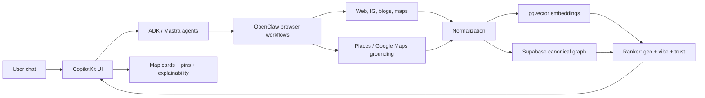

Below is a practical research synthesis for **mdeai’s local-intelligence stack**, focused on OpenClaw, restaurant/café discovery, tourism intelligence, map search, and browser automation. The best systems are not static directories; they combine grounded places data, conversational UX, social proof, and automated enrichment loops. [docs.openclaw](https://docs.openclaw.ai/tools/browser)

## Executive summary

The strongest commercial references are **Mindtrip**, **Yelp’s updated AI assistant**, and **Foursquare’s location-intelligence platform**, because they connect conversational discovery to structured place data and task execution. [phocuswire](https://www.phocuswire.com/mindtrip-ai-trip-planner-travel-startup)
The most useful open-source references are **OpenClaw itself**, **travel agent repos built with LangGraph**, and **Instagram place/location extraction repos**, because they show how to automate research, enrichment, and geo-signal collection. [github](https://github.com/duncanleung/travelgram)
For mdeai, the highest-value pattern is: **OpenClaw for crawling and enrichment, Supabase as the system of record, pgvector for semantic ranking, and CopilotKit for conversational delivery**. [github](https://github.com/openclaw/openclaw)

## Top GitHub repos

| Name | URL | Stars | Stack | Score /100 | Best features | Useful for mdeai? | MVP or advanced? | What to steal/adapt | Risk |
|---|---|---:|---|---:|---|---|---|---|---|
| OpenClaw | [https://github.com/openclaw/openclaw](https://github.com/openclaw/openclaw) | N/A | OpenClaw platform, browser control, skills, gateway.  [github](https://github.com/openclaw/openclaw) | 97 | Dedicated agent browser profile, tool/skill runner, safe browser lane.  [docs.openclaw](https://docs.openclaw.ai/tools/browser) | Yes — core automation layer.  [docs.openclaw](https://docs.openclaw.ai/tools/browser) | Advanced | Browser-controlled enrichment, social research, local intelligence workflows. | Medium complexity, security-sensitive browser actions. |
| awesome-openclaw-skills | [https://github.com/VoltAgent/awesome-openclaw-skills](https://github.com/VoltAgent/awesome-openclaw-skills/blob/main/categories/browser-and-automation.md) | N/A | Skill catalog / workflow ideas.  [github](https://github.com/VoltAgent/awesome-openclaw-skills/blob/main/categories/browser-and-automation.md) | 88 | Large skill taxonomy, workflow patterns.  [github](https://github.com/VoltAgent/awesome-openclaw-skills/blob/main/categories/browser-and-automation.md) | Yes | Advanced | Use as idea library for task decomposition. | Maintenance freshness varies. |
| Travel itinerary planner | [https://github.com/vikrambhat2/MultiAgents-with-Langgraph-TravelItineraryPlanner](https://github.com/vikrambhat2/MultiAgents-with-Langgraph-TravelItineraryPlanner) | N/A | Streamlit, LangGraph, Ollama, Serper API.  [github](https://github.com/vikrambhat2/MultiAgents-with-Langgraph-TravelItineraryPlanner) | 84 | Multi-agent itinerary orchestration, interactive planning.  [github](https://github.com/vikrambhat2/MultiAgents-with-Langgraph-TravelItineraryPlanner) | Yes | Advanced | Split planning, retrieval, and output agents. | Demo-grade, not production hardened. |
| AI travel agent | [https://github.com/nirbar1985/ai-travel-agent](https://github.com/nirbar1985/ai-travel-agent) | N/A | LangGraph travel agent.  [github](https://github.com/nirbar1985/ai-travel-agent) | 80 | Agentic travel workflows and retrieval.  [github](https://github.com/nirbar1985/ai-travel-agent) | Yes | Advanced | Travel task decomposition and tool routing. | Unknown maintenance depth. |
| Travel agent | [https://github.com/2020uce0047/travel-agent](https://github.com/2020uce0047/travel-agent) | N/A | LangGraph, SERPAPI, OpenAI.  [github](https://github.com/2020uce0047/travel-agent) | 73 | Simple RAG travel-agent baseline.  [github](https://github.com/2020uce0047/travel-agent) | Yes | MVP | Fast prototype for itinerary logic. | Limited differentiation. |
| Geo Explorer | [https://github.com/Free-AI-Things/Geo-Explorer](https://github.com/Free-AI-Things/Geo-Explorer) | N/A | AI geolocation discovery.  [github](https://github.com/Free-AI-Things/Geo-Explorer) | 83 | Geolocation-centric AI discovery concept.  [github](https://github.com/Free-AI-Things/Geo-Explorer) | Yes | Advanced | Geo-aware prompting, location inference, exploratory UX. | Unknown production maturity. |
| Travelgram | [https://github.com/duncanleung/travelgram](https://github.com/duncanleung/travelgram) | N/A | Instagram geolocation photo discovery.  [github](https://github.com/duncanleung/travelgram) | 78 | Photo-location discovery from Instagram.  [github](https://github.com/duncanleung/travelgram) | Yes | Advanced | Creator-driven discovery pipeline. | Instagram API fragility. |
| scrape-instagram-by-location | [https://github.com/timkiely/scrape-instagram-by-location](https://github.com/timkiely/scrape-instagram-by-location) | N/A | R package, IG place lookup.  [github](https://github.com/timkiely/scrape-instagram-by-location) | 70 | Location-based Instagram metadata collection.  [github](https://github.com/timkiely/scrape-instagram-by-location) | Yes | Advanced | Place-linked social signal ingestion. | TOS and API risk. |
| combat-ai-restaurants | [https://github.com/iamalegambetti/combat-ai-restaurants](https://github.com/iamalegambetti/combat-ai-restaurants) | N/A | Research code on fake review detection.  [github](https://github.com/iamalegambetti/combat-ai-restaurants) | 69 | Anti-fake-review modeling.  [github](https://github.com/iamalegambetti/combat-ai-restaurants) | Yes | Advanced | Trust/scam scoring patterns. | Research-only, not product-ready. |
| OrderWorder | [https://github.com/itzzritik/OrderWorder](https://github.com/itzzritik/OrderWorder) | N/A | AI dining ops platform.  [github](https://github.com/itzzritik/OrderWorder) | 62 | Restaurant ops digitization.  [github](https://github.com/itzzritik/OrderWorder) | Maybe | MVP/adjacent | Menu/order interactions. | Too CRUD-heavy for mdeai’s focus. |

## Top startups

| Startup | URL | Score /100 | Best feature | Useful lesson for mdeai |
|---|---|---:|---|---|
| Mindtrip | [https://mindtrip.ai](https://mindtrip.ai) | 97 | Start-from-anywhere travel planning with maps, collections, nearby discovery, and local expert guides.  [apps.apple](https://apps.apple.com/do/app/mindtrip-ai-travel-companion/id6503107567) | Use multimodal intake, map-aware recommendations, and shareable collections. |
| Yelp AI assistant | [https://www.yelp.com](https://www.yelp.com) | 90 | Answers questions, books reservations, and grounds responses in business pages, website, and user reviews.  [techcrunch](https://techcrunch.com/2026/04/21/yelps-updated-ai-assistant-can-answer-questions-and-book-a-restaurant-or-service-in-one-conversation/) | Great model for grounded local Q&A and action-taking in one flow. |
| Foursquare | [https://foursquare.com](https://foursquare.com) | 92 | 100M+ POIs, rich metadata, tips, photos, geo intelligence, and MCP-style support for agents.  [foursquare](https://foursquare.com/products/places-api/) | Excellent source model for location intelligence, popularity, and geofencing. |
| GuideGeek | [https://brands.guidegeek.com](https://brands.guidegeek.com) | 86 | Destination-specific conversational travel assistant via messaging channels.  [en.wikipedia](https://en.wikipedia.org/wiki/GuideGeek) | Strong template for WhatsApp/IG-first tourist assistance. |
| Wanderlog | [https://wanderlog.com](https://wanderlog.com) | 84 | Collaborative travel planning with map view and itinerary optimization.  [ycombinator](https://www.ycombinator.com/companies/wanderlog) | Good planning UX, less AI-native than Mindtrip. |
| Atlas Obscura | [https://www.atlasobscura.com](https://www.atlasobscura.com) | 82 | Hidden-gems storytelling with a global map of wonders.  [atlasobscura](https://www.atlasobscura.com/articles/all-places-in-the-atlas-on-one-map) | Storytelling matters for discovery and retention. |
| Time Out | [https://www.timeout.com](https://www.timeout.com) | 72 | Editorial curation and local lists. | Strong content model, weak AI and personalization. |
| Spotted by Locals | [https://www.spottedbylocals.com](https://www.spottedbylocals.com) | 78 | Local-expert curation of city tips. | Creator/local authority is a moat. |
| Google Maps AI/Places | [https://www.google.com/maps](https://www.google.com/maps) | 95 | Best-in-class grounding, routes, reviews, and place discovery. | Source of truth for place identity and route intelligence. |
| Booking.com AI features | [https://news.booking.com/bookingcom-enhances-travel-planning-with-new-ai-powered-features--for-easier-smarter-decisions/](https://news.booking.com/bookingcom-enhances-travel-planning-with-new-ai-powered-features--for-easier-smarter-decisions/) | 91 | Review summarization and smarter travel planning.  [news.booking](https://news.booking.com/bookingcom-enhances-travel-planning-with-new-ai-powered-features--for-easier-smarter-decisions/) | Turn reviews into decision support, not raw text. |

## Top OpenClaw use cases

| Use case | Real-world Medellín example | Business value | Stack integration | Difficulty | Core or advanced? | Score /100 | Risks |
|---|---|---|---|---|---|---:|---|
| Coffee-tour intelligence crawler | Crawl coffee tours in Santa Elena, Barrio La Sierra, and outskirts. | Build a defensible Medellín coffee-tour graph. | OpenClaw + Gemini + Supabase + pgvector. | High | Core | 97 | Site changes, scraping fragility. |
| Instagram café discovery | Find cafes tagged in Provenza, Manila, Laureles. | Surface hidden gems and creator picks. | OpenClaw browser + Instagram location extraction.  [github](https://github.com/duncanleung/travelgram) | High | Core | 94 | TOS risk, anti-bot blocks. |
| Restaurant menu extraction | Pull menus from café/restaurant pages. | Better search, dietary matching, dish intelligence. | OpenClaw + OCR/Gemini + Supabase. | Medium | Core | 90 | Menu drift, language variation. |
| Local review summarization | Summarize Google/Tripadvisor/Yelp review themes. | Trust scoring and vibe summaries. | OpenClaw + grounding + embeddings. | Medium | Core | 91 | Hallucinated summaries if not grounded. |
| Creator food-map extraction | Extract places from creator guides and social posts. | Build creator-driven discovery moat. | OpenClaw + social crawl + pgvector. | High | Advanced | 93 | Source quality, creator rights. |
| Hidden-gems detection | Detect repeated positive mentions across blogs/IG. | Find non-obvious venues and cafés. | OpenClaw + semantic clustering. | Medium | Core | 89 | Overfitting to SEO noise. |
| Event enrichment | Add hours, address, and category to events. | Better event discovery and routing. | OpenClaw + Places + Supabase. | Medium | Core | 88 | Event freshness issues. |
| Sponsor lead generation | Identify restaurants/cafés with ad potential. | Monetization via local partnerships. | OpenClaw + CRM + enrichment. | Medium | Advanced | 86 | Sales data privacy risk. |
| Competitor/local SEO monitoring | Track city guides, map/list pages, and ranking content. | Content strategy and coverage gaps. | OpenClaw + browser automation + alerts. | Medium | Advanced | 85 | Requires careful robots/TOS handling. |
| Neighborhood intelligence refresh | Track new openings, hotspots, safety signals, and vibe shifts. | Long-term Medellín data moat. | OpenClaw + periodic crawl + vector store. | High | Core | 96 | Needs maintenance and dedupe discipline. |

## Top café and restaurant AI features

| Feature | Startup inspiration | GitHub inspiration | How mdeai should adapt it | MVP or advanced? | Score /100 |
|---|---|---|---|---|---:|
| AI menu understanding | Yelp AI, Mindtrip.  [techcrunch](https://techcrunch.com/2026/04/21/yelps-updated-ai-assistant-can-answer-questions-and-book-a-restaurant-or-service-in-one-conversation/) | OrderWorder.  [github](https://github.com/itzzritik/OrderWorder) | Parse menus into dishes, price bands, dietary tags, and signature items. | MVP | 92 |
| Best-dish extraction | Yelp review synthesis.  [theverge](https://www.theverge.com/news/714944/yelp-ai-stitched-videos) | combat-ai-restaurants.  [github](https://github.com/iamalegambetti/combat-ai-restaurants) | “Best for arepas / espresso / date night / group brunch.” | MVP | 91 |
| Creator food maps | Mindtrip local experts, Travelgram.  [prnewswire](https://www.prnewswire.com/news-releases/mindtrip-becomes-travelers-ultimate-companion-with-launch-of-new-ai-powered-app-that-pinpoints-must-see-attractions-restaurants-and-hidden-gems-nearby-302490836.html) | travelgram.  [github](https://github.com/duncanleung/travelgram) | Build curated creator collections with venue pins. | Advanced | 94 |
| Instagram café extraction | Social discovery models.  [github](https://github.com/duncanleung/travelgram) | scrape-instagram-by-location.  [github](https://github.com/timkiely/scrape-instagram-by-location) | Turn posts into venue candidates and vibe labels. | Advanced | 90 |
| Vibe search | Mindtrip “travel vibe.”  [apps.apple](https://apps.apple.com/do/app/mindtrip-ai-travel-companion/id6503107567) | Geo Explorer.  [github](https://github.com/Free-AI-Things/Geo-Explorer) | Search by “quiet, bright, laptop-friendly, romantic, scenic.” | MVP | 96 |
| Semantic café search | Foursquare tags and AI discovery.  [foursquare](https://foursquare.com/products/places-api/) | Geo Explorer.  [github](https://github.com/Free-AI-Things/Geo-Explorer) | Rank by intent, not just category. | MVP | 95 |
| Local-expert recommendations | Mindtrip guides, Spotted by Locals.  [prnewswire](https://www.prnewswire.com/news-releases/mindtrip-becomes-travelers-ultimate-companion-with-launch-of-new-ai-powered-app-that-pinpoints-must-see-attractions-restaurants-and-hidden-gems-nearby-302490836.html) | travelgram.  [github](https://github.com/duncanleung/travelgram) | Add local curator badge and rationale. | MVP | 93 |
| Hidden-gems system | Atlas Obscura.  [atlasobscura](https://www.atlasobscura.com/articles/all-places-in-the-atlas-on-one-map) | OpenClaw crawl graphs.  [github](https://github.com/openclaw/openclaw) | “Not obvious from Maps” layer with confidence scoring. | Advanced | 92 |
| Social proof systems | Yelp and Foursquare tips/photos.  [foursquare](https://foursquare.com/products/places-api/) | travelgram.  [github](https://github.com/duncanleung/travelgram) | Show verified signals, not raw star spam. | MVP | 94 |
| Authenticity scoring | Foursquare ground-truth philosophy.  [foursquare](https://foursquare.com/resources/blog/leadership/intersecting-ai-with-location-intelligence/) | combat-ai-restaurants.  [github](https://github.com/iamalegambetti/combat-ai-restaurants) | Score on cross-source corroboration and freshness. | Advanced | 95 |
| Crowd intelligence | Foursquare + Yelp.  [foursquare](https://foursquare.com/products/places-api/) | N/A | Use aggregate patterns, not one-off opinions. | Advanced | 90 |
| Atmosphere intelligence | Mindtrip nearby + guides.  [apps.apple](https://apps.apple.com/uz/app/mindtrip-ai-travel-companion/id6503107567) | N/A | Label seating, lighting, noise, scenery, laptop-friendliness. | MVP | 93 |
| AI review summarization | Booking.com, Yelp.  [news.booking](https://news.booking.com/bookingcom-enhances-travel-planning-with-new-ai-powered-features--for-easier-smarter-decisions/) | combat-ai-restaurants.  [github](https://github.com/iamalegambetti/combat-ai-restaurants) | Summarize “what people actually say” into themes. | MVP | 96 |
| Dynamic map markers | Mindtrip interactive maps.  [apps.apple](https://apps.apple.com/do/app/mindtrip-ai-travel-companion/id6503107567) | neighborhood-map.  [github](https://github.com/sojackyso/neighborhood-map) | Pins that change based on vibe, popularity, and freshness. | MVP | 94 |
| Conversational maps | GuideGeek + Mindtrip.  [en.wikipedia](https://en.wikipedia.org/wiki/GuideGeek) | LangGraph travel agents.  [github](https://github.com/vikrambhat2/MultiAgents-with-Langgraph-TravelItineraryPlanner) | “Show me coffee near coworking in Laureles” and update map live. | MVP | 97 |

## Top local-marketing automations

| Automation | Business value | Automation flow | Difficulty | Score /100 |
|---|---|---|---|---:|
| Local SEO monitoring | Find content gaps and ranking opportunities. | Crawl competing city pages, extract themes, compare coverage. | Medium | 90 |
| Tourism trend monitoring | Catch rising neighborhoods and attractions early. | Crawl posts/blogs/reviews, cluster by location and vibe. | High | 94 |
| Instagram/TikTok monitoring | Track creator-driven demand signals. | Search posts, extract venues, count mentions, map places.  [github](https://github.com/duncanleung/travelgram) | High | 92 |
| Event monitoring | Keep events fresh and relevant. | Detect recurring event venues and time-sensitive posts. | Medium | 88 |
| Competitor monitoring | Understand what rival portals emphasize. | Track content structure, offers, and map UX. | Medium | 86 |
| Creator outreach automation | Seed a local expert network. | Identify creators, score fit, send draft outreach. | High | 89 |
| Sponsor prospecting | Monetize local discovery. | Find high-traffic restaurants/cafés and score ad fit. | Medium | 87 |
| AI lead generation | Create partnership leads for local businesses. | Score businesses with growth intent and contact paths. | Medium | 85 |
| Neighborhood hotspot detection | Build Medellín intelligence moat. | Compare new mentions, density shifts, and sentiment. | High | 95 |
| Menu and listing freshness checks | Prevent stale data. | Re-crawl menu/hours/offer pages on a schedule. | Medium | 91 |

## Best local intelligence architecture

The best architecture is a **three-loop system**: acquisition, intelligence, and presentation. OpenClaw should do acquisition and enrichment; Supabase should store normalized entities, sources, and signals; pgvector should power semantic similarity and taste matching; CopilotKit should present the conversational layer; and Maps/Places should remain the source of truth for geometry and travel-time grounded results. [foursquare](https://foursquare.com/products/places-api/)

### Recommended flow
1. OpenClaw browses Google Maps, websites, Instagram, blogs, and directories.  
2. Extraction pipelines normalize names, addresses, categories, menus, and social links.  
3. Supabase stores canonical entities, source evidence, and freshness timestamps.  
4. pgvector stores embeddings for vibes, intent, and semantic clusters.  
5. Ranking blends semantic match, geo distance, source confidence, and popularity.  
6. CopilotKit returns explanations, comparisons, and map actions.  
7. Google Maps/Places handles routing, geometry, and place identity.

### Diagram

## Medellín moat analysis

What competitors are missing is **deep local specificity**: not just where places are, but how they feel, who recommends them, when they peak, and which neighborhoods are changing. Mindtrip and Yelp are broad platforms; they do not specialize in Medellín’s neighborhood culture, creator scene, or Spanish-English local nuance. [techcrunch](https://techcrunch.com/2026/04/21/yelps-updated-ai-assistant-can-answer-questions-and-book-a-restaurant-or-service-in-one-conversation/)

The hardest-to-replicate moat is a **living neighborhood graph**: cafés, restaurants, events, rooftops, coworking spaces, coffee tours, and viewpoints connected by creator signals, route behavior, and freshness checks. OpenClaw can continuously refresh this graph from public sources, which compounds over time. [github](https://github.com/timkiely/scrape-instagram-by-location)

Trust comes from multi-source corroboration, source freshness, and explanation quality. Retention comes from memory, saved collections, and evolving neighborhood intelligence. Virality comes from shareable maps, creator lists, and “best hidden gems” collections. Semantic advantage comes from embeddings that encode vibe, intent, and local context rather than just category labels.

## MVP recommendations

- Use OpenClaw for venue enrichment, café/menu extraction, and creator/social discovery. [github](https://github.com/VoltAgent/awesome-openclaw-skills/blob/main/categories/browser-and-automation.md)
- Build a canonical place graph in Supabase with source provenance.  
- Use pgvector for vibe search, hidden-gem clustering, and “best for” personalization.  
- Make CopilotKit the front door: ask in plain language, return map cards, citations, and next actions.  
- Ground all location results in Google Maps/Places and keep AI-generated text clearly labeled. [foursquare](https://foursquare.com/resources/blog/leadership/intersecting-ai-with-location-intelligence/)

## Advanced recommendations

- Add multi-agent workflows for city research, creator outreach, and local SEO monitoring. [github](https://github.com/vikrambhat2/MultiAgents-with-Langgraph-TravelItineraryPlanner)
- Add trust scoring that blends cross-source corroboration, freshness, and negative-signal detection. [github](https://github.com/iamalegambetti/combat-ai-restaurants)
- Add shared collections and neighborhood itineraries for virality and retention. [ycombinator](https://www.ycombinator.com/companies/wanderlog)
- Add map-story mode for hidden gems, coffee tours, and nightlife routes. [atlasobscura](https://www.atlasobscura.com/articles/all-places-in-the-atlas-on-one-map)
- Add continuous social discovery ingestion from Instagram and creator lists, with strict source labeling. [github](https://github.com/duncanleung/travelgram)

## Final strategic direction

mdeai should become **Medellín’s intelligent local layer**, not a city directory. The product should combine OpenClaw-powered enrichment, grounded map search, semantic ranking, and conversational exploration so users can discover cafés, restaurants, neighborhoods, events, coffee tours, and rentals through one living city graph.  

The best wedge is **hyperlocal trust + discovery**: Medellín-specific, bilingual, creator-aware, and map-native. The best moat is **fresh, structured local intelligence** that keeps compounding as OpenClaw continuously learns the city. The best user experience is **ask, compare, see on the map, save, and share** in one flow.  

Would you like me to turn this into a **ranked shortlist of the top 25 repos/startups with deeper notes** or a **mdeai implementation roadmap by stack component**?