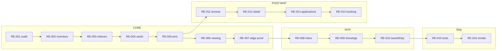

# Real Estate Roadmap

## 1. Executive summary

Optimize for one working **Medellín rental loop** before sales, WhatsApp, or catalog pages:

```text
Chat search → real cards → schedule viewing → lead in DB → (MVP) landlord sees lead → (POST-MVP) showing → application → booking
```

**Already shipped (archive pack A):** `rentalAgent`, `rental-search-workflow`, `search-rentals`, `RentalCard`, `/api/leads/schedule-viewing` → `chat-lead-capture`.

**Next:** data column fixes, Done evidence refresh, landlord inbox, showings bridge, saved/trips — **not** F41 `/rentals` until chat loop is proven.

---

## 2. Roadmap phases

| Phase | Goal | Build | Do not build |
|-------|------|-------|--------------|
| **CORE** | Prove search + lead | Indexes, cards polish, viewing modal proof, RLS | `/rentals`, Stripe rental, WA |
| **MVP** | Close landlord loop | data-020/021, inbox, showings, saved/trips | Application wizard, browse catalog |
| **POST-MVP** | Scale discovery | F41 `/rentals`, detail pages, applications, rental Stripe | OpenClaw prod |
| **ADVANCED** | Growth + sales | WA, Hermes, marketing, buyer/seller CRM | — |

---

## 3. Implementation order

| Order | ID | Track | Depends | Output | Proof |
|------:|-----|-------|---------|--------|-------|
| 1 | [RE-001](./tasks/RE-001-supabase-schema-audit.md) | data | — | Evidence + gap matrix | MCP + data-019 |
| 2 | [RE-002](./tasks/RE-002-apartment-inventory-quality.md) | ops | RE-001 | 44 rows QA report | photos, lat/lng, price_daily |
| 3 | [RE-003](./tasks/RE-003-rental-search-indexes.md) | data | RE-001 | data-009 M3 applied | EXPLAIN on search query |
| 4 | [RE-004](./tasks/RE-004-rental-cards-chat.md) | app | F46 | SCREEN-005 Done | Playwright + screenshots |
| 5 | [RE-005](./tasks/RE-005-map-pin-sync.md) | maps | RE-004, MAP-008 | Pin ↔ card sync | smoke:f50 |
| 6 | [RE-006](./tasks/RE-006-schedule-viewing-modal.md) | app | RE-004 | SCREEN-008 Done | leads row + modal |
| 7 | [RE-007](./tasks/RE-007-lead-capture-edge-proof.md) | edge | RE-006 | G2 evidence | rate limit + RLS note |
| 8 | [RE-008](./tasks/RE-008-landlord-inbox-mvp.md) | app | data-020 | Inbox read UI | landlord sees lead |
| 9 | [RE-009](./tasks/RE-009-showing-bridge.md) | data+app | data-021, RE-006 | `showings` populated | SQL + UI |
| 10 | [RE-010](./tasks/RE-010-saved-trips-integration.md) | app | TRIP-006/007 | Save + add-to-trip | E2E |
| 11 | [RE-011](./tasks/RE-011-rental-browse-page.md) | app | MAP-001, RE-005 | `/rentals` | POST-MVP gate |
| 12 | [RE-012](./tasks/RE-012-rental-detail-page.md) | app | RE-011 | `/rentals/[id]` | POST-MVP |
| 13 | [RE-013](./tasks/RE-013-application-wizard.md) | app | RE-009 | wizard → `rental_applications` | POST-MVP |
| 14 | [RE-014](./tasks/RE-014-booking-payment-prep.md) | data+stripe | data-024 | rental webhook spec | POST-MVP |
| 15 | [RE-015](./tasks/RE-015-playwright-rls-tests.md) | qa | RE-004–010 | screen specs pass | floor 0 |
| 16 | [RE-016](./tasks/RE-016-production-smoke.md) | ops | RE-015 | preview `/` chat rental | Vercel smoke |

---

## 4. Phase timeline



---

## 5. Cross-track dependencies

| Real estate | Blocked by |
|-------------|------------|
| RE-003 indexes | data-009 M3 migration |
| RE-008 inbox | data-020 `leads.apartment_id` |
| RE-009 showings | data-021 |
| RE-010 saved/trips | TRIP-006, TRIP-007 |
| RE-011 browse | MAP-001, F41 scope approval |
| RE-014 booking | data-024, events Stripe patterns |

---

## 6. GitHub / reference repos

| Path | Use |
|------|-----|
| `CopilotKit/examples/integrations/mastra` | Runtime base ✅ in mdeapp |
| `CopilotKit/examples/v1/travel` | Map + progress UI patterns only |
| `CopilotKit/examples/showcases/generative-ui` | RentalCard HITL |
| `github/maps/react-google-maps` | AdvancedMarker reference |

**Avoid:** LangGraph runtimes, CopilotKit v2, CrewAI for Phase 1.

---

## 7. Done definition (CORE + MVP)

1. Camila gets ≥3 real cards from chat search.  
2. Schedule viewing creates `leads` row (listing FK after data-020).  
3. Andrés sees lead in inbox MVP.  
4. Optional: `showings` row after data-021.  
5. Save → trip path works (TRIP-007).  
6. RLS isolation documented.  
7. `npm run floor` exit 0.

---

*Last updated: 2026-05-26*
